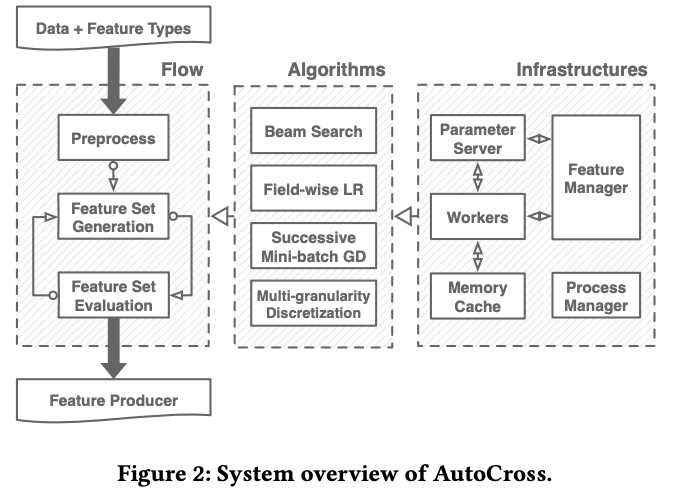
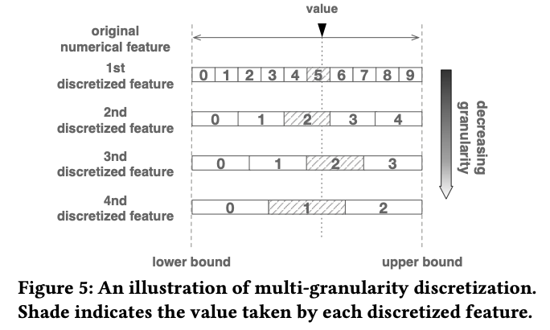
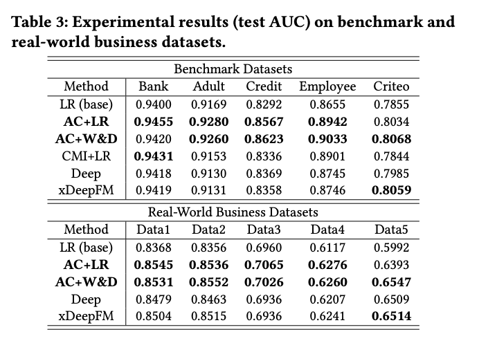

# AutoCross: Automatic Feature Crossing for Tabular Data in Real-World Applications

# 标题
- 参考论文：AutoCross: Automatic Feature Crossing for Tabular Data in Real-World Applications
- 公司：4Paradigm + Hong Kong University of Science and Technology
- 链接：https://arxiv.org/pdf/1904.12857
- Code：
- `泛读`

# 内容

## 摘要
- 特征交叉，即稀疏特征的叉积 cross-product ，是捕获 categorical feature 之间的交互的一种很有前途的方法，广泛用于增强从表格数据中的学习。
- 通过beam search 在树结构的空间， AutoCross 可以实现高效的生成高阶特征交叉的新特征。
- 算法被设计为降低计算量，数据流动，和存储的问题在分布式系统中。

## 1 简介
- 问题
  - 机器学习方法的性能在很大程度上取决于特征的质量。由于原始特征很少产生令人满意的结果，因此通常进行手动 feature generation 从而更好地表达数据并提高学习性能。
  - 这通常是一项乏味且 task-specific 的工作。这促使了自动化的 feature generation ，这也是 AutoML 的一个主要话题
- 方法：
  - 特征交叉，即稀疏特征的叉积 cross-product ，是捕获 categorical feature 之间的交互的一种很有前途的方法。
    - 特征交叉表示特征的共现，它可能与 target label 高度相关。例如，交叉特征 "job x company" 表示一个人在特定公司从事特定工作，这是预测个人收入的一个强大特征。
    - 特征交叉还增加了数据的非线性，这可能会提高学习方法的性能。例如，线性模型的表达能力受到其线性的限制，但可以通过交叉特征来扩展。
    - 显式生成的交叉特征具有高度的可解释性，这是许多真实世界业务中的一个吸引人的特性，例如医疗和欺诈检测。
- 难点：
  - 枚举所有交叉特征可能会导致学习性能下降，因为它们可能是不相关的或冗余的，会引入噪声，并增加学习难度。
  - 传统的机器学习应用中，人类专家大量参与特征工程，努力为每项任务生成有用的交叉特征，并以试错的方式使用其领域知识，但是人工特征交叉的人力需求和难度大大增加了应用机器学习技术的总成本。
- 需求：
  - 简单性要求：用户友好且易于使用，主要是超参数的调整。
  - 分布式计算：现实世界企业中的大量的数据和特征使得分布式计算成为必须。特征交叉方法应考虑计算成本、传输成本、以及存储成本。
  - 实时推理需求：实时推理涉及许多真实世界的业务。在这种情况下，一旦输入了实例，就应该立即生成特征并进行预测。
- 贡献：
  - 提出了一种高效的 AutoML 算法，从而在广泛的搜索空间中显式地搜索有用的交叉特征。它能够构造高阶交叉特征，这可以进一步提高学习性能。
  - AutoCross 具有高度简单性和最小化的超参数暴露。论文提出 successive mini-batch gradient descent 和多粒度离散化。它们提高了特征交叉的效率和效果，同时避免了仔细的超参数设置。
  - AutoCross 针对分布式计算进行了充分优化。通过设计，这些算法可以降低计算成本、传输成本、和存储成本。

## 2 动机
- 通过对原始特征的叉积的结果进行向量化来构建交叉特征：
  - 其中：f_i 为二元的特征向量（通过 one-hot encoding 或哈希技巧）；vec() 函数把张量展平为向量；⊗ 为向量的叉积。
  - 交叉特征也是二元的特征向量。如果交叉特征使用三个或更多个原始特征，我们称它为高阶交叉特征。
  - 高阶交叉特征可以提升数据的质量和增加算法的预测能力
  - search-based feature generation 主要在 numerical feature 上
  - deep-learning-based feature generation 主要在 categorical feature 上，并且显性和隐性的都有
  - 最后，提出一种全新的自动的特征crossing的方法，能高效的生成高阶交叉特征

## 3 系统总结

    
      <figcaption style="text-align: center">
        AutoCross系统overview
      </figcaption>
    </img>
  

- the general work flow
  - preprocessed
    - hyper-parameters determined
    - missing values filled
    - numerical features discretized
  - feature set generation，生成全新的特征组合
  - feature set evaluation，对生成的特征组合 evaluated
- the component algorithms
  - 连接左右两边的部分
  - beam search for feature set generation
  - field-wise logistic regression and successive mini-batch gradient descent for feature set evaluation
  - multi-granularity discretization for data preprocessing
- the underlying infrastructure

## 4 方法
主要讲解具体算法应用

## 4.1 Problem Definition

## 4.2 Feature Set Generation

    
      <figcaption style="text-align: center">
        AutoCross_特征集合生成
      </figcaption>
    </img>
  

- 每一个节点的子节点就是该节点内所有样本两两交叉，生成一个新的特征。
- 比如原始特征是ABCD，第二层就是第一层两两交叉，对于第一个节点，就表示在原来特征集合的基础上（ABCD），再加入一个交叉特征AB。以此类推，每一个子节点在上面所有组合好的特征集合里面找一个两两新的交叉特征。
- 也就是说，检索特征结合等价于从上图中找到一条从根节点开始的路径。每个节点表示加入最终特征集合的交叉组合特征。比如图上最终的特征集合是 {A, B, C, D, AB, CD, ABC, ABCD}。
- 检索空间是 O((d^2/2)^k)，d为原始特征数量，k为路径的最大长度。特大，太耗时。
- 通过beam search，greedy 策略，每次只检索最优的那个节点的子节点，复杂度为 O(k*d^2)。

## 4.3 Feature Set Evaluation
对于候选特征集合，需要进行评估。如果对于每一个候选特征集合都训练一个模型进行评估显然是无法接受的。太耗resource。

### 4.3.1 Field-wise Logistic Regression
- 用最简单的LR模型来训练、评估，近似替代之后可能真正用的更复杂的模型，因为这样LR更快，更广泛使用，可解释性强。
- 在模型训练的时候，只更新新加进来的特征的权重，其他特征的权重保持不变。

### 4.3.2 Successive Mini-batch Gradient Descent
- allocates more resources to more promising candidates
- 如果要在当前n个特征集合里面选一个最优的特征，那么就采用了二分的方法来加速选取过程。
- 将样本分成N份，每次淘汰掉最次的1/2之一特征，相当于将机器资源分配给了更优的那些特征。
- 最终一个loop上面的两步，一起就不让他们走了。

## 4.4 Preprocessing

    
      <figcaption style="text-align: center">
        AutoCross_特征预处理
      </figcaption>
    </img>
  

- 离散是处理numerical 数据已经被证实是有用的去提高预测能力
- 离散的方式：等宽度划分 equal-width discretization
  - 问题：如何number of intervals（granularity）很需要考虑人工经验
  - 解决方式：把numerical feature划分成多个categorical feature根据不同的宽度，也就是不同的granularity
  - 如何选择划分过后的特征：用4.3.1里面的评估方式，最终留一半
  - 如何选择granularity：
    - 有经验的，则依靠experience
    - 没经验的，{10^p}_p = 1

## 4.5 Termination
- runtime condition: 达到某个loop的次数后停止，用户自行设置
- performance condition: 当再次划分数据集训练后，validation performance degrades
- maximal feature number: 当特征数据集个数总数达到某个数之后

## 5 实验

    
      <figcaption style="text-align: center">
        AutoCross_实验最终结果
      </figcaption>
    </img>
  

- 更多细节对比参考原始paper section 5
- 总而言之，AC+LR and AC+W&D 带有AC生成后的特征集合的模型在两种数据集上测试的效果都明显更好，并且对比其它原始的deep模型inference的时间，反而更快。

## 7 CONCLUSION
- 提出特征交叉，即稀疏特征的叉积 cross-product ，是捕获 categorical feature 之间的交互的一种很有前途的方法
- 提出一种beam search的方式，可以高效的生成高阶特征交叉的新特征
- 提出Field-wise Logistic Regression 和 Successive Mini-batch Gradient Descent，两个算法，一个用于快速的评估特征组合搜索的结果，一个用于如何选择用于评估的特征组合。
- 本质上是一种自动化生成特征交叉的方式，实验证明比其它 search-based and deep-learning-based （FM，Cross Net，之类的包含显示特征交叉的模型） 的方式都要好。
- 并且整体system支持分布式训练查找组合

# 思考

## 本篇论文核心是讲了个啥东西
- 参看section 7

## 是为啥会提出这么个东西，为了解决什么问题
- 问题：
  - 对比只使用原始特征，特征交叉可以更好地表达数据并提高学习性能，但是这个工作需要太多手动工作或者task specific的知识
- 贡献：
  - 提出了一种高效的 AutoML 算法，从而在广泛的搜索空间中显式地搜索有用的交叉特征。它能够构造高阶交叉特征，这可以进一步提高学习性能。
  - AutoCross 具有高度简单性和最小化的超参数暴露。论文提出 successive mini-batch gradient descent 和多粒度离散化。它们提高了特征交叉的效率和效果，同时避免了仔细的超参数设置。
  - AutoCross 针对分布式计算进行了充分优化。通过设计，这些算法可以降低计算成本、传输成本、和存储成本。

## 为啥这个新东西会有效，有什么优势
- 对比传统LR模型
  - 自动化引入高阶交叉特征组合，提供更多信息
- 对比其它特征交叉模型（DeepFM, xDeepFM, DCN, W&D）
  - 不需要枚举所有的特征交叉可能性，特别是对于高阶特征交叉，实现了自动化降低特征交叉组合noise的过程，并且不是在训练过程中，可以提前分布式查找组合

## 与这个新东西类似的东西还有啥，相关的思路和模型
- AutoML 方向下的paper

## 在工业上通常会怎么用，如何实际应用
- 可以尝试一下用分布式获取特征交叉组合

