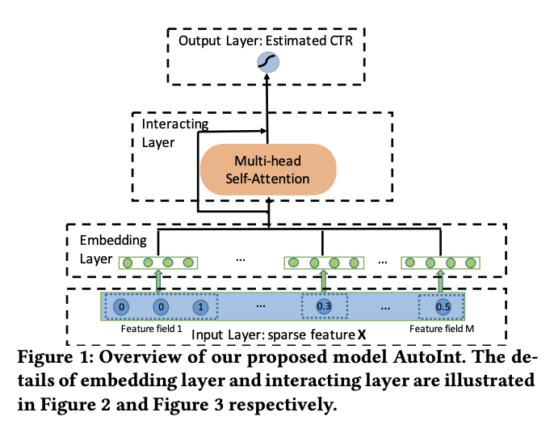
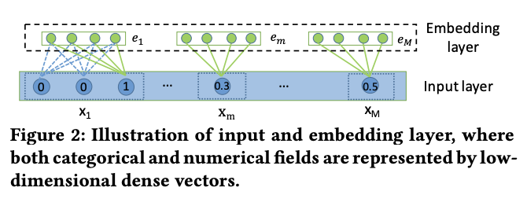
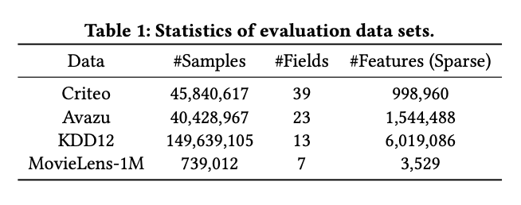
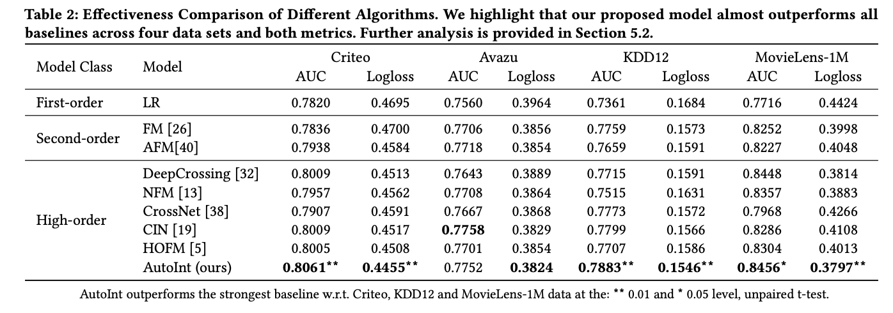
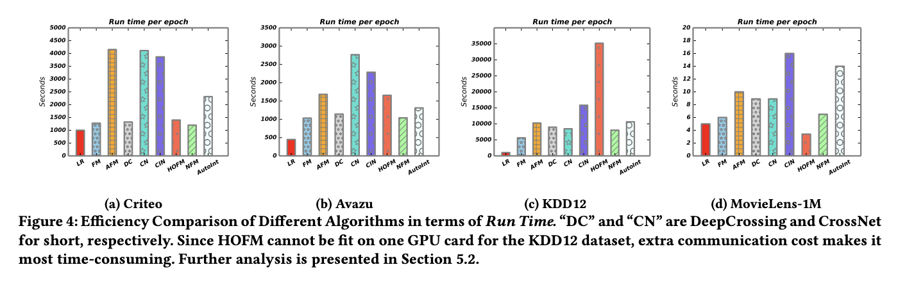
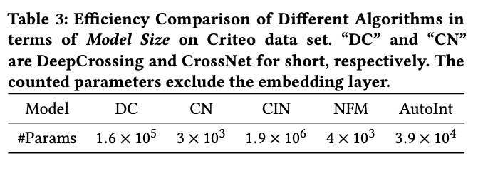
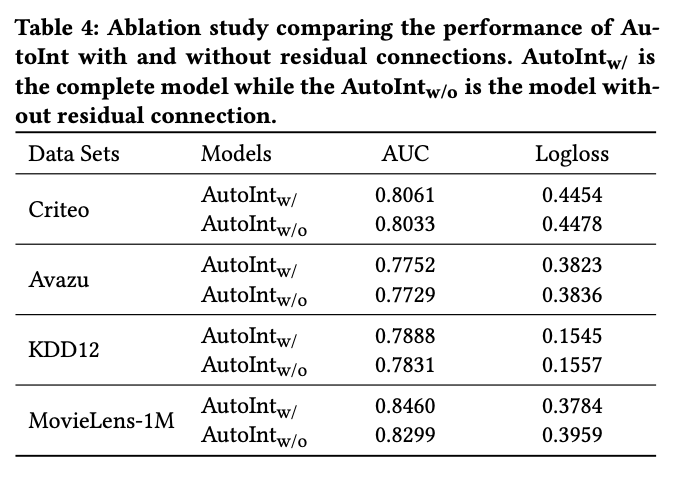
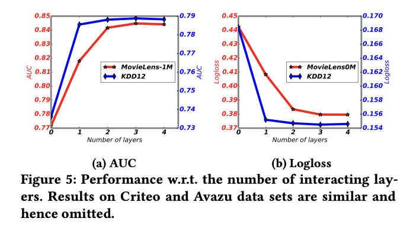

# AutonInt: Automatic Feature Interaction Learning via Self-Attentive Neural Networks

# 标题
- 参考论文：AutoInt: Automatic Feature Interaction Learning via Self-Attentive Neural Networks
- 公司：北大 
- 链接：https://arxiv.org/pdf/1810.11921
- Code：https://github.com/shenweichen/DeepCTR/blob/master/deepctr/models/autoint.py

# 内容

## 摘要
- CTR预测难点：
  - 输入数据一般是高纬稀疏数据，比如user_id，item_id，item category。
  - 高阶特征交叉（cross features）很重要对于预测的准确性，但是很耗时并且很依赖domain knowledge。
  - 本质是需要去寻找稀疏高纬特征的低纬有效表示形式
- 创新点：
  - 自动提取任意高阶特征组合
  - 非常general，输入形式是数值还是类别特征都无所谓

## 1 简介
其实已有的深度模型的相关工作基本核心都是在做高阶的特征交叉，但是诸如 PNN、FNN、DeepCrossing、Wide&Deep、DeepFM 等模型，主要是依赖前馈网络来实现高阶特征交叉。主要的问题是
  - MLP并不高效做特征交叉
  - 特征交叉过程是隐式的，很难解释是哪些特征间的组合起到了关键作用
本文总结来说贡献点在于：
  - 可以显示的学习高阶特征交叉，并且具备一定的解释性
  - multi-head self-attention机制下interacting layer可以有效自动的学习高阶特征交叉的信息，并且高效的处理大型高纬稀疏数据
  - 文章在大量的实际数据上测试过，都是state-of-the-art，并且具备模型的可解释性

## 2 相关工作
我们的工作和三个方向相关：
  - CTR在推荐系统和在线广告的预测
  - 特征交叉的技术
  - 多头自注意力机制和残差链接在deep learning领域的运用

## 2.1 Click-through Rate Prediction
- Deep&Wide结构
- Shan 开创了context-aware CTR
- Oentaryo 提出了 hierarchical importance-aware factorization machine

## 2.2 Learning Feature Interactions
- FM，FFM，GBFM，AFM 缺点在于主要关注模型的低阶特征交叉
- NFM，PNN，FNN，DeepCrossing，Wide&Deep，DeepFM 虽然关注了高阶特征交叉，但是缺点在于特征交叉过程是隐式的，缺乏可解释性
- DCN，xDeepFM虽然学习的是显性的特征交叉，但是解释哪些特征组合的作用还是不太明显
- 树模型，利用embedding + 树模型，会造成模型分裂成几个阶段训练
- HOFM高效的学习高阶特征交叉，但是参数太多，实际应用中很难实现

## 2.3 Attention and Residual Networks
- 多头自注意力机制已经在NLP领域大量证明有效
- 残差链接在CV领域已经证明有效，逐渐变成常见的DNN层

## 3 PROBLEM DEFINITION
- DEFINITION 1. (CTR Prediction)
- DEFINITION 2. (p-order Combinatorial Feature)
- DEFINITION 3. (Problem Definition)，给定输入x的情况下，学习稀疏高纬特征组合的低纬有效表示形式

## 4 AUTOINT: AUTOMATIC FEATURE INTERACTION LEARNING

## 4.1 概括

    
      <figcaption style="text-align: center">
        AutoInt_模型结构
      </figcaption>
    </img>
    

- 模型的目标在于将原始高维稀疏特征向量映射到低维空间，同时能够刻画高阶的交叉特征。
- 首先原始稀疏特征向量经过embedding层转换为低维稠密向量
- 然后将embedding向量喂给interacting layer（引入multi-head self-attention的神经网络），在每一个interacting layer，通过attention机制多会实现高阶特征的组合；同时multi-head的引入使得模型能够引入各种不同方式的特征组合，也就是将特征映射到了不同的子空间中。通过堆叠多层的interacting layer，就可以实现不同阶数的特征组合。
- 最后一层的interacting layer的输出就是一个低维向量，他可以表示前几层学到的高阶特征交叉信息，最后利用这个低维向量来学习CTR分布。

## 4.2 输入层

    
      <figcaption style="text-align: center">
        AutoInt_输入层
      </figcaption>
    </img>
    

- 如果xi是类别特征的话，就使用one-hot向量进行表示
- 如果xi是数值类型的话，我们就使用标量进行表示
- 并进行拼接起来传入embedding层

## 4.3 Embedding Layer（编码层）
- 针对类别特征，通过embedding方式转换为低维稠密向量 ei=Vi*xi 其中，Vi 是特征组 i 对应的嵌入字典(嵌入矩阵)，xi 是特征组特征的独热编码表示向量(通常出于节省空间的考虑，只存储非零特征对应的索引)，离散特征是直接 lookup embedding 表
- 多值的离散特征使用 average pooling
- 连续特征则相当于乘以一个不含 bias 的 Dense 层，em=Vm*xm 其中 Vm 是一个嵌入向量，xm 是一个标量值
  - 通常在CTR任务中对连续值特征的处理方式有三种：
    - 进行归一化处理拼接到embedding向量侧
    - 进行离散化处理作为类别特征
    - 赋予其一个embedding向量，每次用特征值与embedding向量的乘积作为其最终表示

## 4.4 InteractingLayer（交互层）
- 交互层使用多头注意力机制将特征投射到多个子空间中，在不同的子空间中可以捕获不同的特征交互模式。通过交互层的堆叠，可以捕获更高阶的交互模式。提高层数本质上可以模拟任何高阶的特征交互模式。
- 本质上就是直接使用NLP里面多头自注意力机制，然后每一层的输出再结合残差连接。
- 每一层的为了combine残差连接，需要用一个矩阵W来进行维度转换，把输入的维度转化成多头注意力机制的输出。因为文章里面多头embedding的维度最终不会等于输入维度。
- 对比原始 attention 有几个不一样的点：
  - AutoInt 中的 Self-Attention 没有进行 scale，求 softmax 之前没有将内积除以一个缩放系数，导致的结果是突出了高效组合的重要性。当然，在实现的时候还是可以尝试把缩放加进来。
  - 在最后一步还会再过一个 LayerNormalization，文章里并没有加；实现的时候可以加了看看。
  - 在实现的时候，假设 embedding 的维度为 d，head 的数量为 k，则可以设置每个 head 中 query、key、value 矩阵 W(h)的维度为 (d/k,d)，这样得到的 ẽ(h)i 就是 d/k 维，将 k 个 head 的结果 concat 后，ẽi 又变成了 d 维，从而保证输入的维度与输出的维度相同；这样的话，最后一步中矩阵 W 其实就不需要了（本文的实验中 e 与 ẽ 维度不同，因此需要通过 W 将 e 变成与 ẽ 相同的维度）。

## 4.5 Output Layer（输出层）
- 最后一层interacting层输出包括原始的embedding特征向量以及利用multi-head self-attention学到的用于表征高阶特征交叉的低维稠密向量。
- 输出层将这些特征拼接起来之后经过一个线性层，变成一个输出值，然后sigmoid激活函数输出最后的值，这个值就是模型预测的ctr

## 4.6 Training（训练）
本文使用point-wise的方法，即训练样本是每个item是否点击，所以是一个二分类问题，损失函数是交叉熵（log loss）损失，这里的损失函数和DCN不一样，没有L2正则化。猜想应该是因为自注意力机制中本身就存在控制参数scale的能力。并不需要额外constrain参数。

## 4.7 Analysis Of AutoInt
- Modeling Arbitrary Order Combinatorial Features
  - 一层自注意力机制可以得到二阶特征交互的信息：g(xi,x1),g(xi,x2),⋯,g(xi,xm)
  - 因此到了两层时，由于第一层输出中每个 field 相当于都是包含了所有的 2 阶组合，因此它的输出就包含了 3 阶和 4 阶的组合特征，例如 g(x1,x2,x3,x4) 就包含在 ẽ1 和 ẽ3 的交互中。同理，三层 Self-Attention 就包含 8 阶内的组合特征。
  - 与 DCN 中的 cross 层相比，cross 每层增加 1 阶特征组合，而 Self-Attention 每层增加 1 倍特征组合。更加高效的自动化得到特征交互信息。
- Space Complexity
  - embedding layer: [n, d]
  - interacting layer: (3 * [d, d'] + [d, H * d']) * L，三个qkv的对应转换矩阵和一个残差链接的转化矩阵。
  - output layer: [d' * H * M, 1]，输出层把每个head和每个特征的embedding拼接起来
  - n -> dimension of sparse representation of input feature, d -> embedding size, d' -> self-attention embedding size, H -> number of head, L -> number of self-attention layers
  - 整体来说可以写成 O(L * d * d' * H)，这里 H 和 d' 一般并不大，文章实验里面设置为 H: 2，d': 32。
- Time Complexity
  - 一层的自注意力层计算时间为 O(M * d * d' + M^2 * d') * H
  - 同理space，H 和 d'并不大，所以整体来说时间上是可以接受的

## 5 实验
- RQ1 AutoInt模型在CTR预测上是否有效？是否有效对于高规模稀疏高纬数据？
- RQ2 不同模型的参数设置有没有什么影响？
- RQ3 不同特征之间的依赖关系，模型是否具有可解释性？
- RQ4 结合隐性的特征交叉是否对模型的表现有提高？

## 5.1 实验设置

### 5.1.1 实验数据
- 数据集：
  四个public real word data，数据statistic如下：
  

      
        <figcaption style="text-align: center">
          AutoInt_数据对比
        </figcaption>
      </img>
      

- 数据处理：
  - 移除不常用的特征值，比如特征值出现的频率低于 10，5，10，并且这一类的特征值统一变成一个特征值 UNKNOWN
  - 数值特征进行log处理
  - 训练和验证数据集选择 8：2 的比例

### 5.1.2 评估指标
- AUC
- LogLoss

### 5.1.3 Competing Models
文章对比了三种类型的model
- 线性模型
  - LR
- 基于FM的模型，只考虑2阶特征交叉的模型
  - FM
  - AFM
- 可以自动获取高阶特征组合的模型
  - DeepCrossing
  - NFM
  - DCN - Full model compare
  - xDeepFM - Full model compare
  - HOFM

### 5.1.4 Implementation Details
- Embedding
  - d - 16 维度
- Optimization：
  - batch size 设置为1024
  - 使用Adam优化器进行mini-batch随机优化
- Interacting layer:
  - layers 设置为3
  - d' 设置为32
  - head 试着为2
- Hyperparameters：
  - dropout [0.1, 0.9] 网格搜索的方式
  - 其它超参数均采用网格搜索

## 5.2 Quantitative Results (RQ1)

    
      <figcaption style="text-align: center">
        AutoInt_实验结果对比
      </figcaption>
    </img>
    

- 二阶模型全面超越LR
- DNN的隐式特征交叉学习并不能保证比显式特征交叉学习更强
- 高价特征交叉明显对模型效果有贡献

    
      <figcaption style="text-align: center">
        AutoInt_实验性能对比
      </figcaption>
    </img>
    

- CIN - xDeepFM 时间上最慢
- AutoInt 一点也不慢
- 实验对比里面AutoInt采用Deep and Cross 结构，保证了一致性对比

    
      <figcaption style="text-align: center">
        AutoInt_实验参数对比
      </figcaption>
    </img>
    

- AutonInt在保证了效果的同时，同时保证了参数个数并不是特别多，可以高效的在线预测

## 5.3 Analysis (RQ2)

### 5.3.1 Influence of Residual Structure

    
      <figcaption style="text-align: center">
        AutoInt_模型残差链接对比
      </figcaption>
    </img>
    

- 所有数据集上有明显显示如果没有残差链接，performance降明显降低

### 5.3.2 Influence of Network Depths

    
      <figcaption style="text-align: center">
        AutoInt_模型层数对比
      </figcaption>
    </img>
    

- 从第一层开始，performance 明显上升
- 到达第三层后，performance 开始趋于稳定

### 5.3.3 Influence of Different Dimensions
文章测试多头注意力机制投影维度从 [8, 32] 的效果变化，随着维度的上升，performance 明显持续提高。因为模型越来越大，效果更好。

## 5.4 Explainable Recommendations (RQ3)
利用attention score的 heat map来找到不同feature直接的对比，参考DCN-V2的方式，本质上是一样的，只是这里是feature-wise的pairs，而DCN-V2是bit-wise的pairs。这里的case-level的选择应该是第一层的attention score，而且应该是只看了正样本。

## 5.5 Integrating Implicit Interactions (RQ4)
集成隐式交互，前馈神经网络能够建模隐式的特征交互，并被广泛集成到现有的 CTR 预测方法中。为了研究集成隐式的特征交互是否能进一步提高性能，我们通将 AutoInt 与两层前馈神经网络相结合（并行集成，而不是堆叠。我们将这个联合模型命名为 AutoInt+，并将其与以下算法进行比较：Wide&Deep、DeepFM、Deep&Cross、xDeepFM。结果如下表所示。
- 通过集成前馈神经网络，我们的方法在所有数据集上的性能都有所提高。这表明，集成隐式的特征交互确实提高了 AutoInt 的预测能力。 
- 然而，从最后两栏可以看出，与其他模型相比，性能提高的幅度相当小，表明我们的单个模型 AutoInt 是相当强大的。 
- 集成了隐式的特征交互之后，AutoInt+ 的性能超过了所有的 baseline 方法，并取得了新的 SOTA 的性能。
- 可以考虑使用stack的方式把AutoInt和DNN连起来，但是效果提升不明显。

## 6 总结和未来研究方向
- 总结
  - 提出自动提取任意高阶特征组合的interaction layer
  - 提出了更具有可解释性的特征组合方法
  - 和隐式学习联合训练(parallel DNN)的时候得到SOTA
- 未来研究方向：
  - 加入context information进入model
  - 延伸AutoInt结构到其它task，比如regression，classification，ranking

# 思考

## 本篇论文核心是讲了个啥东西
- 提出一种能自动获取任意高阶特征组合能力且具有一定特征组合可解释性的模型

## 是为啥会提出这么个东西，为了解决什么问题
- 对比简单的线性模型LR，解决人工特征工程的问题。
- 对比FM或者FFM解决了：达到3阶或者更高的特征组合，取决于attention layer的层数。
- 对比只有DNN的模型，解决了可以显示的自动学习到任意阶的显式的特征组合。
- 对比DCN之类的自动化获取特征组合的模型：
  - 实现了feature-wise的特征交叉计算
  - 实现了特征类型无影响，输入形式是数值还是类别特征都无所谓，特别是对于数值类型的特征向量化处理，保证了维度一致。
  - 能获取任意更高阶的特征组合并且不需要太多层（不需要太多参数）
  - 更好的全局特征意识，来学习任意阶层特征交叉

## 为啥这个新东西会有效，有什么优势
- 利用多头自注意力机制，实现了随着层数增加，更容易获取高阶特征交叉，并且不需要太深，比如AutoInt只需要3层可获得8阶特征组合，然而DCN需要7层。
- 同NLP的多头自注意力机制，采用residual connect的形式，保证了模型收敛的速度和稳定性，可以使模型更大更深，同时稳定了高阶交叉带来的无意义noise信息。
- 本质上还是提出了一直全新的计算特征高阶显性交叉与特征选择性的思路。

## 与这个新东西类似的东西还有啥，相关的思路和模型
- PNN：提出了两种自动化计算特征交叉的方式
- Wide&Deep：提出了本文沿用的训练的框架
- DeepFM：Wide部分不一样
- xDeepFM：Wide部分不一样
- DCN：提出了cross layer，实现高阶特征组合自动化

## 在工业上通常会怎么用，如何实际应用
- 可以使用DeepCTR-pytorch的版本
- 参考论文里面 5.3 这一章节，设置重要的两个参数（层数，注意力输出维度）range调参。
- 可以变成特征组合提取的思路，应用在同一个embedding维度下的不同的特征子集，因为现实中很难保证所有特征同一个维度。

# 参考
- https://datawhalechina.github.io/fun-rec/#/ch02/ch2.2/ch2.2.2/AutoInt

