# DCN V2: Improved Deep & Cross Network and Practical Lessons for Web-scale Learning to Rank Systems

# 标题
- 参考论文：DCN V2: Improved Deep & Cross Network and Practical Lessons for Web-scale Learning to Rank Systems 
- 公司：Google 
- 链接：https://arxiv.org/pdf/2008.13535
- Code：https://github.com/tensorflow/recommenders/blob/v0.5.1/tensorflow_recommenders/layers/feature_interaction/dcn.py

# 内容

## 摘要
- 特征工程很重要，DCN模型能高效地学习特定阶以内的特征交叉。
- DCN，在大规模（几十亿样本）场景下，DCN中cross网络的表达能力有限，无法学到更加有用的特征交叉。
- 基于DCN的优缺点以及现有的特征交叉方法，本文提出了改进版的DCN-M来使模型更容易在大规模工业场景下落地。
- 实验结果表明，DCN-M在学习特征交叉时的表达能力更强且效率较高，在主流数据集上能够超过SOTA方法。
- 在引入混合低秩矩阵后效果更好。DCN-M结构简单，容易作为building blocks，且在许多大规模L2R系统中取得了显著的线下和线上指标提升。

## 1 简介
- 特征交叉对CTR预估很重要。目前的特征交叉依赖于手工或穷举完成，依赖专业领域的知识，并且很难泛化到没见过的特征交叉上。
- 线性模型很快但是太简单不能够捕捉特征交叉的信息。Embedding被广泛的应用与各种领域并且FM里面。
- DCN虽然有效但是在大规模（几十亿样本）场景下，表达能力有限。
- Cross net受限于灵活的表达特征交叉的随机组合。
- 并且Cross net部分和DNN部分的参数对比非常不平衡。当遇到大规模（几十亿样本）场景下时，大量的参数会被应用到学习隐式的DNN结构上。
- 本文的贡献：
  - 提出了一种新的DCN-M模型来有效地学习显式和隐式特征交叉，模型高效、简单的同时，表达能力更强。
  - 基于DCN-M中学习出的低秩矩阵，利用低秩方法来在子空间中进行近似特征交叉，在模型效果和时延上达到了更好的权衡。受MOE结构启发，将矩阵分解至多个子空间，随后通过门控机制来对这些子空间进行融合。
  - 使用人造数据集进行了研究，结果表明传统的基于ReLU的神经网络在学习高阶特征交叉时效率较低。
  - 在Criteo和ml-1m数据上的大量实验表明，DCN-M模型能够显著胜过SOTA方法。

## 2 相关工作
- Parallel Structure
  - 平行的训练两个networks，思路来源于Deep&Wide，难点在于Wide部分的选取。
  - DeepFM选择FM作为Wide部分。
  - DCN选择cross net作为Wide部分。能高效并且自动的学校显式的有边界的特征交叉。
  - xDeepFM提出新的network，提高cross net的表达能力通过：
    - 提出利用多个feature map，学习当前层和输入层所有的两两特征交叉
    - 同时提出每个embedding 特征整体作为一个unit，而不是特征的每一个维度作为一个unit
    - 缺点：
      - 计算量非常高，参数个数是DCN的10倍多，很难在实际工程中落地使用。
      - DeepFM和xDeepFM需要每个特征embedding后统一维度，但是实际数据中很多离散特征的字典大小从v 𝑂(10) to millions级别。
  - AutoInt使用了多头自注意力机制和残差链接
  - InterHAt使用了Hierarchical Attentions
- Stacked Structure
  - 把特征交叉层放在embedding 层和 DNN 层之间的模型。这一层会很早的学习到更多的特征交叉的信息来帮助后面的hidden layer学习。
  - PNN提出 IPNN 和 OPNN，OPNN的缺点之一是计算量很大。
  - NFM使用Hadamard product替换了原本FM里面的inner product部分。
  - DLRM使用了inner product提取特征交叉。
  - 以上所有模型的问题主要是都只能拟合显式二阶特征组合

## 3 模型架构
DCN-M模型同DCN结构一样，从嵌入和堆积层（embedding and stacking layer）开始，接着是Cross Network和深度网络，最后是组合层，它结合了两个网络的输出。对比DCN文章提出了两种组合方式，堆叠（串行）和并行两种，完整的DCN-M模型下图所示。

    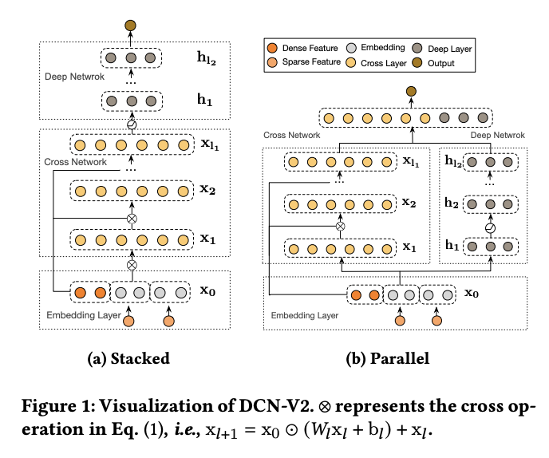
      <figcaption style="text-align: center">
        DCN-M_模型结构图
      </figcaption>
    </img>
    

## 3.1 Embedding Layer
- 考虑输入有稀疏和稠密的特征。在大规模的网络推荐系统中，输入大部分是类别特征，如"country=usa"。类别特征通常用one-hot编码，如”[0,1,0]“；然而，这会导致过度的高维特征空间。
- 为了降低维度，采用embedding process将二值化特征变换为稠密实值向量（通常称为嵌入向量，embedding vectors）。
- 最后，我们将嵌入（embedding）向量和归一化的稠密特征 x_dense 拼接成一个向量输入到网络中去。对于 multivalent features 先做mean再拼接在一起。输入和拼接方式同DCN。
    - 

        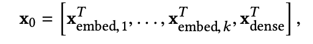
          <figcaption style="text-align: center">
            DCN_输入
          </figcaption>
        </img>
        

## 3.2 Cross Network
DCN-M对比DCN核心区别在于W权重矩阵变成了[d, d]。公式如图。

    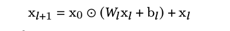
      <figcaption style="text-align: center">
        DCN-M_cross_net_公式
      </figcaption>
    </img>
    

- 其它特点和DCN一样，结构图如下

    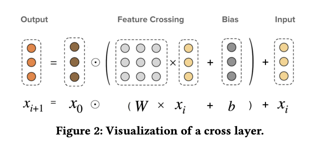
      <figcaption style="text-align: center">
        DCN-M_cross_net_结构图
      </figcaption>
    </img>
    

- 从结构图可以看出来，每一层的复杂度之和 w，b 有关系，也就是说整体的cross net复杂度是 (d × d + d) × L_c。d 是 input 维度也就是embedding and stacking之后的维度，L_c是 cross net 的层数。
- DCN的参数结构在cross net和MLP上面随着层数的增加，差距越来越大，容易导致大部分的参数专注于deep tower，导致cross net的表达能力不住，所以DCN-M把vector改成了matrix。一定层度保证了参数平衡，再通过低秩矩阵降低时间复杂度。
- 同DCN一样每次都会用到初始值x_0，这样也保证了无论如何交叉，不会让最终层的输出偏离原始值太远。同时它代表特征的一阶结果，在交叉网络中每一层都会引用它，每引用一次本层就会再这基础上再上一阶，x_0是一个把DCN推上更高阶的增量因子。
- DCN网络的 cross layer 的建模是element-wise，DCN-V2 cross layer可以实现element-wise和feature-wise的特征交叉通过和初始值的哈达玛积。**这里的实现后面有证明。**
- W矩阵和本层的结果x_i矩阵相乘，使得x_i每个元素都变成了x_i内所有元素的一个加权求和线性映射的结果，再配合上和x_0的哈达马积逐位相乘就实现了类似FM的交叉操作，而W的作用就是挑选出每个x_i位置下需要交叉的内容，将原始的x_i映射为最合适和x_0做逐位相乘的形态。
- 本质上，DCN-V2采用了一个wx+b操作对每层的表征x做一个变换，使得它更好地和一阶输入x0进行哈达马积，而哈达马积就是在做特征交叉。

## 3.3 Deep Network
深度网络就是经典的MLP，同DCN一样，深度网络的复杂度为 d × m + m + (m^2 + m) × (L_d−1)，d 是 input 维度也就是embedding and stacking之后的维度，L_d是 mlp 的层数，m 是每层的deep layer size也就是hidden unit。

## 3.4 Deep and Cross Combination
本文使用point-wise的方法，即训练样本是每个item是否点击，所以是一个二分类问题，损失函数是交叉熵（log loss）损失，这里的损失函数带了L2正则化。
- Stacked Structure： 
  - 将cross network的输出放进deep network，最后过一个logits layer，模拟的是f_cross * f_deep的结果。
- Parallel Structure：
  - 将x_0作为cross和deep的输入，把cross network的输出和deep network的输出拼接在一起，最后过一个logits layer，模拟的是f_cross + f_deep的结果。
- 以上两种结构各有千秋，取决于数据的分布。

## 3.5 Cost-Effective Mixture of Low-Rank DCN
工业界模型往往受计算资源和响应时间限制，需要在保证效果的同时降低计算成本。低秩方法被广泛用于降低计算成本——将一个稠密矩阵近似分解为两个”高瘦“的低秩矩阵。而且，当原矩阵的奇异值差异较大或快速衰减时，**低秩分解**的方法会更加有效。作者发现，DCN-M中学到的参数矩阵是低秩的（所以比较适合做矩阵分解）。

    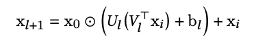
      <figcaption style="text-align: center">
        DCN-M_低秩矩阵公式
      </figcaption>
    </img>
    

- 以上公式显示，cross net是在子空间中学习特征交叉
  - 子空间的交叉特征建模使得我们可以利用MoE。MoE由两部分组成：experts专家和gating门（一个关于输入x的函数）。我们可以使用多个专家，每个专家学习不同的交叉特征，最后通过gating将各个专家的学习结果整合起来，作为输出。这样就又能进一步增加对交叉特征的建模能力。结构图如下：
  - 

      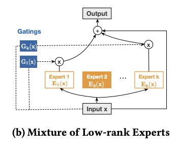
        <figcaption style="text-align: center">
          DCN-M_MoE结构图
        </figcaption>
      </img>
      

- 我们将输入x从维度d映射到r，然后又映射会维度d。[d >> r]。
  - 利用映射空间的低秩性。在映射回原有空间之前，施加了非线性变换来提炼特征。进一步增加模型的表达能力。

## 3.6 Complexity Analysis
- 原始的DCN-V2时间复杂度为 O(d^2 × L_c)
- 加入低秩矩阵和MoE后，时间复杂度为 O(2 × d × r × k × L_c)
- d 是 input 维度也就是embedding and stacking之后的维度，L_c是 cross net 的层数。r 是低秩矩阵的投影维度，k是MoE专家个数。
- 当 r × k << d 的时候，DCN-M效率更高

## 4 模型分析
- 详细推导了 Polynomial Approximation 在 bit-wise 和 feature-wise上的theorem。
- 验证了其它相关的模型比如DCN，DeepFM，xDeepFM，AutoInt，PNN 实现的效果一样。

## 5 实验问题
提出了五个问题并一一解答：
1. 在什么情况下，显式学习特征交叉的模型能比基于ReLU的DNN更有效？
2. 去掉DNN后，baselines中的特征交叉部分表现如何？
3. DCN-M的效果与baselines相比如何？能否在准确性和计算成本上取得更好的权衡？
4. DCN-M中的各项参数是如何影响模型效果的？
5. DCN-M能否捕捉重要的特征交叉？

## 6 EMPIRICAL UNDERSTANDING OF FEATURE CROSSING TECHNIQUES (RQ1)
很多CTR的工作都在针对显式特征交叉进行建模（传统神经网络无法高效地学习到），但很多工作都只在公开数据集上进行研究，这些公开数据集上特征交叉的模式是未知的，且包含许多噪声数据。因此，作者通过特定的特征交叉模式来生成数据集，验证各模型的效果。因此需要弄明白以下两点。
- 什么情况下传统的DNN变的不高效
- DCN-V2中每个component的角色，在做什么

**Performance with increasing difficulty**：只考虑2阶特征交叉的情况下，作者提出三种特征交叉模型，按照难度由易到难的顺序指定特征交叉的模式构建ground truth。

      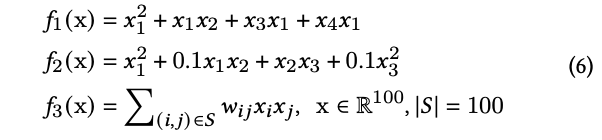
        <figcaption style="text-align: center">
          DCN_特征交叉公式
        </figcaption>
      </img>
      

      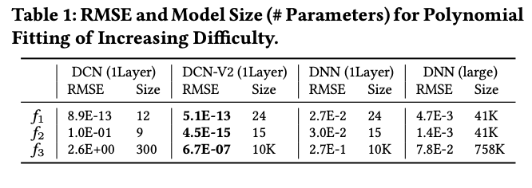
        <figcaption style="text-align: center">
          DCN_特征交叉效果对比
        </figcaption>
      </img>
      

从RMSE上来看模型拟合的效果看出：DCN和DCN-V2效果较好。当交叉的模式变得复杂时（f3），所有方法的效果都有所下降，但DCN-V2仍然是很准确的。DNN的效果较差，即使是使用更宽、更深的DNN（DNN-large），效果仍然较差。

**Role of each component**：只有交叉项的时候，随着layer的增加，RMSE的起伏很不稳定，但是加入residual和bias后，随着layer的增加RSME稳定的降低。由此可见，residual 和 bias 负责模型的稳定性，降低了每一层的gap，当一些没必要的交叉层引入的时候，保证了稳定性。

**Performance with increasing layer depth**：1-4阶特征交叉（与实际情况较为接近），当增大层数时，DCN-M能够捕捉数据中更高阶的特征交叉、达到更好的效果。由于DCN-M中的残差项和偏置项，即使模型超过3层（引入了多余的特征交叉），效果也没有变差。

      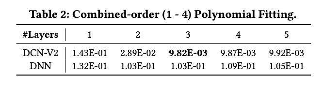
        <figcaption style="text-align: center">
          DCN_特征交叉层数增加对比
        </figcaption>
      </img>
      

总结什么情况下显示学习特征交叉模型比ReLU的DNN更有效
- ReLUs are inefficient in capturing explicit feature crosses (multiplicative relations) even with a deeper and larger network. 
- The accuracy considerably degrades when the cross patterns become more complicated. 
- DCN accurately captures simple cross patterns but fails at more complicated ones. 
- DCN-V2, remains accurate and efficient for complicated cross patterns.

## 7 EXPERIMENTAL RESULTS (RQ2 - RQ5)
详细总结了实验过程和对应的回答了上面的几个问题

## 7.1 Experiment Setup

### 7.1.1 数据
- Criteo，同DCN
- MovieLen-1M

### 7.1.2 baseline
我们对比了其它6个特征交叉的SOTA模型

      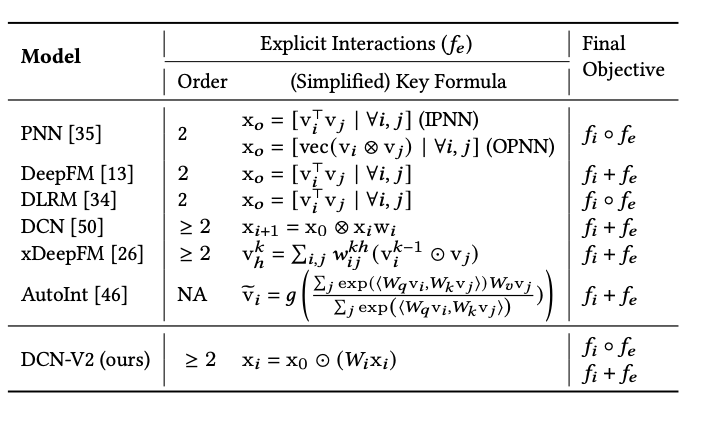
        <figcaption style="text-align: center">
          DCN_模型对比
        </figcaption>
      </img>
      

### 7.1.3 Implementation Details
- Embeddings
  - 数值特征apply log 规范化。
  - 类别特征apply embedding 技术变换为 avg(6 × (category cardinality)^1/4) 取平均值，维度的稠密向量。为了保证和其它模型一直，保证每个feature的特征维度一致。
  - 类别特征维度，39 for Criteo， 30 for Movielen-1M
- Optimization：
  - 使用Adam优化器进行mini-batch随机优化
  - batch size 设置为512
  - Batch Normalization
  - gradient clip norm 设置为100
  - Kernels were initialized with He Normal, and biases to 0
- Hyperparameters：
  - 网格搜索的方式，从大范围到小范围
  - hidden unit [562, 768, 1024]
  - cross network layer 1 -> 4
  - learning rate 0.0001 -> 0.1 by log scale, then from 0.0001 -> 0.0005 by linear scale

## 7.2 Performance of Feature Interaction Component Alone (RQ2)
去掉DNN后，baselines中的特征交叉部分表现:

      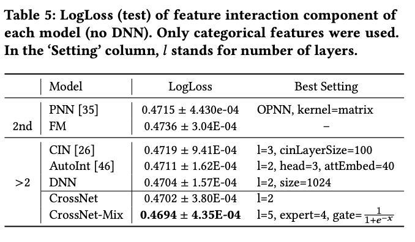
        <figcaption style="text-align: center">
          DCN_模型对比
        </figcaption>
      </img>
      

- 更高阶的模型会比2阶的模型效果更好，说明在Criteo数据集上更高阶的交叉也是有意义的。
- 在高阶模型中，Cross Network取得了最好的效果，并且slightly better than DNN。

## 7.3 Performance of Baselines (RQ3)
- 对于不同的数据集，stacked或者parallel的结构都可能取得best performance，并不是parallel一定最好。
- 当cross net和DNN进行联合训练的时候，高order的特征交叉不再明显，performance的差距越来越近。这里可以明显感觉出隐式特征交叉的重要性和DNN的拟合能力强大。
- 对于高阶特征交叉的模型，xDeepFM，AutoInt and DCN表现的performance差不多。
- 对比DNN，实验显示，在调过参数的DNN之后，比一些更复杂的模型效果还要好一点。我们认为当和DNN联合训练的时候，整体的performance被DNN部分主宰。特别当DNN参数很大的时候。一些简单的特征交叉可能已经被DNN拟合了。
- 在实践情况下，单一变量很难被学习到，特别是和大量的其它参数一起训练的时候，因此一个不合适的特征可能会导致noise。
- 大部分模型的运行时间大约是参数量#Params的2倍，但xDeepFM却高出了一个数量级，难以落地。DCN-M效果最好，而且相对来说效率比较高；DCN-Mix进一步降低了计算成本，在准确性和计算成本上实现了更好的权衡。

      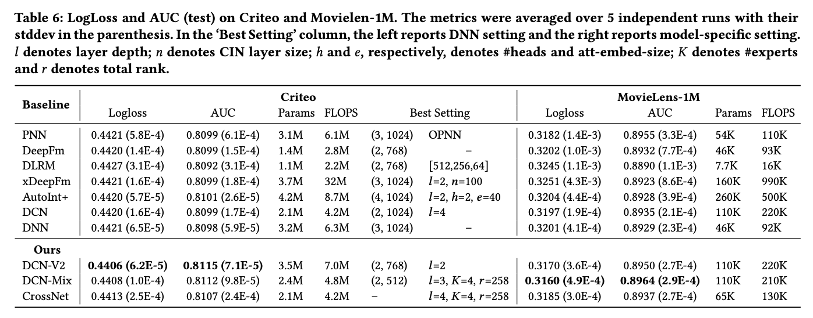
        <figcaption style="text-align: center">
          DCN_模型效果对比
        </figcaption>
      </img>
      

## 7.4 Can Cross Layers Replace ReLU layers
文章进一步对比了DNN和CrossNet的效果。由于实际生产环境中资源有效，往往需要限制模型大小。因此作者限制了模型的内存占用（即参数量）。结果显示，在相同的参数量限制下，CrossNet的效果更好。那是不是说CrossNet就能替代ReLU层？作者表示：还需要更多实验和分析，不过是一个潜在的方向。

      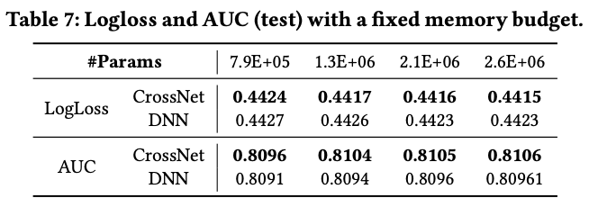
        <figcaption style="text-align: center">
          DCN_模型效果对比
        </figcaption>
      </img>
      

## 7.5 How the Choice of Hyper-parameters Affect DCN-V2 Model Performance (RQ4)

      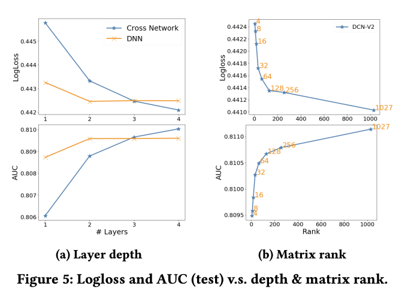
        <figcaption style="text-align: center">
          DCN_参数效果对比
        </figcaption>
      </img>
      

- 网络层数： 
  - 当cross网络层数增加时，效果会稳定提升，说明能够捕捉更有用的交叉。但提升的速度越来越慢，说明高阶特征交叉的作用是低于低阶交叉的。作者也对比了一个相同规模的DNN，层数<=2时DNN效果比cross网络更好，但层数更多时，差距会减小甚至出现反超。
- 矩阵的秩：
  - 当秩小于64时，logloss几乎是呈线性下降；大于64时下降速度放缓。这说明最重要的特征能够被最大的64个奇异值所捕捉当原始特征维度为1000的时候。
- 专家网络的数量：
  - 当其他参数设置为最优时，使用更多的专家网络并没有明显地提升，这可能是由于门控机制和优化方法比较朴素。作者认为，如果采用更精细化的门控机制和优化方法，会从MOE结构中取得更大收益。

## 7.6 Model Understanding (RQ5)

      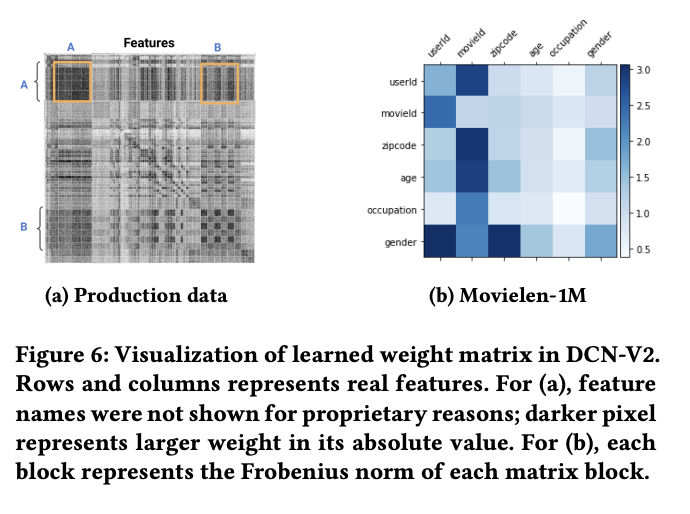
        <figcaption style="text-align: center">
          DCN_模型理解能力
        </figcaption>
      </img>
      

DCN-M中的权重矩阵 W 能够反映不同交叉特征的重要程度，importance of feature interaction between 𝑖-th and 𝑗-th feature is characterized by the (𝑖, 𝑗)-th block 𝑊𝑖,𝑗。通过heatmap可以看出来，模型能够学到一些强特征，例如gender × userid，movieId × userid。

## 8 PRODUCTIONIZING DCN-V2 AT GOOGLE
取得了很大的成功offline和online上面

### Production Data and Model
- Embedding 词典大小从 2 - millions
- Baseline model is a fully-connected multi-layer perceptron (MLP) with ReLU activations

### Comparisons with Production Models:
- DCN-V2 yielded 0.6% AUCLoss (1 - AUC) improvement

### Practical Learnings
- It’s better to insert the cross layers in between the input and the hidden layers of DNN. Our hypothesis is that the physical meaning of feature representations and their interactions becomes weaker as it goes farther away from the input layer。
- 设置cross layer 1 - 2，可以看到持续性的accuracy的提升，2之后曲线走势趋向平缓。
- cross net每一层之间本身也可以实现stacked或者concatenation，实验证明两种情况都可以取得不错的效果，stacked 扑捉到 higher-order feature interactions，concatenation 扑捉到 complimentary interactions。
- 使用低秩矩阵，降低到 (input size)/4 的维度可以保持得到和 full-rank DCN-V2 一样的accuracy。

## 9 总结和未来研究方向
- 总结
  - DCN-M模型能够简单且有效地建模显式特征交叉
  - 混合低秩矩阵在模型效果和时延上实现了更好的权衡
  - DCN-M已成功应用于多个大型L2R系统，取得了显著的线下及线上收益
- 未来研究方向：
  - 继续提高理解 interaction 在 DCN-V2 和 optimization 算法之间的关系，比如考虑 second-order method。
  - 继续提高 embedding，DCN-V2 和 rank of matrix 之间的关系，从而提高 gating 机制在 DCN-M 里面。
  - 继续 cross layers 能否替代 ReLU layers in DNN。

# 思考

## 本篇论文核心是讲了个啥东西
- 提出一种表达能力更强且效率较高的交叉网络结构，同时提出了一种矩阵转化方式实现了工程上的权衡。

## 是为啥会提出这么个东西，为了解决什么问题
- 对比简单的线性模型LR，解决人工特征工程的问题。
- 对比FM或者FFM解决了：
  - 联合训练的时候融入了DNN一起，表达能力在 Generalization 上面更强
  - 在低阶组合方面能够特征组合出高于FM的二阶组合情况，达到3阶或者更高，取决于cross net的层数。
- 对比只有DNN的模型，解决了可以显示的自动学习到有限阶的显式的特征交叉。
- 对比DCN第一版模型，对于工业级大数据，提升了表达能力，同时实现了工程上的高效。

## 为啥这个新东西会有效，有什么优势
- 在特征交叉和每层加入初始值上原理同DCN，采用residual connect的形式，保证了模型收敛的速度和稳定性，同时稳定了高阶交叉带来的无意义noise信息。
- 对比DCN虽然参数扩大了很多，但是采样低秩矩阵分解 W，根据实验结果基本实现了参数 * 1/4 达到同样的效果，如果参数和DNN一样的时候，大部分情况下DCN-V2模型performance更好。
- 提出了MoE的思路，进一步提高了模型的表达能力，实现了在多个子空间上的表达能力提升。
- 联合DNN模型一起concat的起来训练，沿用了Wide&Deep的思路，保证了 Memorization 和 Generalization。
- 提出了用cross net 替代 ReLU 的思路，并且实验证明参数一样的情况下，cross net 效果比 DNN + ReLU 效果更好。
- 提出了用第一层的 W 权重矩阵可以表达出特征交叉heatmap，增强了解释性，更好地理解特征交叉效果。

## 与这个新东西类似的东西还有啥，相关的思路和模型
- PNN：提出了两种自动化计算特征交叉的方式
- Wide&Deep：提出了本文沿用的训练的框架
- DeepFM：Wide部分不一样
- xDeepFM：Wide部分不一样
- AutoInt：使用了多头自注意力机制和残差链接

## 在工业上通常会怎么用，如何实际应用
- 直接使用TF-ranking里面模型，或者DeepCTR-pytorch的版本
- 参考论文里面 Practical Learnings 这一段，设置参数range调参。
- 目前实际使用情况中，stacked + 2 layers 起到的效果比较好。

# 参考
- https://zhuanlan.zhihu.com/p/353223660