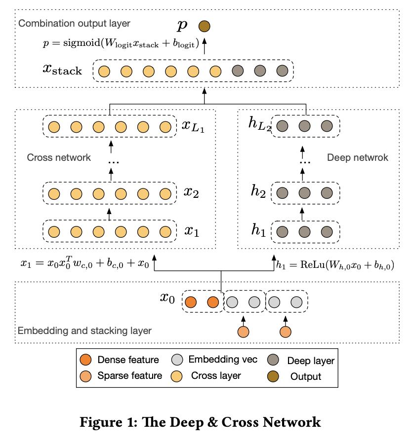
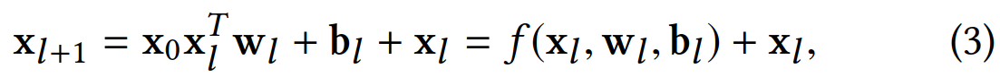
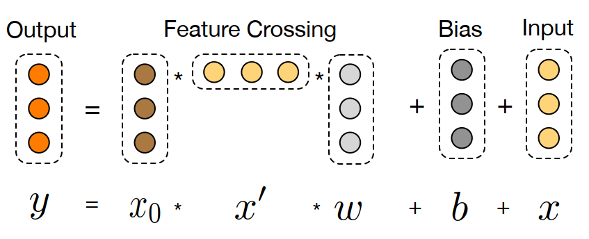
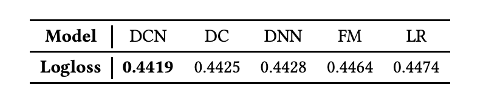
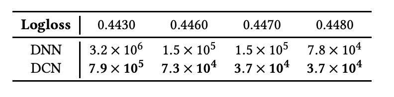
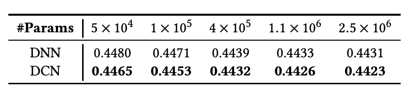
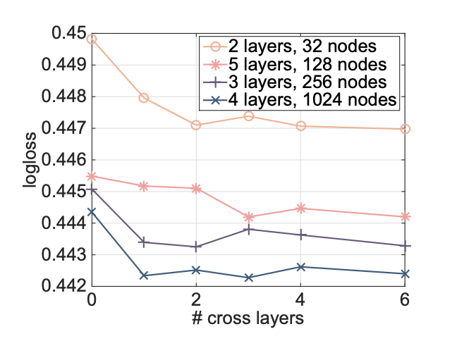

# Deep & Cross Network for Ad Click Predictions

# 标题
- 参考论文：Deep & Cross Network for Ad Click Predictions 
- 公司：Google 
- 链接：https://arxiv.org/pdf/1708.05123
- Code：https://github.com/tensorflow/recommenders/blob/v0.5.1/tensorflow_recommenders/layers/feature_interaction/dcn.py

# 内容

## 摘要
- 特征工程很重要，DNN模型能够学习到所有隐式的特征交叉，但并不是所有特征交叉都有用、都能学好。
- DCN，它保留了DNN模型的优势，同时引入了一个新的交叉网络cross network，交叉网络能更加高效地学习特定阶以内的特征交叉。
- DCN在每一层都进行显式的、自动的特征交叉，既不需要人工特征工程，也不会增加太多的模型复杂度。
- 实验结果表明，DCN在CTR任务和非CTR任务上都取得了显著的性能优势，且内存消耗最低。

## 1 简介
- 特征交叉对CTR预估很重要。目前的特征交叉依赖于手工或穷举完成，并且很难泛化到没见过的特征交叉上。
- 线性模型很快但是太简单不能够捕捉特征交叉的信息。
- 提出神经网络cross network，它能自动地进行显式特征交叉。Cross network包含多层网络，每增加一层网络会产生更高一阶的特征交叉，同时保留上一层的特征交叉结果。所以层数越多，交叉阶数越高，最高交叉阶数取决于网络的层数。
- 同时本文仍然保留了传统的DNN网络，cross network和DNN网络组成Depp & Cross Network (DCN)。在DCN中，cross network和DNN网络联合训练。
- cross network以较小的参数量捕捉显式的特征交叉，而DNN网络以较多的参数量捕捉非常复杂的、隐式的特征交叉。

### 1.1 相关工作
- 因子分解机相关的工作如FM、FFM，表示能力不足。
- 通用DNN网络，很强大，可以近似任何（arbitrary）函数。然而，在现实问题中，感兴趣的特征交叉往往不是任意的（arbitrary）。在Kaggle比赛中，大多数获胜方案中使用的是手工交叉的特征，它们的阶数比较低，并且是显式的、有效的；而DNN网络学习到的特征是隐式的，且是高度非线性的。因此，有必要设计一个网络，它能自动学习到有限阶的显式的特征交叉，且比通用DNN更加高效。

### 1.2 主要贡献
- 设计了一个cross network，它能在每一层进行显式的、自动的特征交叉，无需人工特征工程。 
- Cross network简单高效，随着网络层数的加深，特征交叉的阶数也不断上升，且网络能学习到从低阶到高阶的所有交叉项，所有交叉项的系数也各不相同。 
- Cross network内存高效，易于实现。 
- 实验结果表明，DCN比DNN的 log-loss 损失更低，且参数量少了一个数量级。

## 2 DCN网络结构
DCN模型从嵌入和堆积层（embedding and stacking layer）开始，接着是并行的Cross Network和深度网络，最后是组合层，它结合了两个网络的输出。完整的DCN模型如图1所示。

    
      <figcaption style="text-align: center">
        DCN_模型结构图
      </figcaption>
    </img>
    

## 2.1 Embedding and Stacking Layer
- 考虑输入有稀疏和稠密的特征。在大规模的网络推荐系统中，输入大部分是类别特征，如"country=usa"。类别特征通常用one-hot编码，如”[0,1,0]“；然而，这会导致过度的高维特征空间。
- 为了降低维度，采用embedding process将二值化特征变换为稠密实值向量（通常称为嵌入向量，embedding vectors）。
- 最后，我们将嵌入（embedding）向量和归一化的稠密特征 x_dense 拼接成一个向量输入到网络中去。
    - 

        
          <figcaption style="text-align: center">
            DCN_输入
          </figcaption>
        </img>
        

    
## 2.2 Cross Network
Cross Network的核心思想是以有效的方式进行显示的特征交叉。公式如图。

    
      <figcaption style="text-align: center">
        DCN_cross_net_公式
      </figcaption>
    </img>
    

- 公式里面本质上每一次的输入都伴随着上一层的原始输出，映射函数 f，本质上拟合的是每一层的 x_l+1 − x_l 的residual。这样类似Resnet的思路保证不会太偏离，同时保证梯度不会消失。 
- High-degree Interaction Across Features，Cross Network的特殊结构使得交叉特征阶数随着层深度增加而增大。对于第l层的最高多项式次数是l+1。事实上，Cross Network包含了从1到（l+1）的所有交叉项。

    
      <figcaption style="text-align: center">
        DCN_cross_net_结构图
      </figcaption>
    </img>
    

- 从结构图可以看出来，每一层的复杂度之和 w，b 有关系，也就是说整体的cross net复杂度是 d × L_c × 2。d 是 input 维度也就是embedding and stacking之后的维度，L_c是 cross net 的层数。
- 交叉网络的时间和空间复杂度是线性的。这是因为，每一层都只有 w 和 b，没有激活函数的存在，相对于深度学习网络，交叉网络的复杂性可以忽略不计。
- 同时每次都会用到初始值x_0，这样也保证了无论如何交叉，不会让最终层的输出偏离原始值太远。

## 2.3 Deep Network
深度网络就是经典的MLP，深度网络的复杂度为 d × m + m + (m^2 + m) × (L_d−1)，d 是 input 维度也就是embedding and stacking之后的维度，L_d是 mlp 的层数，m 是每层的deep layer size也就是hidden unit。

## 2.4 Combination Layer
最后将cross network和deep network的输出拼接起来，过一个logits layer，预测当前item的CTR。本文使用point-wise的方法，即训练样本是每个item是否点击，所以是一个二分类问题，损失函数是交叉熵（log loss）损失，这里的损失函数带了L2正则化。

## 3 CROSS NETWORK ANALYSIS

## 4 实验结果
本文应用了一些常见地用于分类上的公共数据集

## 4.1 Criteo Display Ads Data
- Criteo 展示广告数据集用于预测广告点击率。它有13个整数特征和26个类别特征，每个类别都有很高的基数。
- 一般来说此数据上 logloss 具有0.001的提升都具有实际意义。因为当用户量很大的时候，微小的提升都可以带来巨大的收益。
- 数据包含7天11 GB的用户日志（约4100万记录）。我们使用前6天的数据进行培训，并将第7天的数据随机分成相等大小的验证和测试集。

## 4.2 Implementation Details
- Data processing and embedding：
  - 数值特征apply log 规范化。
  - 类别特征apply embedding 技术变换为 6 × (category cardinality)^1/4 维度的稠密向量。
  - 最后把所有的嵌入向量拼接成一个1026维度的向量。
- Optimization：
  - 使用Adam优化器进行mini-batch随机优化
  - batch size 设置为512
  - Batch Normalization
  - gradient clip norm 设置为100
- Regularization：
  - early stop
  - 没有 L2 和 dropout
- Hyperparameters：
  - 网格搜索的方式
  - hidden layer 2 -> 5
  - hidden unit 32 -> 1024
  - cross network layer 1 -> 6
  - learning rate 0.0001 -> 0.001 by 0.0001

## 4.3 Models for Comparisons
对比了五个模型 DNN，LR，FM，Wide&Deep，Deep Crossing

## 4.4 Model Performance

### 不同模型在 logloss 指标上的对比

    
      <figcaption style="text-align: center">
        DCN_模型表现对比
      </figcaption>
    </img>
    

每个模型对应的最优的参数组合
- DCN：2 deep layers of size 1024 and 6 cross layers
- DNN：5 deep layers of size 1024
- DC：5 residual units with input dimension 424 and cross dimension 537
- LR：42 cross features and raw features

### 不同维度的对比DCN和DNN
- 达到同样的 logloss 指标需要的参数个数
  - 

        
          <figcaption style="text-align: center">
            同样的损失不同参数个数对比
          </figcaption>
        </img>
        

- 同样参数下，能达到最小的 logloss 指标
  - 

        
          <figcaption style="text-align: center">
            同样参数下最小的损失对比
          </figcaption>
        </img>
        

- 同样地超参数下，增加cross net 层数对 logloss 指标的影响，可以看出增加更高维度的特征交叉并不一定会对 logloss 指标有帮助。相反有时候会有反作用。
  - 

        
          <figcaption style="text-align: center">
            cross net层数对 logloss 指标的变化
          </figcaption>
        </img>
        

## 5 总结和未来研究方向
- 总结
  - 识别有效的特征交互是许多预测模型成功的关键
  - 特征学习是隐式的和非线性的，DNN可以学习到但是并不一定是有效的
  - DCN可用于处理稀疏和稠密特征集合
  - 传统的DNN联合训练，有限度的学习显示组合特征
  - 组合特征的阶数随着cross layer的增加而增加
  - 内存方面对比DNN可以节省40%并且达到一样的甚至更好的效果
- 未来研究方向：
  - 把 cross layers 作为其它模型的一个 block 来使用
  - 继续研究高效的训练 DCN
  - 继续研究 DCN 和 deep networks 的 interaction during optimization
  

# 思考

## 本篇论文核心是讲了个啥东西
- 提出一种新型的交叉网络结构，可以用来提取交叉组合特征，并不需要人为设计的特征工程。

## 是为啥会提出这么个东西，为了解决什么问题
- 对比简单的线性模型LR，解决人工特征工程的问题。
- 对比FM或者FFM解决了：
  - 联合训练的时候融入了DNN一起，表达能力在 Generalization 上面更强
  - 在低阶组合方面能够特征组合出高于FM的二阶组合情况，达到3阶或者更高，取决于cross net的层数。
- 对比只有DNN的模型，解决了可以显示的自动学习到有限阶的显式的特征交叉。

## 为啥这个新东西会有效，有什么优势
- DCN网络结构保证了显式的组合有限阶的特征交叉组合，随网络层数增加而增加的多项式阶（polynomial degree）交叉特征，同时这样又不至于组合出太高阶的无意义的特征交叉组合对比DNN。
- DCN网络的参数是共享的， 每一层的这个权重特征之间共享，这个可以使得模型泛化到看不见的一些低阶特征交互作用。
- DCN网络每一层都会输入初始X值，这样保证了无论如何交叉都不会偏离太远。同时采用residual connect的形式，保证了模型收敛的速度和稳定性。
- 十分节约内存（依赖于正确地实现，先实现权重矩阵 W 和 X 的点乘），能保证达到同样的损失指标下，对比DNN可以少用40%的参数。
- 联合DNN模型一起concat的起来训练，沿用了Wide&Deep的思路，保证了 Memorization 和 Generalization。

## 与这个新东西类似的东西还有啥，相关的思路和模型
- PNN：提出了两种自动化计算特征交叉的方式
- Wide&Deep：提出了本文沿用的训练的框架
- DNC-V2：增强了cross net的表达能力，加速了特征交叉部分的计算，引入了MoE的思路
- DeepFM：Wide部分不一样
- xDeepFM：Wide部分不一样

## 在工业上通常会怎么用，如何实际应用
- 直接使用TF-ranking里面模型，或者DeepCTR-pytorch的版本
- 参数方面参考论文里面的设置作为base model调参

# 参考
- https://datawhalechina.github.io/fun-rec/#/ch02/ch2.2/ch2.2.2/DCN