# DCNv3: Towards Next Generation Deep Cross Network for Click-Through Rate Prediction

# 标题
- 参考论文：DCNv3: Towards Next Generation Deep Cross Network for Click-Through Rate Prediction 
- 公司：Google 
- 链接：https://arxiv.org/html/2407.13349v1
- Code：https://github.com/salmon1802/FCN

# 内容

## 摘要
- Deep & Cross Network 及其衍生模型面临四个主要限制：
  - 大多数模型声称可以捕获高阶feature interactions ，但它们通常通过DNN 以隐式的和不可解释的方式进行，这限制了模型预测的可信度
  - 现有的显式feature interaction 方法的性能通常弱于隐式的deep neural network: DNN ，从而削弱了它们的必要性。
  - 许多模型在增加feature interactions 的阶数时无法自适应地过滤噪声。
  - 大多数模型的融合方法无法为其不同特征交叉方式提供合适的监督信号。
- 为了解决上面的问题，提出DCN v3 和SDCN v3 分别一一对应解决上述问题：
  - 保证特征交叉建模的可解释性
  - 同时线性地和指数地增加feature interaction 的阶数，实现真正的Deep Crossing ，而不仅仅是Deep & Cross
  - 采用Self-Mask 操作来过滤噪声，并将Cross Network  中的参数数量减少一半
  - 在fusion layer ，我们使用一种简单但有效的multi-loss trade-off and calculation 方法Tri-BCE ，来提供适当的监督信号

## 1 简介

    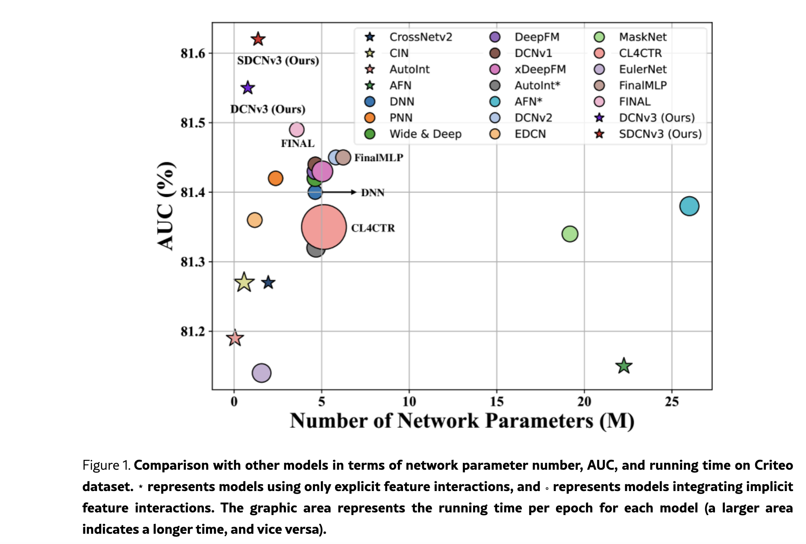
      <figcaption style="text-align: center">
        DCN_V3_模型效果
      </figcaption>
    </img>
    

大部分的特征交叉CTR模型是基于DCN系列的，旨在通过显式和隐式的特征交叉，融合不同信息，提高模型的可解释性和准确率。但是仍存在一些需要克服的局限性：
- 缺乏可解释性：
  - 大多数模型集成DNN 来建模隐式高阶feature interactions ，并实现81.3 到81.5 之间的AUC性能。这证明了隐式feature interactions 的有效性。然而，隐式feature interactions 缺乏可解释性，这降低了CTR 模型预测的可信度。
- 显式特征交叉的必要性是有限的：
  - 大多数仅使用显式feature interactions 的模型（例如CIN）的AUC 性能低于81.3，而deep neural network: DNN 的AUC性能更好，为81.4。这表明大多数explicit modeling 方法的性能弱于implicit DNN
  - 削弱了集成显式feature interactions 和隐式feature interactions 的必要性
  - 一些工作也强调了DNN 在捕获multiplicative feature interactions 方面的局限性
  - FINAL 和 FinalMLP 放弃了传统的显示特征交叉部分，而是尝试隐式特征交叉，从而达到了SOTA
- 噪声过滤能力低下：
  - 许多研究指出CTR 模型包含大量冗余feature interactions 和噪声，尤其是在高阶feature interactions 中
  - 大多数CTR模型仅使用两到三个网络层来构建，放弃了对有效高阶feature interaction 信息的explicit capture（显示捕捉）
  - 同时，为模型过滤噪声通常会产生额外的计算成本，增加大量的参数，从而导致更长的训练时间和推理时间，可能会抵消提高模型准确率所带来的好处
- 监督信号不足且没有区分性：
  - 显示和隐式的特征交叉，通常需要一个融合层来进行最终的预估。 通常只使用最终的预估分计算loss，没有为不同的方法本身提供适当的监督信号。这削弱了监督信号的有效性。
  - 一些研究，例如CL4CTR，引入辅助损失提供额外的监督信号。但是会引入额外的计算成本和损失权衡超参，增加调参的难度。
  - 需要一种简单、通用、有效的计算监督信号的方法至关重要。

为了解决上述问题，本文提出了DCN v3和SDCN v3:
- 结合了低阶和高阶特征交叉。为了保证模型的可解释性，没有使用DNN。
- 引入了一种新的指数级特征交叉，来建模高阶特征交叉。设计了一个自掩码 Mask 操作来过滤噪声，并将交叉网络的参数量减少一半。
- 融合层，提出了一种简单高效的loss计算方式，Tri-BCE。为不同的子网络提供合适的监督信号。

**本文贡献：**
- 第一个在没有集成DNN的情况下 仅使用显式特征交叉，来实现很好的性能。
- 随着层数呈现指数增长，实现了真正的深度特征交叉。显式地捕获feature interaction 信息， 同时self-mask操作将参数量减半，并过滤噪声。
- SDCN v3，显式的捕捉高阶和低阶特征交叉。Tri-BCE，确保不同的子网络接收合适的监督信号。
- 6个数据的实验，我们的模型在多个预测中获得了第一名。

## 2 相关工作

## 2.1 CTR Prediction
- LR是一阶特征交叉，FM系列是二阶特征交叉。DNN高阶特征交叉（PNN、wide&deep、DeepFM、DCN v1和v2、DIN等）。 
- DCN相对DeepFM的优势是，FM是显式二阶交叉，Cross网络是显式高阶特征交叉
- DCN系列在效率和性能中取得平衡。
- 显式特征交叉通常层次结构进行建模，例如DCN中的cross 层、FiGNN中的Graph layer、AutoInt中的interact layer。
- 由于显式特征交叉的性能弱于DNN，一些模型放弃显式特征交叉，将乘法操作集成到DNN中。MaskNet逐块引入乘法操作，GateNet、PEPNet、FINAL逐层引入乘法操作。 
- 但是只进行隐式建模会导致模型的可解释性差，换个角度看，如果显式建模的同时可以看特征重要性，也算是显式建模的一个贡献。方便特征有选择的进不同的子网络，例如显示交叉层。

## 2.2 问题定义

## 2.2.1.DEFINITION 1: CTR Prediction.
传统的binary classification问题

## 2.2.2.DEFINITION 2: Feature Interaction.
- DNN学习乘法操作的效率低。
- 特征交叉 
  - 线性增长：X1和Xn-1之间的哈达玛乘积，实现Xn。 
  - 指数增长：X_2^(n-1) 和 X_2^(n-1) 之间的哈达玛乘积，更有效的生成高阶特征。有效指的是用更少的层数获得更高阶的特征。

## 3 模型架构

    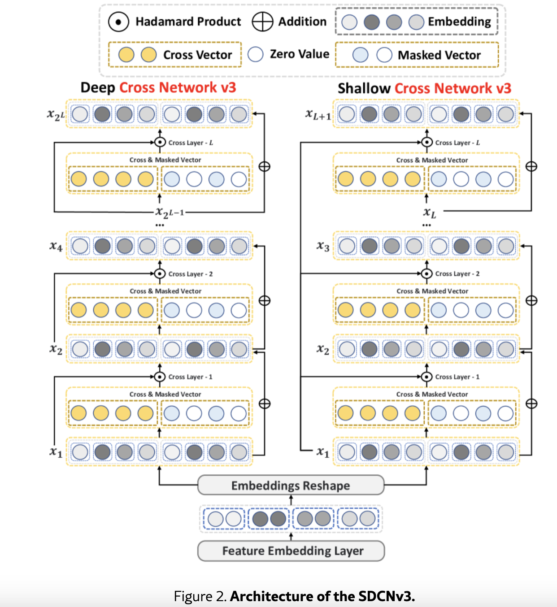
      <figcaption style="text-align: center">
        DCN_V3_模型架构
      </figcaption>
    </img>
    

SDCN v3通过 SCN v3和 DCN v3分别来建模低阶和高阶的特征交叉。从图中看 shallow部分就是 线性，deep部分是指数。

## 3.1.Embedding & Reshape Layer
- 大部分model用 embedding layer，把每个特征转化成低维稠密向量，e_i = E_i * x_i
- 本文使用chunk reshape embedding，分成 e_i,a, e_i,b = chunk(e_i)，e_i,a 被视为original view，e_i,b 被视为another view。最后的输入为：

    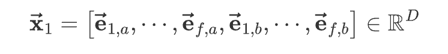
      <figcaption style="text-align: center">
        DCN_V3_模型输入层
      </figcaption>
    </img>
    

这里的f 为特征的数量，D为拼接后整体的embedding维度，每个特征的embedding维度是d。这里猜测 chunk() 函数是：将每个 field 的 embedding 向量一分为二；左半边拼接起来，构成 original view；右半边拼接起来，构成 another view。

## 3.2 Shallow & Deep Cross Network v3

### SCN v3

    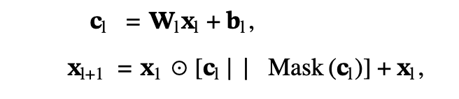
      <figcaption style="text-align: center">
        SCNv3 公式
      </figcaption>
    </img>
    

- c_l ∈ ℝ D/2 表示第 l 层（在original view ）的Cross Vector
- W_l ∈ ℝ D/2×D, b_l ∈ ℝ D/2 分别为可学习的权重矩阵和偏置向量
- x_l ∈ ℝ D 表示第 l 阶的feature interaction
- Mask 表示Self-Mask （在another view ）
- ⋅||⋅ 表示向量拼接。

由于线性增长的feature interaction 方法难以在有限的层数内捕获高阶交互，因此我们引入DCN v3 来实现真正的、高效的deep cross network。

### Deep Cross Network v3

    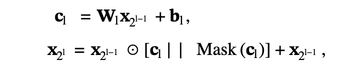
      <figcaption style="text-align: center">
        DCNv3 公式
      </figcaption>
    </img>
    

- x_2^l∈ ℝ D 表示第 2^l 阶的feature interaction

原始的Cross Network v2 本质上是一种shallow crossing 方法，通过层的堆叠实现feature interactions 阶次的线性增长。实验表明，DCNv2 中交叉层的最佳数量为2 或3，其大部分性能来自负责隐式交互的DNN。相比之下，DCNv3 将 x_1 修改为 x_2^(l−1)，实现feature interactions 阶次的指数级增长，从而在有限的层数内实现特征的Deep Crossing ，显式地捕获高阶feature interactions。

### Self-Mask

    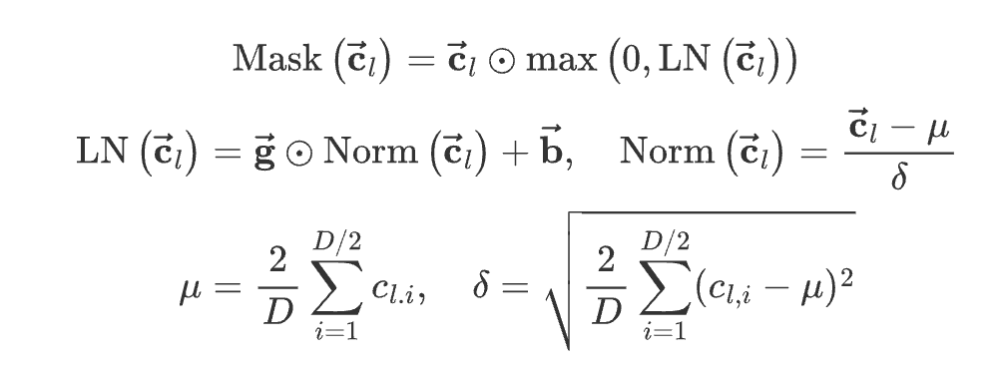
      <figcaption style="text-align: center">
        self mask 公式
      </figcaption>
    </img>
    

正如一些论文指出的那样，并非所有feature interactions 都对CTR  任务中的最终预测有益。因此，我们在another view 中引入了Self-Mask 操作来过滤掉feature interactions 中的噪声信息。

- LN表示 LayerNorm，对 c_l 进行正态分布变换，确保 Mask(c_l)包含大约50%的零值，以滤掉噪声并提高计算效率。
- 其他的mask方法也可以用到这里，例如基于伯努利分布的随机mask，基于top-k选择的可学习掩码等。
- 相当于每一层的crossing 输出，包含一个原始的上一层信息，加上一个被随机过滤掉50%的原始上一层信息。最终拼接起来保证了每一层的输出维度都一样等于x_1。

## 3.3.Fusion Layer
大多数先前的CTR 模型试图建模显式和隐式feature interactions ，这本质上意味着同时捕获低阶和高阶feature interactions 。我们的SDCN v3 通过整合SCN v3和DCN v3来实现这一点，只通过显示特征交叉，避免使用可解释性较差的DNN。同时由于公式高度相似性，我们采用parallel结构而不是stacked结构。

    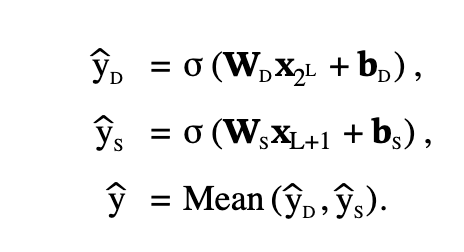
      <figcaption style="text-align: center">
        DCN_V3_融合层
      </figcaption>
    </img>
    

- W_D, W_S ∈ ℝ 1×D 表示可学习的权重，b_D, b_S ∈ ℝ 为偏置。
- Mean 表示均值运算，
- L 表示层的last number。 
- y_D, y_S, y 分别表示DCNv3、SCNv3和SDCNv3 的预测结果。

Tri-BCE loss calculation and trade-off 方法如Figure 4 所示。我们使用广泛采用的二元交叉熵损失（即Logloss ）作为SDCNv3  的primary and auxiliary loss。

    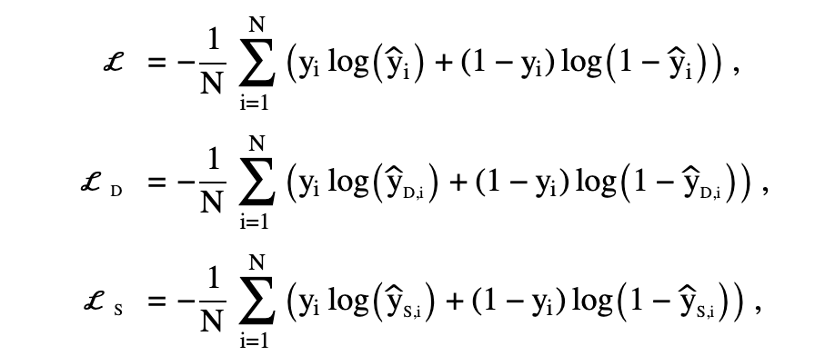
      <figcaption style="text-align: center">
        DCN_V3_loss公式
      </figcaption>
    </img>
    

- y 为ground-truth， N 为batch size。 
- L 为primary loss，L_D,L_S 分别表示DCN v3和SCN v3 预测结果的auxiliary losses。

为了给每个子网络提供合适的监督信号，我们为它们分配了自适应权重：

    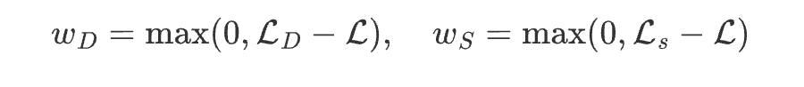
      <figcaption style="text-align: center">
        DCN_V3_loss权重公式
      </figcaption>
    </img>
    

并联合训练它们以实现Tri-BCE loss:

    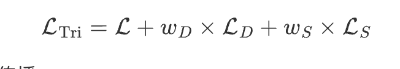
      <figcaption style="text-align: center">
        DCN_V3_tri_loss
      </figcaption>
    </img>
    

如 TF4CTR paper 所示，向子网络提供单一监督信号通常不是最优的。我们提出的Tri-BCE loss 通过提供自适应权重（该权重在整个学习过程中变化）来帮助子网络学习更好的参数。详细的求导公式推导参考论文3.3 公式8。换句话说，对每个子网络都有一个辅助损失，有助于帮助模型更好的利用子网络提供的信息，而不是像传统Deep & Wide 层一样，融合后在计算loss，这样子网络的信息可能已经丢失一部分了。

## 3.4.复杂度分析

    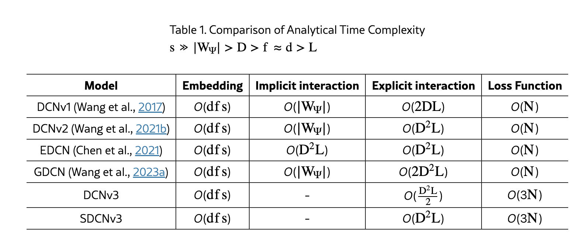
      <figcaption style="text-align: center">
        DCN_V3_复杂度分析
      </figcaption>
    </img>
    

- 所有模型对于embedding 的时间复杂度相同。因此，我们仅在实验部分可视化non-embedding 参数。
- 除了我们提出的DCNv3 和SDCNv3 之外，所有其他模型都包含隐式交互以增强预测性能，这会产生额外的计算成本。 
- 在显式交互方面，DCNv3 仅具有比DCNv1 更高的时间复杂度，而GDCN 的时间复杂度是DCNv3 的四倍。 
- 由于我们的DCNv3 使用Tri-BCE loss，因此DCNv3 的loss 计算时间复杂度是其他模型的三倍。但这并不影响模型的推理速度。

## 4 实验
四个研究问题（research question: RQ）：
- RQ1：DCNv3 在性能方面是否优于其他CTR 模型？它们在大规模的和高度稀疏的数据集上表现良好吗？ 
- RQ2：DCNv3与其他CTR模型相比是否更有效率？ 
- RQ3：DCNv3 是否具有可解释性和过滤噪音的能力？ 
- RQ4：不同的配置如何影响模型？

## 4.1 实验设置

### 4.1.1 数据集
Avazu, Criteo, ML-1M, KDD12, iPinYou, and KKBox

### 4.1.2 数据预处理
遵循 "Open benchmarking for click-through rate prediction" 中概述的方法

### 4.1.3 评估指标
- Logloss：
  - 这里采用的是最终融合的loss，L 为primary loss，不是Tri loss
- AUC

### 4.1.4 Baselines
- 显性对比模型：
  - LR实现了一阶feature interactions。 
  - FM及其衍生模型FM、FwFM、AFM、FmFM实现了二阶特征交互。 
  - CrossNetv1、CrossNetv2、CIN、AutoInt、AFN、FiGNN 实现了高阶feature interactions。
- 为了验证DCNv3 相对于包含隐式feature interactions 的模型的优越性，隐性对比模型：
  - PNN 和 Wide & Deep
  - DeepFM 和 DCNv1
  - xDeepFM
  - AutoInt*
  - AFN*
  - DCNv2和EDCN
  - MaskNet
  - CL4CTR
  - EulerNet
  - FinalMLP和FINAL

## 4.1.5 Implementation Details
- Adam optimizer
- learning rate 设置为0.001。
- 为了防止过拟合，我们采用patience = 2  的早停。
- baseline 模型的超参数是根据 （An open-source CTR prediction library、Open benchmarking for click-through-rate prediction）及其原始论文中提供的最佳值进行配置和微调的。

## 4.2 RQ1 整体性能
详细的实验数据参考原始paper 4.2 章节

## 4.2.1 与仅使用显式feature interactions 的模型进行比较
- 我们发现大多数仅仅使用显式feature interactions 的模型通常比集成隐式feature interactions 的模型表现更差，甚至比简单的DNN 更差。这无疑削弱了显式feature interactions 的必要性。 
- 总体而言，捕获高阶feature interactions 通常可以提高模型性能。例如： 
  - FM 在两个大规模数据集Avazu 和Criteo 上的表现优于LR 。 
  - CrossNetv2 在Avazu 上的表现优于除FwFM 之外的所有一阶和二阶feature interaction 模型。 
- 更复杂的模型结构不一定会带来性能提升。与FM 相比，AFM引入了更复杂的注意力机制，但并没有取得更好的性能，这一点在 Open benchmarking for click-through rate prediction 中也有所报道。但是，与CrossNetv1 相比，CrossNetv2扩展了权重矩阵的规模，从而带来了一定程度的性能提升。因此，细设计模型架构很重要。 
- FiGNN 在显式feature interaction 模型中取得了最佳的baseline 性能。然而，与FiGNN相比，我们的DCNv3 在Avazu 数据集上仍然实现了Logloss 下降0.4%、AUC 增加0.54%，在Criteo 数据集上实现了Logloss 下降0.18%、AUC 增加0.17%，均在统计显著水平上超过0.001。这证明了DCNv3的优越性。

## 4.2.2 与集成隐式feature interactions 的模型的比较
- 总体而言，SDCNv3 在所有六个数据集上都取得了最佳性能，与最强的baseline 模型相比，平均AUC 提高了0.21%，平均Logloss 降低了0.11%，均超过了0.1%的统计显著阈值。 
- FinalMLP 模型在Avazu 和Criteo 数据集上取得了良好的性能，超越了大多数结合显式和隐式feature interactions 的CTR 模型。这证明了隐式feature interactions 的有效性。因此，大多数CTR 模型试图将DNN 集成到显式feature interaction模型中以提高性能。然而，SDCNv3 仅使用显式feature interactions 就实现了SOTA 性能，表明仅使用显式feature interaction 进行建模的有效性和潜力。 
- SDCNv3 在所有六个数据集上都实现了优于DCNv3 的性能，证明了SCNv3 在捕获低阶feature interactions 和Tri-BCE loss 方面的有效性。值得注意的是，在iPinYou数据集上，我们观察到所有模型的Logloss 值都在0.0055水平左右。这是由于数据集中正样本和负样本之间的不平衡，其他工作也报告了类似的结果。 
- DCNv3 在AUC方面优于所有baseline 模型，唯一的例外是KKBox  数据集上的Logloss optimization ，DCNv3 比DCNv1 弱。这进一步证明了DCNv3  的有效性，因为它通过指数级增长的feature interactions 和噪声过滤机制捕获高质量的feature interaction 信息。

## 4.3 深入研究 DCNv3 and SDCNv3

## 4.3.1 效率对比 (RQ2)

    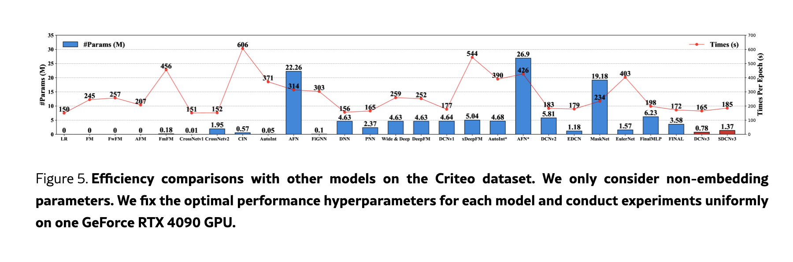
      <figcaption style="text-align: center">
        DCN_V3_模型效率对比
      </figcaption>
    </img>
    

- 显式CTR 模型通常使用较少的参数。例如，LR, FM, FwFM, and AFM  的non-embedding 参数几乎为零，而 FmFM, CrossNet, CIN, and AutoInt 都需要少于1M 的参数。值得注意的是，参数数量并不总是与时间复杂度相关。虽然CIN仅使用0.57M个参数，但其每个epoch 的训练时间最多达到606 秒，因此不适合实际生产环境。FiGNN 和AutoInt 面临同样的问题。 
- 在所有模型中，LR 模型的运行时间最短，为150 秒。CrossNetv1  和CrossNetv2 紧随其后，在提升性能的同时，时间几乎不增加。这证明了CrossNet  及其系列模型的效率。作为deep CTR  模型的基本组成部分，DNN  仅需156 秒。由于CTR  并行结构的parallel-friendly 特性，一些精心设计的deep CTR  模型（如DCNv2、FinalMLP和FINAL）在运行时间没有大幅增加的情况下显著提高了预测准确率。 
- 我们提出的DCNv3 和SDCNv3 是DCN系列中参数效率最高的模型，分别仅需0.78M和1.37M个参数即可实现SOTA性能。同时，在运行时间方面，DCNv3始终优于FinalMLP, FINAL, DCNv2, and DCNv1 等强大的baseline 模型。这证明了DCNv3  的时间效率。尽管由于使用了Tri-BCE loss ，SDCNv3  比DCNv3 多需要20秒，但它仍然与DCNv2相当。值得注意的是，loss 的额外计算成本仅在训练期间产生，不会影响实际应用中的推理速度。这进一步证明了DCNv3 和SDCNv3 的效率。

## 4.3.2 SDCNv3 的可解释性 (RQ3)
我们研究动态的Cross & Masked Vector c_l 和静态的 W_l 以了解模型的预测过程
- 我们观察到c_l 和 Mask(c_l) 随着层数的增加而逐渐变化。例如： 
  - UserID 在DCNv3 和SCNv3 的第一层都具有很高的重要性，但随着层数的增加而降低。 
  - 同时，UserID 的 Mask(c_l) 逐渐增加其相应的稀疏性以进一步滤除噪声信息。
- c_l 和 Mask(c_l) 表现出互补特性。当 c_l 中的feature field 变得重要时，其在 Mask(c_l) 中的相应稀疏性会降低，反之亦然（例如，UserID, Occupation, Age fields ）。这证明了我们引入的Self-Mask 操作的有效性，该操作通过更积极地为某些feature fields 分配零值来进一步过滤掉噪音。
- 我们观察到DCNv3 和SCNv3 在同一层捕获不同的feature interaction 信息。 
  - 在DCNv3 中，W3 用于计算3 阶特征的重要性从而生成4 阶feature interactions。 
  - 相反，在SCNv3 中，W3 用于计算 2^2 阶特征的重要性从而生成 2^3 阶feature interactions。
  - 因此，对于UserID × Genres ，与DCNv3 相比，SCNv3 展示了更低的重要性。这进一步证明了SDCNv3 的有效性。
- 总体而言，我们观察到高阶feature interactions 的重要性低于低阶feature interactions。

## 4.3.3 消融实验 (RQ4)
为了研究SDCNv3 各组件对其性能的影响，我们对SDCNv3 的几种变体进行了实验
- w/o TB：使用BCE 代替Tri-BCE的DCNv3。 
- w/o LN：没有LayerNorm 的Self-Mask

    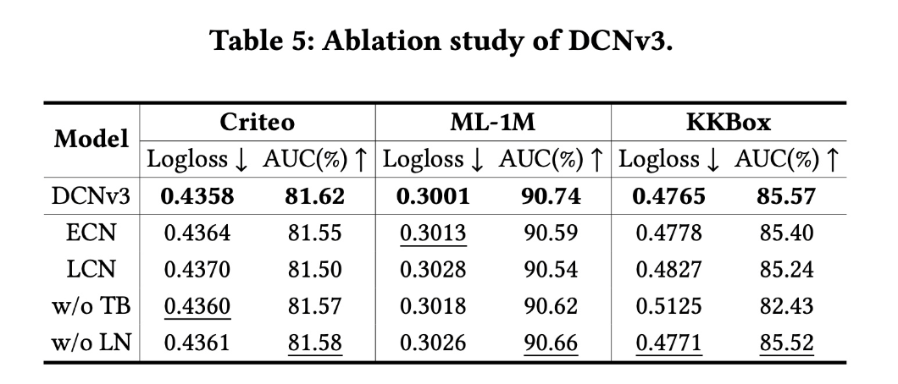
      <figcaption style="text-align: center">
        DCN_V3_消融实验结果
      </figcaption>
    </img>
    

- DCNv3 和SCNv3 与SDCNv3 相比都表现出一定的性能损失，这表明有必要同时捕获高阶和低阶feature interactions 。 
- 与DCNv3 相比，SCNv3 的表现始终不佳，证明了指数级feature interaction 方法的优越性。 
- 同时，w/o TB 的变体也导致一定程度的性能下降，在KKBox上尤为明显。 
- LayerNorm 的目的是保证Self-Mask保持0.5 左右的masking rate，因此删除它会导致masking rate 不稳定，从而导致一些性能损失。

## 4.3.4 网络深度的影响（RQ4）
- 在Criteo 数据集上，该模型在4 层的深度下实现了最佳性能，这表明DCNv3 最多可以捕获 2^4 阶feature interactions。 
- 在KDD12  数据集上，DCNv3 在6 层的深度下实现了最佳性能，这意味着它捕获了 2^6 阶feature interactions。
- 如果用DCN-V2，实现相同阶次的feature interactions 分别需要 2^4 - 1 和 2^6 - 1 层，考虑到所需的巨大计算资源，这是不切实际的，而DCNv3 凭借其指数级增长的feature interaction 机制轻松实现了这一点。这进一步证明了DCNv3 的有效性。

## 5 总结
- 提出一种新的指数级特征交叉，来建模高阶特征交叉。
- 设计了一个自掩码 Mask 操作来过滤噪声，并将交叉网络的参数量减少一半。
- 结合了低阶和高阶特征交叉，放弃了解释性差的DNN。
- 提出了一种简单高效的loss计算方式，Tri-BCE。为不同的子网络提供合适的监督信号。
- 达到SOTA，并且打破了传统CTR 模型中必须引入隐性特征交叉来提升performance。

# 思考

## 本篇论文核心是讲了个啥东西
- 提出一种新的指数特征交叉，可以更高效的来建模高阶特征交叉
- 提出高阶特征交叉之所以之前效果不好是因为有很多noise，提出一种不需要引入参数的 Mask 操作来过滤噪声，并且同时减少一半的交叉网络的参数。
- 提出我们可以完全放弃DNN，用低阶和高阶特征交叉更好的可解释性的替代DNN。此方式非常独特，因为大部分之前做CTR预测的模型，都提出必须需要加入DNN才能提升performance。
- 提出一种全新的监督子网络的辅助loss，同时融合两个子网络提出 Tri-loss。此方法强化了每个单独子网络对于最后的结果预测的重要性。

## 是为啥会提出这么个东西，为了解决什么问题
- 对比大多数模型声称可以捕获高阶feature interactions ，通常通过DNN 以隐式的和不可解释的方式进行。
  - 通过只用显性交叉，保证特征交叉建模的可解释性
- 对比大部分Deep & Wide 模型，DNN明显强于显性交叉部分，这削弱了显性交叉的必要性：
  - 通过线性地和指数地增加feature interaction 的阶数，达到了完全放弃DNN
- 对比大部分包含显性交叉的模型，模型在增加feature interactions 的阶数时无法自适应地过滤噪声。
  - 通过Self-Mask 操作来过滤噪声，并将Cross Network  中的参数数量减少一半
- 对比大部分Deep & Wide 模型，没有一个模型会为单独的子网络提供监督信号，也就是设计辅助loss，类似对于包含multi-task的模型每个task应该有自己的loss。最终有一个融合loss。
  - 提出为每一个子网络单独设计一个BCE loss，最终融合一个Tri-loss，来提供适当的监督信号。

## 为啥这个新东西会有效，有什么优势
- 只做显性交叉，提出指数特征交叉，保证了不增加层数的情况下，大幅增加了每一层可以获取的特征交叉阶数。这样可以实现类似DNN的更多更高价的特征交叉。从而达到放弃DNN的隐性交叉也不会影响performance，同时增加了可解释性。
- 同时不放弃线性交叉的部分，达到了低阶和高阶都可以在一定的的层数内获得。
- 用一个简单的LN 的 Mask，同时把每个特征维度对半分开，一半用于获取信息，一半用于过滤信息。有效的在不增加参数的情况下，对比GDCN模型，实现过滤噪音，降低参数数量减少一半。
- 给每个子网络也就是线性部分和指数部分都加一个单独的loss，作为辅助loss，最后在来一个Tri-loss，作为自适应的学习的融合loss。这样可以更加有效的强化了子网络的单独信息对预测结果的影响，从而提高模型的performance，因为之前的模型很多都是直接融合，可能在融合的时候就已经丢失了一些子网络的信息。

## 与这个新东西类似的东西还有啥，相关的思路和模型
- [ ] 目前为止
  - 过滤噪音部分
    - GDCN: 利用遗忘门的思路再加每一层进行自适应的学习过滤上一层的noise
    - GateNet
  - 其它特征交叉的网络设计部分和DCN类型的模型如出一辙

## 在工业上通常会怎么用，如何实际应用
- 目前为止还没看到实际落地的code，只有论文放出来的[code](https://github.com/salmon1802/FCN)。
- 准备尝试SDCNv3的思路加入高阶特征交叉进模型。
- Mask noise部分可以在统一embedding维度的 encoder 上面尝试，所有特征上面一起尝试不现实，在工业中很多特征都还没有embedding或者是手动特征工程。
- 子网络的辅助loss，可以尝试来提高特征交叉部分的效果。
- 完全放弃DNN和手动特征工程没有一定的必要性。

# 参考
- https://www.huaxiaozhuan.com/%E6%B7%B1%E5%BA%A6%E5%AD%A6%E4%B9%A0/chapters/9_ctr_prediction7.html

