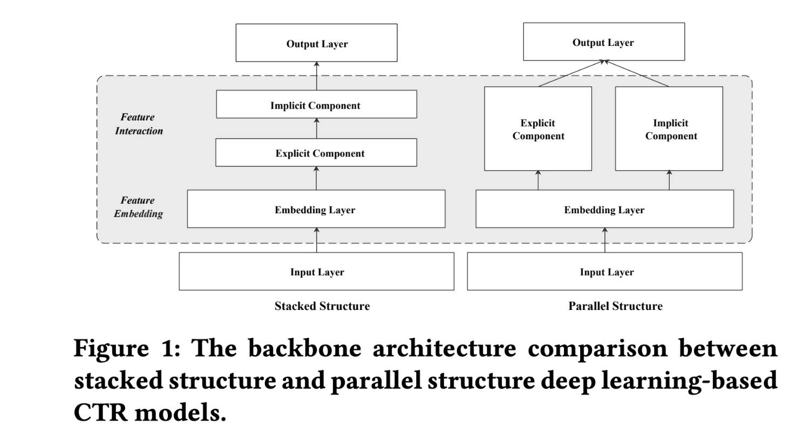
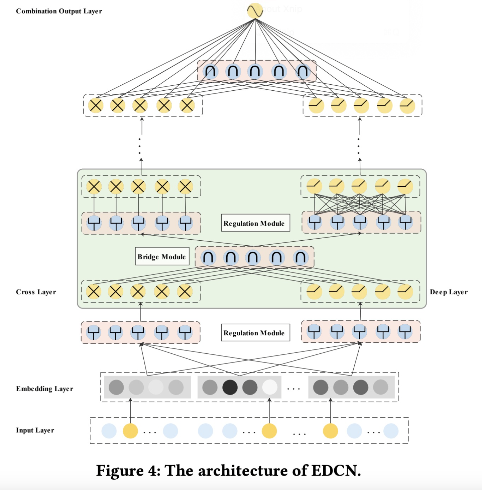
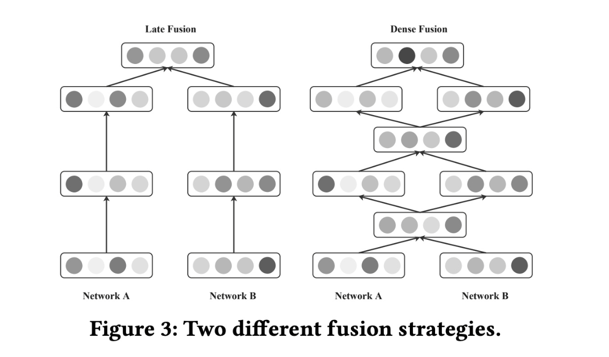
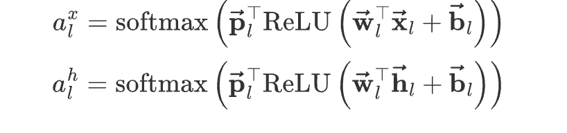
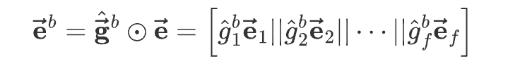
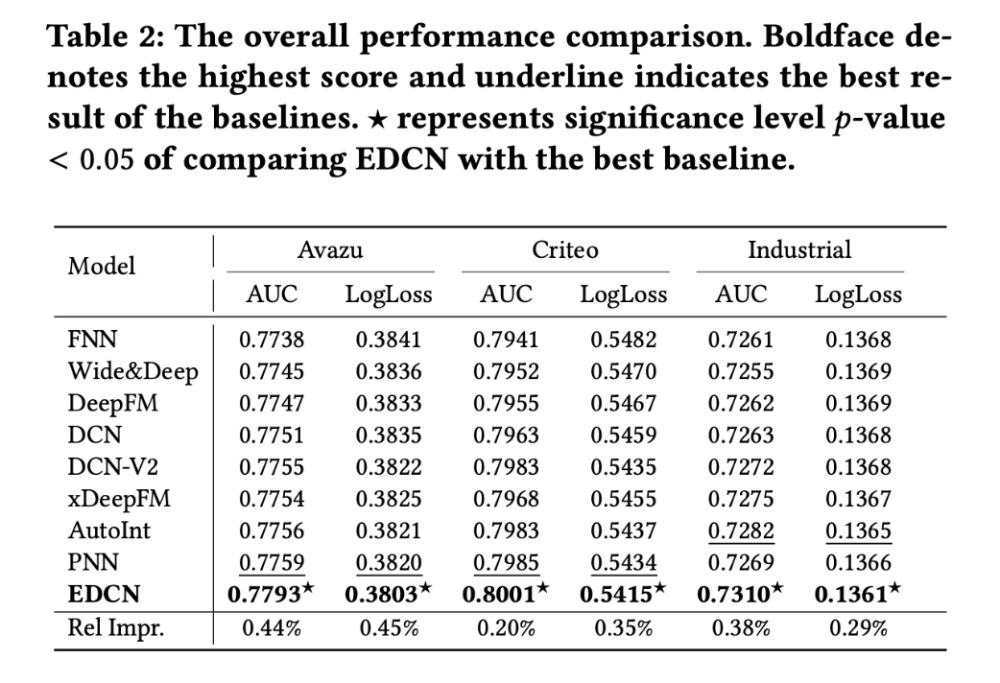
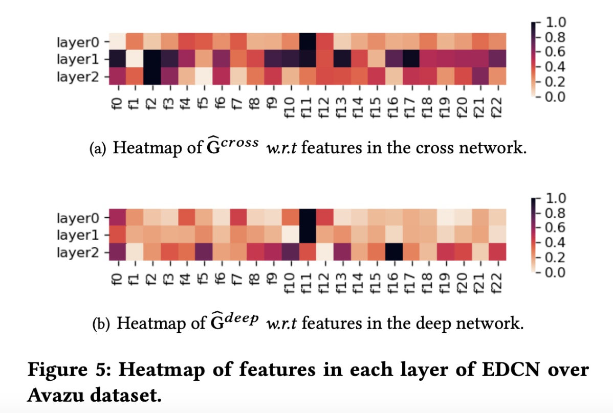
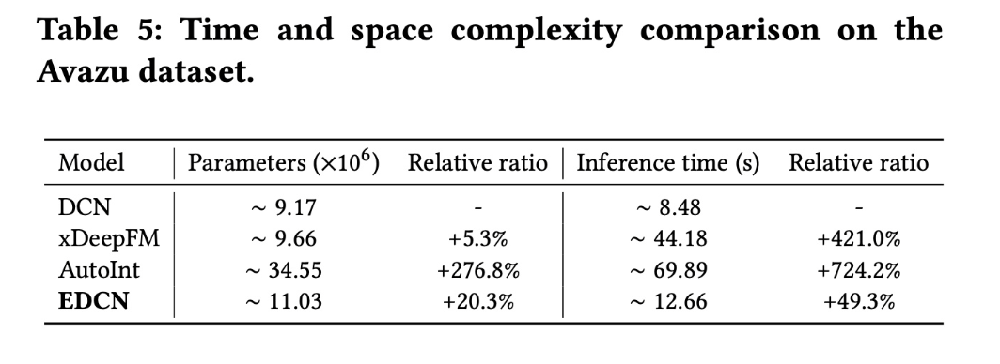
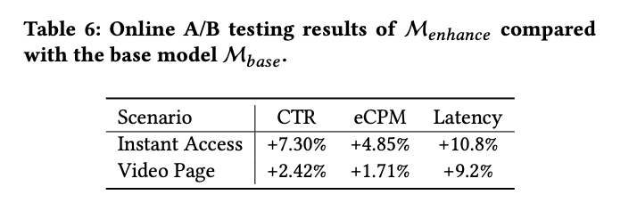

# Enhancing Explicit and Implicit Feature Interactions via Information Sharing for Parallel Deep CTR Models

# 标题
- 参考论文：Enhancing Explicit and Implicit Feature Interactions via Information Sharing for Parallel Deep CTR Models
- 公司：Huawei 
- 链接：https://dlp-kdd.github.io/assets/pdf/DLP-KDD_2021_paper_12.pdf
- Code：https://github.com/shenweichen/DeepCTR/blob/master/deepctr/models/edcn.py

# 内容

## 摘要
- 具有并行结构的SOTA 的deep CTR 模型（例如DCN）通过独立的并行网络学习显式的和隐式的feature interactions 。但是这些模型都存在一些简单共享（trivial sharing ）的问题：
  - hidden layers 的共享不足
  - network input 的共享过度
  - 从而限制了模型的表达能力和有效性。 
- 提出了一种新颖的deep CTR 模型EDCN。增强显式的和隐式的feature interactions 之间的信息共享。
  - EDCN引入了两个高级模块，桥接模块（bridge module）和调制模块（regulation module ）。
  - 对于并行网络的每一个hidden layer，这两个模块协同工作以捕获layer-wise 的交互信号并学习差异性的特征分布（discriminative feature distributions ）。
  - 两个模块是轻量级的、以及模型无关的，可以很好地推广到主流的并行deep CTR 模型。

## 1 简介
基于深度学习的CTR，具有以端到端方式来捕获informative feature interactions 的能力，摆脱了手动特征工程和pre-defined formula 的阻碍。如Wide & Deep、DeepFM、DCN、PIN、DIN 和DIEN，联合学习显式的和隐式的feature interactions 并实现显著的性能提升。这些deep CTR 模型可以根据所用于建模显式的和隐式的feature interactions 的网络的组合方式分为两类：
- stacked:
  - 具有堆叠结构的模型将两个网络以串行的方式组合在一起，其中一个网络用于显式的有界阶次的feature interactions ，另一个网络用于隐式的feature interactions ，例如PIN、DIN 和DIEN。
- parallel:
  - 具有并行结构的模型以并行的方式联合训练两个网络，例如DeepFM 、DCN 和xDeepFM

    
      <figcaption style="text-align: center">
        模型综合结构
      </figcaption>
    </img>
    

在本文中，我们专注于通过信息共享（information sharing ）来增强显式的和隐式的feature interactions 从而来优化具有并行结构的模型。为了使我们的演示简单明了，我们以Deep & Cross Network: DCN 为例。
- **hidden layers 的共享不足（insufficient sharing ）**：
  - DCN 并行且独立地执行交叉网络（显式交互）和深度网络（隐式交互），并且学到的latent representations 直到最后一层才融合
  - 在late fusion 中，显式的和隐式的feature interaction networks 不会在intermediate hidden layers 共享信息，这会削弱彼此之间的interactive signals ，并且可能在反向传播过程中容易导致梯度倾斜。
- **network input 的过度共享（excessive sharing）**：
  - DCN 中的交叉网络（cross network）和深度网络（deep network）共享相同的embedding layer 作为输入，这意味着所有input features 都被无差别地输入到并行网络中。
  - AutoFeature 这篇paper指出，不同的特征适用于不同的interaction 函数。因此，network inputs 的过度共享，以及将所有特征无差别地输入到所有并行网络中，可能不是一个合理的选择，会导致性能不佳

为了解决上述问题，本文提出了EDCN并引入了两个高级模块bridge module 和regulation module，分别解决了上述两个问题：
- bridge module 通过在交叉网络和深度网络之间建立连接进行dense fusion ，从而捕获并行网络之间的layer-wise interactive signals ，并增强feature interactions。
- regulation module 旨在通过soft selection 方式通过field-wise gating network 学习不同子网络的差异化的特征分布（discriminative feature distributions ）。
- regulation module 还能够与bridge module 协同工作，进一步学习每个hidden layer 的合理输入，使两个并行网络协同学习显式的和隐式的feature interactions。

**本文贡献：**
- 我们分析了并行结构模型中存在的sharing 的问题，即hidden layers 的insufficient sharing 、以及network input 的excessive sharing ，并提出了一种新颖的deep CTR  模型EDCN ，以增强显式的和隐式的feature interactions 之间的信息共享。
- 在EDCN 中，我们提出bridge module 从而捕获并行网络之间的layer-wise interactive signals ，提出regulation module 来学习两个网络的每个hidden layer 的差异化的特征分布。
- 我们提出的bridge module and regulation module 是轻量级的与具体哪个模型无关的，可以很好地推广到主流的并行其它deep CTR 模型以提高性能。
- 在两个公共数据集和一个工业数据集上进行了大量的实验，证明EDCN 优于SOTA baseline。此外，还验证了bridge module and regulation module 与各种并行结构的CTR  模型的兼容性。在华为广告平台进行的为期一个月的online A/B test 显示，两个模块在CTR 和eCPM 方面分别比base 模型提升了7.30% 和4.85%。

## 2 相关工作

## 2.1 特征交叉
- Stacked
  - PNN, NFM and OENN leverage the product operation (inner product, outer product or hadamard product)
  - DIN and DIEN utilize attention operation
  - DNN to further capture high-order implicit feature interactions
- Parallel
  - DeepFM and AutoFIS adopt FM structure to perform pairwise interaction learning
  - DCN and DCN-V2 use a cross network to apply feature crossing at each layer
  - xDeepFM employs a Compressed Interaction Network
  - AutoInt leverages a multi-head self-attention

## 2.2 Discriminative Input
- DeepFM, DCN , AutoInt share one unique input layer (embedding layer)
- SENET is designed to learn feature importance by performing Squeeze, Excitation and Re-Weight steps over the original representations
- GateNet constructs bit-wise and vector-wise gate to select salient latent information for embedding layers and hidden layers
- 同样在MMOE 里面 utilizes a sparse gating network to automatically balance task specific information over the shared knowledge
- 本文提出一种field-wise gating network to generate discriminative feature distributions for different sub-networks in a soft-selection manner

## 3 基础概念

## 3.1 CTR 预测
- 数值特征（例如bidding price 、使用次数），常用的方法是离散化
- 稀疏向量转换为低维稠密向量，feature embedding

## 3.2 DCN
- 典型的并行结构的CTR 模型
- 两个独立的子网络，即交叉网络和深度网络，用于建模显式的和隐式的feature interaction

## 4 ENHANCED DEEP & CROSS NETWORK (EDCN)

    
      <figcaption style="text-align: center">
        模型结构
      </figcaption>
    </img>
    

## 4.1 Bridge Module
问题：
- 后期融合策略无法捕获在中间层（intermediate layers ）中两个并行网络之间的相关性，从而削弱了explicit and implicit feature interaction 之间的交互信号。
- 每个子网络中冗长的updating progress 可能导致反向传播过程中梯度倾斜（Dense multimodal fusion for hierarchically joint representation），从而阻碍两个网络的学习过程。

    
      <figcaption style="text-align: center">
        融合方式对比
      </figcaption>
    </img>
    

- 本文提出dense fusion 在每一层共享中间信息（intermediate information），利用multi-level 交互信号，并缓解梯度问题。具体来说，每对cross layer and deep layer 之后插入一个bridge module ，从而捕获有效的layer-wise 交互。
- 假设第 l 个cross layer 和第 l 个deep layer 的输出记作 x_l 和 h_l，bridge module 可以表示为 f_l = f(x_l, h_l)，其中 f(⋅) 是一个预定义的交互函数，它以两个向量作为输入并输出一个具有相同维度的向量。具体的交互函数本文尝试了一下四种：
  - Pointwise Addition：逐元素地计算输入向量的element-wise sum 。它没有parameters，公式为 f_l = x_l ⊕ h_l。
  - Hadamard Product：逐元素地计算输入向量的element-wise 乘积 。它也没有parameters，公式为 f_l = x_l ⊗ h_l。
  - Concatenation：将输入向量拼接起来，并传递到具有ReLU 激活函数的feed-forward layer ，以保持输出向量的维度为 d 同单个输入维度。该函数的公式为：f_l = ReLU(w_l [x_l||h_l] + b_l)。其中 w_l，b_l 分别为bridge module 第 l 层的权重参数和偏置参数。
  - Attention Pooling：利用self-attention network 来衡量两个输入向量的重要性，并相应地执行attentive pooling。该交互函数记作：f_l = a_x_l x_l ⊕ a_h_l h_l。其中，a_x_l, a_h_l 分别为bridge module 第 l 层的attention weights.
  - 

        
          <figcaption style="text-align: center">
            attention权重计算方式
          </figcaption>
        </img>
        

- bridge module 充当连接explicit and implicit modeling networks 的桥梁，加强了网络之间的交互信号，避免了反向传播过程中的倾斜梯度。

## 4.2 Regulation Module
问题：
- 结构的deep CTR 模型基于shared embeddings 来同时利用显式的和隐式的特征，但是不同的特征适合不同的交互函数，如AutoFeature 论文中所观察到的，不是像DCN 那样将所有特征平等地馈入这两个网络。

方法：
- 受MMoE 中使用的门控机制的启发，我们提出了一个regulation module，由field-wise gating network 实现。
- 假设有 B 个并行网络，对于第 b 个网络，field-wise 门控单元为：
  - 

          
            <figcaption style="text-align: center">
              attention权重计算方式
            </figcaption>
          </img>
          

- 实数 g_b_i 为在网络b 中第 i 个field 的门控权重（gating weight ）
- 为了获得差异化的特征分布，对 g_b 执行Softmax 激活函数
- 标量 g^_b_i 为在网络 b 中第 i 个field 的gating score
- 最终网络 b 的regulated representation e_b 为：
  - 

          
            <figcaption style="text-align: center">
              门控输出表达式
            </figcaption>
          </img>
          

- 除了shared embedding layer 之外，本文还将regulation module 与每个bridge module 一起执行。也就是每层的输入都会被regulation module一次，来实现门控机制。
- 本质上门控机制是线性变化，等价于DCN原始的输入x_0，所以在bridge module 之后加regulation module 是一样的逻辑，并不影响field的信息在bridge module的融合输出里面。

## 4.3 Combination Output Layer
- 堆叠 L 层后，交叉网络和深度网络的输出被拼接起来，并馈入到标准 logits layer 进行预测。同大部分的Deep & Wide 结构模型。
- 损失函数是广泛使用的带有正则化项的LogLoss

## 4.4 讨论

## 4.4.1 复杂度分析
这里只分析bridge module and regulation module 的时间复杂度和空间复杂度。Embedding size 记作 k，实验中最佳性能Hadamard Product 作为bridge module 中的交互函数。
- bridge module 由于是无参数的逐元素乘积：
  - 时间复杂度：O(k)
  - 空间复杂度：O(1)
- regulation module：
  - 时间复杂度：由于包含e_l 的计算，逐一field相乘 O(k)
  - 空间复杂度：由于g_l里面的参数是filed-wise的，O(1)

### 4.4.2 兼容性分析
bridge module and regulation module ，可以无缝应用于主流的并行结构的模型，如DeepFM、DCN、xDeepFM、AutoInt 等。
- bridge module 捕获不同并行网络之间的layer-wise interaction ，增强跨网络的交互信号。
- regulation module 可以为不同的并行网络来区分特征分布。
- 为了应对隐式网络和显式网络具有不同层的情况，我们利用层数较少的子网络的最后一层输出与另一个子网络重复执行桥接操作。

## 5 OFFLINE EXPERIMENTS

## 5.1 Offline Experimental Setting

### 5.1.1 Dataset and Evaluation Protocols
- 数据集：
  - Avazu
  - Criteo
  - 工业数据集包含从华为广告平台采样：
    - 44 个categorical 特征和41个numerical
    - 离散化处理。
    - 第1-7 天设置为训练集，第8 天设置为验证集，第9 天设置为测试集
- 评估指标：
  - AUC, LogLoss

### 5.1.2 Baselines and Implementation Details
- 对比模型：
  - FNN、Wide & Deep、DeepFM、DCN、DCN-V2、xDeepFM、AutoInt 和PNN
- Embeddings：
  - 40
- Optimization：
  - mini-batch with Adam
  - learning rate:
    - 0.00001 -> 0.01
- Batch size:
  - 2000
- Deep network:
  - hidden unit [400, 400, 400]
- Batch Normalization
- L2:
  - 0.00001 -> 0.001
- Dropout rate；
  - 0.1 -> 0.9
- bridge module 中的交互函数选择Hadamard Product
- regulation module 中的 g_bi 初始化为1.0，确保开始时每个field 的权重相等

## 5.2 Performance Comparison

    
      <figcaption style="text-align: center">
        实验性能对比
      </figcaption>
    </img>
    

- 明显强于其它所有模型，达到SOTA。原因如下：
- 基于dense fusion 策略的bridge module 有助于加强并行网络之间的 layer-wise interaction and supervision。
- regulation module 调制了shared embeddings 和fused information ，将差异化的特征分布传递到不同的子网络中，这帮助子网络soft-select 合适的特征。

## 5.3 Compatibility Analysis with Different Models

### 5.3.1 Compatibility Study of Bridge Module
本文在三种流行的deep parallel CTR 模型（即xDeepFM、DCN和DCN-V2）中为每个hidden layer 引入了bridge module。来对比兼容性和效果。最终在xDeepFM 上改进0.13% 、DCN 上改进0.42% 和DCN-V2 上改进0.20%。取得了明显的效果。可能原因如下：
- layer-wise bridge module 利用dense fusion 策略来捕获interactive correlation signals
- 由于引入了不同子网络之间的multi-paths ，反向传播时梯度更新更加均衡，从而可以很好地缓解梯度倾斜问题

### 5.3.2 Compatibility Study of Regulation Module
将regulation module 应用于五种SOTA 的并行CTR模型：DeepFM、xDeepFM、AutoInt、DCN、DCN-V2。同样取得了明显的提升。可能原因如下：
- regulation module 差异化特征分布并将它们传递到不同的子网络中，在这些子网络中将分别利用不同的feature collections。
- 由于并行结构的模型中的shared embeddings，来自多个子网络的梯度可能会在一定程度上相互冲突。通过regulation module，在反向传播到embedding layer 之前对梯度进行调制，从而缓解梯度冲突。

## 5.4 Analyzing Regulation Module

    
      <figcaption style="text-align: center">
        特征heatmap
      </figcaption>
    </img>
    

- 特征分布在不同layers 和不同feature interaction 方式之间有所不同
- 交叉网络中的热力图更加多样化，表明某些fields 在bounded-degree explicit feature interaction 中比其他fields 发挥更重要的作用。相反，大多数fields 对implicit feature interactions 的贡献相对地相似。
- 随着层数的增加，不同子网络的偏好更加明显。特征分布在layer0 相对接近，而在layer 2 则明显不同。
- 由此可见 Regulation Module 来soft-select 差异化的特征分布，从而充分利用不同的特征，不同的特征在不同的网络起到不同的作用。也侧面证实了share embedding 不能统一使用。

## 5.5 消融实验

### 5.5.1 Bridge Module
为了比较bridge module 中不同交互函数的性能，我们探索了四个交互函数 f(⋅)，即逐点加法（EDCN-ADD）、hadamard product（EDCN-PROD）、拼接（EDCN-CON）、以及attention pooling（EDCN-ATT ）。hadamard product 的表现明显优于其他函数。可能原因是：
- hadamard product 是无参数的，因此不涉及任何额外的learnable parameters，比有参数的方法（例如拼接和attention pooling）更容易稳定地训练。
- 与逐点加法相比，乘积操作是推荐模型中更好的interaction modeling 操作，乘积操作基本上模拟了特征交叉的本质。

### 5.5.2 Regulation Module
为了证明我们提出的regulation module 的有效性，我们进行了实验，用三种方法替换了regulation module (RM)：
- Fully connection (FC)：全连接是一种常用的变换方法，从前一层提取representation。
- Squeeze-and-Excitation (SE)：Squeeze-and-Excitation Network 执行Squeeze, Excitation and Re-Weight 步骤。
- GateNet (GN)：GateNet 提出feature embedding gate 来从feature-level 选择显著的信息（salient information）。
- RM 结构始终比其他结构显著改进。其中FC最差。

## 5.6 模型复杂度分析

    
      <figcaption style="text-align: center">
        模型复杂度对比
      </figcaption>
    </img>
    

## 6 ONLINE A/B TESTING

    
      <figcaption style="text-align: center">
        线上实验对比
      </figcaption>
    </img>
    

## 7 总结和未来研究方向
- 总结：
  - 提出一个 bridge module to capture the layer-wise interactive signals between the deep and cross networks.
  - 提出一个 regulation module is proposed to learn discriminative feature distributions for different networks.
- 未来研究方向：
  - proposing some information sharing strategy into models with stacked structure.

# 思考

## 本篇论文核心是讲了个啥东西
- 提出两个高级模块，桥接模块（bridge module）和调制模块（regulation module ）
- 分别解决了：
  - hidden layers 的共享不足
  - network input 的过度共享

## 是为啥会提出这么个东西，为了解决什么问题
- 对比所有的平行结构的Deep & Wide 结构模型，解决了intermediate hidden layers 共享信息的问题，并且可能同时解决了可能在反向传播过程中容易导致梯度倾斜。
- 对比大部分embedding share 同时无差输入的模型，解决了过度共享的问题，保证了利用不同的特征的差异化的分布。

## 为啥这个新东西会有效，有什么优势
- 桥接模块（bridge module）：
  - 提出了dense fusion 在每一层共享中间信息（intermediate information），利用multi-level 交互信号，并缓解梯度问题。每对cross layer and deep layer 之后插入一个bridge module ，从而捕获有效的layer-wise 显性和隐性特征交互。
  - 四种dense fusion里面，哈达玛积是最好的效果，主要是因为哈达玛积高效的模拟了特征之间特征交互的过程。
  - 同样哈达玛积不会引入参数，可以高效的计算并且不会过多的增加复杂度
- 调制模块（regulation module ）:
  - 由field-wise gating network 实现，类似MMoE的效果，对每个field进行单一的特征分布的控制，保证了每个特征可以单独发挥效果对每个不同的layer输入。
  - 同时在反向传播到embedding layer 之前对梯度进行调制，从而缓解梯度冲突。

## 与这个新东西类似的东西还有啥，相关的思路和模型
- GateNet (GN)：GateNet 提出feature embedding gate 来从feature-level 选择显著的信息（salient information）。

## 在工业上通常会怎么用，如何实际应用
- 使用DeepCTR的EDCN版本，或者FuxiCTR里面的EDCN版本
- 参考论文里面 5.1.2 这一段，设置参数range调参
- 这两个模块都可以考虑加入进实际工作中，参数占比很小，同时计算量也很小
- bridge的实现问题是如何在实际工作中保证两个tower的输出是一样的维度
- regulation的问题是只能作用在有embedding的输入上面，然而实际工作中会保留很多人工特征工程并不全都是embedding的特征，可以借鉴直接在bit-level做。这样就不用担心特征没有embedding的问题。

# 参考
- https://www.huaxiaozhuan.com/%E6%B7%B1%E5%BA%A6%E5%AD%A6%E4%B9%A0/chapters/9_ctr_prediction7.html