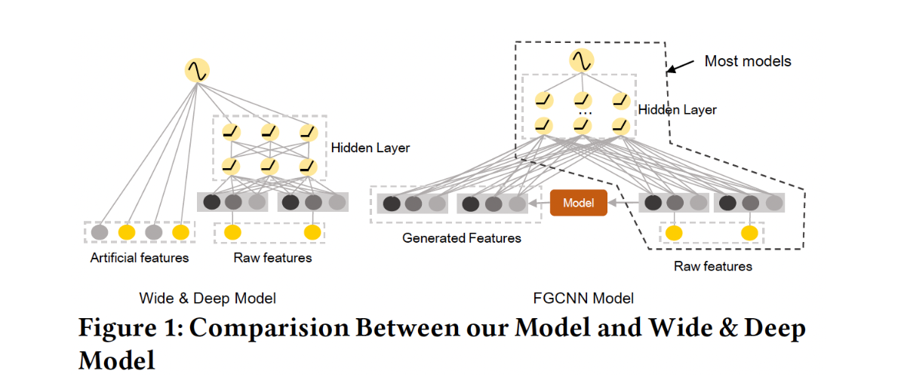
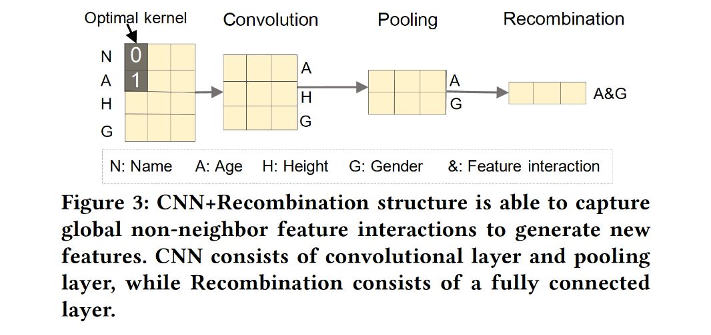
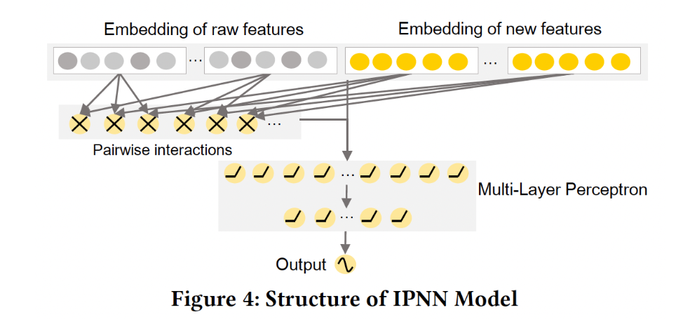

# Feature Generation by Convolutional Neural Network for Click-Through Rate Prediction

# 标题
- 参考论文：Feature Generation by Convolutional Neural Network for Click-Through Rate Prediction
- 公司：Facebook
- 链接：https://arxiv.org/pdf/1904.04447
- Code：https://github.com/reczoo/FuxiCTR/blob/main/model_zoo/FGCNN/src/FGCNN.py
- `泛读`

# 内容

## 摘要
- 大部分deep 模型都在学习高阶和低阶的特征交互，然而有用的特征交互通常是稀疏的，要从大量的参数中有效地学习它们是非常困难的。
- 现实环境中，在人工特征的帮助下，deep 组件的性能得到了显著的提高。然而，特征工程可能是昂贵的，并且需要领域知识。因此需要自动的增强特征空间。
- 本文提出全新的自动生成特征的通用框架，由一下两部分组成：
  - Feature Generation
    - 利用CNN来找到一些local的pattern，并且重新组成全新的特征。
  - Deep Classifier
    - 采用IPNN 的结构来学习增强后的特征空间
- 提出了一种全新的CTR方向，用于降低DNN的学习难度，通过自动化发现重要的特征
- 本质上还是产生不同重要性的特征，这里利用了CNN来实现融合特征后新特征的重要性

## 1 简介
- 以前的问题：
  - FM 及其变体将 pairwise 特征交互建模为潜在向量的内积。
  - PIN、xDeepFM 等。这类模型将原始特征馈入深度神经网络，以显式或隐式的方式学习特征交互。
  - 理论上，DNN 能够从原始特征中学习任意的特征交互。然而，由于与原始特征的组合空间相比，有用的特征交互通常是稀疏的，要从大量的参数中有效地学习它们是非常困难的。
  - 比如Wide & Deep 中的，Wide部分，采用人工特征工程，大部分的人工特征工程是比较expensive的并且是不高效的，而且需要很多人工domain knowledge。
- 创新，本文提出自动生成特征的通用框架：
  - 原始特征被馈入到机器学习模型，从而识别和生成新的特征。
  - 之后，原始特征和新特征被结合起来，
  - 并馈入一个深度神经网络（DNN）。
  - 被生成的特征能够通过提前捕获稀疏的但重要的特征交互来降低深度模型的学习难度。
  - 框架选择：
    - MLP，有用的特征交互通常是稀疏的，MLP 很难从巨大的参数空间中学习这种交互。
    - CNN，本文方法，共享权重、池化机制的设计大大减少了寻找重要局部模式所需的参数数量，克服了MLP的权重太多的问题。
      - 问题：特征的顺序对描述样本的语义没有任何区别，这与图像和句子的情况完全不同。CNN 抽取的邻居模式 neighbor pattern，许多有用的 global feature interaction 就会丢失。
      - 方法：混合CNN 和 MLP，达到获取global feature interaction。
        - 本文任务提出了一个新的模型，由一下两部分组成：
          - Feature Generation：
            - CNN+MLP 的结构用来从原始特征中识别和生成新的重要特征
            - CNN学习 neighbor feature interaction，MLP 被用来重新组合它们从而提取 global feature interaction
            - 最后生成之后，可以结合原始特征和新特征来进行扩充
          - Deep Classifier：
            - 所有 SOTA 网络结构（如 PIN、xDeepFM、DeepFM）都可以被采用。本文的框架兼容性很好，本文选用的是IPNN 最为最后一层
- 综上所述，主要贡献：
  - 确定了 CTR 预测的一个重要方向：通过提前自动生成重要的特征来降低深度学习模型的优化难度，这既是必要的，也是有益的。这一条本质上还是特征重要性的融合。
  - 提出了一个新的模型 FGCNN 用于自动生成特征和分类，它由两个部分组成：Feature Generation、Deep Classifier。特征生成利用 CNN 和 MLP ，它们相互补充，以识别重要的但稀疏的特征。 此外，几乎所有其他的 CTR 模型都可以应用在深度分类器中，从而根据生成的特征、以及原始的特征进行学习和预测。 
  - 在三个大规模数据集上的实验证明了 FGCNN 模型的整体有效性。当生成的特征被用于其他模型时，总是能取得更好的性能，这表明 FGCNN 模型具有很强的兼容性和鲁棒性。

## 2 FEATURE GENERATION BY CONVOLUTIONAL NEURAL NETWORK MODEL

    
      <figcaption style="text-align: center">
        FGCNN_模型结构
      </figcaption>
    </img>
    

## 2.1 Overview

    
      <figcaption style="text-align: center">
        FGCNN_特征生成结构图
      </figcaption>
    </img>
    

- 特征生成：
  - 特征生成侧重于识别有用的局部模式和全局模式，以生成新的特征作为原始特征的补充。
  - 根据后面的消融实验来看，通过 CNN 生成的新特征虽然有效果，但是提升不显著（平均而言不到 0.1% 的 AUC 提升）。 如果将 CNN 替换为 MLP，那么特征生成组件就是一个 MLP 结构，同时将每一层的输出再投影为新的特征向量。最后进Deep的其实就是每一层的MLP的输出的叠加再叠加原始特征。
- 深度分类器： 
  - 深度分类器则通过深度模型在增强的特征空间的基础上进行学习和预测。

## 2.2 Feature Embedding
- 如果一个 field 是 univalent 的（例如，Gender=Male ），它的 embedding 就是该 field 的 feature embedding 。
- 如果一个 field 是 multivalent 的（例如， Interest=Football, Basketball ），该 field 的 embedding 是 feature embeddings 之和。
- 为了避免更新参数时梯度方向的不一致，我们将为深度分类器引入另一个 embedding 矩阵 E′ ∈ ℝ_n_f × k ，而 E 用于特征生成。
- 也就是说总共需要引入两套 embedding table，模型的参数要翻倍（模型参数被 embedding table 所主导）。

## 2.3 Feature Generation
- 之前的问题：
  - 在原始特征的组合空间中，有用的特征交互总是稀疏的。因此，MLP 很难从大量的参数中学习它们。
  - 其次，虽然 CNN 可以通过减少参数的数量来缓解 MLP 的优化困难，但它只产生 neighbor feature interaction ，可能会失去许多有用的 global feature interaction 。
- 提出解决方法：
  - CNN 和 MLP 相互补充从而进行特征生成。
  - 

      
        <figcaption style="text-align: center">
          FGCNN_特征生成结构图
        </figcaption>
        </img>
        

  - CNN 用有限的参数学习有用的 neighbor feature pattern
  - 而重组层（这是一个全连接层）根据 CNN 提供的 neighbor pattern 生成 global feature interaction
  - 这里纵向为不同的 field，横向为不同的 embedding 维度，卷积核为 K × 1，这会在每个 embedding 维度上聚合相连的 K 个 field。
  - 最后一步，Recombination 会把卷积结果进行投影并减少通道数。也就是把前面所学到的 neighbor feature pattern 来一个 global 的加权组合。

### 2.3.1 Convolutional Layer
- 每个样本通过 feature embedding 被表示为 embedding 矩阵 E ∈ ℝ_n_f × k 。
- 为后续的矩阵计算，将 embedding 矩阵 reshape 为 E1 ∈ ℝ_n_f × k × 1 作为第一个卷积层的输入矩阵，即通道数为 1
- 为了捕获 neighbor feature interaction ，用非线性激活函数的卷积层对 E1 进行卷积，卷积层的输出记做 C1 ∈ ℝ_n_f × k × m_1_c
- 卷积核的尺寸为 h_1 × 1、输出通道数为 m_1_c、输入通道数为 1 ，激活函数为 tanh
- h1 为卷积核的高度（代表对相连的多少个 field 进行卷积）。也就是neighbor 的大小

### 2.3.2 Pooling Layer
- 在第一个卷积层之后，应用一个 max-pooling 层来捕获最重要的特征交互，从而减少参数的数量。
- h_1_p 为池化层的高度（池化层的宽度为 1 ），那么第一个池化层的输出为 S1 ∈ ℝ(n_f/h_1_p) × k × m_1_c。
- 第 i 个池化层的池化结果将是第(i+1) 个卷积层的输入：E_i + 1 = S_i。

### 2.3.3 Recombination Layer
- 引入了一个全连接层来重新组合局部的 neighbor feature pattern 并生成重要的新特征。
- S1 展平为一维向量 s_1 ∈ ℝ_n_f_k / h_1_p_m_1_c 
- 全连接层的权重矩阵为：W1 ∈ ℝ(n_f_k/h_1_p × m_1_r) × (n_f_k/h_1_p × m_1_r) bias 向量为 b_1 ∈ ℝ(n_f_k/h_1_p × m_1_r)
- m_1_r 为重组层的输出通道数
- 这里是把全连接层的结果又 reshape 回来。

### 2.3.4 Concatenation
- 新的特征可以通过多次执行 CNN+Recombination 来产生。假设有 n_c 组卷积层、池化层、以及重组层。则有 n 个 R_1 进行拼接。
- 最终和一组全新的Deep 的 embedding E′，进行拼接成一个 deep 层的输入。

## 2.4 Deep Classifier
采用 IPNN 模型作为深度分类器的网络结构，因为它在模型复杂性和准确性之间有很好的权衡。实际上任何deep网络都可以。

### 2.4.1 Network Structure

    
      <figcaption style="text-align: center">
        FGCNN_deep结构图
      </figcaption>
    </img>
    

- IPNN 模型结合了 FM和 MLP 的学习能力。
- 一个 FM layer，通过内积运算从 embedding 向量中抽取 pairwise 特征交互。这里的embedding是前面的输出，也就是raw embedding + CNN之后的new embedding
- 之后，input feature 的 embedding 和 FM layer 的结果被拼接起来，并馈入 MLP 进行学习。

### 2.4.2 Batch Normalization
- 在 FGCNN 中，Batch Normalization 应用在每个激活函数之前从而加速模型训练。

### 2.4.3 Objective Function
- 最小化交叉熵

## 2.5 Complexity Analysis

### 2.5.1 Space Complexity
- Feature Embedding：包含两个 embedding 矩阵
- Feature Generation：第 i 个卷积层有 h_i_m_i−1_c * m_i_c 个参数
- Deep Classifier

### 2.5.2 Time Complexity
- Feature Generation
- Deep Classifier
- 详细推导见原论文
- 这里的超参数非常多，很难调参

# 思考

## 本篇论文核心是讲了个啥东西
- 提出了一个通用型的特征生成框架，可以自动获取邻居特征和全局特征信息

## 是为啥会提出这么个东西，为了解决什么问题
- 对比FM 及其变体将 pairwise 特征交互建模为潜在向量的内积。
  - FGCNN可以获取更多的全局信息
- 对比PIN、xDeepFM 等。这类模型将原始特征馈入深度神经网络，以显式或隐式的方式学习特征交互。
  - FGCNN的框架更加通用，利用了CNN的特性达到更加高效的学习
- 对比 DNN 能够从原始特征中学习任意的特征交互。然而，由于与原始特征的组合空间相比，有用的特征交互通常是稀疏的，要从大量的参数中有效地学习它们是非常困难的。
  - FGCNN可以克服了特征交叉稀疏的问题
- 对比Wide & Deep 中的，Wide部分，采用人工特征工程，大部分的人工特征工程是比较expensive的并且是不高效的，而且需要很多人工domain knowledge。
  - FGCNN实现了自动化，并且不需要太多domain knowledge或者人工experience

## 为啥这个新东西会有效，有什么优势
- 特征生成过程：
  - CNN，本文方法，共享权重、池化机制的设计大大减少了寻找重要局部模式所需的参数数量，克服了MLP的权重太多的问题。
  - 同时CNN可以生成邻居特征，克服了大量特征交互通常是稀疏的，MLP 很难从巨大的参数空间中学习这种交互。
  - 又利用CNN + MLP 的结构解决了CNN 只有邻居信息的问题，实现了全局信息 + 邻居信息
  - 本质上其实就是传统的 MLP层，之前加了一个CNN来对所有特征进行一个融合和提取，降低了稀疏特征的存在。同时CNN的池化层是max pooling，可以实现提取特征按照相对的重要性的过程。
- Deep 框架：
  - 利用了IPNN 的思路，模型结合了 FM和 MLP 的学习能力，并且带入原始特征的embedding，保留了原始特征两两交叉的特征交互学习

## 与这个新东西类似的东西还有啥，相关的思路和模型
- CNN 的思路：
  - CCPM 应用多个卷积层来探索邻居特征的相关性。CCPM 以一定的排列方式对 neighbor field 进行卷积。由于特征的顺序在 CTR 预测中没有实际意义，CCPM 只能学习邻居特征之间有限的特征交互。
- 特征交互的思路：
  - 经典的FM
  - PIN
  - DCN

## 在工业上通常会怎么用，如何实际应用
- 目前看大到的code：https://github.com/reczoo/FuxiCTR/blob/main/model_zoo/FGCNN/src/FGCNN.py
- CNN 的思路可以尝试应用一下，参数量很小，尝试在Deep tower这边可以加一个 CNN层。不影响 Wide 这边。

# 参考
- https://www.huaxiaozhuan.com/%E6%B7%B1%E5%BA%A6%E5%AD%A6%E4%B9%A0/chapters/9_ctr_prediction5.html

 
  
  