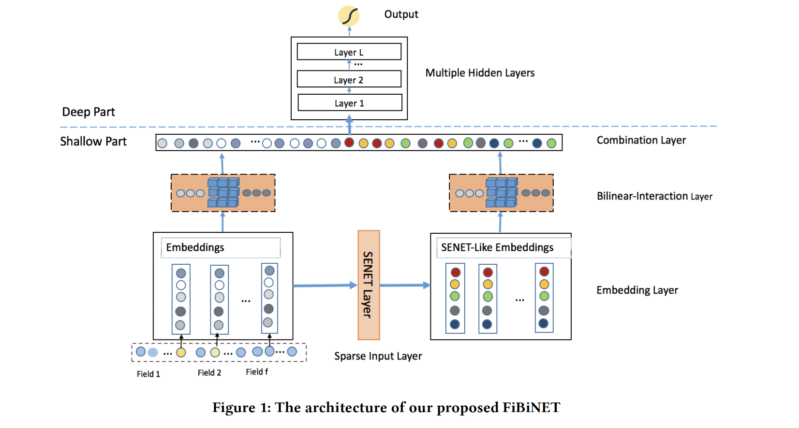
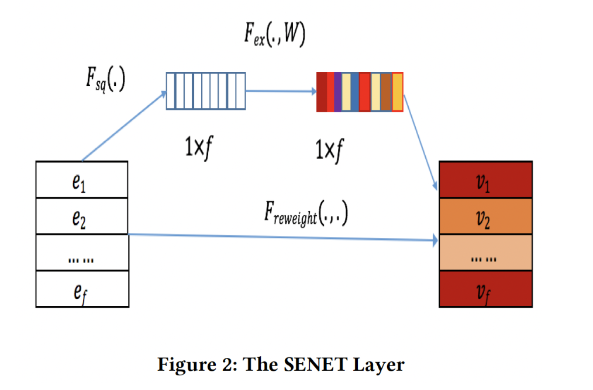
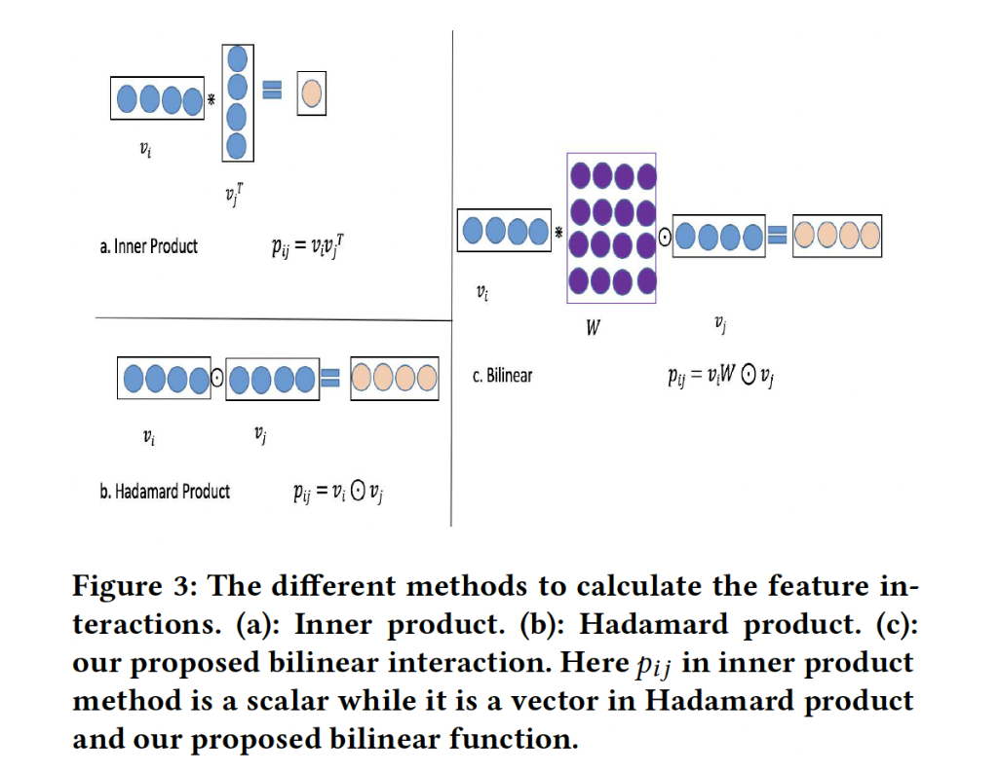

# FiBiNET: Combining Feature Importance and Bilinear feature Interaction for Click-Through Rate Prediction

# 标题
- 参考论文：FiBiNET: Combining Feature Importance and Bilinear feature Interaction for Click-Through Rate Prediction
- 公司：Sina Weibo 
- 链接：https://arxiv.org/pdf/1905.09433
- Code：https://github.com/shenweichen/DeepCTR-Torch/blob/master/deepctr_torch/models/fibinet.py
- `泛读`

# 内容

## 摘要
目前的问题： 
  - 在特征交互这一方面， 目前的ctr模型要么是简单的两两embedding内积(这里针对离散特征)， 比如FM，FFM。 或者是两两embedding进行哈达玛积(NFM这种)
新模型：
  - 动态地学习特征重要性和细粒度的特征交互

## 1 简介
- 不同的特征对目标任务有不同的重要性。例如，当我们预测一个人的收入时，职业这个特征比爱好这个特征更重要。考虑到这一点，论文引入了 Squeeze-and-Excitation network: SENET 来动态地学习特征的权重。换句话来说就是每个特征根据重要性程度进行加权。
- 特征交互是 CTR 预测领域的一个关键挑战，许多相关工作以简单的方式计算特征交互，如 Hadamard 积和内积。论文提出了一种新的细粒度的方法采用双线性函数来计算特征交互。
- 论文主要贡献：
  - 论文引入了三种类型的双线性交互层 Bilinear-Interaction layer ，以一种精细的方式学习特征交互。而之前的工作用 Hadamard 积或内积来计算特征交互。
  - 受 SENET 在计算机视觉领域的成功启发，论文使用 SENET 机制来动态地学习特征的权重。

## 3 OUR PROPOSED MODEL

    
      <figcaption style="text-align: center">
        FiBiNET 模型整体结构
      </figcaption>
    </img>
    

- sparse input layer 和 embedding layer 与 DeepFM 相同，它对输入特征采用稀疏表示并将原始特征嵌入到稠密向量中。
- SENET layer 可以将 embedding layer 转换为 SENET-Like embedding feature ，这有助于提高特征的 discriminability。
- Bilinear-Interaction layer 分别对原始 embedding 和 SENET-Like embedding 的二阶特征交互进行建模。
- combination layer 拼接了 Bilinear-Interaction layer 的输出。
- 最后，将combination layer 的输出馈入一个深度神经网络 DNN 从而得到预测分数。

## 3.1 Sparse Input and Embedding layer
embedding layer 将 sparse feature 嵌入到一个低维稠密的实值向量中。embedding layer 的输出是由 field embedding 向量所拼接而来。和大部分Deep & Wide 模型输入一样。最终维度是 f x k，f 是 field的个数，k 是特征的维度。

## 3.2 SENET Layer
SENET 机制，让模型更加关注特征的重要性。对于特定的 CTR 预估任务，我们可以通过 SENET 机制动态地增加重要特征的权重、减少不重要特征的权重。

    
      <figcaption style="text-align: center">
        FiBiNET_SENET结构图
      </figcaption>
    </img>
    

- squeeze:
  - 计算每个 field embedding 的 summary statistics
  - 使用一些池化方法（如 max/mean/sum）从而将原始的 embedding e = [e_1, e_2, ⋯ ,e_f] 挤压为一个统计向量，z = (z_1, ⋯ ,z_f)。
  - z_i 为一个标量，表示第 i 个特征表示的全局信息。
  - 原始 SENET 论文中的 squeeze 函数是最大池化。本文的实验结果表明，均值池化的性能比最大值池化的性能更好。
  - 图像领域对卷积核元素求 Max，等于找到最强的那个特征，而推荐领域的特征Embedding，每一位的数字都是有意义的，所以求均值能更好地保留和融合信息。
- excitation：
  - 基于统计向量 z 来学习每个 field embedding 的权重。我们使用两个全连接层来学习权重。
  - 第一个全连接层是一个降维层，参数为 W1，降维率 r 是一个超参数，非线性函数为 σ1。
  - 第二个全连接层是一个升维层，参数为 W2，非线性函数为 σ2。
  - 本质上就是学习哪一些特征的权重可以通过降维后降低权重，也就是实现动态调整特征的权重。达到保留最重要的 r 个权重。
- re-weight：
  - 通过上面计算出来的新的权重 a，来重新计算field embedding v。公式：v = e * a。
  - 其实就是把前面学习到的不同特征的权重点成回去原始的field embedding。
  - 所谓动态，指的是比如对于某个特征，在某个输入组合里可能是没用的，但是换一个输入组合，很可能是重要特征。它重要不重要，不是静态的，而是要根据当前输入，动态变化的。

## 3.3 Bilinear-Interaction Layer

    
      <figcaption style="text-align: center">
        FiBiNET_双向交叉层
      </figcaption>
    </img>
    

- 特征交互的经典方法是内积和 Hadamard 积，但是都过于简单，不能有效地建模稀疏数据集中的特征交互。
- 新的Interaction layer 提出了三种类型的双线性函数
  - Field-All Type
    - W ∈ ℝ_k×k 为权重矩阵，它在所有的 field interaction pair 之间共享。
  - Field-Each Type
    - W ∈ ℝ_k×k 为权重矩阵，每个 field 都有一个。
  - Field-Interactoin Type
    - W ∈ ℝ_k×k 为权重矩阵，每个 field interaction pair 都有一个。
- 最终对于每一种 embedding，我们可以选择采用 bilinear 函数或 Hadamard 积。
  - 从原始 embedding e 中输出一个 interaction vector p = [p_1, ⋯, p_f]
  - 从 SENET-like embedding v 中输出一个 interaction vector q = [q_1, ⋯, q_f]
- 本质上是组合了内积和哈达玛积的操作。先乘以 W 内积，本质上是新向量的每个元素，相当于是原来向量v_i 在每个维度上的线性组合了。这时候再与v_j 进行哈达玛积得到结果。

## 3.4 Combination Layer
- combination layer 将 interaction vector p 和 q 拼接起来，把 3.3 的输出直接 concat 起来得到一个新的vector c
- 这里可以参考一个新的想法，对原始的拼接前的 vector 进行线性加权，及 score = w * p + w * q

## 3.5 Deep Network
- 深度网络由多个全连接层组成，隐式地捕获了高阶的特征交互。参考大部分同类的结构，输入是3.4的输出vector c。
- 也就是这里是 stacked 的模式进行相连接。

## 3.6 Output Layer
- 最终的输出是 wide part + deep part 的输出再做一个 sigmoid。
- 目标函数为交叉熵损失 loss function cross entropy

# 思考

## 本篇论文核心是讲了个啥东西
- 提出了一个全新的特征交互模型，来动态地学习特征重要性和细粒度的特征交互。

## 是为啥会提出这么个东西，为了解决什么问题
- 对比FM 类型的模型，或者其它计算交互的模型，内积或者哈达玛积不够精细，提出了一个全新的特征更细粒度(fine-grained way)的交互。
- 对比大部分Deep & Wide 模型，大部分模型没有考虑特征重要性，也就是交互完事之后，没考虑对于预测目标来讲谁更重要。提出了一个SENET 网络来动态学习特征重要性。

## 为啥这个新东西会有效，有什么优势
- 参考作者本人的回答，推荐领域里面的特征有个特点，就是海量稀疏，大量长尾特征是低频的，而这些低频特征，去学一个靠谱的Embedding是基本没希望的，但又不能把低频的特征全抛掉，因为有一些又是有效的。既然这样，把SENet用在特征Embedding上，类似于做了个对特征的Attention，弱化那些不靠谱低频特征Embedding的负面影响，强化靠谱低频特征以及重要中高频特征的作用。
- 动态学习特征权重，通过小权重抑制噪音或者无效低频特征，通过大权重放大重要特征影响的目的。
- 核心思想还是要对所有输入的特征加以区分，赋予特征的重要性权重，不能直接全部一口气送进特征交叉计算。
- 对于双线性函数：
  - 内积操作没有考虑向量各个维度的重要性
  - 哈达玛积操作自身也没有考虑各个维度重要性，但通过后面的线性或者非线性操作，有一定的维度重要性在里面
  - 双线性操作同时可以考虑交互的向量各自的各个维度上的重要性信息，这应该是作者所说的细粒度，各个维度上的重要性。

## 与这个新东西类似的东西还有啥，相关的思路和模型
- [ ] 目前为止
  - 特征重要性方向：
    - AutoInt，AFM，attention的方式计算

## 在工业上通常会怎么用，如何实际应用
- 以下是工业界使用过的经验：
  - 推荐系统的场景因为大量的user/item属性都是符合这些要求的，所以效果格外好。对于搜索场景可以做类似的推广，特征工程中最重要的类别特征。
  - 文字描述类的特征（比如人工标注的主观评价，名字，地址信息……）可以用tokenizer处理成int sequence/matrix作为embedding feature喂进模型，丰富的interaction方法可以很好的学习到这些样本中这些特征的相似之处并挖掘出一些潜在的关系。
  - 如果dense feature比较多而且是分布存在很多异常值的numeric feature，尽量就不要用FiBiNET了，相比大部分NN没有优势不说，SENET那里的一个最大池化极其容易把特征权重带偏，如果一定要上，可能需要修改一下池化的方法。比如修改成均值池化。
  - 使用Field-Each方式能够达到最好的预测准确率，而且相比默认的Field-Interaction，参数也减少了不少，训练效率更高。
  - reduce ratio设置到8效果最好
  - 使用dropout方法扔掉hidden layer里的部分unit效果会更好，系数大约在0.3时最好
  - 在双线性部分引入Layer Norm效果可能会更好些

# 参考
- https://www.huaxiaozhuan.com/applications/recommendation/ctr_prediction/chapters/2019_FiBiNET.html