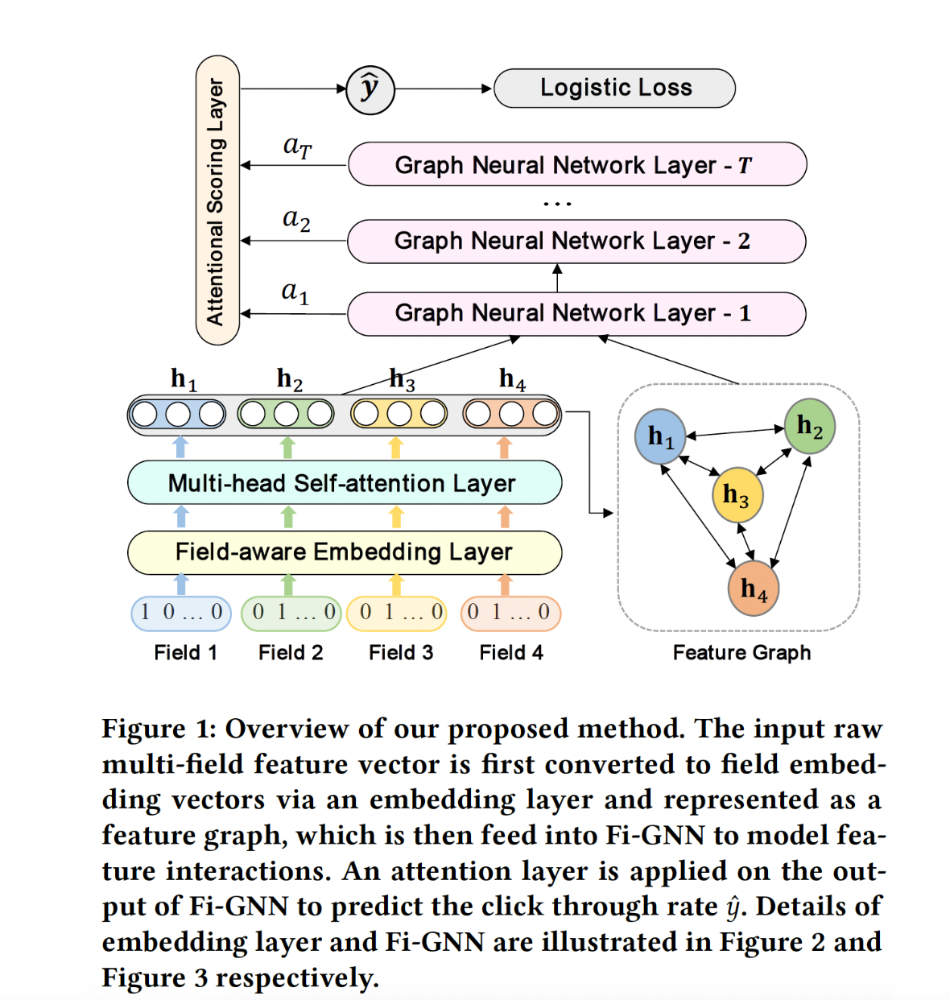
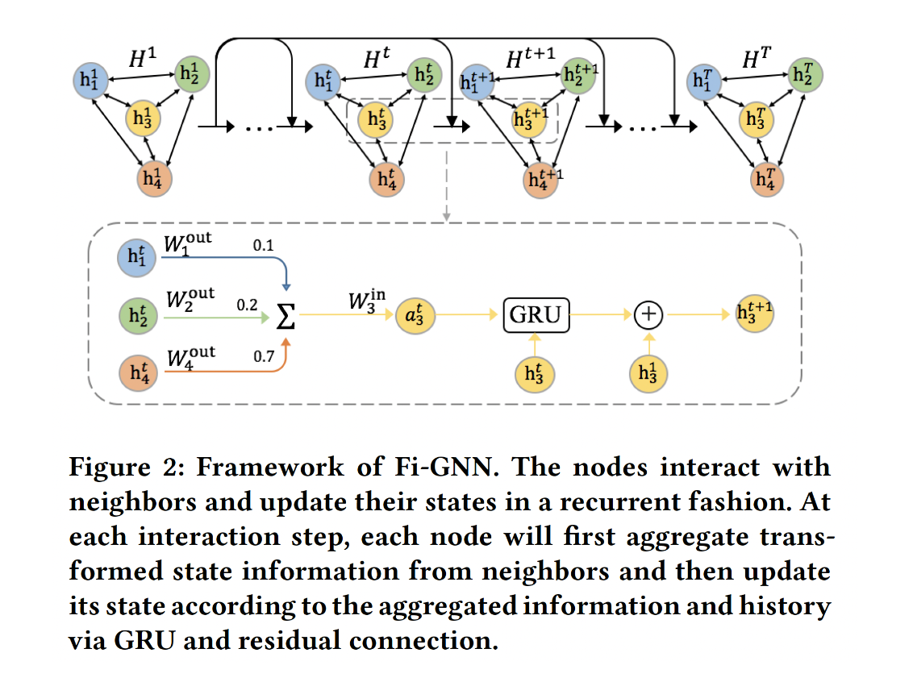

# Fi-GNN: Modeling Feature Interactions via Graph Neural Networks for CTR Prediction

# 标题
- 参考论文：Fi-GNN: Modeling Feature Interactions via Graph Neural Networks for CTR Prediction
- 公司：UCAS 
- 链接：https://arxiv.org/pdf/1910.05552
- Code：
  - https://github.com/reczoo/FuxiCTR/blob/main/model_zoo/FiGNN/src/FiGNN.py
  - https://github.com/CRIPAC-DIG/GraphCTR
- `泛读`

# 内容

## 摘要
问题：
  - 简单的 unstructured combination 也就是大部分模型用的输入层，把embedding节点的并接起来，将不可避免地限制了灵活地、显式地建模不同 feature field 之间复杂交互的能力。
提出：
  - multi-field features in a graph structure intuitively，每个节点是一个field，每条边代表特征交互。
  - 建模 feature field之间复杂交互的任务可以转化为建模 feature graph 上的节点交互的任务，它能够以灵活的、显式的方式建模复杂的节点交互

## 1 简介
问题： 
  - FM 向量内积来建模二阶特征交互。FFM 进一步考虑了 field 信息并引入了 field-aware embedding 。然而，这些 FM-based模型只能建模二阶交互。
  - FNN, NFM, Wide&Deep, DeepFM 等，这些基于 DNN 的模型都是以 bit-wise 的、隐式的方式来学习高阶特征交互，这缺乏良好的模型解释。
  - 设计的网络来显式地学习高阶交互。例如，DCN 引入了 CrossNet，xDeepFM 引入了压缩交互网络 CIN 。但是仍然不够有效和显式，因为它们仍然遵循将 feature field 组合在一起的通用范式来建模交互。简单的 unstructured combination 将不可避免地限制了灵活地、显式地建模不同 feature field 之间复杂交互的能力。
方法：
  - 提出feature graph 的图结构来表示 multi-field feature。直观而言，图中的每个节点对应于一个 feature field，不同 field 可以通过边进行交互。因此，建模 feature field之间复杂交互的任务可以转化为建模 feature graph 上的节点交互的任务。
  - 每一个 time step 中，模型与邻居节点进行 one-hop 的交互。interaction step 的数量等同于特征交互的阶次。
  - 边的权重反映了不同 feature interaction 对于 CTR 预测的重要性，而节点的权重反映了每个 feature field 对于 CTR 预测的重要性，提供了很好的可解释性。
  - 总结来说，贡献如下：
    - 现有工作的局限性，把 multi-field feature 视为 feature field 的 unstructured combination。首次提出用图结构来表示 multi-field feature。
    - 设计了一个新的模型 Fi-GNN ，从而以更灵活的、显式的方式建模 graph-structured feature 上 feature field 之间的复杂交互。
    - 在两个真实世界的数据集上进行的广泛实验表明：所提出的方法不仅可以超越 SOTA 的方法，而且可以提供良好的模型解释。
  - 同AutoInt的逻辑，AutoInt 用 Transformer Encoder Block 建模 multi-field feature，而这里用 GNN 来建模 multi-field feature。 Transformer Encoder Block 可以视为一个简单的 GNN。本质上transformer是一个全连接图。
  
## 3 OUR PROPOSED METHOD

## 3.2 Overview

    
      <figcaption style="text-align: center">
        Fi_GNN 模型整体结构
      </figcaption>
    </img>
    

- 输入的 sparse m-field feature vector 首先被映射成稀疏的 one-hot 向量，然后通过 embedding layer 和 multi-head self-attention layer 嵌入到稠密的 field embedding 向量中。
- field embedding 向量被表示为一个 feature graph ，其中每个节点对应于一个 feature field ，不同的 feature field 可以通过边进行交互。把建模交互的任务可以转换为建模 feature graph 上的节点交互。feature graph 被馈入 Fi-GNN 从而建模节点交互。
- 最后，在 Fi-GNN 的输出上应用一个 Attentional Scoring Layer来估计点击率 y_pred。
- 注意：这里的 Multi-head Self-Attention Layer 就是单层的 AutoInt，因此，Fi-GNN 相当于是 AutoInt 和 GNN 的堆叠。

## 3.3 Embedding Layer
- 每个 field 表示为一个 ont-hot encoding 向量，然后将其嵌入到一个稠密向量中，记做 field embedding 向量 。
- m 个 field 的 field embedding 向量被拼接为（沿着 feature field 维度拼接），最终变成一个 m x d 维度的向量，m 是 field 个数，d 是 embedding 的维度。

## 3.4 Multi-head Self-attention Layer
- 利用多头自注意力机制来捕获不同语义子空间中的 pairwise 特征交互。
- 遵从 AutoInt，给定 feature embedding 矩阵 E，我们获取 feature representation。
- 将学到的每个 head 的 feature representation 结合起来，以保留每个语义子空间中的 pairwise feature interaction。
- 本质上就是1层的 AutoInt。来获取一个特征之间的交互信息。

## 3.5 Feature Graph
- 将每个输入样本的 multi-field feature 表示为一个 feature graph：（N，E）
- 每个节点 n_i 对应一个 feature field，不同的 field 可以通过边进行交互。这里有 N = m。
- 建模特征交互的任务可以转换为建模图上节点交互的任务。
- 本质上就是 graph-level 分类任务（二分类），也就是每个样本都是一个不同类型的graph，这里的类型就是y_pred里面的是否点击。

## 3.6 Feature Interaction Graph Neural Network

    
      <figcaption style="text-align: center">
        Fi_GNN_特征交互结构
      </figcaption>
    </img>
    

- t 表示 interaction step 。由多头自注意力层学到的 feature representation 作为图的初始状态。节点以循环方式进行交互并更新其状态。在每一个 interaction step 中，节点聚合邻居节点的状态信息（经过变换之后），然后根据聚合信息、以及节点历史状态通过 GRU 和残差连接来更新节点状态。
- State Aggregation：
  - 在 interaction step t，每个节点将聚合来自邻居节点的状态信息。具体而言，节点 n_i 的聚合信息是其邻居节点的状态信息（转换之后）之和。
  - 投影矩阵和邻接矩阵决定了节点之间的交互。由于每条边上的交互应该是不同的，我们的目标是建模边上的交互，这需要对每条边有一个 unique 的权重和投影矩阵。
    - 基于注意力的边权重：
      - 通过注意力机制来学习边权重
    - edge-wise 变换：
      - 所有边上的固定的投影矩阵无法建模灵活的交互，对每个边进行 unique 的变换是必要的
      - 图是完全图 complete graph （即，任意两个节点之间都存在边），因此包含大量的边。简单地给每条边分配一个 unique 的投影矩阵将消耗太多的参数空间和运行时间。为了减少时间和空间的复杂性，同时实现 edge-wise transformation，我们为每个节点 n_i 分配一个输出矩阵和一个输入矩阵。 
- State Update：
  - 通过 GRU 进行状态更新，参考`GGNN`结构：
    - 节点 n_i 的状态向量是根据节点 n_i 的聚合状态信息、以及节点在上一个 step 的状态通过 GRU 更新的
  - 通过残差连接进行状态更新：
    - 引入了额外的残差连接（来自初始状态），与 GRU 一起更新节点状态，这可以促进低阶特征重用和梯度反向传播

## 3.7 Attentional Scoring Layer
经过 T 个 propagation step 之后，我们得到了 final node state。由于节点已经与它们的 T 阶邻居交互过，因此 Fi-GNN 建模了 T 阶特征交互。此时需要一个 graph-level output 来预测 CTR。
- 分别对每个 field 的 final state 预测一个得分，并通过注意力机制将它们相加，这个注意力机制衡量它们对整体预测的影响。每个节点 n_i 的预测得分、以及它的 attentional node weight 可以通过两个 MLP 分别得到。
- 整体预测是所有节点的预测的加权和

## 3.8 Training
- 损失函数为 logloss
- RMSProp 优化器
- 为了平衡正负样本比例，在训练过程中，对于每个 batch 我们随机选择相同数量的正样本和负样本。这里参考GNN里面对于样本的不平均非常敏感。否则很容易学习到的节点状态是一模一样的。

# 思考

## 本篇论文核心是讲了个啥东西
- 提出用图结构来表示 multi-field feature，这样可以实现field-level的特征交互而不是简单的拼接后bit-level交互
- 提出全新的 Fi_GNN 结构来对 feature graph 进行特征交互提取，更灵活的、显式的方式建模，同时具有可解释性。

## 是为啥会提出这么个东西，为了解决什么问题
- 对比FM 类型的模型，GNN天然的多个hop timestep 达到高阶特征交互。
- 对比大部分Deep & Wide 模型
  - 对比Wide 部分，只是简单的bit-level的拼接后计算特征交互，实现了一个节点就是一个field，达到了field-level的特征交互。
  - 对比Deep 部分，GNN的节点和边具有天然的可解释，边代表了特征交互的权重，节点代表了这个特征的重要性。

## 为啥这个新东西会有效，有什么优势
- 利用graph 这个结构，GNN 的多个timestep 的计算方式直接实现了高阶特征交互。
- 这里的graph都是全连图，本质上是AutoInt的思路。
- 基于field-level的特征交互方式，更好的显示的获取特征交互信息。

## 与这个新东西类似的东西还有啥，相关的思路和模型
- [ ] 目前为止
  - 基于图的利用GNN进行CTR预测方向

## 在工业上通常会怎么用，如何实际应用
- 目前放出来的[code](https://github.com/CRIPAC-DIG/GraphCTR)。
- 对于工业界并不是所有特征都会做embedding，这样来说就很难利用feature graph结构来对所有特征进行特征交互计算。