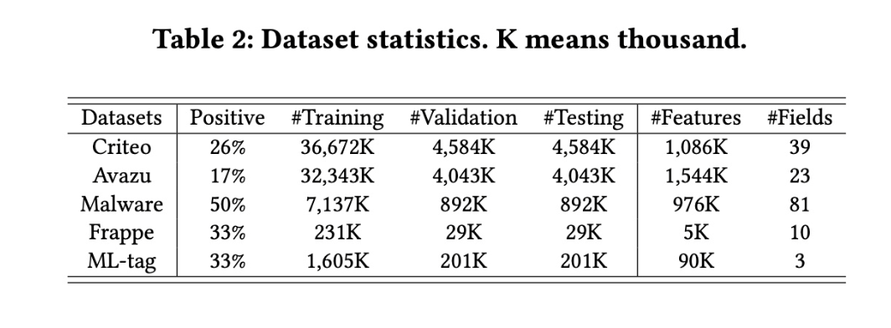

# Towards Deeper, Lighter and Interpretable Cross Network for CTR Prediction

# 标题
- 参考论文：Towards Deeper, Lighter and Interpretable Cross Network for CTR Prediction 
- 公司：复旦 + 微软 
- 链接：https://arxiv.org/pdf/2311.04635
- Code：https://github.com/anonctr/GDCN

# 内容

## 摘要
- 当前针对特征交叉建模的方法主要存在以下三个挑战：
  - 当前的方法虽然能够捕获用户交互历史中高阶的交叉特征关系，但是他们的模型表现随着模型深度的增加而提升越来越少
  - 当前的方法缺乏对于所捕获的高阶特征关系的可解释性，限制了预测结果的可解释性； 
  - 许多方法都存在冗余参数，特别是在嵌入层中。
- 本文提出了一种门控深度交叉网络（GDCN）的和一种场级（field-level）维度优化（FDO）方法来应对这些问题。
  - 其中门控交叉网络（GCN）捕获显式的高阶特征交互，并按每个阶层（这里的阶是指特征交互的层次深度，就是通常说的高阶交互，低阶交互等）动态过滤重要交互。
  - FDO根据每个field中包含的信息来学习压缩维度。

## 1 简介
- 大部分模型的效果随着特征交叉阶层递增而递减
  - 高阶特征交互数量会随着层数增加而指数递增
  - 有大量的无意义的高阶特征交叉，这些noise可能会造成模型的performance受影响或者浪费cost
  - 大部分模型实验显示3层layer之后就明显模型效果递减
- 大部分模型对高阶特征交互的可解释性有缺失，导致不确定那些高阶特征交互比较重要
- 大部分模型有很多浪费的参数，主要在embedding层，因为很多特征并不需要统一的维度的embedding，我们提出一种方式能针对每个特征来找到最合适的维度。
- 提出GDCN + DNN 达到SOTA
- 提出FDO压缩特征embedding维度，只使用23%的原来的参数量，达到SOTA

## 2 相关工作

## 2.1 CTR Prediction
- Stacked Structure
  - Inner product and Outer product - PNN, ONN
  - Hadamard product - FM, FFM
  - Cross net - DCN, DCN-V2, XCrossNet
  - Attention operation - AFM, AutoInt, DCAP, DIEN
  - 以上所有模型都用于显性特征交叉，再加入DNN来获得隐性特征交叉
- Parallel Structure
  - WDL, DeepFM, DCN, DCN-V2, xDeepFM and AFN
  - 以上所有模型都采用了DNN作为平行结构获取隐性特征交叉，区别就在于不同模型获取显性特征交叉的过程
  - **FED**, **NON**, **MaskNet** 则采用了三个或者更多的平行结构

## 2.2 Gating Mechanism in CTR Prediction
- DCN-V2, **DynInt** 采用了 MMoE 的思路
- **IFM**, **DIFM**, and FiBiNet 则采用了不同的权重学习方式 to recalibrate the importance of feature embeddings

## 3 提出的模型结构
- GCN and DNN networks: (a) GDCN-S and (b) GDCN-P.

    
      <figcaption style="text-align: center">
        GDCN_模型结构
      </figcaption>
    </img>
    

## 3.1 Embedding Layer
不同于其它需要特征维度一致的模型，和DCN-V2一样，可以采用任意维度的特征，最终以向量拼接来表示拼接在一起。

## 3.2 Gated Cross Network (GCN)

    
      <figcaption style="text-align: center">
        GDCN_模型特征交叉层
      </figcaption>
    </img>
    

- c_0 为来自embedding layer 的base input，其中包含一阶特征。
- c_l 是是来自前一个gated cross layer （即，第 l 个gated cross layer ）的输出特征，用作当前第 (l+1) 个gated cross layer 的输入
- c_l+1 是当前第 (l+1) 个gated cross layer 的输出
- W(c)l, W(g)l 为可学习的权重矩阵，b_l 为可学习的偏置向量，这里的矩阵维度如果不做低秩矩阵分解的话，则是 [D, D] 维度的矩阵，D为embedding layer 拼接后的维度。
- σ(⋅) 为sigmoid 函数，⊙ 为逐元素乘积也就是哈达玛积。
- 整个模型最重要的两个部分：
  - feature crossing 组件以bit-level 计算一阶特征c_0 和 l 阶特征 c_l 之间的交互。然后，它输出下一个多项式阶次的交互，其中包含所有 (l+1) 阶交叉特征。矩阵 W(c)l 称为交叉矩阵（cross matrix ），表示第 l 阶中各个field 之间的固有重要性。但是，并非所有的 (l+1) 阶特征都对预测产生positive 影响。随着cross depth 的增加，交叉特征呈现指数级增长，这会引入交叉噪声并可能导致性能不佳。
  - information gate 组件。作为soft gate ，它自适应地学习第 (l+1) 阶特征的重要性。通过将sigmoid 函数 σ(⋅) 应用于 (W(g)l * c_l)，可获得gate values 。然后将它们逐元素乘以feature crossing 的结果。此过程放大了重要特征，并减轻了不重要特征的影响。随着cross layers 数量的增加，每个cross layer 的information gate 都会过滤下一阶次的交叉特征并有效控制信息流。
  - 最后，通过将输入 c_l 与feature crossing and information gate 的结果相加，生成最终的output cross vector c_l+1 ，从而包含从第0阶到第 (l+1) 阶的所有特征交互。
  - 本质上思路参考NLP里面的LSTM遗忘门的设计，每次用一个门来控制上一个状态下需要遗忘的信息

## 3.3 Deep Neural Network (DNN)
DNN 的目标是建模隐式feature interactions，基本上和其它的 Deep&Wide 模型选择一模一样。每一层是一个MLP。

## 3.4 整合GCN 和DNN
现有的研究主要采用两种结构来整合显式的和隐式的交互信息：堆叠和并行。因此，我们也以两种方式将GCN 和DNN结合起来，得到了两个版本的GDCN。同理DCN-V2。
- Stacked Structure：
  - 将gate cross network的输出放进deep network，最后过一个logits layer，模拟的是f_cross * f_deep的结果。
- Parallel Structure：
  - 将embedding output作为gate cross和deep的输入，把gate cross network的输出和deep network的输出拼接在一起，最后过一个logits layer，模拟的是f_cross + f_deep的结果。
- 训练方式：
  - 基本上和大部分CTR预测一样使用point-wise的方法，即训练样本是每个item是否点击，所以是一个二分类问题，损失函数是交叉熵（log loss）损失。不带L2正则化。

## 3.5 与DCN-V2 的关系
- GDCN是DCN-V2的推广。当省略information gate 或所有gate values 都设置为1时，GDCN会退回到DCN-V2。在DCN-V2中，cross layer（即CN-V2）平等对待所有交叉特征并直接将它们聚合到下一个阶次，而未考虑不同交叉特征的不同重要性。然而，GDCN引入了GCN，在每个gated cross layer 中都包含一个information gate 。这个information gate 自适应地学习所有交叉特征的bit-wise gate values ，从而实现对每个交叉特征的重要性的细粒度控制。值得注意的是，GDCN和DCN-V2 都能够建模bit-wise and vector-wise 特征交叉。
- DCN-V2引入了MMoE的思想，将cross matrix 分解为多个较小的子空间或“专家”。然后，门控函数将这些专家组合在一起。这种方法主要减少了cross matrices 中的non-embedding 参数，同时保持了性能。 
- 不同的是，GDCN 利用门控机制自适应地选择重要的交叉特征，真正利用deeper 的交叉特征，而不会降低性能。它提供了动态的instance-based 的可解释性，可以更好地理解和分析模型的决策过程。

## 4 FIELD-LEVEL DIMENSION OPTIMIZATION (FDO)
- embedding 维度通常决定了编码信息的能力。然而，为所有field 分配相同的维度会忽略不同field 的信息容量。例如，“性别” 和“item id ” 等field 中的特征的数量范围从 O(2)到 O(10^6)。
- DCN-V2 和 DCN 采用经验公式根据每个field 的特征的数量，为每个field 分配独立的维度，即 (feature number)^0.25。这是一种先验的方法，但忽略了每个field 的真正重要性。
- 本文使用后验的 Field-level Dimension Optimization (FDO)方法，该方法根据每个field 在特定数据集中的固有重要性来学习其独立的维度。
  - 首先，我们训练一个完整模型，采用固定的field 维度为16 ，正如先前的研究所建议的那样。此过程使我们能够为每个field 生成一个informative embedding table -> [feature number, embedding size]。 
  - 接下来，我们使用PCA 为每个field 的embedding table 计算一组奇异值，按奇异值的幅值（magnitude）降序排列。通过评估信息利用率（即information ratio ），我们可以通过识别对整体information summation 贡献最大的 arg_mink 个奇异值来确定最佳维度。此步骤使我们能够为每个field 选择合适的压缩维度。 
  - 最后，我们使用上一步中学到的field 维度训练一个新模型。
  - 本质上其实就是对每个embedding table训练完后的特征，进行降维，并选择最佳解释的降维维度。

    
      <figcaption style="text-align: center">
        GDCN_特征维度对比
      </figcaption>
    </img>
    

- 当保留95% 比率时，field 维度范围为2 到15。
- 降低 information ratio  会导致每个field 的维度减少。 
- 具有大量特征的field 有时需要更高的维度，如在fields {#23, #24} 中观察到的那样。然而，情况并非总是如此；例如，fields {#16, #25} 表现出更小的维度。在实验部分中，我们提供了实验证据，表明field 的维度与其在预测过程中的重要性密切相关，而不是其特征数量 
- 此外，通过保留超过80%  的information ratio ，我们可以获得更轻的GCN 模型，其性能略优于具有完整embedding 维度的GCN  模型，并超过其他SOTA 模型。
- 95%的比例时候，就可以减少到只有原始embedding table 37%的参数个数。
- 减少embedding 的维度，会大大降低之后cross matrix，gate matrix 的维度。

## 5 实验分析

## 5.1 Experiment Setup
- Datasets 分析

    
      <figcaption style="text-align: center">
        GDCN_数据集
      </figcaption>
    </img>
    

- 数据预处理： 
  - 首先，我们将每个数据集随机分成训练集（80%）、验证集（10%）和测试集（10% ）。 
  - 其次，在Criteo 和Avazu中，我们删除某个field 中出现次数少于阈值的低频特征，并将其视为dummy feature "<unkonwn>" 。Criteo 和Avazu 的阈值分别设置为{10, 5} 。 
  - 最后，在Criteo数据集中，我们通过将实数值 z 转换为 log2(z)。
- 评估指标：
  - AUC
  - Logloss
- baseline 方法：我们与四类代表性的方法进行了比较。 
  - 一阶方法，例如LR 。 
  - 建模二阶交叉特征的基于FM 的方法，包括FM、FwFM、DIFM和FmFM 。 
  - 捕获高阶交叉特征的方法，包括CrossNet(CN)、CIN、AutoInt、AFN、CN-V2、IPNN、OPNN、FINT、FiBiNET 和SerMaskNet。 
  - 代表性的集成/并行方法，包括WDL、DeepFM、DCN、xDeepFM、AutoInt+、AFN+、DCN-V2、NON、FED 和ParaMaskNet。
- 实现细节： 
  - 我们使用Pytorch实现所有模型，并参考现有工作。 
  - 我们使用Adam 优化器优化所有模型，默认学习率为0.001。我们在训练过程中使用Reduce-LR-On-Plateau scheduler，当性能在连续3 epochs 停止改善时，将学习率降低10 倍。 
  - 我们在验证集上应用 patience = 5 的早停（early stopping），以避免过拟合。 
  - batch size 设置为4096。所有数据集的embedding 维度均为16。 
  - 根据先前的研究，我们对涉及DNN的模型采用相同的结构（即3层，400-400-400），以便进行公平比较。除非另有说明，所有激活函数均为ReLU，dropout rate = 0.5。 
  - 对于我们提出的GCN、GDCN-S 和GDCN-P ，除非另有说明，默认的gated cross layer 数量为3。 
  - 对于其他baseline，我们参考了两个benchmark 工作（即 BARS  和FuxiCTR ）及其原始文献来微调它们的超参数。
- 显著性检验：
  - 为了确保公平比较，我们在单个GPU（NVIDIA TITAN V）上使用随机种子运行每种方法10次，并报告平均的测试性能。我们执行双尾t-test 来检测我们的方法与最佳baseline 方法之间的统计显着性。
  - 在所有实验中，与最佳baseline 相比的改进具有统计学意义（p<0.01），在Table 3  和Table 4 中用 ★ 表示。

    
      <figcaption style="text-align: center">
        GDCN_实验结果对比
      </figcaption>
    </img>
    

    
      <figcaption style="text-align: center">
        GDCN_实验结果对比
      </figcaption>
    </img>
    

## 5.2 整体性能
注意，以下的所有结果是在没有应用 FDO 的情况下得出的。实验结果放在上图。

### 5.2.1 Comparison within stacked models
- 在大多数情况下，高阶模型优于一阶模型和二阶模型，证明了学习复杂的高阶feature interactions 的有效性。值得注意的是，OPNN、FiBiNet、FINT 和SerMaskNet 等模型表现更佳，它们使用一个stacked DNN 同时捕获显式的和隐式的特征交叉。这证实了对显式的和隐式的高阶feature interactions 进行建模背后的原理。
- GCN 通过仅考虑显式的多项式feature interactions 没有DNN 的部分，始终优于所有堆叠的baseline 模型。GCN是CN-V2的泛化，增加了一个information gate 来识别有意义的交叉特征。GCN 的性能验证了并非所有交叉特征都对最终预测有益，大量不相关的交互会引入不必要的噪音。通过自适应地re-weighting 每个阶次中的交叉特征，GCN 比CN-V2  实现了显著的性能提升。
- GDCN-S 超越了所有堆叠的baseline 并实现最佳性能。在 GDCN-S 中，stacked DNN 进一步学习GCN 结构之上的隐式交互信息。因此，与其他堆叠式模型（例如OPNN、FINT和SerMaskNet）相比，GDCN-S优于GCN并实现更高的预测准确率。

### 5.2.2 Comparison within parallel models
- 整合隐式的和显式的feature interactions 可以增强预测能力。DNN 仅建模隐式的feature interactions ，而将DNN 与捕获显式feature interactions 的其他网络相结合得到的并行模型优于单个网络。
- GDCN-P 的表现优于所有并行式模型和堆叠式模型。与Table 4 中的并行式模型相比，GDCN-P 实现了卓越的性能，超越了所有最佳baseline。

## 5.3 Deeper 高阶特征交叉

    
      <figcaption style="text-align: center">
        GDCN_高阶特征交叉效果对比1
      </figcaption>
    </img>
    

    
      <figcaption style="text-align: center">
        GDCN_高阶特征交叉效果对比2
      </figcaption>
    </img>
    

### 5.3.1 Compare GCN to other models by changing cross depth
- 随着交叉层的增加，五个被比较的模型的性能得到改善。然而，当cross depth 变得更深（例如，超过2、3  或4 个交叉层）时，它们的性能会显著下降。这些模型可以在功能上捕获更深的高阶显式和隐式的feature interactions ，但高阶的交叉特征也会引入不必要的噪声，这可能会导致过拟合并导致结果下降。在许多SOTA 工作中进行的cross depth 超参数分析中也观察到了这个问题。
- 相反，随着交叉层数从1 增加到8，GCN的性能不断提高。具体来说，与CN-V2模型相比，GCN包含了一个information gate 。该information gate 使GCN能够对每个阶次识别有用的交叉特征，并仅积累最终预测所需的信息。因此，即使cross depth 变得更深，GCN 的表现始终优于CN-V2和其他模型，验证了information gate 设计的合理性。

### 5.3.2 The performance of GCN and GDCN-P with deeper gated cross layers
- 随着cross depth的增加，GCN和GDCN-P的性能都得到了改善，在GDCN-P 中观察到的趋势与GCN的趋势一致。
- 在加入DNN组件后，GDCN-P 的表现始终优于GCN，这凸显了使用DNN捕获隐式feature interactions 的重要性。
- DNN 使GDCN-P能够更早地获得最佳结果。具体来说，当深度超过8或10时，GCN的性能会达到稳定状态，而GDCN-P 的阈值为4或6。
- 尽管GCN 和GDCN-P 可以选择有价值的交叉特征，但随着cross depth的增加，高阶交叉特征的有用性会急剧下降。这种现象符合人们的普遍直觉，即个人在做出决策（例如点击或购买item ）时通常不会同时受到太多特征的影响。
- 在cross depth超过稳定阈值后，模型的性能保持稳定，而不是下降。说明information gate 起到了很好的过滤noise的作用。

## 5.4 GCN 的可解释性
可解释性对于理解specific predictions背后的原因、以及增强对预测结果的信心至关重要。GCN 从模型的和实例的角度提供静态的和动态的解释，有助于全面理解模型的决策过程。

### 5.4.1 Static model interpretability
- 静态的model interpretability：同DCN-V2，在GCN 中，交叉矩阵 W(c) 作为不同fields 之间交互的相对重要性的指标。
- 此外，随着交叉层的增加，相应的交叉矩阵可以进一步表明多个field 之间的固有的relation importance 。
- 将FDO 方法应用于GCN时，GCN-FDO仍然能够捕获相似的交叉重要性，如Figure 5(b) 所示。两个矩阵之间的余弦相似度为0.89，表明在应用FDO之前和之后，在捕获固有field cross 重要性方面具有很强的一致性。

### 5.4.2 Dynamic instance interpretability
GCN 通过information gate 学到的gate weights 提供动态可解释性，为每个input instance 提供bit-wise 的和field-wise 的解释。从Criteo 数据集中随机选择两个实例来可视化学到的gate weights ，并检查从第一个到第三个gated cross layer 的gate values。

    
      <figcaption style="text-align: center">
        GDCN_动态特征可解释性
      </figcaption>
    </img>
    

- Figure 6(a) 展示了bit-wise gate weight vectors ，每层的维度为 ℝ1×(39*16)，显示了每个bit-wise cross 的重要性。使用bit-wise gate vector ，我们通过对每个field 对应的16-bit values 取平均值来导出field-wise gate vectors。
- Figure 6(b) 显示了field-wise gate weight vectors（ℝ1×39），表示每个specific feature 的重要性。由于gated cross layer 中的gate weights 是使用sigmoid 函数计算的，因此red blocks （大于0.5 ）表示重要特征，而blue blocks （小于0.5 ）表示不重要特征。
- 通常，低阶特征交叉包含更重要的特征，而高阶特征交叉包含不太重要的特征。在第一层中，许多特征交叉被标识为重要的（红色块），而在第二和第三交叉层中，大多数交叉是中性的（白色块）或不重要的（蓝色块），尤其是在第三层。这符合我们的直觉：随着交叉层的增加，重要的交叉特征的数量显著减少，因此我们设计了information gate 来自适应地选择重要特征。相反，大多数模型在建模高阶交叉时无法选择有用的特征交叉，导致性能下降。
- 从Figure 6(b) 中，我们可以识别出重要的或不重要的特定特征，例如特征{#20, #23, #28} 很重要，而特征{#6, #11, #30} 不重要。我们还可以从input instance 中引用这些specific important features 的名称。一旦我们知道哪些特征有影响，我们就可以解释甚至干预有助于用户点击率的相关特征。

    
      <figcaption style="text-align: center">
        GDCN_动态特征可解释性平均结果
      </figcaption>
    </img>
    

- 在Figure 7 中，我们记录并平均了M 个实例的field-level gate vectors ，表明每个field 的平均重要性，特别是在第一层。例如，field {#20, #23, #24} 非常重要，而field {#11, #27, #30}  相对较不重要。此外，Figure 7  从统计角度进一步验证了随着交叉层的增加，重要交叉特征的数量显著减少。

## 5.5 FDO 的综合分析

### 5.5.1 效果分析
将FDO方法应用于GCN，并通过保持information ratio 从50% 到98%来评估其性能。
- 当保持80% 的information ratio 时，只需要23%的参数，而模型的性能与完整模型相当
- 当information ratio 在80% 到98%之间时，模型性能甚至比完整模型更好。这是因为FDO refine 了每个field 的特征维度，消除了非必要的维度信息并减少了交叉过程中的冗余。
- 当information ratio 较低（即低于80% ）时，较短的维度无法充分表示相应field 的特征，导致预测性能显著下降。
- 最后将整个模型的所有特征维度直接从16 减少到8，不区别对待，大约相当于95% 比率下的加权平均维度（7.56 ）。虽然它直接减少了模型的参数，但也导致了性能的下降。其他研究同样证实了减少embedding 大小的负面影响。相比之下，FDO 方法可以更直接地减少参数数量，同时实现相媲美的性能。

### 5.5.2 内存和效率比较
- 大多数现有模型的参数范围从18M到20M，主要是由于embedding 参数。
- 通过应用FDO ，我们可以直接减少embedding 参数。同时，GCN-FDO 和GDCN-PFDO  仅使用约5M 模型参数就实现了相媲美的准确率。
- 未经维度优化的GCN 和GDCN的训练时间与DNN和DCN-V2相当。 
- 应用FDO 后，GCN-FDO和GDCN-P-FDO 以更少的参数和更快的训练速度超越了所有的SOTA 模型。

### 5.5.3 兼容性分析
将FDO应用于DNN、CNV2、DCN-V2 和FmFM，它们不需要相同的field 维度。此外，我们将FDO 与分配固定维度、以及FDO 章节中提到的分配不同维度的Formula method 进行了比较。
- 首先，Formula method 增加了模型参数并降低了其性能，因为它只考虑每个field 中的特征数量，而忽略了field 在训练过程中的重要性。相反，FDO 是一种后验方法，它通过在trained embedding table 中合并重要信息来学习field 维度。
- 其次，将FDO应用于CN-V2和GCN 比base 模型获得了更好的性能。由于CN-V2 和GCN 主要关注显式的bit-level 特征交叉，FDO通过删除不必要的embedding 信息来refine field 维度。然而，将FDO 应用于包含DNN网络的DNN、DCN-V2和GDCN-P 会导致性能略有下降。
- 最后，这些结果表明，我们可以使用FDO 基于SOTA 模型获取group field dimensions ，并将其复用为其他模型的默认维度。在Table 6 的最后一行，我们基于GCN学习了具有95% information ratio 的group field dimensions ，并将其应用于其他五个模型。与使用模型本身学到维度相比，这种方法实现了相媲美的性能，并且进一步减少了参数数量。

### 5.5.4 The understanding of condensed field dimensions.
- 通过FDO 学到的field 维度表明了相应field 的重要性。有时候并不是特征值越多的特征越需要高纬度的embedding，应该和此特征在模型里面的重要性相关。
- 比如，field 维度并不总是与field 中的特征数量相关。例如，field {#16, #25}  具有最大的特征数量，但它们的field 维度很短，其重要性也不大。如果使用Formula method 分配field维度，则field {#16, #25}  将具有最长的维度。这种比较进一步凸显了所引入的FDO 方法的合理性和优越性。

## 6 总结
- 总结： 
  - 提出了一个全新的结构GDCN
  - 利用 information gate 来提取重要的有用的特征交叉组合，并且过滤一些高纬的特征交叉 noise，避免了高纬的特征交叉带来的模型效果下降。
  - 提出了一种基于模型和样本的可解释方式
  - 提出了FDO 算法来压缩特征的embedding维度基于每个特征的重要性，保证了用更少的参数来达到媲美原始维度甚至更好的模型效果。

# 思考

## 本篇论文核心是讲了个啥东西
- 提出一种门控制的 GDCN 网络，自动获取显式的高阶特征交互，并且自动过滤高阶特征交叉带来的 noise
- 提出一种维度优化（FDO）方法，类似树模型的后减枝，可以根据每个特征的重要性来压缩特征维度

## 是为啥会提出这么个东西，为了解决什么问题
- 对比DCN-V2或者CIN、AutoInt、AFN、CN-V2、IPNN、OPNN、FINT、FiBiNET等其它的包含高阶特征交叉的模型，显著的提升了高阶特征的重要性同时提升了模型的performance。
- 对比大部分模型embedding层使用rule base的不加区分的维度设置，FDO特征维度压缩方法，大量减少了参数数量同时保证了模型效果。

## 为啥这个新东西会有效，有什么优势
- 对于大部分包含高阶特征交叉的模型，引入高阶的交叉特征会引入不必要的噪声，并且这个噪音一般是随着阶数越高越多，这可能会导致过拟合并导致结果下降。引入information gate 使GCN能够对每个阶次识别有用的交叉特征，过滤掉不需要的noise特征交叉，并仅积累最终预测所需的信息传递到下一层。
- 类似NLP里面LSTM的思路，引用遗忘门来忘记之前状态里面不需要的信息，这里也就是上一个阶次下不需要的特征交叉组合信息。
- FDO 根据后减枝原理，保证了每个特征随着在模型中的重要性来压缩，而不是一刀切维度。采用PCA降维的方式，能在高纬度特征空间内能很好找到对应的低纬度。换句话来说，还是一样把不需要的embedding维度信息当做noise过滤掉，基于完整的跑一次模型后。

## 与这个新东西类似的东西还有啥，相关的思路和模型
- LSTM：采用遗忘门类 GDCN 里面的 information gate

## 在工业上通常会怎么用，如何实际应用
- 目前没看到官方的开源，只有论文中包含代码地址，也可以直接自己implement，直接在DCN-V2上面每一层增加一个information gate 即可。
- 参考论文里面 5.4 这一段，如何正确地解释模型，同时起到一定的特征筛选功能。
- 参考论文里面的 4 这一段，如何使用FDO压缩模型，同时保证模型效果。
- 目前实际使用情况中，stacked + 2 layers 起到的效果比较好。

