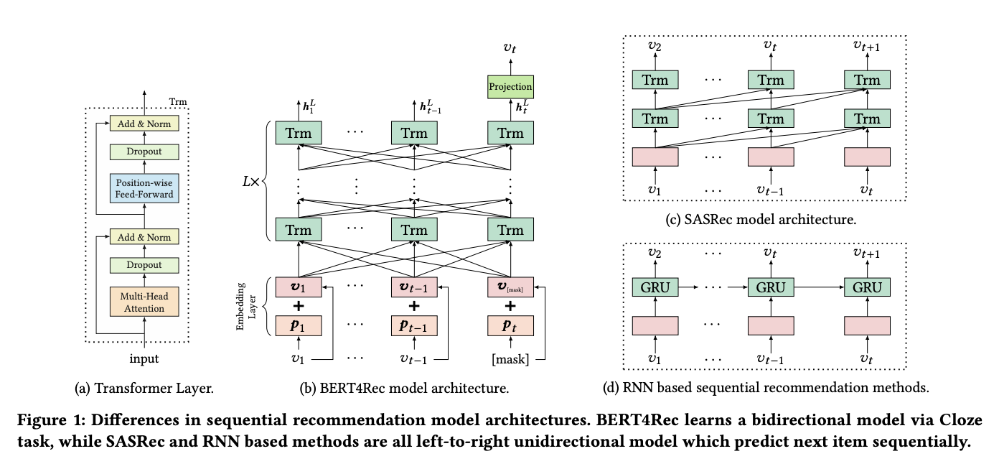

# BERT4Rec: Sequential Recommendation with Bidirectional Encoder Representations from Transformer

# 标题
- 参考论文：BERT4Rec: Sequential Recommendation with Bidirectional Encoder Representations from Transformer
- 公司：Alibaba
- 链接：https://arxiv.org/pdf/1904.06690
- Code：https://github.com/FeiSun/BERT4Rec
- 时间：2019
- `泛读`

# 内容

## 摘要
- 问题：只利用从左到右的单向模型的信息进行建模。存在以下限制。
  - 单向结构限制了用户行为序列中隐藏表示的能力，每个 item 只能对来自 previous items 的信息进行编码
  - 单项模型（RNN）通常假设数据上的严格排序的序列 ordered sequence ，这对于真实世界的 application 并不总是正确的
- 方法：
  - 提出了BERT4Rec 模型：
    - 采用深层的双向自注意力来对用户行为序列进行建模。
    - 为了避免信息泄漏并有效地训练双向模型，采用 Cloze 目标进行序列推荐，通过联合item左右的上下文来预测序列中随机masked item。

## 1 介绍
- 单项模型信息不够，并且不符合现实时间场景
- 问题：
  - 传统的序列推荐模型通常通过预测输入序列中每个位置的 next item 来从左到右进行训练。但是在深度双向模型中同时联合调节jointly conditioning左侧和右侧的上下文，会导致信息泄露，即允许每个位置间接 see the target item 。这可能会使预测未来变得没有价值。
- 方法：
  - BERT4Rec 引入了完形填空任务Cloze task 来代替单向模型中的目标（即，序列地预测 next item）。
  - 模型在输入序列中随机地mask 一些 item （即，用特殊 token [mask] 来替换它们）
  - 然后根据它们周围的上下文来预测这些 masked item 的 id。 
  - 通过这种方式，BERT4Rec 通过允许输入序列中每个 item 的 representation 同时融合左侧和右侧上下文，从而避免信息泄露并学习。
  - 除了训练双向模型之外，完形填空目标的另一个优点是：
    - 它可以产生更多的样本来在多个 epoch 中训练更强大的模型
    - 因为一次性可以mask多个 item，形成多次样本来训练，传统方法只有一个item
  - 完形填空任务的一个缺点是：
    - 它与最终任务（即序列推荐）不一致。为了解决这个问题，在测试过程中，在输入序列的末尾附加了特殊的 token [mask] 来指示我们需要预测的 item，然后根据其 final hidden vector 进行推荐。
    - 这样来达到永远是predict 最后一个特殊 mask 的item
- **主要贡献**
  - 提出通过完形填空任务用双向自注意力网络来建模用户行为序列。据作者所知，这是第一个将深度双向序列模型和完形填空目标引入推荐系统领域的研究。
  - 将BERT4Rec与 state-of-the-art 的方法进行比较，并通过对四个 benchmark 数据集的定量分析证明双向架构和完形填空目标的有效性。
  - 进行了一项全面的消融研究，从而分析所提出模型中关键组件的贡献。
- 本质上这是一个下一个item predict的任务（更像是LLM做推荐，和传统用户行为做encoder后再特征交叉不一样），用的是user sequence的行为数据来训练，同时证实了双向结构更能反应现实世界中用户的意图和行为

## 3 BERT4REC

### 3.1 Problem Statement
- 给定历史交互序列 S，序列推荐旨在预测用户 u 在 time step n_u + 1 即将交互的 item。该问题可以形式化为：建模用户 u 在 time step n_u + 1 所有可能交互的 item 的概率。

### 3.2 Model Architecture
- BERT赋予了直接捕获任何距离的依赖关系的能力。这种机制导致全局感受野
- 对比 Caser 这样的 CNN-based 方法通常具有有限的感受野。
- 并且与 RNN-based 方法相比，self-attention 可以直接并行化
- 其它的部分本质上就是BERT的结构，没什么改动

    
      <figcaption style="text-align: center">
        BERT4Rec_模型结构
      </figcaption>
    </img>
  

### 3.3 Transformer Layer
- Multi-Head Self-Attention：和BERT或者说Transformer一样，没区别
- Position-wise Feed-Forward Network：
  - PFFN(H_l) = [FFN(h_l_1)^⊤; . . . ; FFN(h_l_t)^⊤]^⊤
  - FFN(x) = GELU(x * W(1) + b(1) * W(2) + b(2)
  - 把原本的RELU变成了GELU，使用更平滑的激活函数
  - 加入Position-wise FFN，作用在注意力子层的输出，在每个位置独立separately 地、且等同地 identically 应用
- Stacking Transformer Layer

### 3.4 Embedding Layer
- h0_i = v_i + p_i
- v_i 是 item embedding
- p_i 是 position embedding
- 使用可学习的 positional embedding 而不是固定的正弦 embedding
  - 优点：
    - 获得更好的性能，对于位置的信息
  - 缺点：
    - 更多的参数，P ∈ R_N × d
    - 时间长度是固定的 N，超过部分必须截断，获取最近的 N 个时间序列

### 3.5 Output Layer
- 在 L 层 Transformer Layer 之后，我们得到输入序列的所有 item 的 final output H_l
- 假设我们在 time step t mask了 item v_t，然后我们根据 h_t_l(最终输出层 t 时间对应的 hidden state) 来预测被 masked 的 item v_t
- P(v) = softmax(GELU(h_L_t * W_P + b_P) * E^⊤ + b_O)
- W_P ∈ R_d × d
- E 是 ∈ R_v × d，是所有 item 的 embedding matrix
- 本质上就是一个带有GELU的MLP，然后去计算整个item 的 矩阵中每个出现的概率，多分类问题。和传统的 BERT/Transformer 做下一个单词预测是一样的思路，只是这个单词变成了 item。

### 3.6 Model Learning
- 训练阶段
  - 问题：
    - 由于是双向模型，每一个item的最终输出表示都包含了要预测物品的信息，这样就造成了一定程度的信息泄漏
  - 方法：
    - 因此采用 Cloze task 完形填空，也就是将输入序列中的p%的物品进行masked，然后根据上下文信息预测masked的物品。预测计算方法在3.5。
    - 本质上是借鉴了 BERT 里面的 Masked Language Model 的思路，随机的把输入序列的一部分掩盖（即变为[mask]标记），让模型来预测这部分盖住地方对应的物品。
    - 优点是：它可以生成更多样本来训练模型，因为可以组成 C_n_k 个组合，k是 mask 的个数。
- 测试阶段
  - 问题：
    - 训练和最终的序列推荐任务之间造成了不匹配 mismatch ，因为完形填空任务的目标是预测当前的 masked item ，而序列推荐任务的目标是预测未来
  - 方法：
    - 将特殊 token "[mask]" 附加到用户行为序列的末尾，然后根据该 token 的 final hidden representation 来预测 next item。
    - 也就是只预测最后一个item，也就是形成了下一个item给用户推荐什么的概念
    - **这里有个思考**：
      - mask 输入序列中最后一个 item 的样本是否可以给予更大的样本权重？这样可以让模型更 focus 这类样本，从而缓解训练阶段和测试阶段不匹配的问题。
      - 本质上是为了满足机器学习有一个核心假设：训练样本和测试样本的分布要保持一致

### 3.7 Discussion
- 与 BERT 有几个不同之处：
  - 最关键的区别是：BERT4Rec 是用于序列推荐的端到端模型，而 BERT 是用于 sentence representation 的预训练模型。BERT 利用大规模的、任务无关的语料库为各种文本序列任务训练 sentence representation 模型，因为这些任务共享相同的、关于语言的背景知识。然而，这个假设在推荐任务中并不成立。因此，我们针对不同的序列推荐数据集，端到端地训练 BERT4Rec 。
  - BERT 不同，我们移除了 next sentence loss 和 segment embedding，因为在序列推荐任务中， BERT4Rec 仅将用户的历史行为建模为一个序列。
- 未来：
  - 将丰富的 item 特征（如商品的类别和价格、电影的演员表）引入到 BERT4Rec 中，而不仅仅是建模 item ID 。**这个思考和其它类型的sequence 模型不谋而合**
  - 将用户组件引入到模型中，以便在用户有多个 session 时进行显式的用户建模。

## 4 EXPERIMENTS

### 4.1 Datasets
- Amazon Beauty
- Steam
- MovieLens

### 4.2 Task Settings & Evaluation Metrics
- 采用 leave-one-out 评估（即，next item 推荐）任务
- 训练：
  - 对于每个用户，我们将行为序列的最后一个 item 作为测试数据，将倒数第二个 item 作为验证集，并利用剩余的 item 进行训练。
- 评估：
  - 将测试集中的每个 ground truth item 与 100 个随机采样的、用户未与之交互的 negative item 进行配对。
  - 为了使采样可靠和具有代表性，这 100 个 negative item 根据流行度进行采样。
  - 任务变成将这些 negative item 与每个用户的 ground truth item 进行排名。
  - 本质上是排序的 metric，这里之应用在test 测试集上面，训练集还是一样的 mask language model 思路
- 指标：
  - NDCG
  - MRR 等价与 MAP
  - 因为仅有一个 ground truth item，因此 HR@k 等价于 Recall@k 且与 Precision@k 成正比

### 4.3 - 4.8
- 详细见paper

## 5 CONCLUSION AND FUTURE WORK
- 总结：
  - 将自然语言处理领域的深度双向自注意力架构成功迁移到推荐系统领域，提出了 BERT4Rec 模型。 
  - 采用 Cloze 任务 作为训练目标，通过随机遮蔽序列中的物品并利用其全部上下文进行预测，来学习更强大的序列表示。
- 未来：
  - 超越仅使用物品ID，探索融入更丰富的物品侧信息。比如这里推荐系统的产品的类别和价格，电影的演员阵容。
  - 在用户行为跨越多个会话时，在模型中引入显式的用户建模组件。也就是加入 user 的本身信息，类似特征交叉里面的context 特征。

# 思考

## 本篇论文核心是讲了个啥东西
- 提出了一个双向自注意力架构也就是BERT，同时成功适用于推荐系统，作为下一个推荐item predict的任务。
- 提出了用完形填空的task来实现训练，学习用户 sequence 的信息。同时利用其全部上下文进行预测。

## 是为啥会提出这么个东西，为了解决什么问题
- 问题：
  - 之前的sequence 模型都是单项的，从左到右，但是现实世界用户的 sequence 行为并不是严格的这样的顺序关系。
  - 单项模型会限制表达能力
- 方法：
  - 采用BERT的思路，双向训练
  - 采用 mask language model 思路，完形填空 task，来达到学习上下文全部信息，同时用全部sequence来predict 下一个 item

## 为啥这个新东西会有效，有什么优势
- 对比其它的GRU4Rec 类的模型
  - 本质上就是利用了 BERT的思路，双向学习 + 利用上下文实现完形填空的思路学习 sequence，得到的信息更丰富
  - 同时避免了 RNN 类型的模型缺点，过度依赖相邻的 sequence的 相关性，过度强调顺序
- 对比其它 DIN，DIEN，DSIN，BST 类型的模型
  - 本质上不是同一个思路，这里更像是生成式思路，预测下一个 item

## 与这个新东西类似的东西还有啥，相关的思路和模型
- 一些利最新的LLM 做推荐 的模型

## 在工业上通常会怎么用，如何实际应用
- feature engineering:
  - 同理也可以参考把更多的关于listing/item 的信息融合进去，不再只是id
  - 同时可以考虑把使用物品、用户属性和场景的信息，加入进去，本质上把CTR预测的思路加进去
- BERT：
  - 这里已经在BST里面实现了，也证明了双向模型做判别式模型，相当于encoder，效果也很好
- mask language model，完形填空思路
  - 可以参考DIEN里面，利用sequence的特性，增加一个辅助loss，也就是把本文的完形填空思路变成辅助loss，放到判别式模型里面去，可能能更好的学习sequence的兴趣相关性。

## 参考链接
- https://www.huaxiaozhuan.com/%E6%B7%B1%E5%BA%A6%E5%AD%A6%E4%B9%A0/chapters/14_session_based_rec3.html
- https://zhuanlan.zhihu.com/p/263014307

