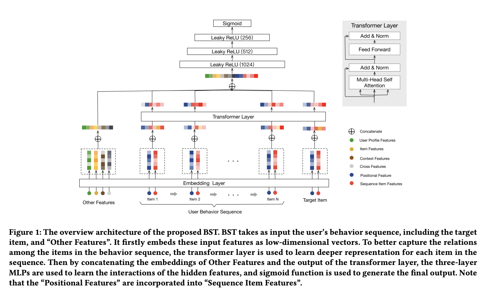

# Behavior Sequence Transformer for E-commerce Recommendation in Alibaba

# 标题
- 参考论文：Behavior Sequence Transformer for E-commerce Recommendation in Alibaba
- 公司：Alibaba
- 链接：https://arxiv.org/pdf/1905.06874
- Code：https://github.com/reczoo/FuxiCTR/blob/main/model_zoo/DIEN/src/DIEN.py
- `泛读`

# 内容

## 摘要
- 问题：
  - 目前特征交叉方向存在一些使用用户行为的CTR预测方法，这些基本上都是转化成embedding后直接拼起来送进模型
  - 没有模型考虑用户的历史行为序列特征，同DIN，DIEN，DSIN提到的出发点
- 方法：
  - 提出了BST模型：
    - 提出用Transformer充分挖掘用户的行为序列，实现对用户行为序列的建模。
  - 已上线，并且CTR提升明显，离线AUC提升0.35%，线上CTR提升3%

## 1 介绍
- 之前DIN模型的问题：
  - 同DIEN的动机，DIN虽然有考虑用户历史行为的注意力机制，但是是无序的，没有sequence的概念在里面
  - 但是用户行为的顺序性质没有被考虑
- 之前WDL类型模型的问题：
  - 没有考虑用户行为顺序
- BST的改进：
  - 引入了Transformer，对位置编码做了更改，通过Multi-head Attention的方式更好反映用户的兴趣变化过程。

## 2 ARCHITECTURE 模型结构

    
      <figcaption style="text-align: center">
        BST_模型结构
      </figcaption>
    </img>
  

## 2.1 Embedding Layer
- 同WDL模型一样，其它所有feature都embedding后 concatenate 起来
- 对用户行为序列以及目标item特征有两种：
  - item本身特征（红色）
    - item_id
    - category_id
    - 其它item特征太多，计算成本过高
    - 这里paper没有解释怎么融合这两个特征，猜测可能是直接拼接（concat），最大限度保留原始信息
  - 序列位置特征（蓝色）
    - 反映整体/相对信息位置
  - **这两种特征最后通过 concatenate 变成序列特征中的一个行为**
- Positional embedding：
  - 没有采用NLP里面的正弦余弦位置编码
  - 直接输入位置信息，以时间间隔为位置信息，文中称这样的设计取得了比正余弦更好的效果。
  - pos(v_i) = t(v_t) - t(v_i)
  - 其中t代表当前时刻，i代表历史行为发生时刻
  - t(v_t) 表示当前候选item被推荐的时刻，t(v_i) 表示历史行为发生的时刻，应该是个标量
  - 对于候选item的位置信息，推测应该直接是0，因为没有时间间隔
  - 虽然文中说的是没有用NLP里面正弦余弦位置编码，但是open source里面实现的方式都是采用这个方法

## 2.2 Transformer layer
- Self-attention layer：
  - 照搬NLP里面的多头自注意力机制，只是输入是 2.1 里面输出的item embedding （item特征 + 序列位置特征）
- Point-wise Feed-Forward Networks：
  - 同样与Transformer中一致，加入FFN网络增强非线性，加入LayerNorm、ResNet、dropout结构，并将原始的Relu激活函数改为leakyRelu
- Stacking the self-attention blocks：
  - 通过堆叠多个上述的self-attention block，得到最终的多层结构
- 论文中实验说明，只需要一层上述结构就能获得最好的结果，其可能的原因是用户行为序列间的依赖关系（对比NLP中的整句话）没有那么强。且信息并不多。

## 2.3 MLP layers and Loss function
- 最后叠加了3层(神经元个数1024、512、256)前向网络
- 最后由sigmoid激活后输出在0-1区间，损失函数选择交叉熵损失函数，Adagrad为优化器。

## 3 EXPERIMENTS 实验

### 3.1 Settings
- Dataset
  - 前7天作为training，最后一天作为test
- Baselines
  - WDL
    - 同DIN paper里面一样，aggregate 用户历史行为embedding，变成一个值后放进model
  - DIN
- Evaluation metric
  - offline
    - AUC
  - online：
    - CTR
    - RT：time cost of generating recommending results for a given query (响应时间)，用于衡量模型效率
- Settings
  - embedding size: 4 ∼ 64
  - batch size: 256
  - head number: 8
  - dropout: 0.2
  - sequence length: 20
  - #epochs: 1
  - transformer block: 1
  - queue capacity: 1024
  - MLP Shape: 1024 * 512 * 256
  - learning rate: 0.01

### 3.2 Results Analysis
- AUC of offline experiment is improved from 0.7734 (WDL) and 0.7866 (DIN) to 0.7894 (BST). 
- From our practical experience, even the small gain of offline AUC can lead to huge gain in online CTR

## 4 RELATED WORK
- 大部分CTR模型都是之前都是
  - DeepFM, XDeepFM, Deep and Cross networks
- 序列模型提出
  - DIN
  - BST
    - 对比DIN，BST更能学习序列信息

## 5 CONCLUSION
- Transformer有强大的学习用户行为序列的能力

# 思考

## 本篇论文核心是讲了个啥东西
- 提出用Transformer充分挖掘用户的行为序列，实现对用户行为序列的建模。

## 是为啥会提出这么个东西，为了解决什么问题
- 问题：
  - 基于DIN的问题，将用户的历史行为看作是一个无序的集合，忽略了行为之间的时序依赖关系
- 方法：
  - 提出用 Transformer 来学习行为之间的时序依赖关系，在 NLP 里面已经证实了效果很好
  - 用 position embedding 来实现顺序的效果，提出直接把行为发生的时间点的差值放进model（这里如何拼接起来的还需要再看看源码），而不是用 NLP里面的正弦余弦

## 为啥这个新东西会有效，有什么优势
- 对比传统 W&D 之类的特征交叉模型
  - 和DIN一样，更多的关注用户历史行为的影响和演化过程
- 对比DIN
  - 更加关注用户行为的有序性

## 与这个新东西类似的东西还有啥，相关的思路和模型
- 系列的sequence model，本质上都是找用户的兴趣演变过程和候选ID的关系
  - DSIN
  - 同DIN

## 在工业上通常会怎么用，如何实际应用
- 十分建议尝试一下在搜索里面使用，同DIN原理，之前搜索过的商品行为会对之后的选择有影响
- 如何构建sequence数据集这里包括如何选择负样本也是个问题，搜索中用户的行为类型更多，每一种类型的行为影响会不一样
- 目前来看所有行为序列的paper都遵守三个步骤：
  - (1) 选取合适的出发点角度对用户历史行为抽象
  - (2) 通过这种抽象完成历史行为的特征构造
  - (3) 使用NLP或时序相关理论算法从历史行为中学习到“兴趣转化”高层信息
  - 前两个步骤应该是最难的，回归上面问题，如何构建用户历史行为
- 同时搜索里面可能需要引入query 进 sequence 来表达兴趣（搜索）的演变过程
- 最后模型会很变的很大，如何落地也是个问题
- 另外是否用户行为一定具有顺序性，需要根据业务来分析

## 参考链接
- https://zhuanlan.zhihu.com/p/433145820
- https://www.zhihu.com/tardis/zm/art/96338316?source_id=1003

