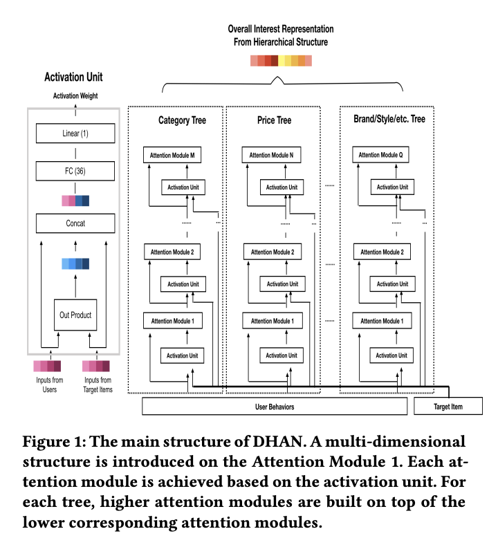
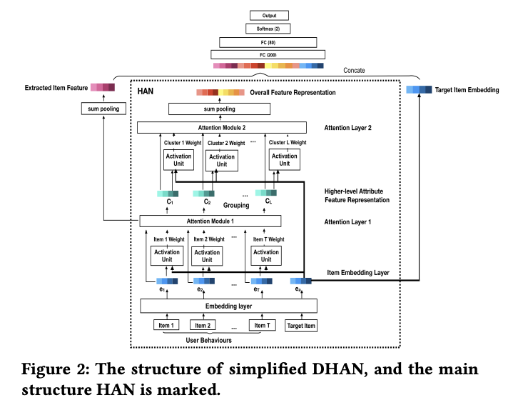

# Deep Interest with Hierarchical Attention Network for Click-Through Rate Prediction

# 标题
- 参考论文：Deep Interest with Hierarchical Attention Network for Click-Through Rate Prediction
- 公司：Alibaba
- 链接：https://arxiv.org/pdf/2005.12981
- Code：https://github.com/stellaxu/DHAN/tree/master
- 时间：2020
- `泛读`

# 内容

## 摘要
- 问题：
  - 用户兴趣天然具有层次性（例如，先喜欢“电子产品”，再细化到“某品牌手机”），但DIN等模型未能有效捕捉这种结构。
- 方法：
  - 提出DHAN模型，核心思想构建一个层次化的注意力网络。
    - 多层注意力：底层注意力关注具体物品，高层注意力关注更抽象的层次（如品类、品牌）。
    - 扩展机制：支持从单一底层概念（如一个品牌）扩展到多个高层概念（如该品牌下的多个产品），实现“一对多”的层次关系建模。
    - 本质上和DIN的思路一样，还是计算attention score，但是计算的更精细（在不同的类别：category, price or brand，建模用户的兴趣）
- 结果：
  - 在AUC指标上，大幅超越DIN（提升12%-21%），并小幅领先于另一个强基线DIEN（提升1%-1.7%）。
- 未来：
  - 将 DHAN（擅长层次兴趣） 与 DIEN（擅长时序兴趣） 相结合，构建更强大的用户兴趣模型。
  - 本质上是考虑用户行为的分层演化，值得尝试

## 1 介绍
- 问题：
  - 现有模型（如WDL, PNN）缺乏对用户历史兴趣的深入挖掘。
  - DIN模型引入了注意力机制，根据候选广告激活相关历史行为，是一大进步，但它忽略了用户兴趣天然的层次性。
  - 比如：用户通常先对高级别属性（如类别、价格或品牌）产生兴趣，然后逐渐细化到低级别属性或具体物品
- 方法：
  - 提出了 DHAN 模型，其核心思想是显式地建模用户兴趣的多维与层次结构。
  - 水平方向（多维）：同时从多个维度（如品类、品牌、价格）理解用户兴趣。
  - 垂直方向（分层）：在每个维度内，构建从抽象（高层级）到具体（低层级） 的兴趣层次。
  - 通过一个层次化的注意力网络来自适应地为不同层级、不同维度的兴趣分配不同的重要性。
- **主要贡献**：
  - 仅简化的DHAN模型（仅使用“类别”一个维度、两个层级），在AUC指标上也大幅超越了DIN。
  - 对比专注于兴趣时序演化的DIEN模型相比，DHAN也实现了小幅但稳定地提升，证明了层次建模本身的价值。
  - 未来将 DHAN（层次兴趣） 与 DIEN（时序兴趣） 相结合，是未来一个非常有潜力的研究方向。

## 2 DEEP INTEREST WITH HIERARCHICAL ATTENTION NETWORK

### 2.1 The Structure of DHAN

    
      <figcaption style="text-align: center">
        DHAN_模型结构
      </figcaption>
    </img>
  

- 扩展机制：
  - 作用：用户行为和目标物品扩展为其在多个维度（如类别、品牌等）上的表征。
  - 目的：实现从“单一物品”到“多维属性”的一对多映射，为多维兴趣建模奠定基础。
- 树状层次结构：
  - 形式：为每个维度单独构建一个像树一样的层次结构，从具体的“物品”或“低层属性”作为叶子节点，逐步向上抽象到“高层属性”作为根节点。
  - 运作方式：使用一系列堆叠的注意力模块自底向上地计算。每个高层节点的表征都由其对应的下层节点通过注意力机制聚合而来。
  - 流程：
    - 同时在每个注意力模块中，都使用一个激活单元（类似于DIN）来根据当前的目标物品动态计算注意力权重。
    - 在最终层，将所有层次和维度的信息融合成一个全面且精准的整体用户兴趣表征。
  - 优势：
    - 这种结构使得模型能够自适应地判断：在面对不同候选物品时，用户的哪个维度兴趣、哪个层次（是具体的品牌还是抽象的风格）更为重要。
  - 本质上就是构建多个维度（兴趣类型，类别，价格，品牌之类）的独立的user sequence，每个sequence构建成独立的树，每棵树表示这个类别从最小到最大级别的概念。然后每棵树，每层都要和target item计算activation score，再计算attention score。
  - 本质上就是把用户的兴趣过程划分的更细，同时每个兴趣划分的更深。来逐一学习和候选item的关系。并融合。

### 2.2 The Structure of Simplified DHAN

    
      <figcaption style="text-align: center">
        DHAN_简化的DHAN结构
      </figcaption>
    </img>
  

- 简化版本的DHAN，具有 one dimension and two attention levels，也就是一个维度（类别），两层注意力机制。
- embedding 层 （物品 level的表示）：
  - embedding of user behaviors 是 E = {e1, e2, · · · , et, · · · , eT }, where et ∈ R_d, T 是 number of user’s historical behaviors.
  - Target Item is its item id, and the embedding of target item is e_a where e_a ∈ R_d
- 负对数似然损失函数进行CTR预测模型训练
- Hierarchical Attention Network (HAN) 
  - 第一阶段（物品 -> 属性）：使用注意力机制将多个具体物品的信息聚合为一个属性级的概括性表征。
    - 计算每个embedding 的 weight W = {w1,w2, · · · ,wt, · · · ,wT }，通过 activation unit（类似DIN的做法，计算每个user sequence里面和后续item的weight）
    - 把上面得到的 E，进行分组，得到 I = {I1, I2, · · · Il, · · · , IL} L 个组
    - Il = {il_1, · · · ,il_X}，每一组里面由长度为x个的 user sequence 组成。
    - wl = {wl_1, · · · ,wl_X}，每组内每个行为对应的权重，来自上面计算出来的 W （由activation unit计算出来）
    - cl = (wl_1 * il_1 + · · · + wl_X * il_X)/sum(X_k=1(wl_k))，计算出 high level 的 cluster l的特征表示。
    - 本质上就是先计算每个行为和后续item的权重，再把embedding进行分组，然后每组内再进行基于前面计算的对应的权重进行加权融合归一化。然后得到 L 个 cluster 的全新的high level 的属性级的概括性表征。
  - 第二阶段（属性 -> 整体用户兴趣）：再次使用注意力机制，将多个属性的表征融合为一个整体用户兴趣表征。
    - Wc = {wc_1 ,wc_2 , · · · ,wc_l , · · ·,wc_L}，同第一个权重的计算方式，通过 activation unit（类似DIN的做法，计算每个cluster里面和后续item的weight），用于学习属性和候选item的关系。
    - x = sum(L_l=1(wc_l * c_l)，最终的整体用户兴趣就是上面计算加权后再和cluster进行加权融合
    - **本质上就是分层的进行不停的加权融合，每一层学习一次和候选item的关系。还是pooling的思路，只是多几次分层分组pooling，多学几层和候选item的关系**
- 问题：
  - 层次结构可能带来过中心化风险，即模型过早地过于关注少数几个属性，导致训练陷入局部最优。
- 解决方案：
  - 采用特征拼接作为补救措施。将 HAN 得到的层次化表征最终的 x 与原始的项目级特征 i_x（上面的I * W 后的结果，也就是DIN的思路）以及目标物品嵌入 e_a 拼接在一起，再输入MLP。
  - 这确保了模型在利用高层次抽象信息的同时，也能接触到更原始、更细粒度的信息，从而增强表达能力和训练稳定性。
  - 这个操作基本上很多CTR model 里面都会用到，也就是拼接原始信息，保证不要过度学习。

## 3 EXPERIMENTS
- 对比模型
  - DIN
  - DIEN
  - WDL
  - PNN

### 3.1 Comparison with DIN
- much better

### 3.2 Comparison with DIEN
- slight better，因为 DIEN 有兴趣提取层，学习了时间顺序在用户行为层次

## 4 CONCLUSION
- 总结：
  - 提出一个DHEN框架，可以适用于多个维度（不同的兴趣特征）任意深度（单一兴趣特征的多个层次）的兴趣层次建模
- 未来：
  - 方向一（强强联合）：将 DHAN（层次性） 与 DIEN（演化性） 相结合，构建更强大的统一模型。这是最有潜力的方向。
  - 方向二（自动化）：从依赖预定义维度（如人工选择的品类、品牌）升级到自动发现对用户重要的兴趣维度，实现更智能的建模。

# 思考

## 本篇论文核心是讲了个啥东西
- 提出一个框架DHAN模型，核心思想构建一个层次化的注意力网络。
  - 多层注意力（depth - level）：底层注意力关注具体物品，高层注意力关注更抽象的层次（如品类、品牌）。
  - 扩展机制（多个维度）：支持从单一底层概念（如一个品牌）扩展到多个高层概念（如该品牌下的多个产品），实现“一对多”的层次关系建模。
- 本质上和DIN的思路一样，还是计算attention score，增加了两个方向的计算，多个维度，和多层注意力。DIN相当于只有一层注意力同时一个维度。

## 是为啥会提出这么个东西，为了解决什么问题
- 问题：
  - DIN模型只学到了最小单位（物品）的兴趣层次，不是很适合泛化在inference阶段
  - 同时用户兴趣天然具有层次性（例如，先喜欢“电子产品”，再细化到“某品牌手机”），但DIN等模型未能有效捕捉这种结构。
- 方法：
  - 提出一个多维度，多层子（多层注意机制）的框架DHAN，可以学习到更多的同一兴趣不同分层上面的信息，比如从用户喜欢某个品牌的手机 ---> 到手机本身这个item

## 为啥这个新东西会有效，有什么优势
- 对比DIN
  - 多了一个分层的概念，学习到的信息更多，更广泛，泛化能力好
- 对比DIEN
  - 同上，但是没有学到兴趣的演化过程，所以相比增加并不大

## 与这个新东西类似的东西还有啥，相关的思路和模型
- 系列的分层的sequence model

## 在工业上通常会怎么用，如何实际应用
- activation unit 和 DIN 基本一样，可以直接照搬使用
- 可以考虑同一兴趣维度的多层的结构，不需要太多的effort，但是可能不能太深（2层足以）

## 参考链接
- https://zhuanlan.zhihu.com/p/266715978

