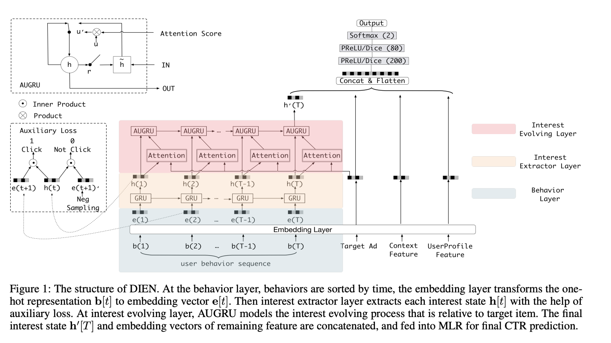
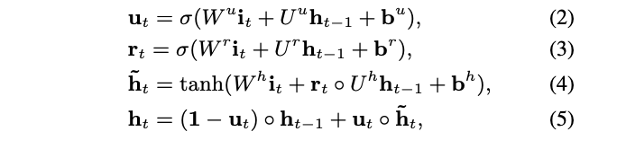
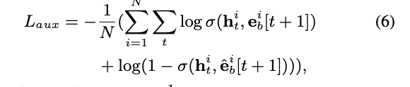
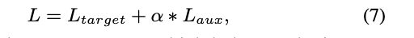
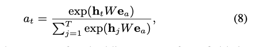

# Deep Interest Evolution Network for Click-Through Rate Prediction

# 标题
- 参考论文：Deep Interest Evolution Network for Click-Through Rate Prediction
- 公司：Alibaba
- 链接：https://arxiv.org/pdf/1809.03672
- Code：https://github.com/reczoo/FuxiCTR/blob/main/model_zoo/DIEN/src/DIEN.py
- 时间：2019
- `泛读`

# 内容

## 摘要
- 问题：
  - 目前特征交叉方向存在一些使用用户行为的CTR预测方法，但是这些方法缺乏对具体行为背后潜在兴趣的专门建模。
  - 目前较少的工作考虑了兴趣的变化。
- 方法：
  - 提出了DIEN模型：
    - 提出兴趣抽取层，来从用户的历史行为序列中获取与时间有关的兴趣，同时一个辅助损失函数在每一步的学习中进行监督
    - 提出兴趣进化层，注意力机制被嵌入到序列结构中，在兴趣进化过程中，相关兴趣的作用增强
  - 线上得到 20.7% 提高在 CTR

## 1 介绍
- 之前DIN模型的问题：
  - DIN模型强调了用户兴趣的多样性，采用基于注意力机制的模型来获取目标项目的相关兴趣
  - DIN模型直接将用户的行为视作用户的兴趣。但是用户的潜在兴趣是很难通过显性的用户行为所反映的。
  - 用户的兴趣是不断变化的，获取动态变化的兴趣对兴趣表示是十分重要的
  - 换句话来说DIN模型将用户的历史行为看作是一个无序的集合，忽略了行为之间的时序依赖关系。用户的兴趣不仅是多样的，更是在持续演化的。
- DIEN的改进：
  - 1）兴趣抽取层，主要作用是通过模拟用户兴趣迁移过程，抽取用户兴趣。
    - GRU进行行为建模。遵循的原则是兴趣直接导致了连续的行为，提出了辅助损失（auxiliary loss）即使用下一个行为来监督当前的隐藏状态
  - 2）兴趣进化层，主要作用是通过在兴趣抽取层基础上加入注意力机制，模拟与当前目标广告相关的兴趣进化过程。
    - 建立了与目标项目相关的兴趣进化轨迹模型，基于从兴趣抽取层获得的兴趣序列，
    - 另外设计了带有注意力机制的更新门的GRU（attentional update gate, 简称AUGRU)

- **主要贡献**：
  - 在电商系统中关注了兴趣进化现象，提出了一个新的网络架构对兴趣进化过程进行建模。兴趣进化模型使兴趣表示更丰富，CTR预测更准确。
  - 与直接以行为为兴趣不同，DIEN中专门设计了兴趣抽取层。针对GRU的隐藏状态对兴趣表示较差的问题，提出了一种辅助损失。
  - 设计了兴趣进化层。兴趣进化层有效地模拟了与目标项目相关的兴趣进化过程。

## 2 相关工作
- MLP, FM, W&D, PNN 等特征交叉模型：
  - 增强了特征交叉，提高了特征表达，但是缺乏用户兴趣的表示能力
- DIN：
  - 提出一个可以得到历史行为和候选广告的attention的机制
  - 但是历史行为序列之间的依赖关系无法得到
- DREAM：
  - 推荐系统里面用RNN来动态表达每个用户和全局历史购买行为的关系
  - 一方面用RNN的hidden state 来表示用户潜在的兴趣，缺乏特殊的监管方式，也就是缺乏辅助loss
  - 另一方面RNN的依赖性取决于相邻的用户行为连续的平等的，但是用户的行为演变可能多变的，每个行为背后的兴趣演化可能有它独立的track。
  - 用RNN只能得到一个固定的用户历史行为演化track，可能会让真正的用户的兴趣track被打断
  - 换句话来说，用户的兴趣行为可能在整个过程中有好几次track，如果都按照NLP里面的思路组成sequence的话，可能有的兴趣演化track已经被丢弃了到最后的hidden state的时候
- QA领域，DMN+模型：
  - 引入attention机制去学习输入sequence的位置和顺序，提出GRU (AGRU)
  - 基于上面这个paper的概念和模型，提出DIEN的AUGRU，能学习到积极的学习到相对的兴趣演化

## 3 Deep Interest Evolution Network

## 3.1 基础模型回顾
先回顾一下基础模型

### Feature Representation
- 四种类型的特征（用户信息，用户行为，广告和上下文信息）。广告设为目标。 每个种类的特征都有几个字段(fields)
- 用户信息包含性别、年龄等等
- 用户行为包含用户访问过的物品编号
- 广告包含广告id，商店id等
- 上下文包含设计类型id，时间等等。
- 每个特征可以被编码成one-hot表示，例如女性可以被编码成[0,1]。
- 本质上和DIN一样，先one-hot，然后转化成embedding

### Embedding
特征的每个字段（field）对应一个embedding矩阵， 同DIN

### Multilayer Perceptron (MLP)
- 首先，将一个类别的（上述提到过的四种类型）embedding向量输入进池化操作。
- 然后将来自不同类别的所有这些池化向量连接起来。
- 最后，将连接后的向量输入MLP进行最终预测。
- 同DIN，也是最传统的deep learning 做CTR的方式

### Loss Function
- negative log-likelihood function

## 3.2 DIEM 模型

    
      <figcaption style="text-align: center">
        DIEN_模型结构
      </figcaption>
    </img>
  

- DIEN由几个部分组成：
  - 第一，所有的特征都由embedding层进行转换。
  - 第二，DIEN采用两个步骤获得兴趣进化：
    - i) 兴趣抽取层基于行为序列抽取兴趣序列，兴趣进化层是对与目标项目相关的兴趣进化过程进行建模。
    - ii) 然后，将最终兴趣的表示和嵌入向量，如广告、用户信息、上下文等进行连接。
  - 最后，将连接后的向量输入MLP进行最终预测。

### Interest Extractor Layer 兴趣抽取层
- 选用GRU：
  - 电子商务系统中的用户行为丰富，即使在很短的如两周这样的时间，其点击这样的历史行为序列也很长。平衡效率和性能。
  - GRU克服了RNN模型的梯度消失问题，并且速度比LSTM快。

    
      <figcaption style="text-align: center">
        DIEN_GRU公式
      </figcaption>
    </img>
  

- 公式解读
  - σ是sigmoid激活函数
  - o是element-wise product， 
  - W_u, W_r, W_h - (n_h, n_i)
  - U_u, U_r, U_h - (n_h)
  - n_h 是隐藏层的大小
  - n_i 是输入层的大小
  - i_t 是GRU的输入
  - i_t = e_t 代表用户产生的第t个行为的embedding向量
  - h_t 是第t个隐藏状态

- 辅助loss
  - 问题：
    - h_t只能表示邻居行为的依赖性
    - 最终的label只能预测target和最终兴趣的关系
    - 历史兴趣状态没办法得到合适的监督和使用
    - 然而历史信息的每一步都可能导致直接的连续用户行为
  - 方法：
    - 用 b_t+1 的状态来监督 h_t
    - 使用下一个实际的行为作为正实例
    - 还使用从除去 click 以外的 item set 里面取样负实例
    - 本质上就是 N 对 pair 的binary classification

    
      <figcaption style="text-align: center">
        DIEN_辅助loss公式
      </figcaption>
    </img>
  

    
      <figcaption style="text-align: center">
        DIEN_全局loss公式
      </figcaption>
    </img>
  

- α 是超参数，用来平衡兴趣表达和CTR最终预测
- 总结：
  - 帮助GRU的隐藏层表达兴趣
  - 降低了back propagation 的困难度，当GRU模型有长历史行为的时候
  - 提供了更多的语义信息对于embedding，构建更好的embedding matrix

### Interest Evolving Layer 兴趣进化层
- 兴趣提取层的不足：
  - 兴趣的演化并不总是平滑的，常常会伴随着兴趣漂移（Interest Drifting）现象，即用户可能在不同的兴趣点之间快速切换。
  - 只用GRU来建模这个兴趣序列，不相关的历史兴趣（漂移）可能会干扰对当前主要兴趣演化的判断。
- 兴趣进化层的优点：
  - 兴趣进化模块可以为最终兴趣的表示提供更多的相关历史信息
  - 根据兴趣进化趋势预测目标项目的点击率比较好
  - 用每一个step的兴趣信息和target计算权重，能更好的解决兴趣漂移的问题，本质上就是DIN的思路，每个兴趣对最终label都有不同的权重贡献
- 解决方式：
  - 结合了注意力机制中的局部激活能力和GRU的序列学习能力来实现建模兴趣演化的目标
  - 提出attention score在当前状态h_t和最终target之间的关系，公式如下
  - e_a 是从广告中的嵌入向量的连接
  - W - (n_h, n_a)
  - n_h 是隐状态的维数
  - n_a 是广告嵌入向量的维数
  - 这一层的GRU的输入就是上一层GRU的输出，i_t = h_t，注意这里的 i_t 是上一层的输出并且会被下面attention score更新，具体更新方式见下文详解

    
      <figcaption style="text-align: center">
        DIEN__兴趣进化层权重公式
      </figcaption>
    </img>
  

- 如何融合注意力机制中的局部激活能力和GRU的序列学习
  - GRU with attentional input (AIGRU)
    - AIGRU使用注意力评分影响兴趣进化层的输入
    - i_t = h_t * a_t
    - h_t 是兴趣抽取层的GRU的第t个隐藏状态
    - i_t 是用于兴趣进化层第二个GRU的输入
    - a_t 是当前状态下和target的注意力
    - 本质上是直接将attention系数和输入相乘。在理想的情况下，相关兴趣越少，输入值越小。
    - 但是实际效果并不好，因为即使是零输入也会改变GRU的隐藏状态，所以相对兴趣越少，也会影响兴趣进化的学习
  -  Attention based GRU(AGRU)
    - 将attention系数来替换GRU的update gate，也就是GRU公式里面的U_t，直接对隐状态进行更新
    - h_t = (1 - a_t) * h_t-1 + a_t * h~_t
    - h_t, h_t-1, h~_t 都是t时刻的隐藏状态
    - 将注意力嵌入进GRU改善了注意力机制的影响，并且AGRU克服了AIGRU的缺点
    - 本质上注意力越大相对兴趣越大的，之前的状态就会遗忘更多，反之保留更多
  - GRU with attentional update gate (AUGRU)
    - 虽然AGRU使用attention系数来直接控制隐状态的更新，但是它使用了一个标量 a_t 来代替了update gate - U_t，也就是忽略了不同维度重要的区别。会丢失信息。
    - 提出用 a_t来实现，attentional update gate的GRU结构
    - U~_t = a_t * U_t
    - 与候选广告越相关的兴趣，其对应的 a_t 越大，其信息在更新门中的权重也越大，从而能更顺畅地在序列中传递
    - 反之，不相关的兴趣（漂移）其影响力就会被削弱。这使得模型能够聚焦于与当前推荐任务最相关的兴趣演化路径。

## 3.3 Experiments 实验
- Public Dataset
  - Amazon Dataset，把review看做行为，按时间排序用户的行为。用t-1时刻的用户行为来预测t时刻用户是否会写评论这个行为
- Industrial Dataset
  - 用至少49天内被点击过的广告的这个行为作为target也就是 positive label
  - 从这个广告被点击后，往前数14天作为用户历史行为，历史行为长度最大为50
  - 在同一时间点没有被点击的作为辅助loss的 negative label，不过这里并没说明是单次下还是，这段时间内
- Compared Methods
  - BaseModel：embedding和DIEN一样，但是历史行为用sum pooling
  - Wide&Deep：deep和base model一样，wide是线性模型
  - PNN
  - DIN
  - Two layer GRU Attention
- Result
  - 在两个数据集上都很明显的，DIEN提升很多，具体数据见论文 Results on Datasets
- Online Serving & A/B testing
  - CTR 20.7%
- Online deploy，为了降低延迟，线上优化
  - element parallel GRU & kernel fusion，每一个GRU的hidden state可以parallel计算
  - Batching: adjacent requests from different users are merged into one batch to take advantage of GPU
  - Model compressing  Rocket Launching：压缩模型到更小的模型，但是performance很接近，比如 GRU的hidden state 维度从 108 压缩到 32
  - Latency 从 33ms 降低到 6.6ms，QPS 提升到 360

## 4 Conclusion
- GRU + auxiliary loss，兴趣提取层，帮助发现用户兴趣背后的sequence，辅助loss帮助监督
- AUGRU，兴趣进化层，捕获与目标商品相关的兴趣及其演变过程，降低了兴趣漂移的影响

# 思考

## 本篇论文核心是讲了个啥东西
- 提出兴趣抽取层，主要作用是通过模拟用户兴趣迁移过程，抽取用户兴趣。
  - GRU进行行为建模。遵循的原则是兴趣直接导致了连续的行为，提出了辅助损失（auxiliary loss）即使用下一个行为来监督当前的隐藏状态
- 提出兴趣进化层，主要作用是通过在兴趣抽取层基础上加入注意力机制，模拟与当前目标广告和目标商品相关的兴趣进化过程。
  - 建立了与目标项目相关的兴趣进化轨迹模型，基于从兴趣抽取层获得的兴趣序列，
  - 另外设计了带有注意力机制的更新门的GRU（attentional update gate, 简称AUGRU)，捕获与目标商品相关的兴趣及其演变过程的注意力

## 是为啥会提出这么个东西，为了解决什么问题
- 问题：
  - 基于DIN的问题，将用户的历史行为看作是一个无序的集合，忽略了行为之间的时序依赖关系。用户的兴趣不仅是多样的，更是在持续演化的。
- 贡献：
  - 提出兴趣抽取层，解决了DIN的问题，模拟了一个用户兴趣行为的进化顺序过程，同时引入辅助loss，帮忙监督hidden state的演化
  - 提出兴趣进化层，模拟了DIN的思路，解决了上面兴趣演化过程中的兴趣漂移问题，建立了目标商品相关的兴趣及其演变过程的注意力

## 为啥这个新东西会有效，有什么优势
- 对比传统 W&D 之类的特征交叉模型
  - 和DIN一样，更多的关注用户历史行为的影响和演化过程
- 对比DIN
  - 更加关注用户行为的有序性，也就是兴趣进化过程
  - 提出辅助loss，更好的帮助序列模型hidden state的监督，同时辅助loss只是增加了train的时间，inference时间完全没影响

## 与这个新东西类似的东西还有啥，相关的思路和模型
- 系列的sequence model，本质上都是找用户的兴趣演变过程和候选ID的关系
  - DSIN
  - BST
  - 同DIN

## 在工业上通常会怎么用，如何实际应用
- 十分建议尝试一下在搜索里面使用，同DIN原理，之前搜索过的商品行为会对之后的选择有影响
- 如何构建sequence数据集这里包括如何选择负样本也是个问题，搜索中用户的行为类型更多，每一种类型的行为影响会不一样
- 同时搜索里面可能需要引入query 进 sequence 来表达兴趣（搜索）的演变过程
- 从实验结果上来看，auxiliary loss 在工业数据集上作用不明显。主要原因是监督兴趣学习的行为可能与目标商品不一致，考虑在这一层也采用attention机制，是否能弥补不足
- 最后模型很变的很大，如何落地也是个问题
- 两个创新的层都可以考虑试一试：
  - 兴趣抽取层基于行为序列抽取兴趣序列
  - 兴趣进化层是对与目标项目相关的兴趣进化过程进行建模。

## 参考链接
- https://www.jianshu.com/p/79060b8db1eb
- https://www.jianshu.com/p/6742d10b89a8

