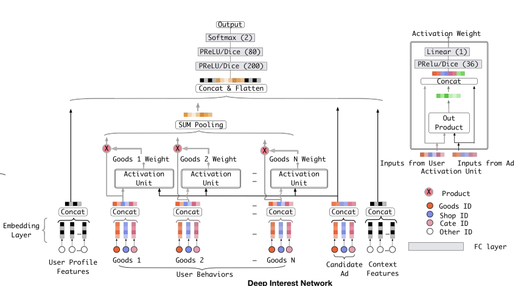

# Deep Interest Network for Click-Through Rate Prediction

# 标题
- 参考论文：Deep Interest Network for Click-Through Rate Prediction
- 公司：Alibaba
- 链接：https://arxiv.org/pdf/1706.06978
- Code：https://github.com/reczoo/FuxiCTR/blob/main/model_zoo/DIN/src/DIN.py
- 时间：2018
- `泛读`

# 内容

## 摘要
- 问题：
  - 将用户丰富的历史行为（如点击过的商品ID）通过embedding和pooling压缩成一个固定长度的表征向量，无法根据不同的候选广告进行自适应变化
  - 比如系统准备向这个用户推荐“跑鞋”还是“手机”，代表他的都是同一个向量。这个向量试图“一视同仁”地蕴含该用户所有的兴趣点，而且在面对具体推荐任务时显得不够聚焦。
  - 为了增强表达能力而粗暴地增加向量维度，又会带来参数量爆炸和过拟合的风险
- 解决方式，DIN：
  - 局部激活 (Local Activation)，用户行为序列(historical behaviors)和目标商品(target item)做融合，学习到行为序列内商品和目标商品的隐藏关系。
  - 小批量下的正则化方式(mini-batch aware regularization)
  - 自适应的激活函数生成(data adaptive activation function)
  - 帮助更好地落地实际业务中的大数据大模型，防止了模型的过拟合

## 1 介绍
**主要贡献**：
- 提出新模型（DIN）：针对固定长度向量无法有效表达用户多样化兴趣的局限性，我们提出了深度兴趣网络（DIN）。
  - 其核心是通过局部激活单元，能够根据给定的广告自适应地学习用户历史行为中的兴趣表征，从而极大地提升了模型表达能力，更好地捕捉了用户兴趣的多样性。
- 开发两项训练技术：为了高效训练工业级大规模深度网络，我们开发了两项新技术：
  - 小批量感知正则化：大幅降低了海量参数模型的正则化计算开销，有效防止过拟合。 
  - 数据自适应激活函数：改进了PReLU函数，能根据输入数据分布进行调整，性能优异。
- 验证与部署：
  - 在公开和阿里巴巴数据集上的大量实验证明了DIN模型和训练技术的有效性。相关代码已开源。该方法已在阿里巴巴（全球最大广告平台之一）的展示广告系统中成功部署，为业务带来了显著提升。

## 2 相关工作
- 采用了embedding + MLP 的结构的模型
  - LS-PLM and FM 此一次引入embedding 概念对sparse数据，并且尝试去找特征组合和target的关系
  - DeepCrossing and  W&D 改进了上面的transformation function，变成了MLP，提高了模型的学习能力
  - PNN 尝试拟合高阶特征组合
  - DeepFM 实现了不需要人工特征工程
- DIN 模型也参考了以上结构但是，但是以上模型对用户历史行为会转化成一个固定长度的vector通过 sum/pooling，必然会造成信息流失

## 4 DEEP INTEREST NETWORK

## 4.1 Feature Representation

    
      <figcaption style="text-align: center">
        DIN_特征处理
      </figcaption>
    </img>
  

- 离散特征的处理：
  - 在推荐场景下最主要常见的就是用户和商品的ID
  - 所有离散特征都采用了One-hot的encoder方式
  - 用户点击行为序列内的离散特征做multi-hot编码。

## 4.2 Base Model(Embedding&MLP)

    
      <figcaption style="text-align: center">
        DIN_base_model
      </figcaption>
    </img>
  

- Embedding layer
  - one-hot，转化成一个embedding vector
  - multi-hot，转化成多个embedding vector组成的list
- Pooling layer and Concat layer
  - 用户的点击序列长度并不相同，如果不采取padding和截断，直接选择完整真实的用户点击序列
  - 可以用池化层派上很合适的用处。
  - 常见的池化为加和池化和平均池化。
  - 把所有的用户点击过的good id 对应的embedding进行 sum/average pooling 到一个一样维度的vector
- MLP
  - 将所有特征转为稠密向量拼接后，模型传入MLP层学习特征间的非线性关系。
- Loss
  - CTR点击率预测就是二分类问题，损失函数选择交叉熵损失函数

## 4.3 The structure of Deep Interest Network

    
      <figcaption style="text-align: center">
        DIN_模型结构
      </figcaption>
    </img>
  

- 基准模型里面最大的问题是对用户点击序列的池化操作，这样丢失了很多信息，并且无论对应的是什么广告，都是固定长度的表达vector
- 如果直接增加user representation vector长度，会造成参数量爆炸和过拟合的风险
- DIN提出：
  - 增加了一个激活单元，在保证用户行为多样性（diverse）的同时，实现了对于不同候选广告
  - 局部激活（local activation）用户兴趣的特性。即为用户行为中每个商品与候选广告通过激活单元计算出一个激活权重。
  - 用户行为中的商品乘以权重再进行sum pooling。
  - 本质上还是pooling，但是是带有权重的pooling，这个权重和候选广告相关

    
      <figcaption style="text-align: center">
        DIN_局部激活公式
      </figcaption>
    </img>
  

- e_1, e_2, ... e_h 是用户U的历史行为Embedding向量列表。 
- v_a 是候选广告A的Embedding向量。 
- a(e_j, v_a) 是一个激活单元（通常是一个小型前馈神经网络），它接收历史行为和候选广告作为输入，输出一个权重 w_j。这个权重就代表了历史行为在面对广告时的“相关性”或“注意力得分”。
- Activation Unit内
  - 传入User和Item特征向量后做了外积(out product)，两个向量越相近(线性相关程度高)，外积越饱满信息量越高，两个向量不相近(线性程度低)，外积信息量越低。
  - 再跑一个自适应的激活函数
  - 输出层是一层的MLP，输出是当前User和Item的 w_j
- 一个值得注意的细节是，DIN计算出的注意力权重 w_j 没有经过Softmax归一化。这意味着 sum(w_j) 不一定等于1。
- 这样设计的目的是为了保留用户兴趣的绝对强度。例如，如果一个用户的历史行为大部分都与某个广告高度相关，那么加权和之后的向量模长就会比较大，反之则较小。这种设计使得模型不仅能捕捉兴趣的“方向”，还能感知兴趣的“强度”。
- 值得一提的是，paper已经尝试过了用LSTM对用户历史行为，并没有起到好的效果：
  - 可能是因为用户的行为在存在同时发生的兴趣行为
  - 或者存在急速的变化或者停止的兴趣行为，造成sequence 用户行为变成noisy
  - 一个可能的方向是，设计一个独特的结构去model这个数据

## 5 TRAINING TECHNIQUES

## 5.1 Mini-batch Aware Regularization
- 问题：
  - 如果不进行正则化，原始数据压缩在整个向量空间中的很小区间内，模型训练会快速的陷入过拟合风险
  - 对于像ID这样的特有特征，数量往往十分庞大，用户级别上是亿级的，item级别也是百万千万级别的，直接计算L2正则项的代价较高，不过模型学习到的就是embedding信息
  - 用户数据符合 长尾定律long-tail law，也就是说很多的feature id只出现了几次，而一小部分feature id出现很多次。这在训练过程中增加了很多噪声，并且加重了过拟合。
- 方法：
  - 提出一个近似方案，参数更新即可只使用小批量形式中出现的参数
  - 本质上就是对于每个batch，只调整（优化）batch中出现过的参数
  - 对于出现频率大的id，给与较小的正则化强度， 参数调整的幅度越小
  - 对于出现频率小的id，给予较大的正则化强度。参数调整的越大。
  - 实际效果中，并不会特别明显，因为单一batch的数据质量相比整体数据分布是很片面的，虽然比不用L2还是要好一些

## 5.2 Data Adaptive Activation Function
- 问题：
  - 传统的PReLU上的控制函数在0值有一个越阶，层间如果分布不同的话就不合适了
- 方法：
  - 提出Dice 激活函数，可以看成PRelU的通用版本（当Dice里面均值和方差设置为0的时候），本质上是调整越阶点应该由数据决定，通过不同的样本分布来计算
  - 采用小批量内的样本均值和方差完成自适应过程，达到一个平滑处理越阶点。

## 6 EXPERIMENTS

    
      <figcaption style="text-align: center">
        DIN_AUC_公式
      </figcaption>
    </img>
  

- 模型的评判指标主要是AUC，但是传统的AUC并没有考虑到每个用户的活跃度不一样，这就导致每个用户对于整体的点击率的贡献不一样。
- 采用先计算验证集中每个用户的AUC，然后带上展现的权重求和得到最终的AUC。从而调整后的AUC能更好的表现出模型在活跃用户上的正负样本的区分能力。
- 本质上就是计算一个带权重的AUC，权重由用户的impression的次数决定，来衡量用户活跃度

## 6.7 Result from online A/B testing
- 线上取得了不错的结果：
  - 10% CTR
  - 3.8% RPM(Revenue Per Mille)
- 线上需要大量的工程能力去实现latency
  - 合并CPU的请求，提升GPU利用率
  - GPU内存调优
  - 并发使用CUDA，提升矩阵计算效率。

## 6.8 Visualization of DIN
- 生成的 Embedding，用户历史信息中和候选广告明显有相同类的id的attention weight更大
- 生成的 Embedding 也有着不错的聚类效果

## 7 总结
- 提出DIN模型，解决了固定长度用户用户表达的问题，实现了自适应的学习用户历史行为和候选ID的关系
- 工程能力上为了实现：
  - 提出了小批量的参数更新正则化
  - 提出Dice激活函数、自适应正则，提升了模型性能与收敛速度。

# 思考

## 本篇论文核心是讲了个啥东西
- 参看section 7

## 是为啥会提出这么个东西，为了解决什么问题
- 问题：
  - 将用户丰富的历史行为（如点击过的商品ID）通过embedding和pooling压缩成一个固定长度的表征向量，无法根据不同的候选广告进行自适应变化
  - 用户的历史行为信息会被浪费或者丢失掉，在传统的池化过程中
  - 同时为了增强表达能力而粗暴地增加向量维度，又会带来参数量爆炸和过拟合的风险
  - 工程上难以实现，用户ID和商品ID的embedding维度非常大
- 贡献：
  - 提出DIN模型，自适应的学习用户历史行为和候选ID的关系。用attention unit 来实现带权重的pooling
  - 提出小批量的参数更新正则化，加速了L2的计算速度在参数更新阶段
  - 提出了Dice激活函数、自适应正则，提升了模型性能与收敛速度。

## 为啥这个新东西会有效，有什么优势
- 对比传统 W&D 之类的特征交叉模型
  - 提出激活单元，实现了自适应的学习候选广告和用户历史行为的关系

## 与这个新东西类似的东西还有啥，相关的思路和模型
- 系列的sequence model，本质上都是找用户的兴趣演变过程和候选ID的关系
  - DIEN
  - DSIN
  - BST

## 在工业上通常会怎么用，如何实际应用
- 十分建议尝试一下在搜索里面使用，用户当前的搜索行为和产品可能和之前的搜索记录会有关系
- 可以作为最简单的基础版本的不考虑顺序的base model，整个思路都值得复现一下，
  - 需要考虑搜索里面的用户行为不一致，比如有点击，加入购物车，购买，需要思考如何组成用户历史行为
  - 可以尝试分类event type 型进行计算
  - 或者尝试混合直接进行计算
- 在源码里面并没有使用外积来计算 Local Activation Unit，而是使用了 向量差（queries - keys），和逐元素乘法（queries * keys）来代替外积。详细原因见如下。

1. 目标是什么？
   - 无论是向量差、外积、点积还是逐元素乘积，它们的根本目标都是一致的：衡量查询（候选广告）和键（用户历史行为）之间的相关性/交互强度，并为每个历史行为生成一个权重。
2. 外积的局限性
   - 外积操作：给定两个向量q（查询，query）和k（键，key），外积会产生一个矩阵C，其中每个元素C_{i,j} = q_i * k_j。这捕获了所有维度对之间的二阶交互，也是最细粒度的局部信息，信息丰富。
   - 计算成本：外积的计算复杂度为O(d^2)，其中d是嵌入维度。对于高维嵌入（如d=64~128），这会产生大量参数（如4096~16384个元素），导致计算和存储开销巨大，同时过多的特征交叉会引入更多的noise，在工业级推荐系统中难以承受。
3. 为什么用queries - keys和queries * keys替代？
   - 计算效率：queries - keys（减法）和 queries * keys（逐元素乘法）的计算复杂度都是O(d)，远低于外积的O(d^2)。这大大减少了计算量，满足线上服务低延迟的要求。
   - 信息捕获能力：
     - queries * keys（逐元素乘法）：捕获两个向量在每个维度上的相似性，类似于点积但保留维度信息。它强调维度对齐的交互，能有效表示哪些特征维度是高度相关的。类似局部信息。
     - queries - keys（减法）：捕获两个向量之间的差异或不一致性，帮助模型识别哪些维度上查询和键不匹配，从而学习到更精细的对比信息。类似全局信息。这里如果是点积，更能体现全局信息。
   - 组合效果：结合减法和逐元素乘法，可以同时捕获相似性和差异性，包括了局部和一部分全局的信息，提供了足够丰富的信号供后续神经网络学习注意力权重。虽然不如外积全面，但在实践中被证明是信息量和效率之间的良好平衡。
4. 为什么这种替代有效？
   - 神经网络的学习能力：MLP本身是一个万能函数逼近器，即使输入是减法和逐元素乘法的结果，它也能学习到复杂的交互模式。外积提供的完整交互矩阵虽然信息丰富，但其中可能包含冗余，MLP可以从更紧凑的表示中提取关键信息。

## 参考链接
- https://www.cnblogs.com/rossiXYZ/p/13796470.html#0x00-%E6%91%98%E8%A6%81
- https://blog.csdn.net/sinat_15443203/article/details/104684745
- fun-rec里面对应章节
