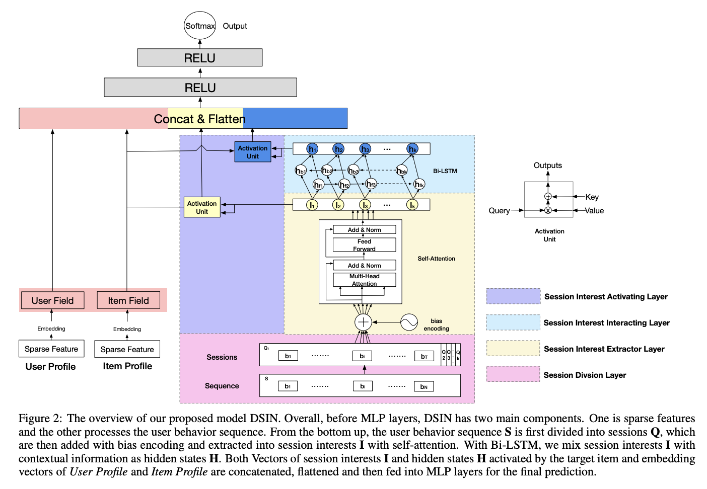
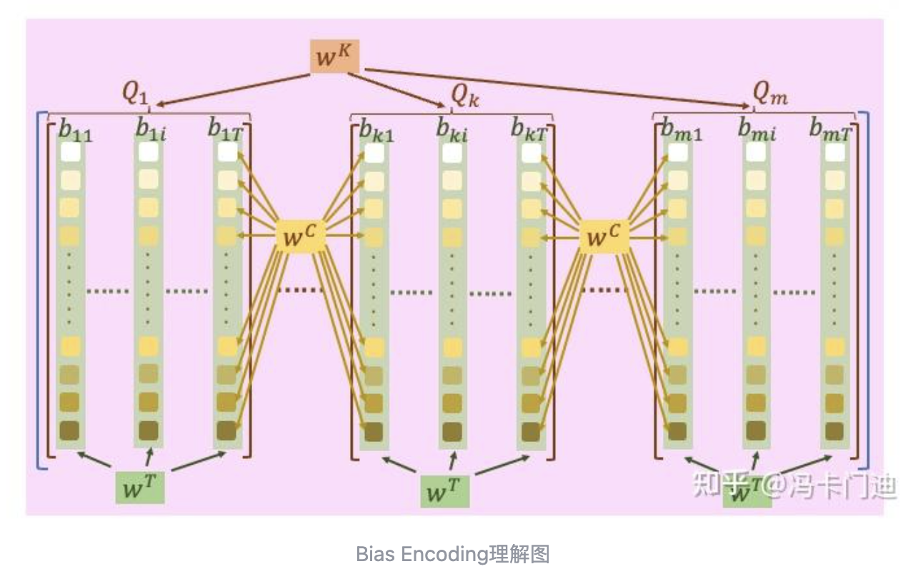

# Deep Session Interest Network for Click-Through Rate Prediction

# 标题
- 参考论文：Deep Session Interest Network for Click-Through Rate Prediction
- 公司：Alibaba
- 链接：https://arxiv.org/pdf/1905.06482
- Code：https://github.com/shenweichen/DSIN
- 时间：2019
- `泛读`

# 内容

## 摘要
- 问题：
  - 兴趣变化是电商平台CTR预估的一个重要思路，但是更多的研究都聚焦于“兴趣转变”上，而忽略了行为序列本身的分布特点。
- 方法：
  - 提出DSIN模型：
    - 通过对 Session 的关注，在行为序列的划分上提出改进方案。
    - 合适的 Session 划分能够让单一session内的用户行为趋于同质，让不同session间的用户行为异质。
    - 在每个 Session 内 模型采用 attention 机制并将 attention 中的 position encoder 做了适配改进，学习用户的兴趣
    - 在不同 Session 间，同时利用双向 LSTM(Bi-LSTM) 学习用户兴趣的演变过程
    - 最后通过 local activation unit 学习不同session内的兴趣 对于 target item的影响

## 1 Introduction
- 用户的行为是由一系列的 sessions 组成的
- 一个 sessions 是由一系列的用户行为在给定时间段内组成的
- 并且连续时间内（一个 sessions）用户的点击集中在较为单一的兴趣上，而离散时间（不同sessions）往往发生了兴趣跃迁
- Session的划分规则：文中直接定义为相邻两个用户行为的发生时间如果大于等于30分钟，则划分为不同的两个 session
- DSIN 模型：
  - 第一，提出了把用户的行为划分成不同的 sessions
  - 用 self-attention 在每个sessions 内，来学习兴趣之间的 interaction和correlation，同时提取用户的兴趣在每个 sessions内
  - 第二，不同的 session 之间可能存在相关性，并且可能有连续性的pattern
  - 用双向 LSTM(Bi-LSTM) 学习兴趣之间的交互迁移和进化
  - 最后，用 local activation unit，局部激活单元，类似DIN，来融合这些兴趣，并且表达学习兴趣和 target item之间的关系

- **主要贡献**：
  - 用户行为序列的session划分规则
  - 处理session序列并学习兴趣演变过程时，采用了改进的self-attention网络和双向长短期记忆网络(Bi-LSTM)，最后提出local activation unit来学习不同兴趣和target item直接的关系
  - 在对比实验上取得了相较其他模型更好的效果。取得了SOTA的成绩。

## 3 Deep Session Interest Network

### 3.1 BaseModel
- Feature Representation：
  - 用户特征(user profile)
    - 用户静态特征(性别、地域、年龄等)
  - 物品特征(item profile)
    - 商品本身的静态特征(商品id、类目id、价格等)
  - 用户行为(user behavior)
    - 用户行为序列的动态特征(用户id、商品id、时间戳、行为类型等)
- Embedding
  - 同DIN，DIEN
- MLP
  - 同DIN，DIEN，把所有的特征拼接起来然后送入MLP
- Loss Function
  - 对数似然函数

### 3.2 Model Overview

    
      <figcaption style="text-align: center">
        DSIN_模型结构
      </figcaption>
    </img>
  

模型主要可以分为两部分：
- (1)左侧对user profile和item profile的embedding处理
- (2)右侧占大量面积的对用户行为序列的处理计算。

其中用户行为序列处理主要由一下四个结构组成：
- (1)粉色部分，session划分层(Session Division Layer)，这部分可以理解为特征工程，将完整的用户行为序列划分为一个又一个的session
- (2)黄色部分，兴趣提取层(Session Interest Extractor Layer)，用于提取每一个session中的用户兴趣
- (3)淡蓝色部分，兴趣演变层(Session Interest Interacting Layer)，兴趣提取层得到每一个session的用户兴趣高阶特征后，这一层学习时序上各个session之间的兴趣演变变化
- (4)紫色部分，兴趣激活层(Session Interest Activating Layer)，将目标商品与session行为序列交互，传入attention网络激活。
- 本质上其实就是DIN和DIEN的融合版本在划分session的基础上进行，第二部分思路来自DIEN，第三部分思路来源DIEN但是实现过程不一样，第四部分思路来源DIEN，实现思路和DIEN一样加入目标商品。三四合并就是DIEN里面的兴趣进化层。

Session划分层：
- 整个sequence记作S，有N个用户行为，划分成M个session，每个session记作Q
- 每个session包含T个用户行为
- 理论上 sum(T_k) from 1 - M = N，实际上有时候一个session内只有1个用户行为，此时会舍弃这个行为的session。
- 按照30分钟为一个间隔进行划分session

会话兴趣提取层 (Session Interest Extractor Layer)：
- 这一层的目标是为每一个会话提取出一个核心的兴趣向量，为了提取内在的关系，同时降低不相关（比如误点或者突然的跳跃性思维）的行为之间的关系，我们提出用多头注意力机制。
- 这里先进行位置编码，embedding后每个session是 Q_t = Q_t + BE
- 然后进入Multi-head Self-attention，最后需要所有的行为attention后的结果做一个avg，得到第k个session的编码 I_k，类似文本处理里面的一个token。
- 偏置编码(bias encoding)
  - 与Transformer内的位置编码(position encoding)作用相同，目的也是通过encoding能够保障局部位置信息与全局位置信息的权衡。
  - 考虑到session之间本身就是一种序列划分，因此需要自上而下的做编码
  - 编码分为三部分：
    - (1)session之间的位置编码，w_k
    - (2)用户行为间的位置编码，w_t
    - (3)行为向量上的位置编码，w_c
- 注意不同的session直接share同样的多头注意力参数
- 这一步等价于DIEN里面用GRU一开始学习行为兴趣之间的关系

    
      <figcaption style="text-align: center">
        DSIN_位置编码图解
      </figcaption>
    </img>
  

会话兴趣交互层 (Session Interest Interacting Layer)：
- 在提取到各个session的高阶兴趣特征后，继续对兴趣演变过程进行学习
- 这种每个session之间的兴趣变化与文本中的上下文语义序列在抽象层面意义相同，因此选择了双向长短期记忆网络(Bi-LSTM)
- 前向LSTM和反向LSTM计算分别得到两个向量序列 H_f 和 H_b，向量维度与 I_t 相同，相同位置相加后得到最终的兴趣序列向量 H_t，类似文本处理里面一句话的每个token进行相加，这里的每个token就是一个session压缩提取之后的结果。
- 这一层的思路其实和DIEN是一样的，但是区别是DIEN引入了目标商品计算attention之后再学习兴趣演化，合并下一步就和DIEN/DIN里面的兴趣进化层一样了。

会话兴趣激活层 (Session Interest Activating Layer)：
- 这一步与DIN/DIEN的思想一脉相承。模型会根据当前的候选广告x_t，使用注意力机制来计算每个会话兴趣的重要性，并进行加权求和，得到最终的用户兴趣表示
- 这里做了两次激活
  - 一次是与兴趣提取层生成的原始高阶兴趣序列，得到 u_i，维度应该是一个常数
  - 一次是与兴趣演变层生成的包含兴趣交互层信息的兴趣序列。得到 u_h，维度应该是一个常数
  - 可能有的 session 之间并没有交互性，所以需要和提取层的原始兴趣序列做一次activating 计算
- 最后和把上面的两个加权过后的结果与做过embedding的用户特征、商品特征结合，并接起来，一起传入最后的前向网络中

## 4 Experiments

### 4.1 Datasets
- 6 billion display/click logs
- 100 million users
- 70 million items
- 总共 8 days 数据
- 前7天用作training，最后一天用作testing
- Users’ recent 200 behaviors are also recorded in logs

### 4.2 Competitors
- YoutubeNet
- Wide&Deep
- DIN
- DIN- RNN
- DIEN

### 4.3 Metrics
- AUC

### 4.4 Results on the advertising and recommender Datasets
- 具体数据参考原论文这一章
- DSIN-BE 最好

### 4.5 Further Discussion
- Effect of Multiple Sessions
  - DIN-RNN多取得的收益甚至小于DIN，因为用户的行为序列不是一直持续的，中间的间隔会影响到RNN的效果，也验证了session划分的重要性。用户行为的突然变化对于模型的训练带来了错误的引导，如果在模型结构上不能体现这些突然的跃迁(rapid jumping)和突然的停止(sudden ending)，想准确反映兴趣变化也会随之变得困难，一定程度上也代表着模型的鲁棒性好坏。
  - DSIN的成功主要是因为：
    - 用户的行为在一个session内更加一致统一
    - 用户每个session的兴趣更加具备序列关系，适合sequence 模型
- Effect of Session Interest Interacting Layer
  - 和target目标的完成信息交叉很重要，也就是说明DIN提供的思路很重要
- Effect of Bias Encoding
  - BE能更好的完整的捕捉到行为的位置信息，不同的session添加偏置项很重要

## 5 Conclusion
- 总结
  - 我们提出了一个DSIN模型，基于同一个session内用户的行为是一致的，不同session之间用户的行为是不一致的。
  - 先用自注意力机制来学习每个session内的用户兴趣提取层
  - 再用双向LSTM来学习不同session之间的兴趣交互层
  - 最后用局部激活层来学习用户不同兴趣和target item之间的关系（权重）
- 未来
  - 用GNN中的知识图谱作为先检知识对于用户的历史行为

# 思考

## 本篇论文核心是讲了个啥东西
- 参考section 5 总结

## 是为啥会提出这么个东西，为了解决什么问题
- 问题：
  - 基于DIEN的问题，将用户的历史行为看作是一整个序列
  - 但是用户行为在连续时间内（一个 sessions）用户的点击集中在较为单一的兴趣上，而离散时间（不同sessions）往往发生了兴趣跃迁
- 贡献：
  - 提出了把用户的行为划分成不同的 sessions先

## 为啥这个新东西会有效，有什么优势
- 对比传统 W&D 之类的特征交叉模型
  - 和DIN一样，更多的关注用户历史行为的影响和演化过程
- 对比DIN和DIEN
  - 更加关注用户行为的分session行为，这样更好的体现了用户的行为序列不是一直持续的，会出现跳点或者漂移，不能当初一个整体序列处理
  - 同时继续保持了兴趣提取层，和兴趣交互层，最后保留了局部激活对于target item

## 与这个新东西类似的东西还有啥，相关的思路和模型
- 系列的sequence model，本质上都是找用户的兴趣演变过程和候选ID的关系
  - BST

## 在工业上通常会怎么用，如何实际应用
- 同DIN/DSIN 一样，但是论文本身并没有线上的指标，虽然实验用到了production的数据，也取得了SOTA。
- 如何构建sequence数据集这里包括如何划分session，才是难点。
- session 三个部分都可以试一试：
    - fix window 话费 session
    - 在每个 Session 内，用 attention 机制，并将 attention 中的 position encoder 做了适配改进，这里可以试一试这种带有 time interval 性质的 position embedding
    - 在不同 Session 间，同时利用双向 LSTM(Bi-LSTM) 学习用户兴趣的演变过程
    - 最后通过 local activation unit 学习不同session内的兴趣 对于 target item的影响

## 参考链接
- https://zhuanlan.zhihu.com/p/464948008
- https://zhuanlan.zhihu.com/p/365999532