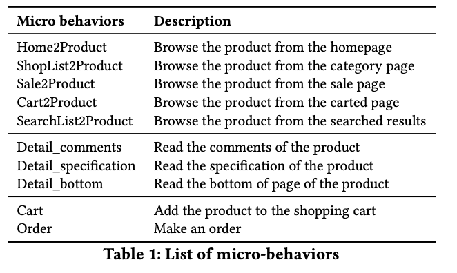
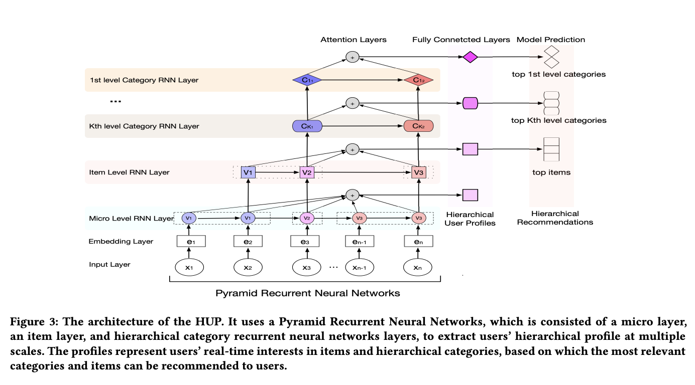
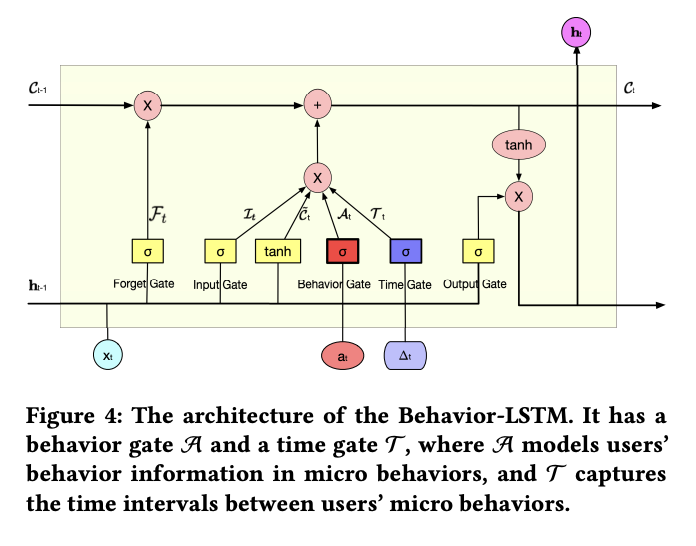

# Hierarchical User Profiling for E-commerce Recommender Systems

# 标题
- 参考论文：Hierarchical User Profiling for E-commerce Recommender Systems
- 公司：JD
- 链接：https://guyulongcs.github.io/files/WSDM2020_HUP.pdf
- Code：https://github.com/guyulongcs/WSDM2020_HUP
- 时间：2020
- `泛读`

# 内容

## 摘要
- 问题：
  - 用户兴趣天然具有层次性（从具体物品到抽象类别），且电商场景需要多粒度的推荐和不同粒度的层次化用户画像。DIN系列模型并没有涵盖。
  - 传统方法依赖物品级行为（如点击、购买）过于粗糙，无法捕捉更细微的用户意图。DHAN之类的model并没有。
- 方法：
  - 提出HUP框架
    - 模型上：
      - 核心思想金字塔循环神经网络，使用 Behavior-LSTM 来同时、多尺度地学习用户的层次化实时兴趣。
    - 数据上：
      - 突破了传统物品级行为的限制，引入了 “微行为” 序列。这指的是用户与物品组件（如图片、评论）的交互、浏览路径等极其细粒度的行为。利用这些数据可以更精准、更实时地洞察用户的真实兴趣和意图。
    - 本质上和DHAN + DIEN 的思路一样，学习更细微的用户行为（不再是点击，购买之类的），同时学习了用户行为的演化过程，也是DHAN paper里面提到的未来方向。同时学习到了兴趣层次关系。

## 1 介绍
- 问题：
  - 传统用户画像方法无法同时为不同粒度（如具体物品、品类、主题）的推荐任务生成统一的、层次化的用户兴趣表征。
  - 主要依赖物品级行为（如点击、购买），忽略了更具信息量的微行为（如看评论、看图、浏览路径）。
  - 对用户兴趣动态变化的捕捉不够精细，忽略了行为类型和停留时间这两个关键信号。
- 方法：
  - 金字塔RNN结构：
    - 这是一个核心创新，它是一个多层级、端到端的模型。底层处理微行为，上层依次抽象出物品级和多个品类级的用户兴趣。这种结构实现了从细粒度信号到多层次兴趣的统一、同步建模。
  - Behavior-LSTM：
    - 对标准LSTM的改进，引入了行为门，能够综合考虑时间间隔、行为类型和停留时间，从而更敏感、更准确地捕捉用户兴趣的实时变化。
  - 数据利用：
    - 首次系统性地利用微行为序列来进行层次化用户画像，挖掘了更深层的用户意图信号。
- **主要贡献**：
  - 提出了一个新的层次化用户画像问题，旨在电商推荐系统中同时精确建模用户的多层次兴趣。
  - 提出了HUP，它利用金字塔循环神经网络，基于用户历史微行为进行层次化用户画像。
  - 提出了Behavior-LSTM，它利用一个行为门来建模行为类型和停留时间，以有效构建用户的实时兴趣。
  - 进行了广泛的实验，证明我们的方法在物品推荐和类别推荐任务上均大幅优于最先进的基线方法。
  - 本质就是学习到了 兴趣层次（细粒度到类别） + 兴趣演化 （不同行为类型微行为序列）

## 2 RELATED WORK

### 2.1 User Profiling for Recommendations
- 大部分的推荐系统要么是静态的（矩阵分解）或者动态的模型，都关注在item本身上面，没有关注过用户行为序列和多层次的用户画像（物品 item 到 类别）

### 2.2 RNN-based User Profiling
- 目前没有任何RNN类型的模型考虑到用户分层兴趣的问题
- 同时没有任何RNN模型能同时加入行为类型 + 停留时间 + 时间间隔 进行建模

## 3 PROBLEM FORMULATION

### 3.1 Background
- Hierarchical categories
  - 核心结构：采用树形结构来组织所有产品和类别。
  - 层级关系：类别之间存在从属关系，即低层级类别隶属于高层级类别。
  - 产品位置：具体的产品被放置在最细粒度的类别（即叶节点）下。
  - 例如：
    - 电子产品 (1级) → 电话 (2级) / 配件 (2级) → 手机 (3级/叶节点)，一个具体的手机产品会归类在“手机”这个叶节点类别下。
- Micro-behaviors
  - 可以提供更丰富的信息来指出用户当时的兴趣
  - 文章中考虑的微行为如下

    
      <figcaption style="text-align: center">
        HUP_用户微行为列表
      </figcaption>
    </img>
  

### 3.2 Hierarchical User Profiling

## 4 HUP: A HIERARCHICAL USER PROFILING FRAMEWORK

    
      <figcaption style="text-align: center">
        HUP_模型结构
      </figcaption>
    </img>
  

### 4.1 The Input and Embedding Layers
- 输入定义：
  - 输入是一个用户的微行为序列。X = ⟨x1, x2, . . . , xN ⟩
  - 每个微行为（xi）是一个六元组 xi =（ti, vi, ci, bi, di, gi），包含：
    - 时间戳 (ti)，timestamps
    - 物品 (vi)，物品本身
    - 多层级类别 (ci)
      - ci = {c(1)_i, c(2)_i, ..., c(K)_i}，这里表示k个categories level
    - 行为类型 (bi)
    - 停留时间 (di)
    - 与下一行为的时间间隔 (gi)
- 预处理：
  - 离散化：
    - 将连续的数值特征（停留时间 di 和 时间间隔 gi）通过分桶转化为离散的ID，以便进行后续的 embedding。
- embedding：
  - 核心操作：
    - 为输入元组中的每一个特征（物品(vi)、各类别(ci)、行为类型(bi)、停留时间桶(di分桶后)、时间间隔桶(gi分桶后)）通过查找各自的embedding table，将其转换为一个稠密向量。
    - 最终把所有特征的 embedding 向量拼接起来，形成代表该 xi 微行为的统一、综合的 embedding 向量 ei
  - 这里唯独没有对 ti 进行处理

### 4.2 Pyramid Recurrent Neural Networks
- 之前的RNN都没有考虑用户兴趣分层的问题，HUP提出一个金字塔RNN结构，包含：
  - micro-level RNN layers
  - item-level RNN layers
  - 多个 category-level RNN layers
  - 这是一个分层、分层的RNN结构，从下到上依次为：微行为层 → 物品层 → 类别层（多个）。
  - 底层处理细粒度信号，上层不断抽象出更高层次的兴趣概念。
  - 本质上和DHAN是一样的，只是DHAN用DIN来学习每一层和候选item的关系，而这里用RNN，可以学习到sequence的顺序
- The micro-level RNN layer：建模用户最细粒度的兴趣
  - 输入：
    - ti 时候经过 embedding 层拼接后的 ei，记作 xM_i
  - 输出：
    - hidden state yM_i，同时作为下一个level，item-level的输入
  - 隐藏状态更新：
    - 在每个微行为输入后都会更新。
- The item-level RNN layer：建模用户物品级的兴趣。
  -  输入：
    - ti 时刻的物品embedding 向量 e_vi 和微行为层输出 yM_i 的拼接
  - 输出：
    - yI_i 被传递给下一个category level 层
  - 隐藏状态更新：
    - 仅当用户将注意力从一个物品转移到另一个物品时才更新。
- The category-level RNN layers：构建用户类别级的兴趣。存在K个类别层（从最细粒度到最粗粒度）
  - 输入：
    - 对于最细粒度K层
      - ti 时刻的类别嵌入向量 e^(K)_ci 和物品层输出 yI_i 的拼接
      - 本质就是把这一时刻对应的 ci = {c(1)_i, c(2)_i, ..., c(K)_i} 里面的最小的 c(K)_i 的 embedding 结果和上一层的输出拼起来
    - 对于更高k层
      - ti 时刻的类别嵌入向量 e^(k)_ci 和下一层细粒度(k-1)层输出的拼接
  - 输出
    - 每一层的输出记作 Y_c_(k)，同时传给下一层
  - 隐藏状态更新：
    - 在每一层中，仅当用户在该层中将注意力从一个类别转移到另一个类别时才更新。
- 金字塔RNN：
  - 每一层的输入都拼接了两种信息：
    - 本层的实体信息（如物品ID、类别ID的嵌入）。
    - 下一层的抽象表征（如物品层的输入包含了微行为层的输出）。
    - 这确保了高层次兴趣是建立在低层次、更具体的行为信息之上的，形成了丰富的层次化表征。
  - 同时每一层并不是同步更新的，这保证了只有用户对应的行为注意力换了才会更新状态学习

### 4.3 Behavior-LSTM Cell

    
      <figcaption style="text-align: center">
        HUP_Behavior-LSTM_结构
      </figcaption>
    </img>
  

- 问题：
  - Time-LSTM，可以学习时间间隔导致的兴趣转移。因为Time-LSTM虽然考虑了时间间隔进模型，但忽略了行为类型和停留时间这两个关键信号，导致兴趣追踪不够精准。
- 方法：
  - 提出一个全新的 Behavior-LSTM，加入了一个 behavior gate 来处理行为类型和停留时间，使HUP能够更精确地跟踪用户的实时兴趣
  - It = σ (WI[ht−1, xt] + bI)， input 门
  - Ft = σ (WF[ht−1, xt] + bF)，forget 门
  - Tt = σ (WT[xt , ∆t] + bT)，time 门
  - At = σ (WA[xt , at] + bA)，behavior 门
  - C˜t = tanh(WC[ht−1, xt] + bC)
  - Ct = Ft ⊙ Ct−1 + It ⊙ Tt ⊙ At ⊙ C˜t，cell 状态
  - Ot = σ (WO[ht−1, xt] + bO)，output 门
  - ht = Ot ⊙ tanh(Ct)，hidden state
  - I, F, T, A and O 分别是 input, forget, time, behavior 和 output gates
  - C and h 是 cell state 和 hidden state vectors
  - 输入：
    - (xt, at, ∆t ) 在 t timestamps 时刻
    - xt 是 ti 时候经过 embedding 层拼接后的 vector
    - at 是行为类型或停留时间信息的 embedding vector
    - Δt 是当前行为与下一行为之间时间间隔分桶后的 embedding vector
  - 这里多出来的两个门的作用：
    - 时间门 T：
      - 专门处理行为间的时间间隔，判断兴趣的衰减或持续。
    - 行为门 A：
      - 专门处理行为本身的属性（比如: 行为类型或停留时间信息），评估该行为的重要性。
    - 分层应用：
      - Behavior-LSTM在不同层级智能地使用不同类型的元信息
      - 在微行为层，由于行为是瞬时的（如点击、滑动）没有停留时间信息，行为门 A 主要关注行为类型（例如，“阅读评论”比“简单浏览”更重要）
      - 在上层的物品层和类别层，行为门 A 则主要关注停留时间（例如，在一个商品页面停留5分钟比5秒钟更能说明兴趣浓厚）
- **这里本质上思路和 TiSSA 里面的 time-GRU 或者 本文提到的 time-LSTM 是一样的，都是加入了时间间隔这个信息进入gate，不过区别是前者加入到了update gate里面，后者和新的LSTM加入了一个全新的时间 gate。**

### 4.4 The Attention Layers
- 用途：用于聚合RNN输出的序列信息，生成一个综合的上下文向量，同时提供模型可解释性。
- 位置：在HUP中，每个RNN层（微行为、物品、类别）后面都紧跟着一个对应的注意力层，形成一个“RNN-注意力”对，从而为每个兴趣层级生成一个汇总的表征。经过attention加权后再穿个下一层。
- s = Σ(αi * yi)； αi = exp(ei) / Σ(exp(ek))； ei = f(yi, yT, ai)
- Y = [y1,y2, ...,yT ] 是每一层RNN的每个时间 t 的输出 + 最后一个 hidden state yT 的输出
- 注意力信号 ai 每一层不一样
  - 微行为层：使用行为类型（如点击、浏览评论）作为信号。
  - 物品层与类别层：使用停留时间作为信号。
  - 这使得模型在聚合信息时，能够依据当前层级最相关的信号（是行为意图还是兴趣浓度/停留时间）来判断哪些历史时刻更重要。
- 这里还引入了一个可学习的对齐模型 f（一个小型神经网络 2 层 FFN）来计算未归一化的注意力分数 ei。该模型综合考虑了当前时刻的兴趣 yi、最后的兴趣状态 yT 和当前层特有的注意力信号 ai。
- **本质上就是一个self-attention的过程，这里的attention在每一层的注意力方向不一样，由这一层的RNN类型控制，目的就是最大化当前层的最相关的型号，来传给下一层，最终来实现学习user sequence中重要的信息。**

### 4.5 The Fully Connected Layers
- 功能：全连接层的作用是进行最终的特征变换与整合。
- 输入：
  - 前面分层注意力机制产生的、已经过加权的上下文向量（sm, si, sc）
- 输出：
  - 最终生成的、不同粒度上的实时用户画像向量（pm, pi, pc = {p(1)_c, p(2)_c, ..., p(K)_c} k 层）
- 本质就是把上一步计算的加权之后的结果，分别各自跑一遍MLP 层，然后得到每一层最终的结果vector

### 4.6 Loss Function
- 训练目标：
  - 核心思想：摒弃传统softmax（因计算量过大），采用相似度学习。
  - 具体做法：对于每个层级，训练目标是让生成的用户画像向量（pm, pi, pc）
  - 与用户下一个真实交互对象
    - 对于微行为和物品层级，是下一个物品 v_{N+1}
    - 对于类别层级，是下一个层次化类别 c_{N+1} = {c(1){N+1}, ..., c(K){N+1}}
    - 相对应的embedding 在向量空间中的余弦相似度尽可能大
- 损失函数设计：
  - 分层损失：为模型的每一个输出层级（微行为、物品、各个类别）都定义了一个独立的损失项。
  - LM_u = cosine_proximity(pm, e_{v_{N+1}}) = - (pm · e_{v_{N+1}}) / (||pm|| ||e_{v_{N+1}}||)
  - 本质上就是计算余弦相似度，越小越好
  - 总损失：最终的总损失是所有这些分层损失的加权和。
  - L = λl_M * Σ(LM_u) + λl_I * Σ(LI_u) + λl_C * Σ( Σ(L(k)_{C_u}) )
  - 系数作用：权重系数 (λl_M, λl_I, λl_C) 用于平衡不同层级任务对模型总损失的影响程度，是实现有效多任务学习的关键。
- 优势：
  - 高效性：避免了在数百万物品上的softmax计算，使训练变得可行。
  - 协同性：通过多任务学习框架，同时优化所有层级的兴趣表征，使得不同层级的学习信号能够相互促进，共同提升模型的整体性能。这使得学习到的用户画像在各个粒度上都更加准确。
- 问题：
  - 多个任务之间真的都是正相关吗，比如有时候喜欢某个item，并不一定喜欢这里的item对应的类别，或者微行为并不一定和category层有关系。
  - 下一个一定是正相关的吗，一定是正样本吗？sessions的概念在这里就很重要。

## 5 EXPERIMENTAL SETTINGS

### 5.1 Hierarchical Recommendations
- 我们只做了物品推荐和类别推荐
- 模型输入用户行为序列，HUP输出两大结果：
  - 层次化的用户画像向量 (pi, pc) 
  - 物品和类别的嵌入向量（在训练中间接获得）
- 然后用HUP生成的用户画像向量，与候选集中的物品/类别嵌入计算余弦相似度，作为最终的排序分数。

### 5.2 Dataset
- JD Micro Behaviors Datasets
- 只有这两类 Appliances 和 Computers
- 每一行是一次用户的微行为序列

### 5.3 Baseline Methods
- POP
- BPR-MF
- Item-KNN
- Word2vec
- RIB
- Time-LSTM
- S-HRNN

### 5.4 Evaluation Metrics
- Recall@K 和 MRR@K，item k = 20，category k = 5，因为category 用户相对比较稳定
- items，behaviors 类型, categories 类型, dwell time 分桶后和 time intervals 分桶后 embedding 的维度设置为 30, 5, 8, 5 and 5
- batch size = 128
- hidden size PRNN = 100

## 6 EXPERIMENTAL RESULTS
- HUP方法显著beat简单基线，小幅度beat复杂基线
- 抛开联合训练，单纯用行为LSTM+attention来单独建模，效果也比复杂基线好，但是会稍逊于HUP，也就是说联合训练还是有用的
- 数据分析看，item和类目是存在跷跷板效应的，调大哪个loss哪个表现就比较好
- 最好的效果是item和类目两个loss，微观loss权重被置零了，因为这个loss是预测下一个微观行为，但是预测这个行为对item和category并没有什么影响
- 还有一个case study，明显看出来在具体例子上面的效果

## 7 总结
- 解决了层次化用户画像这一关键问题，能够同时捕捉用户多粒度的实时兴趣。对于推荐系统中多样化的推荐任务（从具体物品到抽象主题）至关重要。
- HUP框架：
  - 核心是金字塔RNN，能够从下到上同步学习用户从微观到宏观的兴趣。
- Behavior-LSTM：
  - 通过引入行为门，将行为类型、停留时间和间隔时间等元信息融入模型，实现了对用户兴趣更精细、更动态的刻画
- 最终这个框架并不是固定死的，可以应用于与各个领域的推荐系统，只需要包含任何具有层次化结构的物品与内容

# 思考

## 本篇论文核心是讲了个啥东西
- 提出HUP框架
    - 模型上：
      - 核心思想金字塔循环神经网络，使用 Behavior-LSTM 来同时、多尺度地学习用户的层次化实时兴趣。从用户最小的微观行为到类型，分层学习用户的兴趣演化过程。自底向上地同步抽象出用户从具体到抽象的兴趣。
    - 数据上：
      - 突破了传统物品级行为的限制，引入了 “微行为” 序列。比如用户与物品组件（如图片、评论）的交互，阅读评论，点击图片之类的行为。
    - 创新思路：
      - 提出了Behavior-LSTM 单元，提出了行为门，时间门，分别学习用户行为和时间间隔。
- 本质上是DHAN + DIEN/TiSSA 的思路，也就是学习用户的层次化实时兴趣同时学习兴趣演化过程，并且考虑了更多的微观行为在每一个时刻。

## 是为啥会提出这么个东西，为了解决什么问题
- 问题：
  - 无法统一建模层次化兴趣：
    - DIN模型没有涵盖用户兴趣天然存在的层次结构（如喜欢“电子产品”->“手机”->“iPhone 15”）以及不同层次兴趣间的内在关联。
  - 忽略“微行为”信号：
    - 大多数模型只利用“点击”、“购买”等物品级行为，浪费了更具信息量的微行为数据（如“查看评论”、“浏览图片”、“搜索”），这些行为能更早、更精准地揭示用户意图。
  - 动态兴趣建模粗糙：
    - 现有的时序模型（如Time-LSTM/Time-GRU）主要考虑了行为间的时间间隔，但忽略了行为类型本身的重要性和停留时间所代表的兴趣浓度，导致对兴趣演变的捕捉不够灵敏和准确。
- 方法：
  - 提出了HUP，分层学习用户的实时兴趣，也就是金字塔循环神经网络，自底向上地同步抽象出用户从具体到抽象的兴趣。
  - 提出了引入“微行为” 序列。和微行为RNN层。专门学习微行为的演化过程，和用于抽象出上层的物品，类别的行为。
  - 提出全新的 Behavior-LSTM 单元，提出了行为门，时间门，分别学习用户行为和时间间隔。

## 为啥这个新东西会有效，有什么优势
- 对比DIN
  - 金字塔RNN结构模拟了电商物品的分类层次和用户兴趣的抽象过程，使模型学到的表征更符合现实。
- 对比DHAN
  - 加入了时间序列的sequence，Behavior-LSTM综合了时间、行为和内容信息，能更敏感地感知用户兴趣的兴起、衰减和转移。
- 对比大部分序列模型
  - 加入了微行为，更能捕捉到其它模型无法察觉的细微兴趣信号（例如，长时间阅读评论代表购买意向强烈）。
- loss 设计
  - 和大部分序列模型最终用CE作为loss来计算CTR不一样，这里采用了相似度学习，每一层都有一个自己的loss，更像是学习每个层次对应的embedding vector，pi, pc, pm。

## 与这个新东西类似的东西还有啥，相关的思路和模型
- DIN (Deep Interest Network)：
  - 相关思路：引入了注意力机制，根据候选广告激活相关的历史行为。
  - 不同点：DIN没有显式地建模兴趣的层次结构，其用户表征是一个固定长度的向量，无法自然支持多粒度推荐。
- DIEN (Deep Interest Evolution Network)：
  - 相关思路：专注于捕捉用户兴趣随时间的演化过程，使用GRU和辅助损失来建模兴趣趋势。
  - 不同点：DIEN主要关注时序动态，但没有像HUP那样构建显式的层次化兴趣结构，也未充分利用微行为。
- DHAN (Deep Interest with Hierarchical Attention Network)：
  - 最相似的思路：明确提出了兴趣层次化建模。它通过多个注意力层来构建从物品到属性的层次结构。
  - 不同点：DHAN主要依赖于注意力机制在静态属性上构建层次，而HUP则通过一个分层的、状态不同步更新的RNN结构，并结合了更丰富的微行为序列和元信息，来动态地构建层次化画像。

## 在工业上通常会怎么用，如何实际应用
- 按照原paper的思路：
  - 作为核心特征生成器，得到层次化用户画像向量（pi, pc）
  - 将生成的各层次用户画像向量、候选物品的嵌入向量、以及其他上下文特征一同拼接起来，然后送入现有的排序模型，也就是DCN模型计算特征交叉
- 具体用户 sequence 可以借鉴的地方：
  - 特征工程上面，时间间隔，和停留时间，的处理方式可以借鉴，然后和其它进行拼接的方式可以借鉴。
  - 分层金字塔RNN思路可以考虑，但是估计最多三层，微行为 - 物品 - 类别，即可。
  - 数据上可以，引入更多的微行为，在搜索里面，这些微行为的信号很有用
  - Behavior-LSTM 可以完全照搬，特别是里面的行为门和时间门
  - attention 层也可以参考完全照搬
  - loss 思路可以作为辅助loss，和后续的特征交叉 loss 进行融合
    - 问题：
      - 如何选择正样本
      - 如何融合loss，每个loss的权重如何设置

## 参考链接
- https://zhuanlan.zhihu.com/p/242041834

