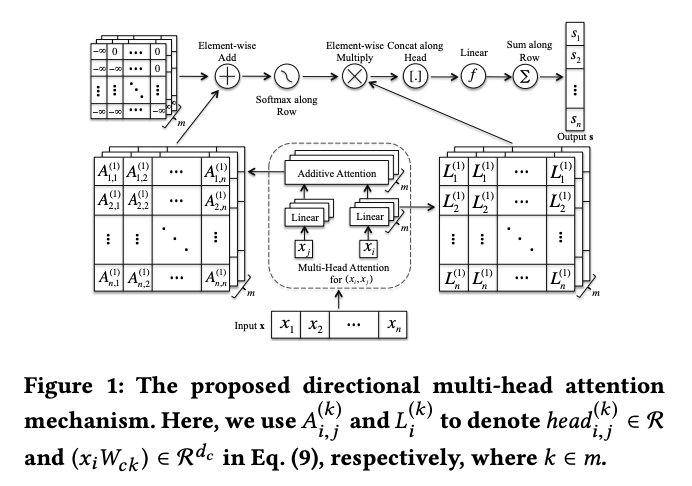
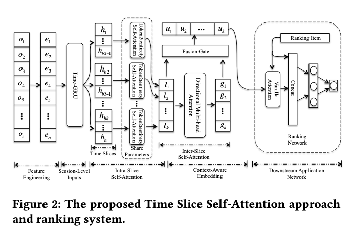
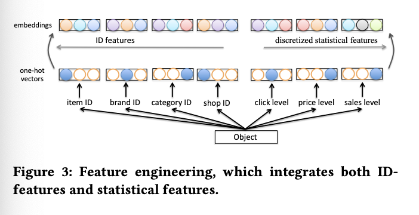
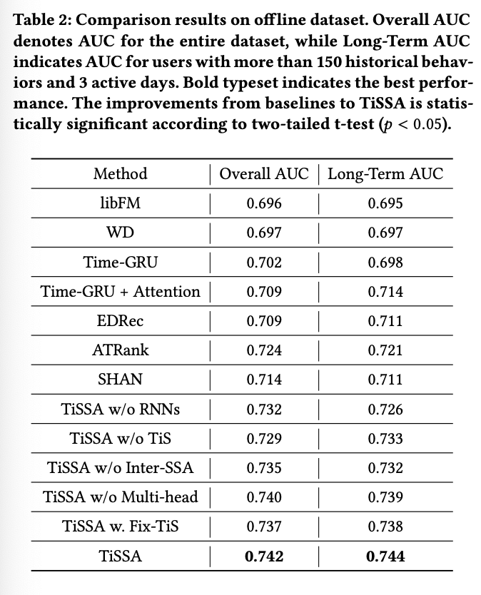

# TiSSA: A Time Slice Self-Attention Approach for Modeling Sequential User Behaviors

# 标题
- 参考论文：TiSSA: A Time Slice Self-Attention Approach for Modeling Sequential User Behaviors
- 公司：Alibaba
- 链接：https://nesa.zju.edu.cn/download/TiSSA%20A%20Time%20Slice%20Self-Attention%20Approach%20for%20Modeling%20Sequential%20User%20Behaviors.pdf
- Code：暂时没找到
- 时间：2019
- `泛读`

# 内容

## 摘要
- 问题：
  - 目前常用的RNN模型来建模用户行为序列，但它们存在一个复杂的依赖关系问题，难以准确捕捉高度相关的行为，且容易受到无关行为（噪声）的干扰。
- 方法：
  - 提出了TiSSA模型：
    - 提出时间间隔的门控循环单元在编码用户行为时挖掘时间维度信息
    - 提出时间切片分层自注意力函数，可以捕捉用户行为的局部依赖（近期行为）和全局依赖（长期模式）。

## 1 介绍
- 用户行为序列使用RNN面对的几个主要问题：
  - 第一个问题：
    - 保持长期行为依赖的同时保持中期和短期的用户行为的依赖
      - 基于RNN的方法：
        - 缺点1：使用的注意力机制过于基础/简单，设计不够完善。
        - 缺点2：采用的双向RNN结构复杂，在实际应用中难以并行化，影响效率。
      - 完全依赖自注意力的方法：
        - 核心缺陷：虽然放弃了RNN，但导致了序列结构信息的丢失或不完整。
        - 反衬RNN的优势：RNN的自回归特性在理论上能更有效地用少量参数建模长期依赖，这是其不可替代的优势。
      - **总的来说就是简单的“RNN+注意力”还是完全抛弃RNN的“纯自注意力”方案，都存在明显缺陷**
  - 第二个问题：
    - 用户行为在时间上和意图上的复杂性与不一致性，导致投射每一个用户行为到独立的一个embedding space，并不合理，模型并不robust
  - 第三个问题：
    - 现有的session划分方式虽然比单一行为表征更有表现力，但是都是通过固定时间窗口或在线会话这种简单且不合理的方式来划分会话
    - 同时会忽视掉session之间的内在联系，未能对跨session的关系进行建模。这里其实 DSIN 论文里面有考虑到。
    - 换句话来说我们需要根据不同用户的行为：
      - 动态session划分
      - 建模会话之间的关系
- 提出TiSSA模型：
  - 步骤一：会话划分：使用基于时间间隔的GRU，将原始用户行为序列动态的地划分并编码（解决了之前“单一行为嵌入”不鲁棒的问题，对应上述第二个问题）。
  - 步骤二：时间切片：利用多尺度时间窗口将第一步的这些会话分组为不同的时间切片（提供了一种比固定窗口更合理的划分方式，对应上述第三个问题）。
  - 步骤三：分层注意力捕捉依赖：
    - 切片内自注意力：捕捉短期/局部模式。
    - 切片间自注意力：捕捉长期/全局模式（同时考虑了会话间关系，对应上述第三个问题）。
    - 特征融合门：动态融合局部和全局信息，形成最终强大的用户表征。（对应上述第一个问题）
  - 步骤四：生成推荐：将得到的用户表征与待推荐物品通过注意力机制交互，最终由神经网络完成排序。
- 已经在天猫上offline和online实验过

## 3 TWO PROPOSED IMPROVEMENTS
- 提出了提升版本的GRU
- 提出了新的attention机制

## 3.1 Time-GRU
- 基于上述第二个和第三个问题，原始的GRU为NLP问题，并没有考虑时间段作为输入。但是很重要。
- 我们提出一个基于时间段的GRU，Time-GRU，去拟合用户session level的表达
- 公式：
  - update gate r_t = σ(W(1)_r * x_t + W(2)_r * h_t−1 + W(3)_r * △t_t + b_r)
  - rest gate z_t = σ(W(1)_z * x_t + W(2)_z * h_t−1 + W(3)_z * △t_t + b_z)
  - △t_t：time interval between adjacent actions，在两个行为直接的时间段也就是x_t和x_t-1之间的时间段
  - b_*：偏执项
- 基于时间段的加入，最为一个过滤信息的机制，最终的GUR h_t会学习到session level时间变化信息
- **本质上就是将关键的时间间隔信息注入到了序列建模的核心单元（GRU）之中，这样GRU可以给予时间段来重置和更新当前行为状态**

## 3.2 Directional Multi-Head Attention

    
      <figcaption style="text-align: center">
        TiSSA_注意力结构图
      </figcaption>
    </img>
  

- 提出一种token2token的，自注意方式，本质上和NLP transformer 里面的多头自注意力方式很像，但是延续的是以前的写法不是 transformer 的attention机制。
- 公式对于其中一个head，总共M个head， head_k i,j = W^T * σ(W(1)(xi * W_ck ) + W (2)(xj * W_qk ))
  - W_ck ∈ R_d × d_c, W_qk ∈ R_d × d_q
  - d_c = d_q = d/m，整个 embedding 被切割成 m 个head，每个head单独计算自注意机制，这里和 transformer 一样的逻辑
  - 第一步： xi * W_ck，把每个token 投影到 d_c 维度，这里类似 transformer 里面对 key 先做线性转换
  - 第二步： W(1)(xi * W_ck ) 这里可能是把 d_c 维度 转化到 n sequence 长度整个维度，这里应该就是把 n 个sequence 给重复 n 次，根据paper来说每个element 是一个 d_c的 vector，**需要看代码来确定这个地方**，然后会输出一个 pro matrix --> [n, n, m]，这里应该每个是一个 [d_c, m] 的矩阵，其实就是把 m 个 head stack起来。
  - 第三部： 把两个投影后的进行相加，达到additive attention，得到 --> [n, n, m]，这里和 transformer 不一样，自注意计算方式不一样，以一个是加，一个是乘。
  - 第四步： apply 一个 激活函数和另一个 W 矩阵
  - 第五步： 为了实现相对位置的概念，apply 一个上三角 mask 矩阵 M_k i,j = ( 0, i < j; −∞, 否则 )，这里和 transformer 概念一样。但是这里 mask 使用的是，add的方式对第四步的输出，然后通过softmax得到normalization的注意力权重。每个element是 pro matrix 的相对应的attention weight。
  - 第六步： 把attention weight 和 pro matrix element-wise 乘，得到自注意后的 sequence 的权重值。
  - 第七步： 将所有注意力头的输出拼接并融合，得到一个 --> [n, n, m, d_c]。
  - 第八步： 然后把融合过的矩阵 apply mlp 投影回去 d 维度 --> [n, n, d]，这里的思路和 transformer 里面的FFN 有点像。
  - 第九步： 最后沿着 row 的维度就是 第二维度进行 sum，得到 --> [n, d]，得到每一个sequence对其他位置加权融合过的结果
- 总之，本质上就是一个多头自注意机制，只是用的自己原创的自注意机制，而不是 transformer。

## 4 TIME SLICE SELF-ATTENTION APPROACH AND RANKING SYSTEM

    
      <figcaption style="text-align: center">
        TiSSA_自切片排序框架
      </figcaption>
    </img>
  

## Feature Engineering

    
      <figcaption style="text-align: center">
        TiSSA_特征工程
      </figcaption>
    </img>
  

- 每个用户行为对象（如点击过的商品）使用一个多热向量 来表示。 这个向量包含了该对象的多种特征，如ID类特征（物品ID、店铺ID等）和离散化的统计特征，本质上就是把多个独热向量拼起来
- 然后对每个特征单独进行线性映射（嵌入），生成一个稠密向量，然后将所有这些特征对应的稠密向量拼接起来，形成最终代表该行为对象的行为嵌入向量。也就是把所有关于这个用户行为对应的item的特征都转化成embedding然后拼接起来变成一个向量
- 嵌入共享：
  - 优化。当不同的特征字段（如“商品ID”和“所属店铺ID”）实际上指向同一个实体时，模型会共享同一个嵌入表。这不仅能大幅减少模型参数量，还能让模型更有效地学习这些共享实体的表征，加强特征间的关联。
  - 其实本质上就是同一个特征类型公用同一个embedding table
- 这里的特征工程不太一样，对比 DIN 系列的 paper 直接用 id 来embedding，这里反而类似 Wide & Deep 的做法，把候选item的所有相关特征的embedding都考虑进去了。

## Session-Level Inputs
- 把上面得到的 e --> [n, d_e]，放进 3.1 提出的 Time-GRU，其中 h ∈ R_d_h × n
- 用户行为的 session 的信息会自动通过时间段在模型里面学习
- 这里思路很有趣，不再是人工划分 session 的定义而是交给模型去学习 session 的意义

## Hierarchical Self-Attention
- 多尺度时间切片：
  - 将整个行为序列的会话表征也就是上一步的每一个用户行为（timestamps）的输出 h，按照多个不同尺度的时间窗口（例如，按天、周、月）进一步划分为更细粒度的时间切片。 
  - 时间切片的具体粒度（即如何划分）是一个可调节的超参数，允许针对不同的推荐平台（如电商、音乐）进行定制。
- 这样的动态划分，模型能够分层地在两种层面上捕捉依赖关系：
  - 切片内自注意力：捕捉局部、短期的用户兴趣模式。
  - 切片间自注意力：捕捉全局、长期的用户兴趣演变。

### Intra-Slice Self-Attention （切片内自注意力层）
- 目的
  - 标准化输出：将每个时间切片内数量不定的用户行为（变长序列）转化成一个统一、固定长度的向量表示。并允许处理空切片。 
  - 捕捉局部模式：专注于学习单个时间切片内部的用户行为之间的关联和规律，即短期/局部兴趣。
- 方法：
  - 原始 paper 2.2 中 公式 6，token2entirety 的自注意力机制。
  - 优点：
    - 将整个切片内所有行为的信息聚合起来，为整个切片生成一个综合的向量表示
    - 参数共享，所有时间切片都共享同一套自注意力参数。这使得模型高效且一致地处理所有切片，同时也是一种正则化手段，防止过拟合。
  - 最终得到 l = {l1,l2, ...,lk} ∈ R_dl × k，k 是 time slice的个数
- 本质上其实就是DSIN里面的第一层GRU模型，代表该用户在此短期时间段内兴趣概况的固定维度的局部表征

### Inter-Slice Self-Attention （切片间自注意力）
- 目的
  - 建模跨越不同时间切片的、长期的全局依赖关系。也就是对上面的输出建模来学习全局关系
- 方法
  - 使用 3.2 中提出的 token2token 的多头自注意力机制
  - 优点：
    - 双向
    - 同时保留了时间切片的先后顺，对于演化过程很重要
  - 最终得到 g = {g1,g2, ...,gk} ∈ R_dg × k，k 是 time slice的个数，和上面的输出保持一致维度
- 本质上和DSIN里面的第二层一样，对各局部表征中提炼出贯穿整个用户行为历史的、有序的长期模式与全局依赖，从而形成对用户兴趣的完整、层次化的理解。

### Feature Fusion （特征融合）
- 目的
  - 为了尽可能的将前两步得到的局部上下文表征 l（代表短期兴趣）和全局上下文表征 g（代表长期兴趣）智能地融合起来，形成每个时间切片的最终上下文感知表征 u。
- 方法
  - 采用了一个受GRU update gate 控机制启发的特征融合门。
  - F = σ (W(1)_F * g + W(2)_F * l + b_F )
  - u = F ⊙ l + (1 − F ) ⊙ g
  - 该融合门 F 是一个由模型自动学习的权重矩阵（值为0到1之间），它根据当前的局部和全局信息，动态地、自适应地决定在最终表征中应保留多少局部信息，又应采纳多少全局信息。
  - 最终输出 u 是局部表征 l 和全局表征 g 的加权和，权重由融合门 F 控制。
- 本质上是一个pooling，但是没有采用简单的concat，sum，mlp之类的融合方式，而是针对 sequence 的特色，设计了一个更新门

### Downstream Application Network
- item：把候选物品通过共享的嵌入层（与处理用户行为时使用的是同一个）被转化为嵌入向量 q。这保证了特征空间的一致性，并减少了参数。
- 用户-物品交互：使用常规的注意力机制来计算用户表征 u 与候选物品 q 之间的相关性，并生成一个加权综合的向量。 
- 最终预测：将该向量与其他可能拼接的特征一起，输入一个小型MLP（全连接层），最终通过Sigmoid函数输出预测概率。
- 这里的思路和 DSIN 最后一步基本一致，还是要计算一个candidate item 和 sequence attention 后所有sequence item 之间的attention 关系，然后再计算高阶的特征交叉。

## 5 EXPERIMENT

## 5.1 Offline Dataset
- 天猫数据
- id 类：item id, category id, shop id, brand id
- numerical 类：pre-designed discretized statistical features, including price level, sales level and click level
- 15天用户的 click behavior
- 预测item用户是否click/purchase
- avg user behavior sequence length 85
- med user behavior sequence length 46

## 5.2 Compared Approaches
- FM
- Wide and Deep network
- Time-GRU
- Time-GRU + Attention
- EDRec
- ATRank2 and SHAN
- Variant TiSSA

## 5.3 Implementations and Metrics
- feature engineering:
  - embedding 初始化正态分布
  - items IDs, category IDs, shop IDs, brand IDs as 64, 32, 32, 32
  - all discretized statistical features are embedded into 16 dimensions
- network shape:
  - RNN hidden dim 64
  - time slices as [0, 1), [1, 2), [2, 4), ..., [2^7, +∞) (#hour) 这个地方很重要，如何划分时间切边会直接影响后续计算切片内和切片间的关系
  - time slices of TiSSA w. Fix-TiS are [0, 2), [2, 4), [4, 6), ..., [14, +∞) (#day)，固定长度划分时间切片
  - heads of inter-slice self-attention as 8
  - mlp 128
- batch size 512
- epoch 2
- AdaGrad
- learning rate 0.01 for variant TiSSA, and 0.1 for rest approaches
- l2 10^−6 for RNN-based methods, and 5 × 10^−5 for rest methods
- latency: one user a batch of 3K items, TiSSA runs less than 50ms to give ranking results
- AUC

## 5.4 Experimental Results on Offline Dataset

    
      <figcaption style="text-align: center">
        TiSSA_实验结果
      </figcaption>
    </img>
  

- 没有 Time-GRU 和 没有动态time-slice，影响是最大的

## 6 CONCLUSION
- 提出时间切片分层自注意力机制，旨在通过一个结构同时捕捉用户行为的局部和全局依赖。
  - 两个attention学习切片内和切片间
  - token2token 定向多头注意力：用于更好地建模序列依赖
- Time-GRU：用于生成更鲁棒的会话级输入，动态学习每个行为的时间概念，自动学习并划分了sequence 里面的 session 的概念
- 提出了一个全新的fusion gate，这个可以动态学习局部和全局的信息

# 思考

## 本篇论文核心是讲了个啥东西
- 提出时间间隔的门控循环单元在编码用户行为时挖掘时间维度信息，也就是把用户行为的时间信息放进模型里面自己去学习 session的概念
- 提出动态的时间切片（time decay）分层自注意力函数，可以捕捉用户行为的局部依赖（近期行为）和全局依赖（长期模式）。
- 提出了一个融合近期行为和长期模式的gate，动态的学习哪一种行为需要被记住或者遗忘
- 本质上和DSTN是一样的逻辑
  - time-GRU + slice window by time decay window 对应 fix window 划分 session
  - 切片内 对应 会话兴趣提取层
  - 切片间 对应 会话兴趣交互层 
  - 多一个 长期短期行为融合gate
  - 与候选item计算attention 对应 会话兴趣激活层

## 是为啥会提出这么个东西，为了解决什么问题
- 问题：
  - RNN模型来建模用户行为序列，但它们存在一个复杂的依赖关系问题，难以准确捕捉高度相关的行为，且容易受到无关行为（噪声）的干扰。
  - RNN模型相邻的行为之间依赖度太高，因为是设计给NLP任务使用的
  - 目前的sequence 模型不能动态session划分，同时没有考虑建模 session 之间的关系。
- 方法：
  - 引入 time-GRU 动态学习 session的划分
  - 引入时间切片的分层自注意力函数，避免了RNN的依赖问题，同时解决了 session 之间的关系，学习了局部依赖（近期行为）和全局依赖（长期模式）的关系

## 为啥这个新东西会有效，有什么优势
- 对比其它序列模型，DIN，DIEN，DSIN，BST
  - 引入 time-GRU 可能动态的学习 session 的划分，因为对不同用户 fix window 划分方式并不是合理的。
  - 分成切片，采用了可变的 window 并且有 time decay的概念，能更好的学习 session 的划分
  - 引入 fusion gate，动态学习长期和短期的行为融合
  - 最后和其它所有模型一样，考虑了和候选item的attention计算
  - 用户历史行为 feature engineering 不一样，这里考虑了更多的信息（更多的id，和 statistic 的信息）

## 与这个新东西类似的东西还有啥，相关的思路和模型
- 系列的sequence model，本质上都是找用户的兴趣演变过程和候选ID的关系
  - 和DSIN一样，考虑了session的概念

## 在工业上通常会怎么用，如何实际应用
- feature engineering:
  - 可以参考试一试把更多的关于listing的信息融合进去，不再只是id
- time-GRU 可以参考动态学习 session 划分 + slice window with time decay
- session 内 和 session 间，可以参考但是感觉可能 DISN 的更好，用不同的 attention 机制来学习
- fusion gate 可以参考，这个对于同时有短期和长期的行为的可以参考
- 计算和候选item的 attention score 基本上是所有的这一些列模型最后的结构，可以参考这里的计算方式

## 参考链接
- user sequence summary 文章：
  - https://zhuanlan.zhihu.com/p/521722722
  - https://zhuanlan.zhihu.com/p/354754356

