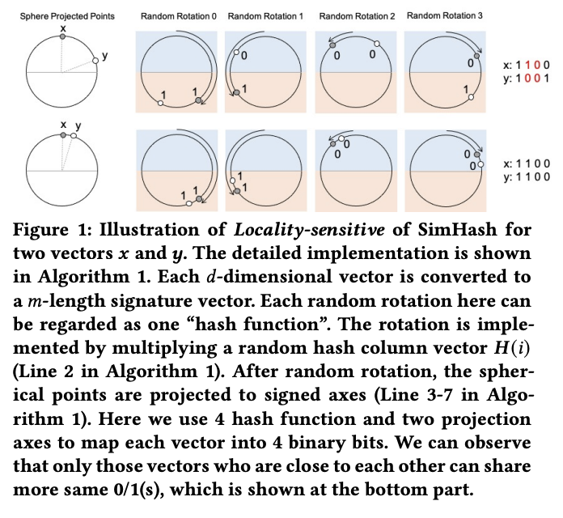
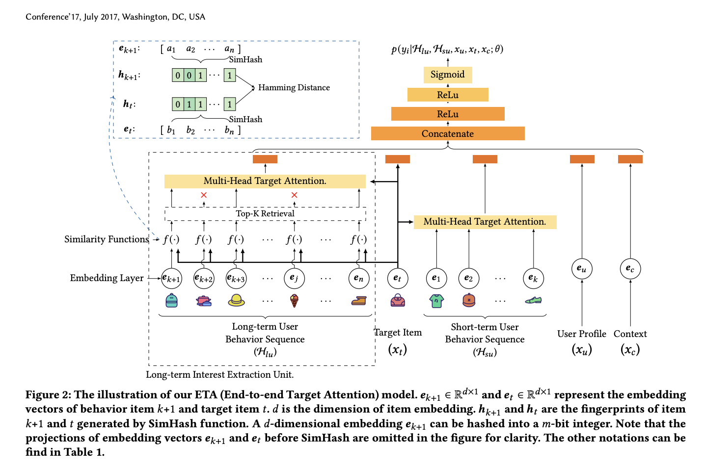

# End-to-End User Behavior Retrieval in Click-Through Rate Prediction Model

# 标题
- 参考论文：End-to-End User Behavior Retrieval in Click-Through Rate Prediction Model
- 公司：Alibaba
- 链接：https://arxiv.org/pdf/2108.04468
- Code：
- 时间：2021
- `泛读`

# 内容

## 摘要
- 问题：
  - 现有处理长序列的方法主要分为两类：
    - 直接截断：只能使用最近N条（如50条），丢失大量信息。
    - 两阶段方法（如SIM、UBR4CTR）：先检索再精排。但检索阶段的目标（通常基于相似度）与主CTR任务的目标（点击率预测）不完全一致，导致信息鸿沟和目标偏差，限制了最终性能的提升。
- 方法：
  - 提出ETA模型，一种基于局部敏感哈希（LSH） 的端到端注意力机制，使得在CTR预测中直接对超长用户行为序列（数万级别） 进行建模成为可能，同时满足严格的线上推理时间约束。
  - **本质上还是高效的检索，但是可以联合CTR任务一起训练，实现最终目标一致进行训练**

## 1 INTRODUCTION
- 问题：
  - 现有方法的演进与局限：
    - 早期方法（池化、RNN、CNN、自注意力）将序列编码为固定向量，但无法捕捉与候选商品相关的动态兴趣，且引入噪声。
    - DIN通过目标注意力解决了动态兴趣建模问题，但受限于计算资源，只能使用最近50条行为，浪费了长期历史信息。
    - 两阶段方法（SIM、UBR4CTR）通过“先检索后精排”成为SOTA，但存在根本性的信息鸿沟：
      - 检索阶段的目标（如类别匹配）与CTR主任务不一致
      - 检索依赖的离线预训练嵌入可能随在线模型更新而变得陈旧，导致长期行为无法被充分利用。
- 方法：
  - ETA提出了一种端到端的解决方案：
    - 通过SimHash局部敏感哈希为每个行为生成二进制指纹
    - 用汉明距离代替向量内积来快速筛选与目标商品最相关的Top-K行为，再进行注意力计算。
    - 将检索复杂度从O(L*B*d)降至O(L*B)，使实时检索成为可能，无需离线辅助模型，实现了真正的端到端训练与推理。
- **主要贡献**：
  - 首次实现CTR模型对长序列的端到端建模，消除信息鸿沟。
  - 离线实验与线上A/B测试均显著优于SOTA，上线后相比两阶段模型GMV提升3.1%。
  - 方法可推广至其他超长序列场景（如长期时序预测）。
- **本质上核心思想是，用近似的 similarity （embedding 经过 LSH 之后的汉明距离）来代替精确的 similarity （embedding 向量的内积）。先分桶，初步筛选，再计算相似度**

## 3 PRELIMINARIES
首先给出 CTR prediction 任务的公式。然后我们介绍如何通过 SimHash  机制生成 d 维 embedding 向量的指纹

### 3.1 Formulation of CTR Prediction Task
- 二分类问题
- 最小化交叉熵损失

### 3.2 SimHash

    
      <figcaption style="text-align: center">
        ETA_SimHash_图解
      </figcaption>
    </img>
  

- 核心：
  - SimHash是一种局部敏感哈希（LSH） 算法，核心思想是：将高维的嵌入向量映射为一个二进制指纹（binary fingerprint），同时保持向量间的相似性——即相似的输入向量会以高概率生成相似的哈希签名。
- 算法实现步骤（对应伪代码）：
  - 随机投影：对于输入向量，使用一组随机生成的投影向量 H^(i) 进行乘法运算，相当于对向量空间进行随机旋转。
  - 符号量化：对这个vector的每个维度上面的投影结果进行判断——若大于0则记为1，否则记为0，从而生成一个由0/1组成的签名向量。相似的向量投影后有更多的0/1。
  - 压缩存储：该签名向量可以进一步编码为整数，以节省存储空间并加速后续的汉明距离计算。例如，1001 可以解码为整数 9 = 1*8 + 0*4 + 0*2 + 1 。
- 核心特性：局部敏感性
  - 上图展示了SimHash的“局部敏感”特性：在原始空间中相近的向量，经过SimHash映射后，得到相同签名的概率很高；而相距较远的向量，签名相同的概率很低。
  - 这一特性使得我们可以用签名之间的汉明距离来近似替代原始向量之间的内积相似度，从而大幅降低计算复杂度。
  - **本质上是聚类，相似的聚合更近，快速的聚类，代替向量内积**

## 4 MODEL

    
      <figcaption style="text-align: center">
        ETA_模型结构
      </figcaption>
    </img>
  

## 4.1 Model Overview
- 模型输入：
  - ETA模型接受五类原始输入特征：
    - H_lu：用户长期行为序列（如过去5个月的点击）
    - H_su：用户短期行为序列（如最近50条点击）
    - x_u：用户画像特征（如ID、年龄、性别）
    - x_t：目标商品特征（如商品ID、类目、店铺）
    - x_c：上下文特征（如时间、场景）
- 核心处理单元：
  - 长期兴趣提取单元：基于SimHash处理超长序列H_lu，和多头目标注意力机制，生成用户长期兴趣表示。
  - 多头目标注意力：对短期序列H_su施加目标感知的注意力，生成用户短期兴趣表示。
  - 嵌入层（论文第4.2节）：将x_u、x_t、x_c等离散特征转换为稠密嵌入向量。
- 特征融合与预测：
  - 将所有模块输出的隐藏向量拼接成一个综合向量。
  - 输入MLP进行深度特征交互。
  - 最后一层使用Sigmoid函数，将输出映射为(0,1)之间的概率值，即用户点击当前目标商品的CTR分数。

## 4.2 Embedding Layer
- 特征分类处理：
  - 类别特征（Categorical features）：采用 One-hot 编码。
  - 数值特征（Numerical features）：先进行 **分桶（Bucketing）** 处理，再对桶 ID 进行 One-hot 编码。
  - **本质上，就是把所有数据都类别化处理了，并且采用了embedding后续**
- 维度压缩：
  - 由于物品 ID 规模可达数十亿，One-hot 向量极其稀疏且维度过高。模型将这些高维向量映射为低维隐藏向量 e_i ∈ R_d×1，以减少参数量。
- 序列矩阵化：
  - 用户行为序列中的所有物品嵌入向量会被打包成一个矩阵 E_s ∈ R_L×d，其中 L 为序列长度，d 为嵌入维度

## 4.3 Multi-head Target Attention
- 角色定义：
  - 在推荐场景中，目标项目 (Target Item) 作为查询向量 (Q)，而用户行为序列中的每个项目则同时充当键 (K) 和值 (V)。
- 计算流程：
  - 相似度计算：通过 Q 和 K 的点积来衡量历史行为与目标项目的相关性。
  - 加权求和：使用经过 Softmax 归一化后的相似度作为权重，对值矩阵 V 进行加权求和，得到最终的兴趣表达向量
- **本质上是标准的 self-attention 框架，只是这里不是自注意，是 target - history behavior 注意机制**

## 4.4 Long-term Interest Extraction Unit
- 核心问题：注意力机制的计算瓶颈
  - 内积搜索 k-nearest neighbor 的复杂度为 O(L * B * d)，其中L是用户行为序列长度，B是候选商品数量，d是嵌入维度。在工业场景下（L≈数千、B≈1000、d≈128），直接对超长序列计算注意力是完全不可行的。
- 方法：
  - SimHash+汉明距离：ETA通过局部敏感哈希（SimHash） 实现了高效且与主模型一致的在线检索：
    - 指纹生成：将每个行为物品的嵌入向量e_i通过SimHash函数压缩为二进制指纹h_i（如128位整数）。
    - 相似度计算：用汉明距离（计算两个指纹二进制位不同的个数）替代内积来衡量相似度。汉明距离计算复杂度为O(1)（仅需一次XOR和位计数）。
    - 实时检索：为每个目标商品计算其指纹h_t与所有历史行为指纹h_i的汉明距离，选出距离最小的top-K个行为。端到端的同步学习。
    - 精确注意力：对这K个行为应用标准的多头目标注意力，生成长期兴趣表示。
    - **本质上是高效的检索和同步CTR模型训练，更新embedding table**
  - 复杂度优势：
    - 检索阶段：从O(L * B * d) 降至 O(L * B)，消除了d维度带来的乘法开销。
    - 存储优化：指纹可预计算并存储在嵌入表中，线上只需查表，几乎零开销。
  - 数学形式化：
    - h_i = SimHash(e_i), h_t = SimHash(e_t)：生成指纹
    - e_i ∈ topK(HammingDistance(h_i, h_t))：选出top-K行为
    - LTI(E_t, E_s) = TA(E_t, E'_s)：对选出的K个行为进行目标注意力，得到长期兴趣表示

## 4.5 Deployment
展示了如何训练带检索的部分，和如何选择hash函数

### 4.5.1 Joint learning of retrieval part
- 目的：
  - 选择为接下来的 multi-head target attention 部分选择 query 的最近邻的 keys 。在选择了 query 的 top-k 最近邻的 keys 之后，对这些 top-k items 的 original embedding vectors 进行正常的注意力机制和反向传播。
  - 因此在训练阶段，检索模块本身不需要通过梯度下降来更新参数
- 初始化：
  - 固定随机投影： 检索过程仅需在训练开始时初始化一个固定的随机哈希矩阵 H
- 特征同步演进：
  - 当 CTR 模型的 Embedding 向量通过反向传播进行更新时，基于这些 Embedding 生成的 SimHash 指纹会随之自动更新
  - 保证 CTR  模型的 latest embedding 无缝地选择 query 的 top-k nearest keys
- 端到端透明性：
  - 这种设计使得检索部分对模型而言是“透明”的，它能确保在每一次迭代中，系统都能使用最新的 Embedding 挑选出最相关的行为条目。
- 消除信息偏差：
  - 相比于 SIM 或 UBR4CTR 需要离线构建索引或预训练，ETA 实现了真正的端到端训练，消除了检索目标与预测任务之间的不一致性。

### 4.5.2 Selection of “Hash Function”
- 采用随机哈希向量：
  - 虽然传统的字符串哈希函数也可以使用，但 ETA 选择了固定随机哈希向量作为哈希函数。
- 工程优势：
  - 这种方法允许使用矩阵运算，极大地提升了在大规模并行计算环境下的扩展性和效率，这与 Reformer 的思路一致。
- 实现机制：
  - 随机旋转（Random Rotation）：通过将 Embedding 向量与随机哈希向量 H(j) 相乘实现。
  - 随机投影（Random Projection）：为了生成二进制指纹，哈希向量 H(j) 中的元素需围绕 0 随机生成，以便将内积结果投影到正负轴上。
- 稳定性：
  - 一旦训练开始，哈希矩阵 H 就会被固定，确保了哈希映射逻辑在整个训练和推理过程中的一致性

### 4.5.3 Engineered Optimization Tricks
- 指纹压缩与存储：
  - SimHash 产生的签名向量（Signature Vector）由 m 个 0 或 1 组成。为了节省空间，系统使用整数来表示这个二进制向量，这极大地降低了内存成本。此外，这些哈希指纹会随模型一起存储在嵌入表（Embedding Table）中。
- O(1) 级计算加速：
  - 在推理时，系统只需进行简单的嵌入查找（Embedding Lookup）即可获取指纹。由于指纹已压缩为整数，计算两个指纹间的汉明距离（Hamming Distance）仅需执行位运算（如 XOR 和位计数），其时间复杂度为 O(1)，计算开销几乎可以忽略不计

## 5 EXPERIMENTS
- 数据集与评价指标 (5.1-5.3)：
  - 数据集：使用了包含 1 亿条记录的 Taobao 公开数据集，以及规模达 1420 亿条实例、平均序列长度为 938 的工业数据集。
  - 指标：主要采用 AUC 衡量离线性能，用 Inference Time (ms) 衡量线上推理效率，线上 A/B 测试则关注 CTR 和 GMV。
- 性能与推理时间对比 (5.4-5.5)：
  - 性能优异：在两个数据集上，ETA 及其变体（ETA + time info）的 AUC 均显著超过了 SIM(hard) 和 UBR4CTR 等最强基准模型。
  - 效率对比：ETA 的推理时间约为 19ms，远低于 UBR4CTR 的 41ms。虽然略慢于不含长序列建模的 DIN (11ms)，但在处理万级序列时表现极其出色。
  - 线上收益：在真实 A/B 测试中，ETA 相比于两阶段模型 SIM(hard) 额外提升了 3.1% 的 GMV。
- 消融实验 (5.6)：
  - SimHash 价值：相比于直接使用内积（Inner Product）检索，SimHash 虽然损失了极微小的 AUC（约 0.07%），但推理时间缩短了 68%，这对于满足线上延迟要求至关重要。
  - 指纹长度：增加哈希指纹的位长度（Bit-length）能提升 AUC，但当长度超过嵌入维度（Embedding size）的 2 倍后，收益会趋于平缓。
  - 序列长度权衡：实验显示在 256 到 2048 的范围内，增加序列长度能持续提升 AUC，但会相应增加延迟，工业部署时需根据 SLA 进行折中选择。

## 6 CONCLUSION
- 提出端到端建模的开创性：
  - ETA 是首个实现在 CTR 预估中将“长序列检索”与“点击率预测”进行端到端联合建模的方法
- 解决信息滞后与偏差：
  - 由于检索模块与主模型参数同步更新，它彻底解决了以往两阶段模型（如 SIM、UBR4CTR）中检索目标与预测目标不一致、以及 Embedding 向量过时的问题
- 效率的巨大跨越：
  - 利用 SimHash 技术将高维向量运算转化为汉明距离计算，将检索复杂度从 O(L×B×d) 降至 O(L×B)，确保了在 1024 级甚至更长序列下的实时推理可行性。
- **本质上是，把高效检索和同步训练两个步骤，融合到了一起和CTR一起训练。模型方面还是自注意力的变体 target注意力**

# 思考

## 本篇论文核心是讲了个啥东西
- 提出ETA，一种基于局部敏感哈希（LSH） 的端到端注意力机制，使CTR预测模型能够直接对超长用户行为序列（数万级别） 进行建模，同时满足严格的线上推理时间约束。
- 提出在长序列的高效检索部分，用SimHash生成的二进制指纹和汉明距离计算，替代传统注意力中耗时的内积相似度计算，从而实现高效的目标感知检索与建模。

## 是为啥会提出这么个东西，为了解决什么问题
- 问题：
  - 信息偏差（Information Gap）：之前的两阶段模型（如 SIM、UBR4CTR）在检索阶段使用类目等属性或过时的离线 Embedding，导致检索目标与最终预测目标不一致
  - 算力瓶颈：传统的 Target Attention 复杂度随序列长度线性增长，无法在推理时间内处理超过 1000 条的行为记录
  - 端到端训练需求：为了让检索部分能随着模型主体的更新而实时进化，需要一种更高效的在线检索机制
- 方法：
  - 提出LSH的方式，保证了同步端到端训练，消除了信息偏差
  - 提出用SimHash生成的二进制指纹和汉明距离计算，降低了整体的序列长度，解决了 Target Attention 的瓶颈

## 为啥这个新东西会有效，有什么优势
- 端到端：
  - 检索指纹直接由 CTR 模型的 Embedding 生成并同步更新，消除了目标不一致的问题。同时高效检索出来的行为可以帮助 CTR 模型。
- 极速检索：
  - 将昂贵的向量点积运算转变为汉明距离计算，复杂度从 O(L×B×d) 降至 O(L×B)，计算开销几乎可以忽略不计。
  - 并且线上inference，可以实现 O(1)，压缩指纹变成整数，线上只需要 looking up table。

## 与此论文类似的东西还有啥，相关的思路和模型
| 模型/方向             | 核心思想                             | 与ETA的关系                                    |
|:------------------|:---------------------------------|:-------------------------------------------|
| **SIM / UBR4CTR** | 两阶段检索+精排，处理长序列。                  | 同属长序列建模，但ETA用**端到端LSH**替代两阶段架构，消除信息鸿沟。     |
| **Reformer**      | 用LSH注意力替代传统注意力，降低Transformer复杂度。 | **直接灵感来源**，ETA将其思想引入CTR领域。                 |
| **DIN / DIEN**    | 目标注意力/序列模型，处理短期序列。               | ETA的注意力部分继承其思想，但输入从固定截断扩展为**LSH检索出的动态子集**。 |
| **MIMN / HPMN**   | 记忆网络压缩长期兴趣。                      | 属于另一技术路线（记忆压缩），ETA是检索增强路线。                 |

## 论文有什么可以改进的地方，可以后续继续拓展研究
- 哈希函数的优化：
  - 探索学习型哈希替代固定的随机投影，使指纹生成更适配CTR任务。
  - 研究多哈希表融合策略，提高近似检索的召回率。
- 指纹长度优化：
  - 探索在不同 Embedding 维度下，指纹长度（Bit-length）与模型精度、推理延迟之间的更佳平衡点
- 多兴趣扩展：
  - 当前ETA使用单一查询（目标商品）。可扩展为多查询向量（如用户多兴趣表征），一次检索覆盖多个兴趣维度。
- 长短期兴趣的深度融合：
  - 当前长短期兴趣简单拼接。可设计门控机制或自适应融合层，根据场景动态平衡两者贡献。
- 增量更新与实时学习：
  - 研究如何高效更新用户行为的SimHash指纹（如滑动窗口机制），支持实时行为流入。
- 可解释性：
  - 分析被检索出的行为与最终预测的关系，为推荐理由提供素材

## 在工业上通常会怎么用，如何实际应用
- 特征处理部分：
  - 可以参考，全部离散化处理
- 长序列部分：
  - ETA的检索部分可以完全照搬尝试
- 模型部分：
  - Target attention 的方式很独特，可以试一试，虽然感觉 decode 模型可能更好

## 参考
- https://www.huaxiaozhuan.com/%E6%B7%B1%E5%BA%A6%E5%AD%A6%E4%B9%A0/chapters/9_ctr_prediction8.html

