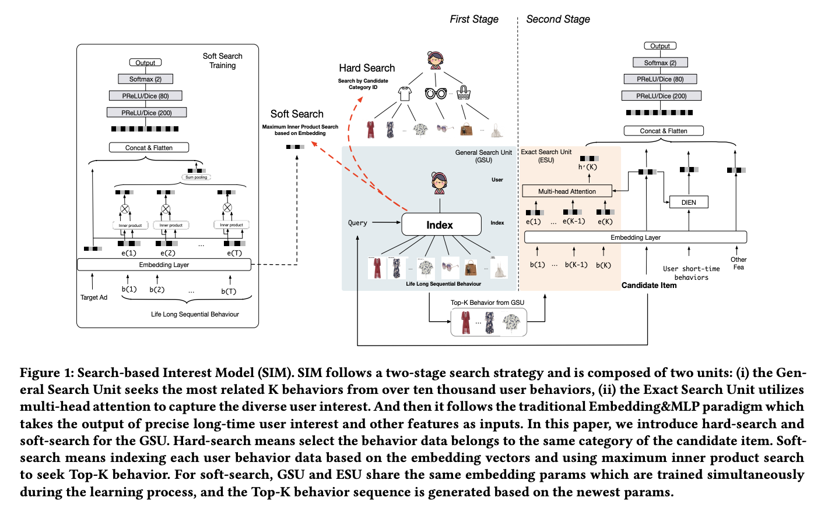

# Search-based User Interest Modeling with Lifelong Sequential Behavior Data for Click-Through Rate Prediction

# 标题
- 参考论文：Search-based User Interest Modeling with Lifelong Sequential Behavior Data for Click-Through Rate Prediction
- 公司：Alibaba
- 链接：https://arxiv.org/pdf/2006.05639
- Code：https://github.com/reczoo/FuxiCTR/blob/main/model_zoo/LongCTR/SIM/SIM.py
- 时间：2020
- `泛读`

# 内容

## 摘要
- 问题：
  - 虽然MIMN使用了外置解耦的兴趣matrix来存储单独用户的兴趣，但是matrix是固定大小，导致在处理极长用户行为序列（如从1000增至数万）时，兴趣捕捉能力下降、计算效率低下的瓶颈。
- 方法：
  - 提出 SIM 基于搜索的兴趣模型，实现两个级联的搜索单元来提取用户兴趣：
    - 通用搜索单元（GSU）：
      - 负责从用户的超长原始行为序列中，快速筛选出一个与当前候选商品相关的、长度大大缩短的 “子行为序列”。
    - 精确搜索单元（ESU）：
      - 负责对GSU筛选出的、长度可控的子行为序列，使用更复杂、更精细的模型（如类似DIN/DIEN的注意力机制）进行建模。精准捕捉用户兴趣。保证了模型效果。
- 效果：
  - 将可建模的序列长度从千级（MIMN）提升至万级（54000）
- **本质上是 搜索 + 精排 的范式，可以兼容多种已有的行为建模模型**

## 1 Introduction
- 问题：
  - 在淘宝上面23%的用户5个月内点击了1000件商品，如何能建模长的用户行为序列数据是一个开放而热门的话题。
  - MIMN 最多能处理 1000 个行为，但当长度增加到 10000 以上时，将所有信息编码进固定大小的内存矩阵会引入大量噪声，导致精度下降。
  - 之前的模型（如 DIN、DIEN）受限于线上系统的计算和存储压力，通常只能处理几百长度的序列。
- 方法：
  - SIM 提出了两级级联搜索机制来处理“终身级（Lifelong）”行为数据：
    - GSU（通用搜索单元）： 从原始长序列中快速检索出与当前候选商品相关的子序列（SBS），将长度从上万降至几百，并过滤噪声。
    - ESU（精准搜索单元）： 对过滤后的子序列进行精准建模
- **主要贡献**
  - 提出了一种新的范式 SIM，用于长的用户行为序列数据进行建模。级联的两阶段搜索机制的设计使得 SIM 具有更好的能力，可以在可扩展性scalability 和准确性accuracy 方面为长期的life-long 用户行为序列数据建模。
  - 介绍了在大规模工业系统中实现 SIM 的实践经验。带来了 7.1% 的CTR 提升和 4.4% 的 RPM 提升。现在 SIM 正在服务于主要流量。
  - 将长的用户行为序列数据建模的最大长度提高到 54000，比已发布的 SOTA 行业解决方案 MIMN 大 54 倍。

## 2 RELATED WORK
- User Interest Model
  - 初期（特征交互）：早期模型（如WDL、DeepFM）聚焦于自动学习特征间的高阶交互，解放特征工程。
  - 深化（兴趣建模）：后续研究认识到用户历史行为是兴趣的直接载体，转向 “用户兴趣模型”。其技术演进体现在：
    - DIN：引入注意力机制，实现兴趣的 “动态” 与 “目标相关” 表征。
    - DIEN：引入序列模型（GRU），建模兴趣的 “时序演化”。
    - MIND：引入胶囊网络，将兴趣从 “单一向量” 扩展为 “多兴趣向量”，承认用户兴趣的并行性与多样性。
    - Transformer的应用：利用其强大的序列建模能力，捕捉行为间复杂的跨会话与会话内关联。
- Long-term User Interest:
  - 更长的用户行为序列为用户兴趣建模带来了更多有用的信息，但是它极大地增加了在线 serving sysem 的延迟和存储负担（效率），同时也为 point-wise 的 CTR 预估带来了大量的噪声（效果）。
  - MIMN：采用记忆网络架构，将长期兴趣压缩存储于固定大小的记忆矩阵中，并通过增量更新（UIC模块）满足线上延迟要求。这解决了“效率”问题。
  - 遗留问题：MIMN等方案为了效率，在记忆网络的写入/更新阶段完全忽略了目标商品信息。这意味着长期兴趣的存储是“静态”和“通用”的，无法在源头实现如DIN那样的“目标相关”动态激活，从而在精准度上存在天花板。
- 新思路：
  - 如何不牺牲“目标相关”精准度的情况下同时实现对超长行为序列的高效建模：**提出先基于目标进行快速搜索，再对精简后的序列进行精准建模**

## 3 SEARCH-BASED INTEREST MODEL

    
      <figcaption style="text-align: center">
        SIM_模型结构
      </figcaption>
    </img>
  

### 3.1 Overall Workflow
- 第一阶段：通用搜索单元 (GSU):
  - 目标： 从包含数万个行为的原始长序列中，快速检索出与当前候选商品最相关的 Top-K 个子序列 (SBS)。
  - 作用：
    - 效率瓶颈：将后续复杂计算的数据规模从“上万”降至“数百”，满足了线上系统的严苛延迟要求。
    - 主动降噪：在源头过滤掉长期序列中大量与当前意图无关的“噪声”行为，为后续精准建模提供高质量输入。
  - 实现： 提供了 Hard-search（按类目过滤）和 Soft-search（基于向量检索）两种具体方式
- 第二阶段：精确搜索单元（ESU）：
  - 目标：对GSU筛选出的、长度可控的优质子序列，应用复杂的兴趣建模器（如DIN, DIEN等），进行精细化的兴趣提取与交互。
  - 实现：利用**多头注意力机制（Multi-head Attention）**捕捉用户多样的兴趣，并引入时间间隔信息（Time Intervals）来衡量行为的时效性贡献
- 最后：
  - MLP + Embedding，和其它feature concat起来
- **注意这个的第一阶段是和后面整体模型一起训练的**

### 3.2 General Search Unit
- 通用搜索单元 (GSU) 的两种具体实现方式，其核心目的是从数万个行为中筛选出 Top-K 个相关行为，以平衡计算压力与准确性
- Hard-search（硬搜索）
  - 核心思想：
    - 基于规则的精确匹配。只筛选与目标商品属于相同类别的历史行为。
  - 公式：
    - r_i = Sign(C_i == C_a) (是否同类)
    - 无需训练，非参数化方法。
  - 优点：
    - 实现极其简单，规则明确。
    - 线上服务效率极高，几乎零开销。
    - 可解释性强。
  - 缺点：
    - 检索粒度粗糙，可能遗漏同类目但语义不相关，或跨类目但强相关的行为。
    - 依赖人工定义的类别体系。
- Soft-search（软搜索）
  - 核心思想：
    - 基于模型的向量相似度。计算行为与目标商品的嵌入向量的相似度（如内积）。
  - 公式及方法：
    - r_i = (W_b * e_i) ⊙ (W_a * e_a)^T (向量内积)
    - 需要训练，参数 W_b, W_a 及嵌入向量通过辅助任务学习
    - 单独增加辅助CTR任务：
      - 由于长期行为数据与短期行为数据的分布不同。因此，软搜索模型（嵌入和权重参数）不能直接复用短期兴趣模型的参数，而必须基于长期行为数据单独训练一个辅助CTR任务来学习
      - 为了进一步加速成千上万个用户行为的 top-K 搜索，基于embedding 矩阵的、亚线性时间sublinear time 的最大内积搜索 maximum inner product search 方法 ALSH 用于搜索和target item 最相关的 top-K 行为
      - 公式：
        - Ur = sum(T_i=1)(ri * ei)
      - 最终 Ur 和 target Ad 向量 e_a 拼接起来，作为后续MLP 的输入，从而建模辅助任务。
      - **本质上也就是说最大化内积后，sum了所有行为的权重后，和候选 item 单独一起拼接后 train一个MLP的CTR辅助任务，保证了单独学习长期行为的分布**
  - 优点：
    - 捕捉细粒度语义相似，不局限于类别。
    - 更灵活，能发现跨类目的潜在关联。
  缺点：
    - 线上检索开销大，需借助近似最近邻搜索（如ALSH）来加速万级向量的Top-K查找。 
    - 需要额外的训练流程

### 3.3 Exact Search Unit
- 核心：
  - ESU负责对GSU筛选出的、高度相关且长度可控（K个）的子行为序列 B* 进行精细化建模
- 方法：
  - 时间信息建模：
    - 由于长期行为跨越很久，仅靠顺序不足以反映时效性。ESU显式地计算每个选中行为与当前目标商品的时间间隔 D = [Δ1; Δ2; ...; ΔK]，并将其编码为嵌入向量 Et = [et1; et2; ...; etK]。这与行为内容嵌入 E* = [e*1; e*2; ...; e*K] 拼接，共同构成行为的最终表示 zj = concat(e*j, etj)。
    - 这使得模型能感知到“一周前点击的鞋子”与“一年前点击的鞋子”对当前决策的不同影响。
  - 多样化兴趣提取：
    - 采用 多头注意力机制 处理序列 z。每个注意力头可以学习关注行为序列中不同类型的关系或模式，最终将多个头的输出拼接，形成综合的用户长期多样化兴趣表示 U_long。
    - **本质上这继承DHAN，DMIN等模型利用注意力捕捉多样化兴趣的思想**
  - 输出：
    - 最终把每个head的输出z_i拼接起来送进MLP
- 最后拼接：
  - 最终模型同时使用了长期用户行为和短期用户行为
    - 长期用户行为使用 ESU 来抽取长期用户兴趣 U_long。
    - 短期用户行为使用 DIEN 来抽取短期用户兴趣 U_short。
    - 以及Other feature representation 一起拼接作为后续 MLP 的输入。
- loss：
  - 公式：
    - Loss = α * Loss_GSU + β * Loss_ESU
  - 当GSU为软搜索（可训练模型）时，其损失 Loss_GSU 参与梯度回传（α=1，β=1），共同优化。
  - 当GSU为硬搜索（基于规则的不可训练模块）时，其损失权重为0（α=0），训练仅优化ESU部分。
  - **本质上，辅助任务，强制 GSU 部分学到的 embedding 是任务相关的，和DMR思路很像，要求模型的子结构也能够捕获到 CTR 相关的信息，约束了模型的解空间**

## 4 IMPLEMENTATION FOR ONLINE SERVING

    
      <figcaption style="text-align: center">
        SIM_系统设计
      </figcaption>
    </img>
  

### 4.1 Challenges of Online Serving with Lifelong User Behavior Data
- serving latency 应该小于 30 毫秒
- 实时请求的数据量（数据量 = 请求条数 x 单条请求的数据量）会随着用户行为序列长度的增加而线性增加
- 系统在流量高峰时每秒可为超过 100 万用户提供服务

### 4.2 Search-based Interest Model for Online Serving System
- 舍弃 Soft-search 拥抱 Hard-search：
  - 尽管 Soft-search 在离线实验中略优，但 Hard-search 能覆盖其 75% 的结果，且计算成本极低，更适合大规模在线系统。
- 用户行为树 (UBT)：
  - 阿里构建了一个名为 UBT 的两级结构索引（Key-Key-Value：用户 ID -> 类目 ID -> 行为条目）。
  - 这个分布式索引高达 22 TB，支持高吞吐查询。
  - 通过将候选广告的类目作为 Query，系统能瞬间将万级序列缩减到几百个，极大地缓解了存储和计算压力
- 关键性能表现：
  - 长度突破：
    - SIM 处理的序列长度上限达到 54,000，是 MIMN（1,000）的 54 倍。
  - 延迟优化：
    - 相比于处理 1,000 条行为的 MIMN，处理上万条行为的 SIM 仅增加了 5ms 的延迟。
  - 算力并行：
    - GSU 的索引检索是在离线构建好的，在线检索时间几乎可以忽略不计，且可以与其他特征计算并行

## 5 EXPERIMENTS

### 5.1 Datasets
- Amazon (Book)
- Taobao
  - 最近的 100 个用户行为划分为短期用户序列特征，将最近的 400 个用户行为划分为长期用户序列特征
- Industrial Dataset:
  - 122 亿样本的超大规模工业数据集。在工业数据中，超过 30% 的样本行为序列超过 10,000，最高达 54,000。
  - 49 天 train
  - 最近 180 天的历史行为序列作为长期行为特征，以及最近 14 天的历史行为序列作为短期行为特征

### 5.2 Competitors and experiment setup
- DIN
- Avg-Pooling Long DIN
- MIMN
- SIM(hard)
- SIM(soft)
- SIM(hard/soft) with Time info
- Experiment Settings：
  - Adam
  - lr: 0.001
  - MLP: 200 x 80 x 2
  - embedding dim: 4
  - AUC

### 5.3 Results on Public Datasets
- SIM 明显更好，其中 soft search 的效果最好，但是最终选择了 hard search，因为差别不大，并且hard 效率更高

### 5.4 Ablation Study
- 两阶段效果明显
- ESU 效果明显
- 加入 time embedding 效果明显

### 5.5 Results on Industrial Dataset
- Offline：
  - SIM 相比 MIMN 在 AUC 上提升了 0.008
- 硬搜索策略保留的用户行为可以覆盖软搜索策略的 75%，同时降低计算资源和存储资源
- Online A/B：
  - 在阿里巴巴“猜你喜欢”场景进行了一个月的严格测试，结果显示 SIM 相比 MIMN 带来了 7.1% 的 CTR（点击率）提升和 4.4% 的 RPM（千次展示收入）提升
- Rethinking Search Model:
  - 新的 metric：d_category（距离上次同类目行为的天数），
  - SIM 在推荐与用户 14 天前（长期）相关的物品上表现远超 DIEN。
  - 证实了 SIM 的成功不仅是算力堆砌，而是真正通过建模长达数月的历史行为捕捉到了深层偏好
  - **本质上是 SIM 倾向于推荐与人们长期行为有关的item**
- Practical Experience For Deployment：
  - 两阶段索引会每天update
  - GSU 会筛选子序列到 200 左右
  - deep kernel fusion 优化了多头自注意力机制
  - SIM 只增加了 5ms 的 latency 但是长度增加了 54 倍到 54000

## 6 CONCLUSIONS
- 提出了GSU，高效从万级别用户行为中提取出相关的子序列，分为hard 搜索和soft 搜索。同时提出辅助任务来单独学习长兴趣的表达。
- 提出了ESU，对子序列精细建模。精准捕捉用户兴趣。

# 思考

## 本篇论文核心是讲了个啥东西
- 提出了一种两阶段级联搜索架构，将用户终身行为序列（长度可达数万）的建模问题，分解为通用搜索（GSU）+ 精确搜索（ESU）两个协同的步骤：
- GSU：以候选商品为查询，从原始超长行为序列中快速检索出Top-K最相关的子序列（将长度从万级压缩至百级）。
- ESU：对筛选出的子序列使用精细的注意力模型（如多头注意力+时间间隔编码）进行深度兴趣建模，输出用户表示用于CTR预测。整个模型端到端联合训练，使检索与精排目标对齐。

## 是为啥会提出这么个东西，为了解决什么问题
- 问题：
  - 效率瓶颈：
    - 直接对全量序列进行复杂建模（如现在的DIN，DIEN）会导致线上延迟和存储开销爆炸，无法落地。
  - 精度损失：
    - MIMN等记忆网络方案为了效率，在记忆写入阶段舍弃了候选商品信息，导致长期兴趣存储是“静态”的，难以精准激活与目标相关的兴趣；且随着序列进一步增长（如超54000），记忆网络本身因为是固定大小的matrix会成为信息瓶颈。
- 方法：
  - 思路：将“检索”引入兴趣建模，通过高效的搜索机制动态裁剪出与当前候选最相关的片段，再对此片段进行精细建模。
  - GSU 解决瓶颈问题，同时增加子序列的精度
  - ESU 解决精度问题中多兴趣提取

## 为啥这个新东西会有效，有什么优势
- 突破序列长度限制：
  - GSU通过亚线性时间复杂度的检索（硬搜索/软搜索+最大内积搜索），使可建模序列长度从千级跃升至万级（54000），是MIMN的54倍。
- 精准度显著提升：
  - 目标信息前置：GSU的检索过程直接以候选商品为查询，确保后续ESU处理的全是高度相关的行为，从源头过滤噪声。
- 时间感知精细化建模：
  - ESU引入行为与目标的时间间隔嵌入，让模型能感知长期行为中不同时刻行为的时效性差异。
- 联合训练：
  - GSU（软搜索）与ESU的梯度一起更新，使检索标准由CTR任务直接驱动，检索出的子序列对最终预测更有价值。
- 工业级可扩展性：
  - 提供硬搜索（零开销）和软搜索（结合向量检索）两种方案，不同场景可根据自身算力和业务需求灵活选择。

## 与此论文类似的东西还有啥，相关的思路和模型
- 对比其它兴趣层次建模，DHAN，HUP:
  - 更长，同时序列的噪音更少，已经在GSU阶段被过滤掉
- 对比 MIMN：
  - 更长的序列长度，同时支持端到端的学习，解决了记忆模块不够精细的问题
- 对比 TransAct：
  - 检索思路一致，只是一个采用NN search，pretrain的 ID embedding
  - 一个把检索变成辅助任务来增加CTR学习的精细程度

## 论文有什么可以改进的地方，可以后续继续拓展研究
- 更高效的检索算法：
  - 当前软搜索依赖ALSH等MIPS方法，可尝试学习型索引或图索引（如HNSW）进一步降低延迟，或探索端到端可微检索以替代独立的MIPS步骤。
- 多兴趣检索：
  - SIM目前检索时只考虑候选商品的一个查询向量，未来可扩展为多查询向量（如用户的多兴趣表征），一次检索出覆盖用户多个兴趣面的子序列，提升多样性。
- 分层记忆融合：
  - 可结合MIMN思想，对极高频用户的完整行为先通过记忆网络压缩成“概览”，再与SIM检索的子序列融合，兼顾终身行为与局部强信号。
- 跨场景迁移：
  - SIM的检索范式可推广至其他包含超长序列的领域（如视频点击序列、新闻阅读序列），验证其通用性。
- 更精细的时间建模：
  - ESU目前仅使用时间间隔嵌入，可引入时间衰减函数或相对时间编码（如Transformer的位置编码变体），更精细地刻画兴趣强度随时间的变化。

## 在工业上通常会怎么用，如何实际应用
- GSU 的设计，完全可以参考:
  - hard search 可以增加 category 或者 shop，如何更好的设计索引树的结构是非常有价值的
  - soft search 配辅助任务的思路很值得试一试
  - 同时可以试着把DMR里面的用用户embedding和soft search的思路结合一起，变成一个全新的辅助任务
- ESU 的设计和 DMIN 的思路一样,都是多头提取后拼接，加入时间间隔 embedding 的思路可以试一试，拼接方式可以试一试变成相加

## 参考
- https://www.huaxiaozhuan.com/%E6%B7%B1%E5%BA%A6%E5%AD%A6%E4%B9%A0/chapters/9_ctr_prediction8.html
- https://zhuanlan.zhihu.com/p/148416488
