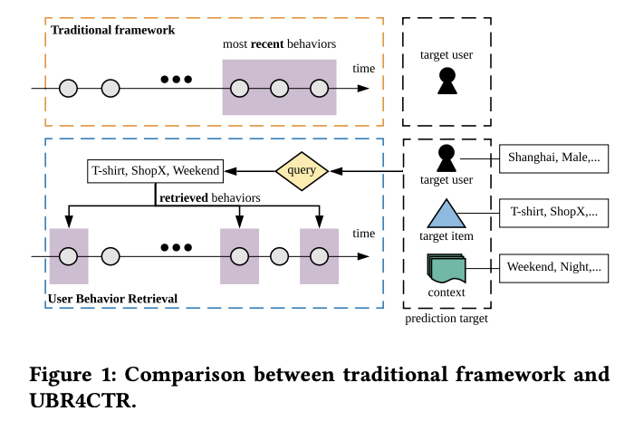
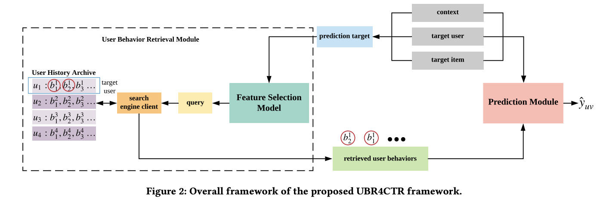
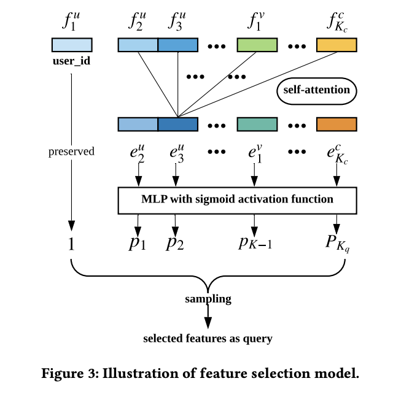
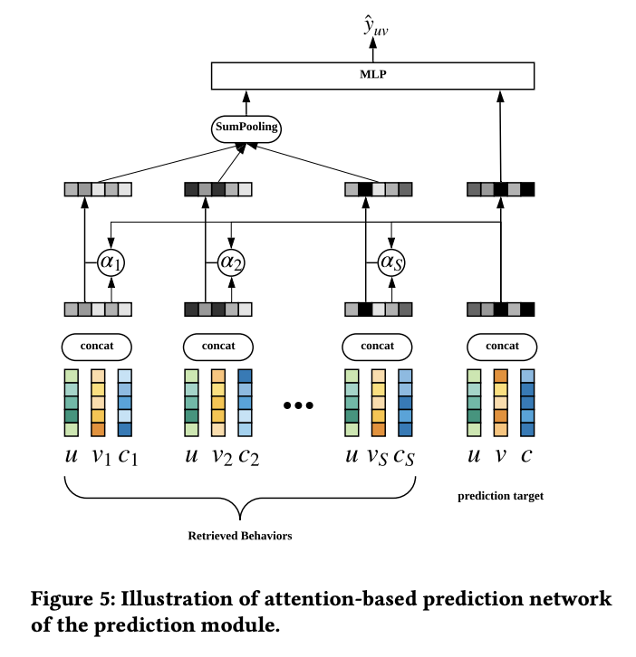

# User Behavior Retrieval for Click-Through Rate Prediction

# 标题
- 参考论文：User Behavior Retrieval for Click-Through Rate Prediction
- 公司：Shanghai Jiao Tong University
- 链接：https://arxiv.org/pdf/2005.14171
- Code：https://github.com/qinjr/UBR4CTR
- 时间：2020
- `泛读`

# 内容

## 摘要
- 问题：
  - 直接馈入长的行为序列将使在线推理时间和系统负载变得不可行。
  - 如此长的历史行为序列中存在大量噪音，导致 sequential model learning 的失败。
  - 目前的工业界做法通常是“截断序列”，只使用近期行为。但这会导致丢失远期历史中的周期性或长期依赖模式
- 方法：
  - 提出 UBR4CTR 框架：
    - 利用一种可学习的搜索方法，从用户整个历史序列中检索出最相关、最合适的行为
    - 将其输入深度模型进行最终预测，而非简单使用最近的记录
- **本质上就是长序列的精准搜索，可根据候选 item 进行调整**

## 1 Introduction
- 问题：
  - 用户积累了海量行为数据（例如淘宝 23% 的用户半年内有超过 1000 条行为），建模这些序列对于捕捉兴趣漂移、长期依赖和周期性模式至关重要。
  - 现有模型的局限：
    - 传统深度模型：侧重特征交互，忽略了序列/时间模式。
    - 截断问题：为满足线上实时推理的延迟要求，工业界通常只使用最近的 50 条行为。这种“截断”导致模型丢失了存储在远期历史中的重要规律。
    - 噪声与开销：简单增加序列长度会引入大量无关噪声，并显著增加计算和存储负担
- 方法：
  - 从数据视角出发：不同于设计更复杂的模型，UBR4CTR 提出从海量历史中检索最相关的行为。
  - 动态检索机制：针对同一个用户的不同目标物品，系统会生成不同的查询（Query），从搜索引擎中检索出最匹配的历史记录，而非一律使用最近的记录。
  - 可学习的检索模块：
    - 查询构建：使用一个自注意力网络，根据当前预测目标的特征（用户画像、目标商品、上下文）动态生成一个查询向量。
    - 行为检索：将该查询用于一个搜索引擎（以倒排索引方式存储用户的历史行为），快速检索出Top-K条最相关的历史行为。关键在于，不同目标商品会生成不同查询，从而检索出不同的历史行为子集。
  - 预测模块：
    - 使用一个基于注意力的深度神经网络，对检索出的Top-K条行为进行精细化建模，并结合原始特征进行最终的CTR预测。
- **主要贡献**
  - 揭示了“检索相关行为”优于“简单截断序列”的事实。
  - 提出了首个能针对不同目标物品和上下文，为同一用户检索不同行为集的框架。
  - 在三大真实电商数据集上验证了该框架的有效性，并证明其具备低成本部署到工业生产线的可行
- **本质上是SIM（hard）的扩展，在 SIM(hard) 中，我们使用 category of target item  作为 query 从而执行检索。而在 UBR4CTR 中，我们根据不同的 input 来自动选择合适的 query 来执行检索**

    
      <figcaption style="text-align: center">
        UBR4CTR_系统设计
      </figcaption>
    </img>
  

## 2 PRELIMINARIES

## 3 METHODOLOGY

    
      <figcaption style="text-align: center">
        UBR4CTR_模型结构
      </figcaption>
    </img>
  

### 3.1 Overall Framework
- 用户行为检索模块 (User Behavior Retrieval Module)：
  - 特征选择模型：
    - 输入：完整的预测目标信息，即目标用户特征、目标商品特征、上下文特征的集合。
    - 功能：一个可学习的模型，其任务是从输入的多项特征中，选出当前预测任务最有用的一组特征子集，并用这些特征生成一个查询。这个查询将作为后续检索的“钥匙”。
    - 目标：让生成的查询能够检索出对最终CTR预测最有帮助的行为。
  - 用户历史存档：
    - 存储：用户的所有历史行为数据被存储在这里。
    - 组织形式：采用基于特征的倒排索引方式组织。不是简单地按时间顺序排列，而是根据其特征（如商品ID、店铺ID、类目等）建立了快速索引，以便高效检索。
  - 搜索引擎客户端：
    - 功能：接收特征选择模型生成的查询，在用户历史存档的倒排索引中进行快速搜索，并返回一定数量的、最相关的用户行为记录。
  - 流程：
    - 将目标用户、目标项目和上下文特征组合成“预测目标”，送入特征选择模型。该模型选出合适的特征构建成查询语句 (Query)，通过搜索引擎在基于倒排索引的历史档案中检索出相关的行为记录。
- 预测模块 (Prediction Module)：
  - 输入：检索模块返回的相关用户行为记录 + 原始的预测目标特征。
  - 模型：采用一个基于注意力的深度神经网络。
  - 功能：对检索出的行为序列进行精细化建模，通过注意力机制区分不同行为对当前点击概率的影响权重，最终输出CTR预测分数。
  - 输出：给出最终的 CTR 预估结果
- **核心思路**：
  - 动态查询生成：查询不是固定的规则，而是由模型根据每次预测的具体目标（不同商品、不同上下文）动态学习生成的，实现了“因物而异”的检索。
  - 可学习的检索：特征选择模型与预测模型是交替训练的。检索模块的目标是直接与最终CTR预测的效果对齐。
  - 工业级架构：通过引入搜索引擎和倒排索引的设计，使得从全量历史中实时检索成为可能，解决了传统方法只能使用固定短序列的根本局限。

### 3.2 User Behavior Retrieval Module

    
      <figcaption style="text-align: center">
        UBR4CTR_特征选择
      </figcaption>
    </img>
  

#### 3.2.1 Feature Selection Model
- 目标：
  - 从当前预测目标（用户、商品、上下文）的所有特征中，选出最有用的特征子集，并用这些特征构建一个查询。让查询的生成过程可学习、可优化，以服务最终的CTR预测。
- 输入准备：
  - 特征集合：模型输入是除“用户ID”外的所有特征，包括目标用户的其它特征、目标商品的所有特征、上下文的所有特征。它们被拼接成一个长度为 Kq 的特征列表 [f1, ..., fKq]。
  - 特殊处理：用户ID被单独处理，因为它必须被选中，以确保检索范围限定在目标用户自己的行为历史中。
- 特征交互建模（自注意力层）：
  - 目的：不同特征之间并非孤立。例如，“商品类目”和“用户性别”可能共同影响用户行为。自注意力机制能捕捉特征之间的高阶交互关系。
  - 方法：将特征列表 [f1, ..., fKq] 作为查询(Q)、键(K)、值(V) 的输入，通过多头自注意力，让每个特征都能与所有其他特征进行信息交互，从而生成蕴含上下文信息的特征表示 E。然后跑一个标准的自注意力机制。
  - **本质：这里和AutoInt的思路一样，拿自注意力做特征交互**
- 特征选择决策：
  - 采样：根据计算出的概率 P，对特征进行采样，得到一个特征子集。用于后续的搜索 query。
  - 强制加入：用户ID特征始终被强制加入最终的特征子集中，确保检索范围正确。

#### 3.2.2 Behavior Searching
- 核心：
  - UBR4CTR创造性地将搜索引擎的经典方法论应用于用户行为建模：
    - 每个用户行为（如一次点击）被视为一个 “文档”。
    - 行为中的每个特征（如商品ID、店铺ID、类目ID）被视为文档中的一个 “词条”。
  - **本质上就是把每次行为转成文档，用这个行为下每个特征发生的具体（离散的值）值作为词条**
- 倒排索引的构建：
  - 结构：为每个特征值（如 user_id_1、brand: Nike）建立一个 “倒排列表”，列表中记录了所有包含该特征值的行为文档ID。
  - 示例：
    - user_id_1 的列表：包含用户1的所有历史行为。
    - brand: Nike 的列表：包含所有品牌为Nike的商品的行为。
  - 目的：通过倒排索引，可以极快地找到同时满足多个特征条件的行为集合。跟树的搜索一样，快速搜索符合的节点同时去并集。
- 查询逻辑与候选集生成：
  - 当特征选择模型生成查询特征集 q = {f1, f2, ..., fn} 后，检索逻辑如下：
    - 基本形式：f_u_1 AND (f1 OR f2 OR ... OR fn)，即用户ID必须匹配（限定检索范围），并且行为文档需包含查询特征集中的至少一个特征。
    - 候选集计算：取 f_u_1 的倒排列表与 f1 至 fn 倒排列表的并集进行交集运算，得到初步的候选行为集合。
  - **本质上是生成，当前用户Id下，所有候选特征对应的过去行为中包含某个候选特征的并集，再和用户取交集，的候选行为集合。注意这里候选和历史行为都使用同样的特征类型（用户、商品、上下文）**
- BM25 相关性排序：
  - 得到候选集后，需要从中选出最相关的Top-S个行为。UBR4CTR采用了经典的BM25算法进行排序：
    - 公式：s = Σ IDF(fi) * (tf * (k1+1)) / (tf + k1)
    - 关键因子：
      - IDF（逆文档频率）：衡量特征 fi 的稀有程度。稀有特征（如特定小众品牌）获得更高的权重，因为它们通常代表更强的个性化偏好；常见特征（如“曝光”）权重较低。这天然实现了对噪声的过滤。
      - TF（词频）：由于一个行为文档中每个特征最多出现一次，因此 tf 值为0或1。
      - 文档长度归一化：由于所有行为文档的特征数量相同，文档长度因子简化为1，简化了计算。
      - 参数：采用经典设置 k1=1.2, b=0.75
  - **本质上，计算排序，按照特征的发生的稀有度和发生的频次来排序过去的行为，本质上也是一种hard attention的思路，只是多种特征的hard attention的融合**

### 3.3 Prediction Module

    
      <figcaption style="text-align: center">
        UBR4CTR_预测模型
      </figcaption>
    </img>
  

- 核心：
  - 检索模块输出的Top-S个用户行为：B^u = {b^u_1, b^u_2, ..., b^u_S}，其中每个行为 b^u_i 包含了行为发生时的用户、商品、上下文信息。
  - 原始的预测目标特征：t = [u, v, c]，即当前请求的目标用户、目标商品和上下文。
  - 类似 DIN 的核心思想——注意力机制，以区分不同检索出的行为对当前预测目标的重要性。
- 计算行为权重：
  - 将每个检索出的行为 b^u_i 与当前预测目标 t 共同输入一个注意力网络 Att。
  - Att 是一个多层感知机，输出一个原始权重 w_i，表示该行为与当前预测目标的相关性强度。
  - 公式：w_i = Att(b^u_i, t)
  - **和前面特征选择计算特征交叉时候 Q，K，V 的区别：**
    - t 包含了 user ID 特征，而 Q，K，V 不包含。
    - t 是向量拼接而成，维度为 (K_q + 1) x D；而 Q，K，V 为向量堆叠而成，维度为 K_q x D
- 归一化权重：
  - 对所有权重 w_i 应用 softmax 函数，得到最终的注意力分数 α_i，确保所有行为的权重和为1。
  - 公式：α_i = exp(w_i) / Σ exp(w_j)
- 生成综合用户表示：
  - 使用计算出的注意力分数 α_i，对检索出的行为向量 b^u_i 进行加权求和池化，得到一个综合的用户兴趣表示向量 r_u。
  - 公式：r_u = Σ α_i · b^u_i
- 最终CTR输出：
  - 将综合用户表示 r_u 与原始的预测目标特征 [u, v, c] 拼接起来。
  - 输入一个三层的多层感知机（宽度分别为200、80、1），最后一层使用 Sigmoid 函数输出最终的CTR预测概率 ŷ_uv。
- **本质上这里和 DIN 的思路基本一模一样，都是用 MLP + ReLU 激活函数计算权重，最后加权融合。**

### 3.4 Model Training
- 训练目标：
  - 最大化对数似然
- 公式：
  - J = max_θ max_ϕ Σ_u Σ_v E_{B^u ~ π_θ(B^u|q)} [LL(y_uv, f_ϕ(B^u, u, v, c))]
  - 前半部分是检索的结果，后半部分是对 target user-item pair （u, v）的预测分数的对数似然
- 核心思想：
  - 同时优化检索模块的参数 θ 和预测模块的参数 ϕ，使得从检索分布 π_θ 中采样出的行为 B^u，经由预测网络 f_ϕ 计算后，能得到最大的对数似然（即预测最准）
- 策略：
  - 两大模块的交替优化，由于检索模块涉及离散的特征选择采样，无法直接使用标准的梯度下降，UBR4CTR采用了一种交替训练的策略，类似于EM算法。

#### 3.4.1 Optimize the Prediction Module
- 优化预测模块（固定检索模块）
- 目标：
  - 最小化交叉熵损失（加上正则化项）。
  - ϕ* = arg min_ϕ [ E[-LL] + λ||Φ||² ]
- 方法：
  - 当检索模块 π_θ 固定时，预测网络 f_ϕ 是连续可微的。因此，可以使用标准的随机梯度下降（SGD） 进行优化。这相当于在固定的、检索出的行为数据集上训练一个CTR模型。

#### 3.4.2 Optimize the Retrieval Module
- 核心：
  - 检索模块的核心是特征选择模型，它输出的是特征被选中的概率 p(f_j)，然后通过采样生成离散的查询。这种离散采样过程不可导，因此不能直接用SGD。
- 方案：
  - 采用REINFORCE算法（一种策略梯度方法）来处理离散优化。
  - 视角转换：
    - 将检索模块 π_θ(B^u|q) 视为一个策略（policy），其动作是生成查询并检索出行为 B^u。
  - 梯度估计：
    - 使用似然比技巧，得到梯度的无偏估计：∇_θ J_q ≈ 1/L Σ ∇_θ log π_θ(B^u_l|q) * Reward
  - 奖励函数设计：
    - 原始的 LL(·)（对数似然）作为奖励可能存在尺度不稳定的问题。因此，论文引入 RIG（相对信息增益） 作为奖励函数，它是对数似然相对于经验CTR熵的归一化值，尺度更稳定。
  - 具体计算：
    - 由于检索模块的分布可分解为各特征选择概率的乘积 π_θ = Π p(f_j)，梯度可以进一步表示为对各特征对数概率梯度的求和。

#### 3.4.3 Pseudo Code of Training Process
- 整个训练过程是一个清晰的交替迭代流程：
- 预训练：用初始的特征选择模型生成查询，检索出行为，预训练预测网络一个epoch。这里初始化的预测结果会成为第一次检索的奖励函数。
- 主循环（交替优化直至收敛）：
  - 步骤A（优化检索）：固定预测网络，使用REINFORCE算法（以RIG为奖励）优化特征选择模型（检索模块）一个epoch。
  - 步骤B（重新检索）：用更新后的特征选择模型，为所有训练样本重新生成查询，并通过搜索引擎获取新的检索结果 B。
  - 步骤C（优化预测）：固定检索模块，使用新检索出的行为 B，通过SGD优化预测网络一个epoch。
- **本质上实现了端到端的学习过程，采用了强化学习的思路，把离散的检索过程不再是人为定义的相关性，而是通过CTR的结果变成奖励机制，来持续学习检索的过程**

### 3.5 Model Analysis
- 结论
  - UBR4CTR的总时间复杂度为 O(T + Kq · N/F)，在工业级海量数据场景下是可行且高效的。其中：
    - T：单个用户的平均行为序列长度（通常有限，如数百至数千）
    - Kq：查询中包含的特征数量（通常很小，如10-20）
    - N：所有用户行为的总数（可高达千亿级）
    - F：全局唯一特征的总数（如不同商品ID、店铺ID等）
- 拆解：

| 计算步骤        | 时间复杂度           | 关键因素                                           | 工业可行性分析                                                                                                                     |
|:------------|:----------------|:-----------------------------------------------|:----------------------------------------------------------------------------------------------------------------------------|
| **倒排列表检索**  | O(1)            | 哈希索引直接定位                                       | 无论数据量多大，检索特定特征值的倒排列表都是常数时间，**完全不受N增长影响**。                                                                                   |
| **候选集交集运算** | O(T + Kq · N/F) | T: 用户平均序列长度 Kq: 查询特征数 N/F: 平均每个特征的倒排列表长度 | - T是用户级常量（如1000） - Kq很小（<20） - N/F ≈ 平均每个特征值出现在多少个行为中？这是一个**可控的常数**（如平均每个商品ID出现在1000次点击中），而不是随总数据量N线性增长。因此此项**整体可控**。 |
| **BM25排序**  | 线性于候选集大小，不增加复杂度 | 与上一步相同                                         | 排序开销已被包含在候选集处理中，无额外复杂度。                                                                                                     |
| **特征选择模型**  | O(Kq²)          | 自注意力的复杂度                                       | Kq很小，Kq²是**极小常数**，可忽略。                                                                                                      |
| **预测模块**    | O(C)            | 注意力网络计算成本                                      | 可并行计算，且输入规模（检索出的S条行为）固定，**常数时间**。                                                                                           |

- **工业可行性的理论保障**：
  - UBR4CTR通过将经典的搜索引擎架构（倒排索引）与深度学习模型相结合，在理论上证明了其处理超大规模用户行为数据的可行性：
  - 可扩展性：复杂度不与总数据量N成线性关系，而是与平均特征频率 N/F 和用户平均序列长度 T 相关，这两者在业务稳定后都是常数级。
  - 在线延迟可控：核心检索操作 O(T + Kq·N/F) 在工业实践中可以控制在毫秒级，满足线上服务要求。
  - 模型复杂度可忽略：特征选择和预测模块的复杂度都是与Kq或固定输入规模相关的常数，不影响整体扩展性。

## 4 EXPERIMENTS
- RQ1 ：与其他 baselines 相比，UBR4CTR 是否实现了最佳性能？
- RQ2 ：Algorithm 1 的收敛性能如何？训练过程是否有效且稳定？
- RQ3 ：UBR4CTR 中的检索模块有什么影响，retrieval size 如何影响性能？

### 4.1 Experimental Settings

#### 4.1.1 Datasets
- Source:
  - Tmall
  - Taobao
  - Alipay
- Dataset Preprocessing:
  - user, item and context features 的一行被视为一个 behavior document
  - 手动设计了season id （春季、夏季等）、是否是周末、以及是哪个半月（上半月还是下半月）
- Search Engine：
  - 使用逗号分隔的 tokenizer 将它们插入搜索引擎
  - 使用基于 Apache Lucene 的 Elastic Search 作为搜索引擎客户端
- Train & Test Splitting：
  - 使用 time step 来拆分数据集
- Hyperparameters：
  - UBR4CTR 的 feature selection model 的学习率从 {1×10−6, 1×10−5, 1×10−4} 中搜索
  - attention based prediction network 的学习率从 {1×10−4, 5×10−4, 1×10−3} 中搜索
  - 正则化项从 {1×10−4, 5×10−4, 1×10−3} 中搜索
  - Batch size 从 {100, 200} 中搜索

#### 4.1.2 Evaluation Metrics
- CTR
- Logloss

#### 4.1.3 Baselines
- GRU4Rec 基于 GRU ，它是第一个工作使用 recurrent cells 建模user behavior序列从而用于 session-based 推荐。
- Caser 是一个 CNNs-based 的模型，它将用户序列视为图像，因此使用 horizontal and vertical convolutional layers 来捕获user behavior的时间模式。
- SASRec 使用Transformer。它将user behavior视为 tokens 的一个序列，并使用自注意机制和 position embedding 来捕获behavior之间的依赖关系。
- HPMN 是一个 hierarchical periodic memory network ，旨在处理非常长的用户历史序列。此外，user memory state 可以增量更新。
- MIMN 基于 Neural Turing Machine ，它建模了用户兴趣漂移的 multiple channels 。该模型作为 user interest center 的一部分实现，可以对非常长的user behavior序列进行建模。
- DIN 是第一个在在线广告 CTR prediction 中使用注意力机制的模型。
- DIEN 使用具有注意力机制的双层 RNN 来捕获不断变化的用户兴趣。它使用所计算出的 attention values 来控制第二个 recurrent layer ，称为 AUGRU 。
- UBR4CTR

### 4.2 Performance Comparison: RQ1
- UBR4CTR 使用的behavior比其他 baselines 少 80% ，但仍然具有最佳性能。这表明较长的序列可能包含更多噪音和不相关信息，因此有必要从整个序列中仅获取最有用的数据。

### 4.3 Learning Process: RQ2
- 学习曲线显示，当预测网络趋于收敛时，开始训练检索模块会为模型带来二次性能飞跃，这表明检索到了更具价值的行为数据
- 检索模块是在 prediction network 之后训练的。这意味着当 prediction network 即将收敛时，检索模块开始训练，之后 prediction network 的性能将有所突破。

### 4.4 Extensive Study: RQ3
- 检索数量并非越多越好。实验发现每个数据集都存在一个“最优检索大小”；检索量过大会引入噪声，而过小则信息不足
- 消融实验显示，无论是简单的求和池化模型（SP）还是复杂的注意力网络（ATT），在装备了检索模块后（即 UBR_SP 和 UBR4CTR），其 AUC 和 Log-loss 均得到了显著改善

## 5 DEPLOYMENT FEASIBILITY
- 部署简便性：该框架已在一家主流银行的推荐平台上部署。其核心变动在于获取历史行为的方式（即建立行为搜索引擎），而预测流水线基本保持不变。
- 系统负载优势：相比于需要将整个行为序列留在内存中的传统方法，UBR4CTR 只需检索相关的部分，极大地减轻了内存负担。
- 推理延迟表现：
  - 在三个真实数据集上的平均推理时间均低于 1ms，完全满足在线服务的性能要求。
  - 虽然比 DIEN 慢约 15% 到 30%，但考虑到其带来的显著性能提升，这种微小的延迟增长在工程上是可接受且有进一步优化空间的。
- 复杂度可控：其时间复杂度受唯一特征数量的调节，增长非常缓慢，因此在处理超长序列时具有良好的扩展性

## 7 CONCLUSION AND FUTURE WORK
- 总结：
  - 提出从特征产生query到从用户整个历史序列中检索出最相关、最合适的行为的框架
  - 提出把搜索到的行为再放进去CTR的预测模型
  - 同时提出了如何把上述两个模型并联在一起交替训练
- 未来：
  - 分布式训练算法：
    - 开发更高效的分布式训练算法，使框架能够以小批量（mini-batch）的方式更快速地完成训练。
  - 改进索引与检索方法：
    - 探索更有效的索引结构和检索技术，以进一步优化用户行为档案的存储与搜索效率

# 思考

## 本篇论文核心是讲了个啥东西
- 提出了一种将信息检索技术融入CTR预测的全新框架。其核心思想是：不再像传统方法那样对所有候选商品使用固定的最近N条用户行为序列，而是为每一个（用户-商品-上下文）预测目标，动态地从用户的全量历史行为中检索出最相关的子集，再用于CTR预估。
- 该框架由两大模块构成：
  - 可学习的检索模块：包含一个特征选择模型（基于自注意力）和一个搜索引擎（基于倒排索引+BM25）。特征选择模型根据预测目标动态生成查询，搜索引擎据此检索出Top-K条历史行为。
  - 预测模块：采用基于注意力的深度神经网络，对检索出的行为进行加权聚合，并结合原始特征输出CTR预测分数。
- 同时整个系统通过交替优化（预测模块用SGD，检索模块用REINFORCE）实现端到端联合学习。
- **本质是是高效的搜索相关行为 + 轻量的用户行为attention + CTR，高效搜索这里本质和SIM一样，只是多个（计算特征重要性并且采样后的特征）hard search 的结合**

## 是为啥会提出这么个东西，为了解决什么问题
- 问题：
  - 信息丢失：无法利用蕴含在更早历史中的长期依赖、周期性模式等有价值信号。
  - 噪声引入：若直接使用更长序列，大量无关行为会淹没关键信号，且计算开销爆炸。
  - 静态不变：对同一用户的不同候选商品，传统方法使用完全相同的行为序列，忽略了不同目标对历史的需求差异。
- 方法：
  - 提出可学习的检索模块，解决信息丢失和噪音引入，同时检索的时候不同item采用的特征不一样，达到动态学习

## 为啥这个新东西会有效，有什么优势
- 动态目标感知的检索：
  - 特征选择模型为每个预测目标生成定制化查询，使检索出的行为与当前商品、上下文高度相关，比固定截断更精准。
  - 倒排序中的打分方式，BM25中的IDF因子天然赋予稀有特征更高权重，自动过滤常见噪声，突出个性化信号。
- 工业级可扩展性：
  - 倒排索引结构使检索复杂度为 O(T + Kq·N/F)，其中 N/F 是平均特征频率（常数），T是用户平均序列长度（有限），确保了亚线性扩展，能支撑千亿级行为数据。
  - 检索与预测分离，检索模块可用传统搜索引擎技术高效实现。
- 端到端联合优化：
  - 通过REINFORCE算法将离散的检索过程纳入梯度传播，使检索模块的目标直接与CTR预测效果对齐，学会检索对预测最有帮助的行为，而非仅仅“相似”的行为。
- 精细的兴趣建模：
  - 预测模块的注意力机制能进一步区分检索出的行为对当前目标的重要性，实现从“粗筛”到“精排”的完整流程。

## 与此论文类似的东西还有啥，相关的思路和模型
| 模型/方向                                | 核心思想                           | 与UBR4CTR的关系                                                                        |
|:-------------------------------------|:-------------------------------|:-----------------------------------------------------------------------------------|
| **SIM（Search-based Interest Model）** | 两阶段级联：GSU（硬搜索/软搜索）+ ESU（精细建模）。 | **最相似**，都是“检索+精排”范式。区别在于SIM的检索更简单（基于规则或向量内积），而UBR4CTR引入了**可学习的特征选择+搜索引擎**，查询生成更灵活。 |
| **MIMN / HPMN**                      | 记忆网络压缩长期兴趣，在线增量更新。             | 属于另一条技术路线——**记忆压缩**，而非检索。MIMN在记忆写入阶段舍弃目标信息，而UBR4CTR将目标信息前置到检索阶段。                   |
| **DIN / DIEN**                       | 注意力机制/序列模型，建模短期行为序列。           | UBR4CTR的预测模块直接继承其思想，但输入不再是最新N条，而是**检索出的动态子集**。                                     |

## 论文有什么可以改进的地方，可以后续继续拓展研究
- 查询生成的优化：
  - 当前特征选择模型基于自注意力，可引入更复杂的特征交互（如Transformer深层堆叠）或用户即时兴趣融合（如将用户短期行为也作为查询输入）。
  - 可探索多查询向量，一次检索覆盖用户多个兴趣维度。
- 检索效率与精度的平衡：
  - BM25虽经典，但可引入学习型排序模型（如LambdaRank）对检索结果进行重排。
  - 结合近似最近邻搜索（如HNSW、FAISS）替代倒排索引，实现向量级别的语义检索，并与当前的特征检索互补。
- 长期记忆与短期行为的融合：
  - 检索出的行为可能缺失近期的即时兴趣。可设计门控机制将检索结果与最新N条行为融合。
  - 借鉴MIMN，对极高频用户的完整行为先通过记忆网络压缩成“概览”，再与检索结果结合。
- 可解释性：
  - 检索出的行为可作为推荐理由的素材，分析哪些特征/行为导致了最终推荐，提升系统可信度。

## 在工业上通常会怎么用，如何实际应用
- 可学习的检索模块可以参考，核心在于构建倒排序表（实际落地和重铸比较费时）
  - 同一个候选item，包含user，item，context 信息作为特征，这里可以参考，加入上下文特征是一个创新点
- 预测模块就是DIN的思路，常见方法

## 参考
- https://www.huaxiaozhuan.com/%E6%B7%B1%E5%BA%A6%E5%AD%A6%E4%B9%A0/chapters/9_ctr_prediction8.html
- https://zhuanlan.zhihu.com/p/1938966410215798655