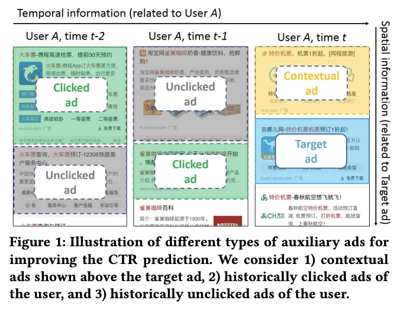
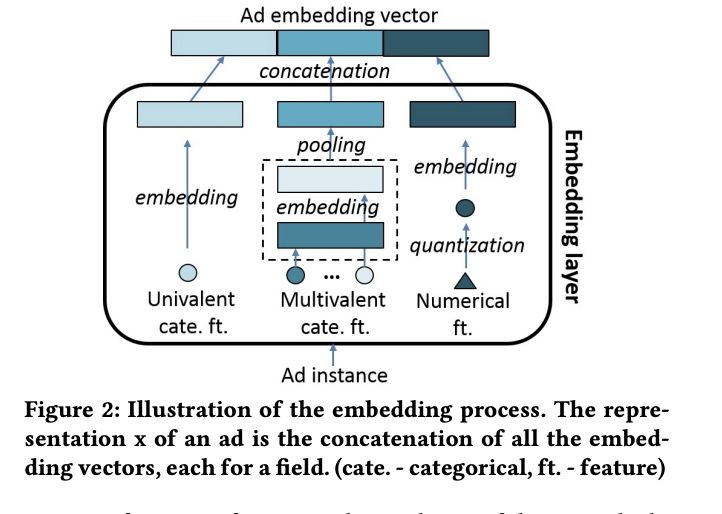
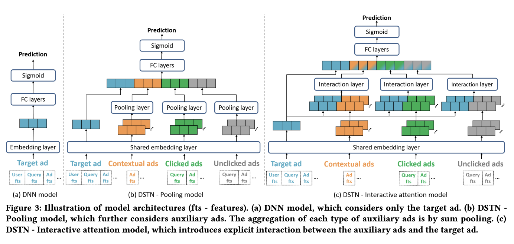
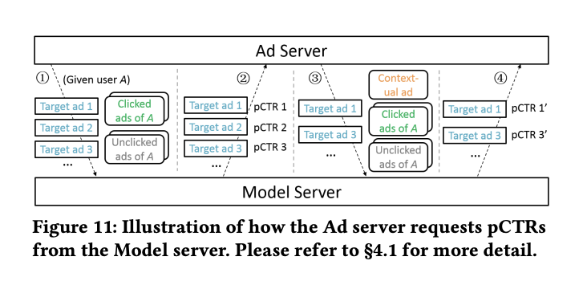

# Deep Spatio-Temporal Neural Networks for Click-Through Rate Prediction

# 标题
- 参考论文：Deep Spatio-Temporal Neural Networks for Click-Through Rate Prediction
- 公司：Alibaba
- 链接：https://arxiv.org/pdf/1906.03776
- Code：https://github.com/oywtece/dstn
- 时间：2019
- `泛读`

# 内容

## 摘要
- 问题：
  - 目前为止所有的方法独立地考虑每个目标广告，（目前构建的特征都是围绕当前ad构建的各种维度的特征）但是忽略了可能影响目标广告 CTR 的其它广告
- 方法：
  - 提出了DSTN模型：
    - 空域 spatial domain 角度：我们考虑在同一个页面上出现的、目标广告上方展示的上下文广告 contextual ad。
      - 背后的直觉是：共同展示的广告可能会争夺用户的注意力。
    - 时域 temporal domain 角度：我们考虑用户的历史点击和历史未点击广告。（这里其实是 user behavior sequence 的角度）
      - 背后的直觉是：历史点击广告可以反映用户的偏好，历史未点击广告可能一定程度上表明用户的不喜欢。

## 1 介绍

    
      <figcaption style="text-align: center">
        DSTN 辅助数据类型
      </figcaption>
    </img>
  

- 三种类型的辅助数据auxiliary data：
  - 同一个页面上出现的、目标广告上方展示的上下文广告contextual ad
  - 用户的历史点击广告clicked ad
  - 用户的历史未点击广告 unclicked ad
- 问题：
  - 由于每种类型辅助广告的数量可能会有所不同，因此模型必须能够适应所有可能的情况。
    - 可能有 1 个上下文广告、2 个历史点击广告、4 个历史未点击广告
    - 也可能是 0 个上下文广告、3 个历史点击广告、2 个历史未点击广告。
  - 由于辅助广告不一定和目标广告相关，因此模型应该能够提取有用的信息并抑制辅助数据中的噪声。 
    - 例如，如果历史点击广告集合是关于咖啡、衣服、汽车的广告，而目标广告是咖啡广告，那么模型能够学到哪个历史点击广告对目标广告的 CTR 预估更有用。
  - 每种类型辅助广告的影响程度可能会有所不同，并且模型应该能够区分它们的贡献。
    - 例如，应该区别对待上下文广告和历史点击广告的重要性。
  - 模型应该能够融合所有可用的信息。
- 解决方法：
  - 提出DSTN的三种变体：
    - 池化pooling 模型
    - 自注意力self-attention模型
    - 交互式注意力interactive attention 模型
- **主要贡献**：
  - 探索了三种类型的辅助数据，从而提高目标广告的 CTR 预估。这些辅助数据包括：展示在同一个页面上的、目标广告上方的上下文广告，用户历史点击广告，用户历史未点击广告。 
  - 提出了有效融合这些辅助数据来预测目标广告 CTR 的 DSTN 模型。DSTN  模型能够学习辅助数据和目标广告之间的交互，并强调更重要的 hidden information 。 
  - 在真实广告系统的三个大规模数据集进行了广泛的离线实验
  - 在线上搜索中部署了性能最好的 DSTN。进行了在线 A/B test，在线 CTR 得到显著提升。

## 2 DSTN MODELS

## 2.1 Overview
- CTR 预估问题：在线广告中的CTR 预估任务是建立一个预估模型来估计用户点击特定广告的概率。
- 传统 FM, DNN, Wide & Deep 之类的经典 CTR 预估模型主要考虑目标广告，它们聚焦于如何表示样本特征，以及如何学习特征交互。
- 辅助数据（即辅助广告）来提升 CTR 预估。我们必须解决以下问题： 
  - 如何适应每种类型辅助广告的不同数量的各种情况。
  - 如何从辅助广告中提取有用的信息并抑制噪音。
  - 如何区分每种类型辅助广告的贡献。
  - 如何融合所有可用信息。

## 2.2 Embedding

    
      <figcaption style="text-align: center">
        DSTN_embedding处理
      </figcaption>
    </img>
  

- 一般有三种类型特征并进行不同的处理，如下图所示。
  - cate. 表示 categorical
  - ft. 表示 feature
  - ad instance 表示样本
  - ad embedding vector 表示样本 embedding 向量
- 单值univalent 的离散特征：这类特征仅包含单个值
  - 例如用户 ID 就是这类特征的代表
- 多值 multivalent 的离散特征：这类特征包含一组值
  - 广告标题就是这类特征的代表。假设广告标题为 ABCD，那么它的 bi-gram 表示为：AB, BC, CD, 由于这类特征包含取值的数量不是固定的，因此我们首先将每个值映射到 embedding 向量，然后执行池化来生成固定长度的聚合向量。
- 数值特征：
  - 用户年龄是数值特征的典型例子。每个数值特征首先被离散化为离散的桶，然后表示为桶ID，最后将每个桶 ID 映射到 embedding 向量。
- 最终经过 embedding 过程之后，样本的 representation x 是所有 embedding 向量的拼接，每个 embedding 向量对应于一个 field，如上图。
- embedding后：
  - 每个目标广告target ad 获得了一个 embedding 向量 x_t，其中 d_t 为目标广告 embedding 维度。
  - 上下文广告集合获得了 n_c 个 embedding 向量 x_c，其中 n_c 为上下文广告数量，d_c 为上下文广告 embedding 维度。
  - 历史点击广告集合获得了 n_l 个 embedding 向量 x_l，其中 n_l 为历史点击广告数量，d_l 为历史点击广告 embedding 维度。 
  - 历史未点击广告集合获得了 n_u 个 embedding 向量 x_u，其中 n_u 为历史未点击广告数量，d_u 为历史未点击广告 embedding 维度。
- 注意：
  - x_t 包含了用户 embedding、广告 embedding 、上下文 embedding （如 query ）。 
  - x_l, x_u 仅包含广告 embedding、上下文 embedding ，而不包含用户 embedding 。
    - 因为历史点击广告、历史未点击广告和目标广告都是同一个用户，没必要提供冗余的、重复的用户信息。
  - x_c 仅包含广告 embedding，而不包含用户 embedding、广告 embedding 。
    - 因为上下文广告和目标广告都是同一个用户、同一个上下文（如 query ）。

## 2.3 DSTN - Pooling Model

    
      <figcaption style="text-align: center">
        DSTN_模型结构
      </figcaption>
    </img>
  

- 问题：
  - 不同用户的辅助广告数量 n_c，n_l，n_u可能千差万别，无法放进模型训练
  - 将每种类型的、可变长度的辅助实例auxiliary instance 处理成固定长度的向量
- 方法：
  - 使用 sum 池化来实现
    - n_c 个上下文广告的聚合 representation 向量 x_c
    - n_l 个历史点击广告的聚合 representation 向量 x_l
    - n_u 个历史未点击广告的聚合 representation 向量 x_u
    - 如果某种类型的辅助广告完全缺失（例如，根本没有上下文广告）则我们将全零向量作为其聚合 representation 向量
  - 下一步融合这些 representation 中包含的信息
    - v = W_t * x_t + W_c * x_c + W_l * x_l + W_u * x_u + b
    - 通过四个独立的矩阵 W 将不同的类型的 representation 映射到相同的语义空间
    - 使用不同的权重来融合来自不同类型数据的输入。因为不同类型的辅助数据对于目标广告的影响程度可能不同，因此需要区分这些差异。
    - 本质上还是权重融合，但是每个语义需要转化到相同的 space 下进行，独立控制，保证即使一种语义表达完全消失，融合的 representation v 也不会受影响
  - 简化上一步，连接FC层变成
    - v = W * m+b, where W ∈ R D_v ×(D_t + D_c + D_l + D_u)
    - m = [x_t, x_c , x_l, x_u]，其实就是把四种语义的 representation 拼接在了一起
    - 然后把原始的四个矩阵也拼接再了一起，这样一起计算更快，其实就是全连层。
    - z_1 = ReLU(W * m + b)
    - z_L = ReLU(W_L * z_L−1 + b_L)
    - 每一层就是标准的FC带激活函数
  - 最后一层sigmoid，每一层输出加入dropout
  - loss 是交叉熵损失函数
  - 本质上还是DNN模型的结构，只是引入了auxiliary ad相关的特征，换句话来说就是加了特征，并且只是 sum pooling了一下
- 缺点：
  - 当给定用户在给定位置展示不同的目标广告时只有 x_t 发生变化，而所有的辅助representation x_c， x_l， x_u 都保持不变。这意味着辅助 representation 仅用作静态基础信息。
  - 由于x_c， x_l， x_u 是通过 sum 池化生成的，因此有用的信息很容易被淹没在噪声中。
  - 这里多说一句，使用sum 和 average pooling基本上是一致的，因为 average 就是 sum 除以一个常数后的结果，链接MLP后基本上没区别，MLP会学习这个权重。
  - 例如，如果目标广告是关于咖啡的，但是大多数历史点击广告是关于衣服的、少部分历史点击广告是关于咖啡的。那么，虽然关于衣服的这些历史点击广告对于目标广告的贡献很小，但是  sum 的结果显然是由这些关于衣服的历史点击广告所主导。
  - 换言之就是辅助特征之间没有加入重要性的概念，这个概念在 DIN 和更早的 AFM 里面就已经提出。

## 2.4 DSTN - Self-Attention Model
- 问题：
  - 为了解决上面模型的缺点，sum pooling 对所有语义不加以区分，丢失信息
- 方法：
  - 提出自注意力机制，即 DSTN-Self Attention 模型。
  - 在每种类型的辅助数据上应用自注意力从而强调更重要的信息。
  - 以上下文广告为例子：
  - x˜c = sum(αc_i({xc_i}i) * xc_i)(1, n_c)
  - αc_i 是第i个上下文广告的注意力系数，也就是对所有的上下文广告乘以一个自注意的权重
  - αc_i = exp(βc_i) / sum(exp(βc_i′))(1, n_c), βc_i = f(xc i)
  - 这里的βc_i是一个标量，f 是一个函数，可以是MLP
  - 换言之就是对每个上下文广告转化成一个标量，然后计算类似softmax的方式算自注意权重。最后再乘回去每个广告，变成一个带权重的pooling方式。
- 优点：
  - 对每种辅助数据，更加突出有用的信息（权重大），抑制无用部分的信息，解决 sum pooling的问题
- 缺点：
  - 权重 βc_i 仅仅基于上下文辅助广告来计算，它并未捕获这个上下文辅助广告和目标广告 x_t 之间的关系。例如，无论目标广告是关于咖啡还是衣服，上下文辅助广告的重要性都保持不变。
  - 归一化的计算方式通过之间的相对重要性来计算，保证了权重和一定是1，但是即使所有的上下文辅助广告 xc_i 和目标广告 x_t 无关，由于归一化的存在，最终的注意力系数 αc_i 仍然很大。
  - 每种类型辅助广告的绝对数量也很重要，但是归一化并未捕获这种效果。例如，假设每个上下文辅助广告的重要性都相同，则采用归一化的注意力系数完全无法区分是 1 个上下文辅助广告、还是 100 个上下文辅助广告。

## 2.5 DSTN - Interactive Attention Model
- 问题：
  - 基于上面第二个模型的缺点，没有和target 广告之间交互
- 方法
  - 提出引入每种类型辅助广告和目标广告之间的显式交互，即 DSTN-Interactive Attention 模型
  - 以上下文广告为例子：
  - x˜c = sum(αc_i(x_t, xc_i) * xc i)(1, n_c)
  - αc_i 现在是目标广告 x_t 和上下文辅助广告 xc_i 的函数。通过这种方式，基于目标广告来动态调整上下文辅助广告的重要性
  - αc_i(x_t, xc_i) = exp(h^T ReLU(W_t_c * [x_t, xc_i] + b_t_c1) + b_t_c2)
  - 权重的计算与上下文广告和target ad 两部分有关，具体可以采用一个单隐藏层的MLP来计算（激活函数为relu）
  - αc_i 不再依赖于其它上下文辅助广告，也不需要进行归一化。如果没有任何上下文辅助广告能够提供信息，则所有的 αc_i 都会很小
  - 同理生成 x˜l 和 x˜u
  - 最终模型表达式为 v = W_t * x_t + W_c * x˜c + W_l * x˜l + W_u * x˜u + b
- 优点：
  - 辅助 representation v 现在不再使用静态基础信息，而是根据目标广告来动态调整。这意味着模型会针对目标广告自适应地提取辅助数据中的更多有用信息。
    - 假设历史点击广告和咖啡、衣服、汽车相关。
      - 当目标广告 x_t 和咖啡有关时，历史点击的咖啡广告应该为 x_t 做出更大的贡献。
      - 当目标广告 x_t 和汽车有关时，历史点击的汽车广告应该为 x_t 做出更大的贡献。
  - 此外，模型仍然保留了使用不同的权重来融合不同类型辅助数据输入的特点。也就是后续的 W_c，W_l，W_u
  - 最后，模型中的权重并没有在所有上下文辅助广告之间进行比较，这避免了归一化导致的问题。

## 3 OFFLINE EXPERIMENTS

## 3.1 数据
- Avito advertising dataset
- Search advertising dataset
- News feed advertising dataset

## 3.2 对比模型
- LR
- FM
- DNN
- Wide&Deep
- DeepFM
- CRF
- GRU
- DSTN-P
- DSTN-S
- DSTN-I

## 3.3 参数
- embedding 向量维度设为 10。因为 distinct 特征数量太高，如果embedding 维度太大则参数规模异常巨大。 
- DNN, Wide&Deep, DeepFM, GRU, DSTN 中全连接层的层数设为 2，每层的维度分别为512, 256。 
- dropout rate 设为 0.5。
- GRU 的隐层维度设置为 128。
- DSTN-S 中的 f 函数是具有单隐层的 MLP，隐层维度为 128。
- DSTN-I 中的 h 的维度也设为 128。 
- 所有方法都在Tensorflow 中实现，并通过 Adagrad 算法进行优化。
- batch size 设为 128
- 使用用户最近 3 天的历史行为，我们进一步限制 n_c <=5，n_l <=5，n_u <=5。也就是说，如果历史点击广告数量不超过 5 个，则我们全部使用；如果超过5 个，则我们使用最新的 5 个

## 3.4 Evaluation Metrics
- AUC
- Logloss

## 3.5 Effectiveness
- 将 wide 部分和 deep 部分组合在一起可以提高整体的预测能力。
- GRU 利用了历史点击广告。效果很好对比非sequence模型。
- DSTN-P 优于 GRU。原因有两个：
  - 用户行为序列中的连续行为可能没有很好的相关性。例如，某个用户最近点击了零食和咖啡的广告。下一次点击的广告可能是关于牙膏的，而不是关于食品的。这仅仅取决于用户的需要，而不是与之前点击广告的相关性。因此，考虑用户行为序列可能不一定有助于提高预测性能。 
  - DSTN-P 可以利用上下文广告、历史未点击广告中的信息。
- 比较 DSTN 的不同变体时，可以观察到：DSTN-S 的性能优于 DSTN-P，而DSTN-I 的性能进一步优于 DSTN-S 。
- 这些结果表明：和简单的 sum 池化相比，self attention 机制可以更好地强调有用的信息。而interactive attention 机制显式地引入了目标广告和辅助广告之间的互动，因此可以自适应地抽取比 self attention 更多的相关信息。

## 3.6 Effect of the Type of Auxiliary Data
- 这里定义了计算方式，详细见paper
- 上下文广告、历史点击广告的作用就比历史未点击广告高得多。
- 上下文广告可能会分散用户的注意力，而历史点击广告通常会反映出用户的兴趣。
- 相反，历史未点击广告可能会产生很大的噪音：历史未点击可能表明用户对广告不感兴趣，或者用户根本没有查看广告。

## 3.7 Effect of the Network Depth
- 增加全连接层的数量可以在一开始改善 AUC，但是随后添加更多层时，提升的幅度会降低。
- 添加更多的层甚至可能导致轻微的性能降级degradation。这可能是由于更多的模型参数导致过拟合，以及更深的模型导致训练难度增加而导致的。

## 3.8 Visualization of Ad Embeddings
- 对比了可视化之后的 NN 和 DSTN-I 学到的 ad-embedding 基于 t-SNE
- DNN 明显没有 DSTN-S 学习更清晰的簇，并清楚地区分了不同的子类目。

## 3.9 Visualization of Attention Weights
- 上下文广告：
  - 周围的广告和目标广告越相似，目标广告的点击率就越低。这是因为相似的广告可以分散用户的注意力，因为所有这些广告都提供相似的产品或服务。
  - 对于上下文广告，和目标广告越相似，注意力权重越低。
- 历史点击广告：
  - 历史点击广告和目标广告越相似，注意力权重越高。这是因为：如果用户曾经点击了和目标广告类似的广告，则用户也可能会点击目标广告。
- 历史未点击广告：
  - 历史未点击广告和目标广告越相似，注意力权重越高。这是因为：如果用户过去没有点击和目标广告类似的广告，那么用户很可能也不会点击目标广告。

## 4 SYSTEM DEPLOYMENT AND EVALUATION

## 4.1 Deployment
详细参考paper

    
      <figcaption style="text-align: center">
        DSTN_系统设计
      </figcaption>
    </img>
  

Ad server requests 过程，重复3，4步骤直到满足条件

    
      <figcaption style="text-align: center">
        DSTN_如何用上下文特征
      </figcaption>
    </img>
  

1. 得到所有的候选广告集，并得到对应的特征，此时的上下文广告信息为空。
2. 计算所有广告的点击概率。
3. 选择点击率最高的一个广告。随后把这个广告加入到上下文广告信息中。
4. 对于剩下的广告，再计算所有广告的点击概率。
5. 重复第3步和第4步，直到得到5个展示的广告。

## 4.2 Online A/B Test
- DSTN 的效果始终优于 Wide&Deep，两周的平均 CTR 提升在 6.92%

## 6 CONCLUSION
- 提出三种辅助数据（上下文，点击，未点击），可以帮助CTR更好的预测
- 提出三种框架来学习辅助数据
  - DSTN-P
  - DSTN-S
  - DSTN-I
- 并同时测出 DSTN-I 的效果最好，因为Attention机制的引入能更好的提炼出auxiliary ad特征中对于target ad更加有用的信息、消除噪声对于模型学习的影响。
- 同时提出了一个较为完整的系统架构，给工业系统的开发和部署提供了建议。

# 思考

## 本篇论文核心是讲了个啥东西
- 提出三种辅助数据，可以帮助提升CTR预测
- 同时提出三种模型框架，最终模型 DSTN-I，引入和目标item，计算attention的机制，可以达到最好的效果
- 给出了线上部署的系统设计方案，特别是如何利用上下文特征这部分

## 是为啥会提出这么个东西，为了解决什么问题
- 问题：
  - 基于目前大部分的CTR模型，只考虑当前候选item和用户直接的关系，并没有考虑上下文和历史记录的影响
- 方法：
  - 提出加入两种辅助数据类型：
    - 空间上：
      - 上下文广告
    - 时间上
      - 历史点击
      - 历史未点击
  - 最终提出 DSTN-I 模型，引入计算每一个辅助数据和目标item的attention score 来增加更有用的信息、消除噪声对于模型学习的影响

## 为啥这个新东西会有效，有什么优势
- 对比传统 W&D 之类的特征交叉模型
  - 和DIN一样，更多的关注用户历史行为的影响，这里有个特点是历史未点击的行为也可能对当前候选item有影响，不过从实验来看影响不大。
- 对比其它序列模型，DIN，DIEN，DSIN，BST
  - 引入历史未点击行为
  - 引入空间上的上下文item信息，此辅助数据很有用，因为视觉上来说上下文的item会分散掉当前item的attention

## 与这个新东西类似的东西还有啥，相关的思路和模型
- 系列的sequence model，本质上都是找用户的兴趣演变过程和候选ID的关系
  - DSIN
  - DIN
  - BST
  - DIEN

## 在工业上通常会怎么用，如何实际应用
- 基本上用户的历史行为上和BST一样，可以完全参考
- 这里可以考虑增加上下文信息，也就是搜索后每个item周边的其它item的信息，但是online inference需要重新设计
- 可以参考如何把多种辅助数据融入一起，每一种辅助数据分别和目标后续item计算attention score
  - 优点：
    - 分开计算，sequence可以更长，attention score 更独立，噪音少了一些
  - 缺点：
    - 忽略掉了不同行为直接是否存在sequence的相关性，也就是顺序和演化过程被忽视了。同DIN一样，只考虑重要性。忽视了兴趣演化过程。
    - 这里值得商榷的地方是，业务上来说是否用户的行为存在大量的演化过程呢？也可能搜索里面用户行为本身就是不断变化的（shifting）。
- 这里的 attention score 的计算方式和 DIN并不一样，可以考虑试一试不同的 attention score 的计算方式

## 参考链接
- https://www.huaxiaozhuan.com/%E6%B7%B1%E5%BA%A6%E5%AD%A6%E4%B9%A0/chapters/9_ctr_prediction3.html
- https://zhuanlan.zhihu.com/p/92051642

  

