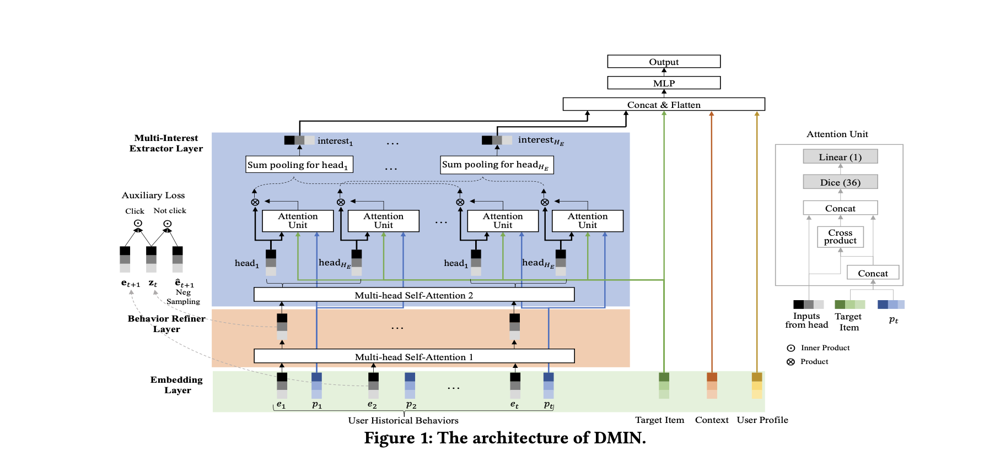

# Deep Multi-Interest Network for Click-through Rate Prediction

# 标题
- 参考论文：Deep Multi-Interest Network for Click-through Rate Prediction
- 公司：Alibaba
- 链接：https://dl.acm.org/doi/pdf/10.1145/3340531.3412092
- Code：https://github.com/reczoo/FuxiCTR/blob/main/model_zoo/DMIN/src/DMIN.py
- 时间：2020
- `泛读`

# 内容

## 摘要
- 问题：
  - 用户在同一时间往往拥有多种共存的兴趣，而行为的改变本质上是由于“潜在主导兴趣”的切换导致的。目前的模型没有能力捕捉这个信息建模。
- 方法：
  - 行为精炼层：
    - 设计了一个使用多头自注意力机制的层，用于捕获更高质量、更具上下文信息的用户历史行为表征。
  - 多兴趣提取层：
    - 提出专门的网络层，从精炼后的行为序列中提取出用户的多个兴趣向量，从而显式地建模用户的多元化兴趣。

## 1 Introduction
- 问题：
  - 用户行为是用户潜在、动态且多样化兴趣的外在表现。目前的模型缺乏这个能力。
  - DIN：
    - 首次引入注意力机制，实现候选商品与历史行为的动态交互，从静态汇总进入“目标相关”的兴趣建模时代。
  - DIEN：
    - 在DIN基础上，引入序列模型（GRU），开始关注兴趣的时序演化。
  - DSIN：
    - 更进一步，通过会话划分捕捉行为序列的内在结构，并利用自注意力提取会话内的兴趣。
- 方法：
  - DMIN的突破：
    - 指出上述模型仍将用户兴趣表征为一个单一向量，而现实中用户兴趣是并行、多元的。因此，DMIN的核心动机是实现从“单一兴趣提取”到“多兴趣解耦”的范式转变。
  - 行为细化层（Behavior Refiner Layer）：
    - 利用自注意力增强行为表征的质量，用于细化和提升用户历史行为中物品的特征表示。
  - 多兴趣提取层（Multi-Interest Extractor Layer）：
    - 旨在从细化后的序列中显式地建模精准捕捉多种潜在兴趣
- **本质上是判断，用户不是“一个有着复杂变化兴趣的人”，而是“一个同时拥有多个兴趣，且哪个兴趣被激活会随场景变化的人”**

## 2 THE PROPOSED METHOD

    
      <figcaption style="text-align: center">
        DMIN_模型结构
      </figcaption>
    </img>
  

### 2.1 Embedding Layer
- 特征分组（四大来源）：
  - 用户画像：用户自身的静态属性，如用户ID、国籍。
  - 目标商品：待评估的候选商品的属性，如商品ID、类目ID、历史统计CTR。
  - 用户历史行为：用户过去交互商品（点击、购买、加购）的序列，每个商品拥有与目标商品相同的特征字段。
  - 上下文：当前场景的环境信息，如时间、匹配类型、触发场景ID。
- 特征编码
  - 常规 embedding 化
  - 用户画像 x_u、行为序列 x_b、上下文 x_c、目标商品 x_t
  - 序列矩阵：
    - x_b = {e1, e2, ..., eT} ∈ R^(T×d_model)
  - 位置编码：
    - 为序列中的第 t 个商品引入了位置编码 p_t ∈ R^(dp)

### 2.2 Behavior Refiner Layer
- 多头自注意力机制:
  - 输入序列 x_b
  - 输出：Z = MultiHead(x𝑏) = Concat(head1, head2, ..., head𝐻𝑅) * W𝑂
- 辅助任务监督：
  - 方法：用当前时刻 t 精炼后的表示 z_t，去预测用户真实的下一项行为 e_{t+1}（正样本），并与随机采样的负样本（除去click的这个正样本） ê_{t+1} 进行对比。
  - **本质上和 TransActv2 的思路一样，只是loss换成了对比学习的loss**
- 这一层的思路其实就是用transformer来学习序列内的相关性，和大部分论文思路一样

### 2.3 Multi-Interest Extractor Layer
- 核心目标：行为序列 → 多兴趣向量
  - 将经过精炼的、富含上下文信息的行为序列 Z，转化为一组（H_E 个）用户兴趣向量 interest_h。每个向量代表用户的一个潜在兴趣维度（如“运动鞋”、“编程书籍”、“咖啡器具”）
- 二次使用多头自注意力：
  - 在行为精炼层之后，再次使用一个多头部自注意力网络来处理序列 Z。
  - 意义：每个注意力头被设计为负责捕捉一种特定的兴趣模式。H_E 个头就会产生 H_E 组不同的序列表示 I ∈ R^(T×H_E×d_model)。可以理解为，每个头像一个“兴趣滤镜”，从原始序列中过滤和强化某类相关信息。
- 兴趣向量聚合：
  - 对于第 h 个兴趣头，将其输出的所有时刻的向量 I_jh 进行加权求和，聚合成一个单一的兴趣向量 interest_h。
  - 权重 w_j 由一个目标感知的注意力单元计算
  - 方法：
    - 目标感知的注意力单元，计算每个兴趣向量 interest_h 与当前候选商品（目标商品） x_t 的相关性权重
    - 输入：兴趣头的输出 I_jh、目标商品向量 x_t、以及位置编码 p_j（逆向编码，使近期行为位置索引更小）。
    - 过程：将目标商品信息与位置信息融合，并与兴趣头信息进行交叉计算，最终通过一个全连接网络输出一个标量权重。
    - 作用：这个权重 w_j 实现了 “局部激活” 。对于不同的目标商品，同一个用户的不同兴趣会获得不同的激活强度。例如，当推荐“跑鞋”时，“运动”兴趣的权重会远高于“咖啡”兴趣的权重。
- 最终输出：
  - 输出：最终，用户的历史行为被表征为一组兴趣向量集合：x̂_b = {interest_1, interest_2, ..., interest_H_E}。
  - 核心特性：
    - 兴趣数量明确：兴趣的数量等于注意力头的数量 H_E，是一个可预先设定的超参数。
    - 兴趣与目标相关：每个兴趣向量在生成时，已经通过注意力单元考虑了与目标商品的相关性，是目标感知的。
    - 保留时序信息：位置编码（特别是逆向编码）的引入，确保了在聚合形成兴趣时，近期行为的影响更大。
- **这一层本质上就是，transform 进行兴趣分层 + DIN思路（attention unit）进行和目标商品计算不同兴趣的权重**

### 2.4 MLP & Loss Function
- MLP
  - 输入：
    - x𝑢 , xˆ𝑏 , x𝑐 and x𝑡，全部拼接起来送进MLP
- loss:
  - binary CE loss
    - 负责提升 CTR 预估的准确性
  - 辅助任务
    - 负责在“行为细化层”中学习更精准的物品表示
  - 𝐿𝑡𝑜𝑡𝑎𝑙 = 𝐿𝑡𝑎𝑟𝑔𝑒𝑡 + 𝜆𝐿𝑎𝑢𝑥

## 3 EXPERIMENTS

### 3.1 Datasets
- 公共数据集（Amazon）
- Alibaba.com：7 天 train，第 8 天为验证集，第 9 天为测试集

### 3.2 Compared Models
- Wide&Deep
- PNN
- DIN
- DIEN

### 3.3 Experimental Results
- item embedding: 36
- position encoding: 2 
- user profile embedding: 18
- batch size: 128
- learning rate: 0.001
- 𝜆: 1
- The maximum length to 10, 20, 80 in 𝐸𝑙𝑒𝑐𝑡𝑟𝑜𝑛𝑖𝑐𝑠, 𝐵𝑜𝑜𝑘𝑠 and 𝐴𝑙𝑖𝑏𝑎𝑏𝑎.𝑐𝑜𝑚, according to sequence length distribution
- 𝐻𝑅: 4
- 𝐻𝐸: 2/4
- dropout rate: 0.2

## 4 CONCLUSIONS
- 提出了 Behavior Refiner Layer，用 transformer 来更好的提纯用户兴趣表达。
- 提出了 Multi-Interest Extractor Layer，同样用 transformer 里面的 heads 的物理意义来提取并分类了用户的多个兴趣。
- 提出了辅助任务更好的学习序列信息

# 思考

## 本篇论文核心是讲了个啥东西
- 行为精炼层：
  - 使用多头自注意力网络对原始行为序列进行深度处理，生成富含上下文信息的“精炼”行为表示。
- 多兴趣提取层：
  - 再次使用多头自注意力，将每个注意力头机制性地定义为“一个兴趣提取器”，从而将精炼后的行为序列聚合成一组用户兴趣向量。每个兴趣向量代表用户的一个潜在兴趣维度，并通过一个目标感知的注意力单元与候选商品进行交互。
- 本质上是兴趣分层的思路 + DIN 的思路进行和候选item交叉

## 是为啥会提出这么个东西，为了解决什么问题
- 问题：
  - 解决“单一兴趣向量”的表达瓶颈：
    - 现有主流序列兴趣模型（DIN, DIEN, DSIN）存在一个根本性假设：将用户某一时刻的兴趣压缩为一个单一的向量。这带来了两个问题：
    - 表征瓶颈：一个向量难以同时准确表达用户可能并存的、多样化的兴趣（例如，同时爱好“数码产品”和“户外运动”）。
    - 兴趣混杂：单一向量可能混淆不同的兴趣，导致兴趣表示不纯，影响后续CTR预测的准确性。
- 方法：
    - 用户行为是由其多个潜在兴趣中的主导兴趣切换所驱动的。直接对多个兴趣进行建模，能更真实地反映用户意图。
    - 这里采用自注意机制里面的多头的概念，刚好符合了物理意义的多个兴趣点

## 为啥这个新东西会有效，有什么优势
- 模型优势：
  - 多头注意力作为天然解耦器：将多头注意力中的“头”的数量直接定义为兴趣的数量，提供了一种优雅且高效的多兴趣建模框架。
  - 两阶段精细化处理：先精炼行为，再提取兴趣，确保输入多兴趣提取层的信息是高质量、去噪的。
    - 第一阶段，提纯相关度高的物品直接的权重，形成相关物品详细权重的聚合效果
    - 第二阶段，再对相关物品直接进行分类（每个head）聚合，更好的学习到兴趣的层次，理论上还可以继续叠加一层学习更高层次的兴趣
  - 目标感知的聚合：最后生成兴趣向量的时候，引入对候选商品的注意力，使兴趣表示与当前预测任务高度相关。
- 训练策略：
  - 辅助损失（核心贡献之一）：
    - 在行为精炼层引入下一项预测的辅助损失。这迫使模型学习到的精炼行为表示必须蕴含预测未来行为的能力，极大地提升了序列表征的泛化性和信息量，为多兴趣提取打下了坚实基础。

## 与此论文类似的东西还有啥，相关的思路和模型
- 对比其它兴趣层次建模，DHAN，HUP:
  - 提取器不一样，采用 transform 更好的提出和分类
  - DHAN 应该算是 DMIN 的通用式框架，可以考虑增加多个序列，学习不同序列里面的层次兴趣关系，或者增加层次数来学习不同层的兴趣

## 论文有什么可以改进的地方，可以后续继续拓展研究
- 兴趣数量的动态化：
  - DMIN需要预设兴趣数量 H_E。可借鉴MIND，探索动态决定兴趣数量的机制，使模型更灵活。
- 兴趣的长期演化与交互：
  - 当前模型提取的是“快照”式多兴趣。可结合DIEN的思想，为每个兴趣通道单独建模其长期演化过程。同时，探索兴趣之间如何交互与竞争。
- 结合超长行为序列：
  - 行为精炼层处理的是有限长度的近期序列。可引入类似SIM或MIMN的检索或记忆机制，从超长行为中为每个兴趣通道检索相关历史，丰富兴趣内涵。

## 在工业上通常会怎么用，如何实际应用
- 行为精炼层值得试一试，同时采用 local attention的方式学习和候选item的关系
- 多兴趣提取层也可以试一试，需要试一试增加层次，或者在多序列上面全都尝试一次
- 辅助任务和DIEN基本一样，可以尝试添加