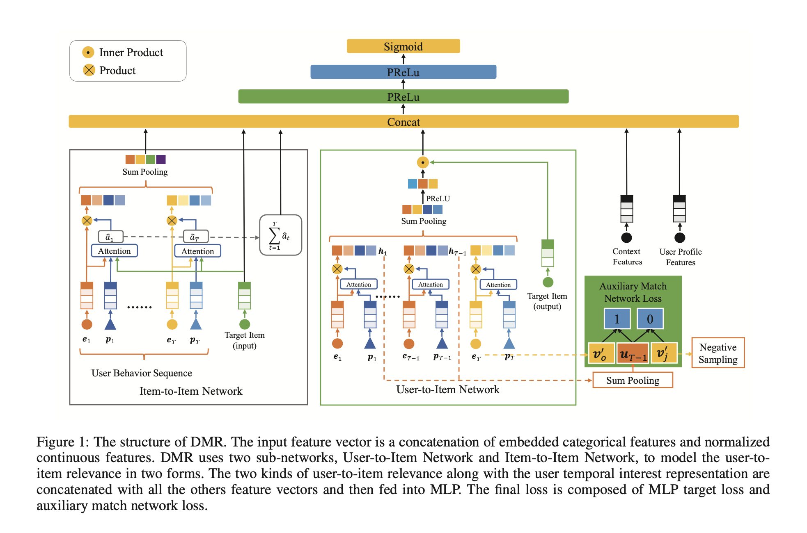

# Deep Match to Rank Model for Personalized Click-Through Rate Prediction

# 标题
- 参考论文：Deep Match to Rank Model for Personalized Click-Through Rate Prediction
- 公司：Alibaba
- 链接：https://ojs.aaai.org//index.php/AAAI/article/view/5346
- Code：https://github.com/reczoo/FuxiCTR/blob/main/model_zoo/DMR/src/DMR.py
- 时间：2020
- `泛读`

# 内容

## 摘要
- 问题：
  - 最近的用户行为 CTR 模型不应只停留在“用户喜欢什么”（用户表示），还应关注“用户对这个物品有多喜欢”（相关性建模）
- 方法：
  - 将召回阶段常用的协同过滤（CF）和向量内积思想，有机地整合进排序（Ranking）阶段的深度网络中
  - U2I 网络（直接关联）：
    - 模仿矩阵分解，计算用户向量与物品向量的内积。为了防止内积失去物理意义，特别设计了“辅助匹配网络”作为监督，强迫模型学习到“高相关性 = 大内积”的映射关系。
  - I2I 网络（间接关联）：
    - 基于注意力机制，通过计算历史行为与目标物品的相似度累加，来表达偏好强度。

## 1 Introduction
- 问题：
  - 现有的深度 CTR 模型（如 DIN、DIEN）从行为中提取用户兴趣，但它们主要通过物品间的相似性来构建“用户表示”，忽略了显式建模“用户对特定物品的偏好强度（U2I相关性）
  - **本质上现在的序列建模是，当前物品对过去的历史行为中的无论的加权，但是没有考虑到用户对物品的加权**
- 方法：
  - 将召回常用的协同过滤（CF）思想引入排序模型，通过计算用户与物品在嵌入空间中的直接关联来增强个性化
  - 双重相关性建模：
    - User-to-Item (U2I)： 通过内积直接衡量关联。
    - Item-to-Item (I2I)： 通过注意力机制，同时引入了位置感知注意力机制（位置越近权重越高）计算历史物品与目标物品的相似度。
  - 联合训练机制：
    - DMR 引入辅助 Matching 网络，有助于模型更好地学习用户表示并统一不同特征的分数尺度
  - **本质上就是同时找和用户近的item + 和当前候选item进的item，一起训练**
- **主要贡献**
  - 提出DMR，将召回阶段常用的协同过滤（CF），用于表达相关性通过U2I和I2I
  - 提出一个辅助任务来训练U2I
  - 加入位置编码在注意力机制内

## 2 Related Work
- 用户表示与相关性建模的断层：
  - 尽管 DIN 和 DIEN 等模型在捕捉动态兴趣方面表现出色，但它们的核心逻辑是构建一个更好的“用户向量”，而非直接计算用户与特定物品之间的“相关性分数”。
- 匹配技术的排序化应用： 
  - CF 技术（尤其是矩阵分解中的内积运算）在衡量 U2I 关联上非常成熟。DMR 的核心思路是打破匹配（召回）与排序的壁垒，将召回阶段的“相关性度量”能力整合进排序模型中

## 3 Deep Match to Rank Model

    
      <figcaption style="text-align: center">
        DMR_模型结构图
      </figcaption>
    </img>
  

### 3.1 Feature Representation
- 四类特征：
  - 用户画像User Profile：
    - 包含用户 ID、消费水平等等。
  - Target Item 特征：
    - 包括item ID、category ID 等等。
  - 用户行为 User Behavior：
    - 是用户交互的 item 形成的 item 序列。
  - 上下文 Context：
    - 包含时间、matching 方法、以及对应的 matching score 等。
- 分类特征：
  - 经历 One-Hot编码 → 嵌入层 → 稠密向量 的标准化流程。
- 连续特征：
  - 进行归一化处理。
- 最终所有各类特征分别被转换为可被神经网络直接处理的特征向量 (xp, xb, xt, xc)。
- 这里 user behavior 特征包含多个 T 个 维度是 d_e 的vector

### 3.2 MLP
- 上面四个特征会被后处理直接拼接进入MLP
- activation function：PRelu + sigmoid最后一层
- CE 作为 loss
- User Behavior 特征向量 xb 最终会被进行池化从而转换为固定长度的特征向量

### 3.3 The structure of Deep Match to Rank
- 结构：
  - 两个子网络来捕获 user-to-item 相关性
    - User-to-Item Network
    - Item-to-Item Network
  - 输入特征向量是嵌入embedded 的离散特征、和正则化normalized 的连续特征的拼接。
  - DMR 使用两个子网（ User-to-Item Network 、Item-to-Item Network）以两种形式来建模 user-to-item 相关性。
  - 两种形式的 user-to-item 相关性、用户的动态兴趣的 representation、以及其它所有特征向量拼接起来，然后馈入到 MLP 中。
  - 最终损失由 MLP 的 target loss 和辅助的 match network loss 组成

#### 3.3.1 User-to-Item Network
- 核心思路：
  - 遵循基于矩阵分解的方法，通过user representation 和 item representation 的内积来建模用户和目标 item 之间的相关性。
  - User representation 用 User Behavior 特征隐式地反映了用户兴趣。
- user representation（u）：
  - 使用带位置编码的注意力机制对用户行为序列 [e1, e2, ..., eT] 进行加权求和。
  - 位置编码（pt）确保了更近期的行为获得更高关注，从而捕捉兴趣的时序变化。
  - 加权后的序列再通过一个全连接层 g(·) 映射为用户向量 u。
  - 公式：
    - 权重
      - at = z^⊤ * tanh * (Wp * pt + We * et + b)
      - αt = exp(at) / (Ti=1 exp(ai))
      - pt ∈ Rdp is the t-th position embedding
      - et ∈ Rde is the feature vector for the t-th behavior
      - Wp ∈ Rdh × dp , We ∈ Rdh×de , b ∈ Rdh and z ∈ Rdh 为待学习的参数。
  - 加权：
    - u = g(t=1(αt * et)) = g(Tt=1(ht))
    - g(·) represents a non-linear transformation, 输入 de 输出 dv
    - ht is the weighted feature vector for the t-th behavior
  - **本质上就是学习用户的行为序列之间的相关性先，然后再和候选 item 进行交互，并且考虑位置信息，和BST里面的用transformer提取原理一样，只是attention设置不一样**
  - 后续考虑的点：
    - 可以添加更多的隐层从而具有更好的representation。
    - 除了位置编码之外，还可以将更多的、反映用户兴趣强度的上下文特征添加到 attention 网络中，例如行为类型（如点击、购买、收藏）、停留时长等。
    - 以行为发生时间的倒序对位置进行编码，从而确保最近的行为获得第一个位置。
    - RNN 不适合，主要因为两点：
      - 用户行为不确定性比较多，并不是严格遵守NLP里面一样的文本顺序
      - 线上serving，RNN串行计算有很大的挑战
- item representation（v‘）：
  - target item 使用一个独立的嵌入矩阵 V‘（称为“输出表征”），与输入特征使用的嵌入矩阵 V 分离。
  - v′ ∈ Rdv 直接从 embedding 矩阵 V′ = [v′1; v′2; ...; vk′] ∈ RK × dv 中 look up。
  - 虽然 embedding table 翻倍了，但是实验显示效果更好
- 最终相关性计算：
  - 通过简单的内积 r = u^T * v‘ 来计算用户-商品直接相关性。模拟了协同过滤的匹配过程。
- 辅助匹配网络：
  - 目的：
    - 解决直接内积 r 难以仅通过点击信号有效学习的问题
  - 方法：
    - 设计一个独立的匹配模型，其任务是预测用户下一次点击的商品（根据前T-1个行为预测第T个）。
    - 计算对 item j 产生第 T 个行为的概率公式见 paper 公式6。
    - 复用上述 User-to-Item 网络的结构（共享用户表征 u_{T-1} 和商品输出表征 V‘），但使用负采样技术来应对商品总数巨大的多分类问题。
    - loss 是 多分类中的CE loss，其中负样本 采样远小于 K （总的item 数量） 个
    - 最终 loss：L_final = L_target + βLNS，β为一个超参数，用于平衡这两部分损失
- 优势：
  - 可以推动更大的 r 来表示更强的相关性，并帮助更好地训练 embedding 矩阵 V′ 和其它参数
  - 在统一模型中共同训练 ranking 模型和 matching 模型，其中 matching 模型是辅助 match 网络。
    - 在 matching 阶段，candidate 是通过多路 match 来生成，其中每一路match 之间的分数不可比，每个候选者仅具有对应 matching 方法的相关性得分。
    - 和仅将 matching score 作为特征馈入 MLP 不同，User-to-Item Network 能够在给定任务 Target Item 的情况下获得 user-to-item 相关性得分，并且相关性以统一的方式可比。
- **本质上还是下一个 item predict的辅助任务，只是用了不同的计算正负label的方式，多分类还是对比学习，参考TransActv2 paper**
- **DMR 模型相当于对模型空间新增了约束：对于正样本，不仅点击率预估为 1.0，辅助 loss 会push模型还需要 user representation 和 item representation 之间相关性很高。负样本也是类似**

#### 3.3.2 Item-to-Item Network
- 核心思路：
  - 建模用户交互的 item 和 target item 之间的相似性similarity ，然后对这些相似性相加从而得到另一种形式的user-to-item 相关性
- 方法：
  - 权重：
    - 用attention的方式学习，而不再是内积，给定用户交互的 item、target item、位置编码作为输入，item-to-item 相似性的公式为
    - aˆt = zˆT * tanh * (Wc * ec + Wp * pt + We * et + b)
    - ec ∈ Rde is the feature vector of target item
    - pt ∈ Rdp is the t-th position embedding
    - et ∈ Rde is the feature vector for the t-th behavior
    - We ∈ Rdh × de , Wp ∈ Rdh × dp , Wc ∈ Rdh × de , b ∈ Rdh and zˆT ∈ Rdh 为待学习的参数。
    - **本质区别 U2I 就是计算attention的时候考虑了候选item，也就是就算了候选 item 和 用户行为 item 之间的关系**
  - 加权：
    - 通过 softmax 将 â_t 归一化为权重 α̂_t
    - 使用权重 α̂_t 对历史行为特征 ê_t 进行加权求和，得到目标相关的用户即时兴趣表示 û
    - α̂_t = exp(aˆt) / (Ti=1 exp(aˆt))
    - û = Ti=1 α̂_t * ê_t
    - r̂ = Ti=1 aˆt
  - 优势：
    - 通过注意力机制的局部激活能力，和目标 item 相关的行为的权重更高，并且主导了目标相关的用户 û representation
- 输出：
  - 该模块的两个输出（û 和 r̂）与 U2I 的输出 r，以及其他所有原始特征向量 xp（用户画像）、xt（目标商品）、xc（上下文）拼接在一起：
  - c = [xp, xt, xc, û, r, r̂]，再送入特征交叉层 MLP
- **本质上就是学习候选 item 和历史 item 之间的 attention 值，并且最后加权求和所有的历史行为**

## 4 Experiments
- Datasets
  - Alimama Dataset
  - Industry
    - 14 train, 15 test
    - 1.18 billion examples with 10.9 million users and 48.6 million items
- Compared Methods
  - LR
  - Wide&Deep
  - PNN
  - DIN
  - DIEN
- hp
  - learning rate: 0.001
  - batch size: 256
  - item embedding: 64
  - user sequence max length: 50
  - MLP: [512, 256, 128]
- Results
  - DMR 大幅领先其它所有

## 5 Ablation Study
- user-to-item 相关性的 representation 的有效性：
  - 正样本的 user-to-item 相关性高于负样本，这意味着我们的 user-to-item 相关性模型是合理的。
- 辅助match 网络的有效性：
  - β 设置为 0.1 的时候，目标损失和辅助损失 同时降低
- 位置编码的有效性：
  - 最近的行为获得更高的注意力权重
- CTR:
  - 5.5%
- Click per user:
  - 12.8%

## 6 Conclusions
- 提出建立 User-to-Item Network，并且参考了矩阵分解的思路来计算相关性
- 提出了一个辅助任务，来帮助训练 User-to-Item Network
- 提出位置编码很重要，可以让最近的行为权重加大

# 思考

## 本篇论文核心是讲了个啥东西
- 提出用户-商品网络：
  - 模拟匹配阶段，通过内积直接计算用户与目标商品的全局、长期偏好相关性 (r)。
- 商品-商品网络：
  - 继承DIN等模型思想，通过注意力计算历史行为与目标商品的局部、即时兴趣相关性 (r̂ 和 û)。
- 辅助匹配网络：
  - 创新性地引入一个基于下一步行为预测的辅助任务，作为主排序任务的正则化器，迫使模型学习到更泛化、更真实的用户和商品表征。
- 位置感知：
  - 引入位置编码在两个网络，捕捉“越近的行为对当前兴趣影响越大”的规律。
  - 同时引入的方式是可学习的 embedding table

## 是为啥会提出这么个东西，为了解决什么问题
- 问题：
  - 解决建模空白：
    - 现有的排序模型（如 DIN, DIEN）侧重于学习“用户表示”，却忽略了显式度量用户与目标物品之间的个性化偏好强度（U2I相关性）。
  - 统一分数尺度：
    - 在工业界，不同召回算法产生的分数不可比。DMR 试图在排序层建立一个统一的、可比较的相关性度量框架
- 方法：
  - 提出用户-商品网络
  - 提出辅助任务匹配网络

## 为啥这个新东西会有效，有什么优势
- U2I 网络：
  - 模仿矩阵分解，通过向量内积直接衡量用户与物品的关联。
  - 同时采用了独立的目标商品 embedding table， 独立于输入特征的“输出嵌入矩阵”，模型容量更大并且使召回发生在独立的统一语义空间。
- I2I 网络：
  - 基于注意力机制，通过累加历史行为与目标的相似度来表达偏好，可以最为全新的一个指标
- 辅助任务匹配网络：
  - 引入“预测下一个点击物品”的辅助任务，强制模型学习“大内积 = 高相关性”，防止内积计算在缺少监督时失去物理意义。
- 位置感知：
  - 引入位置编码在两个网络，捕捉“越近的行为对当前兴趣影响越大”的规律。

## 与此论文类似的东西还有啥，相关的思路和模型
- 对比 DIN/DIEN/DSIN：
  - 加入了U2I 网络，来学习用户行为和item的关系
  - 加入了辅助任务，来联合训练，迫使模型学习到更泛化、更真实的用户和商品表征
  - 加入了可学习的 timestamps 本身来进行训练，而不是时间间隔

## 论文有什么可以改进的地方，可以后续继续拓展研究
- 引入更多上下文特征：
  - 论文提到目前主要利用了位置特征，未来可以加入行为类型、页面停留时间等更丰富的上下文来优化注意力权重。
- 更丰富的辅助任务：
  - 当前辅助任务仅为下一步预测。可探索更多任务，如行为序列掩码恢复、多兴趣解耦、跨域行为预测等，以学习更鲁棒的表征。
- 更复杂的用户-商品交互：
  - 当前使用简单内积。可探索更复杂的交互方式（如双线性、神经网络），并研究如何避免过拟合。
- 端到端全系统优化：
  - DMR是在排序模型内模拟匹配。未来可探索更激进的 “匹配-排序”一体化端到端模型，更复杂的联合优化策略，直接对海量商品库进行精细化排序，衍生出召回排序统一化生成式模型。
- 动态兴趣与长期偏好的融合：
  - 当前r（长期）和û（即时）是简单拼接。可设计更精巧的门控或记忆网络来动态融合长期偏好与当前情境兴趣。

## 在工业上通常会怎么用，如何实际应用
- 辅助 loss 的设计可以考虑，可以参考多分类或者 TransActv2 里面的对比学习方式
- 如果考虑加入 User-to-Item Network，必须同时加入辅助 loss，考虑全新的辅助任务在搜索序列里面
  - **用 user 来过滤 item 的相关性的思路很好，可以考虑在长序列里面也设计一个这样的检索机制来高效的提取长序列内相关性高的行为**
- 位置编码采样可学习的 embedding 来设计
- 设计 attention 的思路很有意思，可以借鉴，需要交叉的就放进去计算权重值，同时匹配一个可学习的矩阵

## 参考：
- https://www.huaxiaozhuan.com/%E6%B7%B1%E5%BA%A6%E5%AD%A6%E4%B9%A0/chapters/9_ctr_prediction3.html
- https://zhuanlan.zhihu.com/p/441083832