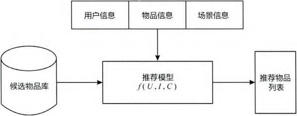
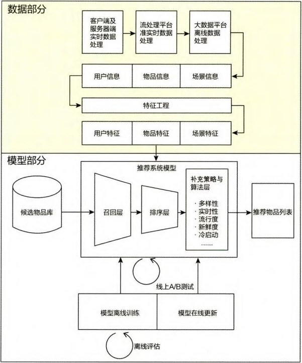

# 第一章：互联网的增长引擎--推荐系统

## 1.1 推荐系统的作用
- 用户角度：解决在信息过载的情况下，用户高效获得感兴趣信息的问题。（用户体验优化）
- 公司角度：推荐系统解决产品能够最大限度地吸引用户、留存用户、增加用户黏性、提高用户转化率的问题，从而达到公司商业目标连续增长的目的。（满足公司商业利益）
- 例子：
  - YouTube，主要优化目标为观看时长。
  - 淘宝，主要优化目标为转化率和点击率。

## 1.2 推荐系统的架构
- 物品信息：在商品推荐中指的是商品信息，在视频推荐中指的是视频信息，在新闻推荐中指的是新闻信息；
- 用户信息：为了更可靠地推测出人的兴趣点，推荐系统希望利用大量与人相关的信息，包括历史行为、人口属性、关系网络等；
- 场景信息或上下文信息：在推荐场景中，用户的最终选择会受时间、地点、用户的状态等环境信息的影响。

## 1.2.1 推荐系统的逻辑框架
在获知用户信息、物品信息、场景信息的基础上，推荐系统要处理的问题可定义为：对用户 U（user），在特定场景 C（context）下，针对海量的物品信息，构建函数 f（U,I,C），预测用户对特定候选物品（item）的喜好程度，再根据喜好程度对所有候选物品排序，生成推荐列表的问题。
  

    
      <figcaption style="text-align: center">
        推荐系统逻辑框架
      </figcaption>
    </img>
  

## 1.2.2 推荐系统的技术架构
- 数据和信息相关的问题，即用户信息，物品信息，场景信息分别是什么？如何存储、更新和处理？逐渐发展为推荐系统中融合了数据离线批处理、实时流处理的数据流框架。
- 推荐系统算法和模型相关的问题，即推荐模型如何训练、如何预测、如何达成更好地推荐效果？逐渐发展细化为推荐系统中集训练（training）、评估（evaluation）、部署（deployment）、线上推断（online inference）为一体的模型框架。
    

      
        <figcaption style="text-align: center">
          推荐系统技术架构
        </figcaption>
      </img>
    

## 1.2.3 推荐系统的数据部分
上面架构图中的黄色部分，负责数据收集与处理的三种平台在实时性由强到弱递减的同时，三种平台的海量数据处理能力则由弱到强。在得到原始的数据信息后，推荐系统的数据处理系统会将原始数据进一步加工，加工后的数据出口有三种： 
- 生成推荐模型所需的样本数据，用于算法模型的训练和评估；
- 生成推荐模型服务（model serving）所需的“特征”，用于推荐系统的线上推断； 
- 生成系统监控、商业智能（Business Intelligence，BI）系统所需的统计型数据。

## 1.2.4 推荐系统的模型部分
上面结构图中的推荐系统模型部分。分别对应三个独立层：
- 召回层，一般利用高效的召回规则、算法或简单的模型，快速从海量的候选集中召回用户可能感兴趣的物品。
- 排序层，利用排序模型对初筛的候选集精排序。
- 补充策略与算法层，也被称为再排序层，在将推荐列表返回用户之前，为兼顾结果的“多样性”“流行度”“新鲜度”等指标，结合补充策略和算法调整推荐列表。

从推荐模型接收到所有候选物品集到最后产生推荐列表前，需要通过模型训练（model training）确定模型结构、结构中不同参数权重的具体数值，以及模型相关算法和策略中的参数取值。模型的训练方法又可以根据模型训练环境的不同，分为“离线训练”和“在线更新”两部分，其中：离线训练的特点是可以利用**全量样本和特征**，使模型逼近全局最优点；在线更新则可以**准实时地“消化”新的数据样本**，更快地反映新的数据变化趋势，满足模型实时性的需求。
除此之外，为了评估推荐模型的效果，方便模型的迭代优化，推荐系统的模型部分提供了“离线评估”和“线上 A/B 测试”等评估模块，用得出的线下和线上评估指标，指导下一步的模型迭代优化。模型部分，特别是“排序层”模型是推荐系统产生效果的重点。

## 1.2.5 深度学习对推荐系统的革命性贡献
- 优点：与传统的推荐模型相比，深度学习模型对数据模式的拟合能力和对特征组合的挖掘能力更强。深度学习模型结构的灵活性，使其能够根据不同推荐场景调整模型，使之于特定业务数据“完美”契合。
- 挑战：深度学习对海量训练数据及数据实时性的要求，也对推荐系统的数据流部分提出挑战。海量数据的实时处理、特征的实时提取，线上模型服务过程的数据实时获取，是系统数据部分需要攻克的难题 