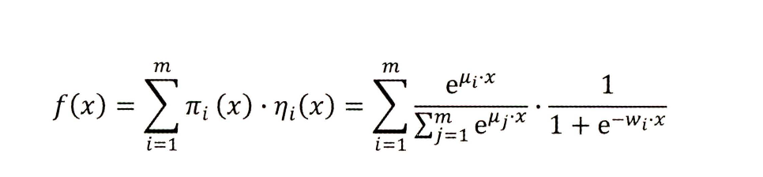

# 第二章：前深度学习时代——推荐系统的进化之路

## 2.1 传统推荐模型的演化关系图

    
      <figcaption style="text-align: center">
        传统推荐模型的演化关系图
      </figcaption>
    </img>
    

- 协同过滤算法族：上图蓝色的部分
- 逻辑回归模型族：LR + LS-PLM
- 因子分解机模型族：FM + FFM
- 组合模型：GBDT + LR

## 2.2 协同过滤——经典的推荐算法
“协同过滤”就是协同大家的反馈、评价和意见过滤海量的信息，从中筛选出目标用户可能感兴趣的信息。

## 2.2.1 UserCF 基于用户的协同过滤
这里用一个商品推荐的例子来说明基于用户的协同过滤的推荐过程

    
      <figcaption style="text-align: center">
        基于用户的协同过滤推荐过程
      </figcaption>
    </img>
  

1. 电商网站的商品库里一共有 4 件商品：游戏机、某小说、某杂志和某品牌电视机。
2. 用户 X 访问该电商网站，电商网站的推荐系统需要决定是否推荐电视机给用户 X。换言之，推荐系统需要预测用户 X 是否喜欢该品牌的电视机。为了进行这项预测，可以利用的数据有用户 X 对其他商品的历史评价数据，以及其他用户对这些商品的历史评价数据。图 2-2（b）中用绿色“点赞”标志表示用户对商品的好评，用红色“踩”的标志表示差评。可以看到，用户、商品和评价记录构成了带有标识的有向图。
3. 为便于计算，将有向图转换成矩阵的形式（被称为“共现矩阵”），用户作为矩阵行坐标，商品作为列坐标，将“点赞”和“踩”的用户行为数据转换为矩阵中相应的元素值。这里将“点赞”的值设为 1，将“踩”的值设为 -1，“没有数据”置为 0（如果用户对商品有具体的评分，那么共现矩阵中的元素值可以取具体的评分值，没有数据时的默认评分也可以取评分的均值）。
4. 生成共现矩阵之后，推荐问题就转换成了预测矩阵中问号元素（图 2-2（d）所示）的值的问题。既然是“协同”过滤，用户理应考虑与自己兴趣相似的用户的意见。因此，预测的第一步就是找到与用户 X 兴趣最相似的 n（Top n 用户，这里的 n 是一个超参数）个用户，然后综合相似用户对“电视机”的评价，得出用户 X 对“电视机”评价的预测。（超参数是在机器学习算法中需要手动设置的参数，它们不是通过训练数据学习得到的，而是在算法运行之前设置的。超参数的选择通常基于经验、试验和交叉验证等方法确定）
5. 从共现矩阵中可知，用户 B 和用户 C 由于跟用户 X 的行向量近似，被选为 Top n（这里假设 n 取 2）相似用户，由图 2-2（e）可知，用户 B 和用户 C 对“电视机”的评价都是负面的。
6. 相似用户对“电视机”的评价是负面的，因此可预测用户 X 对“电视机”的评价也是负面的。在实际的推荐过程中，推荐系统不会向用户 X 推荐“电视机”这一物品。
以上描述了协同过滤的算法流程，其中关于“用户相似度计算”及“最终结果的排序”过程是不严谨的，下面重点描述这两步的形式化定义。

**UserCF核心思想：先找到相似用户，再找到“他们喜欢的物品”。**

## 2.2.2 用户相似度计算
在协同过滤的过程中，用户相似度的计算是算法中最关键的一步。此时计算用户i和用户j的相似度也就是拿用户i的行向量和用户j的行向量进行计算相似度。
- 余弦相似度
  - 计算向量夹角。夹角越小，余弦相似度越大，两个用户越相似。
- 皮尔逊相关系数
  - 用户平均分对各独立评分进行修正，减小了用户评分偏置的影响。本质上就是在计算夹角余弦之前将两个向量减去各个样本的平均值，达到中心化的目的。是余弦相似度在维度缺失上的一种改进方法。
- 基于皮尔逊系数的思路，引入物品平均分的方式，减少物品评分偏置对结果的影响
  - 把皮尔逊系数中用户i对所有物品打分的平均分R_i换成R_p为物品p得到所有评分的平均分。

## 2.2.3 最终结果的排序
根据相似用户的已有评价对目标用户的偏好进行预测。最常用的方式是利用用户相似度和相似用户的评价的加权平均获得目标用户的评价预测。

    
      <figcaption style="text-align: center">
        给予用户的CF排序打分公式
      </figcaption>
    </img>
  

这里 W_u_s 是用户u和用户s的相似度，R_s_p是用户s对物品p的打分。也就是说用户u对物品p的打分给予所有相似用户对同一个物品打分的加权平均。越是相似的用户打分起到的作用越大。

缺点：
1. 在互联网应用的场景下，用户数往往远大于物品数，而 UserCF 需要维护用户相似度矩阵以便快速找出 Top n 相似用户。该用户相似度矩阵的存储开销非常大，而且随着业务的发展，用户数的增长会导致用户相似度矩阵的空间复杂度以 n^2 的速度快速增长，这是在线存储系统难以承受的扩展速度。因为每次有新的用户，需要计算更新新用户对于其它所有用户的相似度。
2. 用户的历史数据向量往往非常稀疏，对于只有几次购买或者点击行为的用户来说，找到相似用户的准确度是非常低的，这导致 UserCF 不适用于那些正反馈获取较困难的应用场景（如酒店预定、大件商品购买等低频应用）。

## 2.2.4 ItemCF 基于物品的协同过滤
ItemCF 是基于物品相似度进行推荐的协同过滤算法。通过计算共现矩阵中物品列向量的相似度得到物品之间的相似矩阵，再找到用户的历史正反馈物品的相似物品进行进一步排序和推荐，具体步骤如下：
1. 基于历史数据，构建以用户（假设用户总数为 m）为行坐标，物品（物品总数为 n）为列坐标的 m×n 维的共现矩阵；
2. 计算共现矩阵两两列向量间的相似性（相似度的计算方式与用户相似度的计算方式相同），构建 n×n 维的物品相似度矩阵；
3. 获得用户历史行为数据中的正反馈物品列表；
4. 利用物品相似度矩阵，针对目标用户历史行为中的正反馈物品，找出相似的 Top k 个物品，组成相似物品集合；
5. 对相似物品集合中的物品，利用相似度分值进行排序，生成最终地推荐列表。 在第5步中，如果一个物品与多个用户行为历史中的正反馈物品相似，那么该物品最终的相似度应该是多个相似度的累加

    
      <figcaption style="text-align: center">
        基于物品的排序打分方式
      </figcaption>
    </img>
  

这里，W_p_h是物品p与物品h的物品相似度，R_u_h是用户u对物品h的已有评分。H是目标用户的正反馈物品集合。也就是说相似度越高的物品对于最终物品评分起到的作用越大。

**ItemCF核心思想：先找到用户喜欢的物品，再找到“喜欢物品的相似物品”。**

## 2.2.5 UserCF与ItemCF的应用场景和总结

    
      <figcaption style="text-align: center">
        UserCF与ItemCF的对比分析
      </figcaption>
    </img>
  

## 2.2.6 协同过滤的下一步发展
协同过滤的缺点：
- 由于热门的物品具有很强的头部效应，容易与大量物品产生相似性，反之尾部的物品由于特征向量稀疏，很少与其他商品产生相似性，那么热门物品就很容易被推荐，尾部物品很少被推荐。具体来说因为稀疏向量和其它稀疏向量计算相似度的时候得到的值一定低于和稠密的向量计算相似度的值。然而稠密向量可能只是一个热门产品。
- 另外，协同过滤仅利用用户和物品的交互信息，无法有效地引入用户年龄、性别、商品描述、商品分类、当前时间等一系列用户特征、物品特征和上下文特征，这无疑造成了有效信息的遗漏。为了在推荐模型中引入这些特征，推荐系统逐渐发展到以逻辑回归模型为核心的、能够综合不同类型特征的机器学习模型的道路上。
- 总结：推荐结果的头部效应较为明显，处理稀疏向量也就是冷门物品的能力弱。没有利用更多的用户特征数据来更好地个性化推荐结果。

    
      <figcaption style="text-align: center">
        协同过滤章节思维导图
      </figcaption>
    </img>
  

## 2.3 矩阵分解算法——协同过滤的进化
为了应对协同过滤头部效应的问题，矩阵分解用更稠密的隐向量表示商品和用户, 分解协同过滤的共现矩阵得到用户和物品的隐向量，计算物品向量与用户向量的相似距离，距离相近的用户与物品表明兴趣点相近，把距离相近的物品推荐给用户。从而解决协同过滤的缺点。

## 2.3.1 矩阵分解算法的原理

    
      <figcaption style="text-align: center">
        协同过滤和矩阵分解在视频推荐场景下的算法原理
      </figcaption>
    </img>
  

- 协同过滤算法找到用户可能喜欢的视频，即基于用户的观看历史，找到跟目标用户看过同样视频的相似用户，然后找到这些相似用户喜欢看的其他视频，推荐给目标用户。
- 矩阵分解算法则期望为每一个用户和物品生成一个隐向量，将用户和视频定位到隐向量的表示空间上，距离相近的用户和物品表明兴趣特点接近，在推荐过程中，就应该把距离相近的视频推荐给目标用户。

寻找隐向量：通过分解协同过滤生成的共现矩阵（用户对物品评分的表）得到用户和物品的隐向量。例如：

    
      <figcaption style="text-align: center">
        矩阵分解过程例子
      </figcaption>
    </img>
  

- 矩阵分解算法将 m x n 维的共现矩阵 R 分解为 m x k 维的用户矩阵 U 和 k x n 维的物品矩阵 V 相乘的形式。 其中m是用户数量，n是物品数量，k是隐向量的维度。k的大小决定了隐向量表达能力的强弱。k的取值越小，隐向量包含的信息越少，模型的泛化程度越高;反之 ，k的取值越大，隐向量的表达能力越强，但泛化程度相应降低。 此外，k的取值还与矩阵分解的求解复杂度直接相关 。在具体应用中，k的取值要经过多次试验找到一个推荐效果和工程开销的平衡点 。
- 基于用户矩阵U和物品矩阵V，用户u对物品i的预估评分用公式表达：
  

      
        <figcaption style="text-align: center">
          预估评分公式
        </figcaption>
      </img>
    

- 其中P_u是用户u在用户矩阵U中对应的行向量，q_i是物品i在物品矩阵V中对应的列向量. 也就是有P_u -> [1, k] * q_i -> [k, 1] = r_u_i -> [1, 1]

## 2.3.2 矩阵分解的求解过程
矩阵分解主要有三种求解的方法。如下：

      
        <figcaption style="text-align: center">
          常见的矩阵分解方式对比
        </figcaption>
      </img>
    

对比可知，矩阵分解主要是梯度下降来实现。详细步骤如下：
- 确定目标函数，这里目标函数的目的是让公式预测值和实际值的差尽量小，这样才能最大限度的保存共现矩阵的原始信息。
  

        
          <figcaption style="text-align: center">
            2.3.2_矩阵分解的目标函数
          </figcaption>
        </img>
      

- 对目标函数求偏导，求取梯度下降的方向和幅度。
  - q_i偏导
    

        
          <figcaption style="text-align: center">
            q_i偏导
          </figcaption>
        </img>
      

  - p_u偏导
    

        
          <figcaption style="text-align: center">
            p_u偏导
          </figcaption>
        </img>
      

- 利用第 2 步的求导结果，沿梯度的反方向更新参数。
- 当迭代次数超过上限 n 或损失低于阔值时，结束训练，否则循环第 3 步。
- 预测阶段：矩阵分解之后得到所有用户和物品的隐向量，进行推荐时候就是利用用户的隐向量与所有物品的隐向量逐一计算内积，排序推荐。

对比协同过滤，在矩阵分解算法中，由于隐向量的存在，使任意的用户和物品之间都可以得到预测分值。矩阵分解生成隐向量的过程是利用了共现矩阵本身包含的全局信息的，因此具有比协同过滤更强的泛化能力，而协同过滤依赖用户，物品互相的历史关系，如果没有交集那相似度就为0，这样无法利用全局信息。并且无法拥有泛化全局信息的能力。

## 2.3.3 消除用户相物品打分的偏差
由于不同用户的打分体系不同（比如在5分为满分的情况下，有的用户认为打 3 分已经是很低的分数了，而有的用户认为打 1 分才是比较差的评价），不同物品的衡量标准也有所区别（比如电子产品的平均分和日用品的平均分差异有可能比较大），为了消除用户和物品打分的偏差（Bias），常用的做法是在矩阵分解时加入用户和物品的偏差向量。

    
      <figcaption style="text-align: center">
        加入偏差的评分公式
      </figcaption>
    </img>
  

其中μ是全局偏差常数，bi是物品偏差系数，可使用物品i收到的所有评分的均值，bu是用户偏差系数，可使用用户u给出的所有评分的均值。相对应的目标函数也需要更新。

    
      <figcaption style="text-align: center">
        加入偏差的目标函数
      </figcaption>
    </img>
  

加入用户和物品的打分偏差项之后，矩阵分解得到的隐向量更能反映不同用户对不同物品的"真实"态度差异，也就更容易捕捉评价数据中有价值的信息，从而避免推荐结果有偏。

## 2.3.4 矩阵分解的优点相同限性
优点：
  - 泛化能力增强，一定程度上解决了数据稀疏的问题。
  - 空间复杂度低。不需再存储协同过滤模型服务阶段所需的“庞大”的用户相似性或物品相似性矩阵，只需存储用户和物品隐向量。空间复杂度由 n^2 级别降低到 (n+m)·k 级别。
  - 更好的扩展性与灵活性（产出的用户与物品隐向量与深度学习的embedding思想较为相似，因此矩阵分解的结果非常便于与其他特征进行组合和拼接，且便于应用在神经网络上）。
局限性：
  - 与协同过滤一样，矩阵分解同样不方便加入用户、物品和上下文相关的特征，丧失了利用很多有效信息的机会，同时在缺乏用户历史行为时，无法有效推荐。

    
      <figcaption style="text-align: center">
        矩阵分解章节思维导图
      </figcaption>
    </img>
  

## 2.4 逻辑回归——融合多种特征的推荐模型
逻辑回归综合利用用户、物品、上下文等多种不同的特征，将推荐问题看成一个分类问题，通过预测正样本的概率对物品进行排序。这里的正样本可以是用户“点击”了某商品，也可以是用户“观看”了某视频，均是推荐系统希望用户产生的“正反馈”行为。因此，逻辑回归模型将推荐问题转换成了一个点击率（Click Through Rate，CTR）预估问题。

## 2.4.1 基于逻辑回归模型的推荐流程
基于逻辑回归的推荐过程如下：
1. 将用户年龄、性别、物品属性、物品描述、当前时间、当前地点等特征转换成数值型特征向量； 
2. 确定逻辑回归模型的优化目标（以优化“点击率”为例），利用已有样本数据对逻辑回归模型进行训练，确定逻辑回归模型的内部参数； 
3. 在模型服务阶段，将特征向量输入逻辑回归模型，经过逻辑回归模型的推断，得到用户“点击”（这里用点击作为推荐系统正反馈行为的例子）物品的概率； 
4. 利用“点击”概率对所有候选物品进行排序，得到推荐列表；

## 2.4.2 逻辑回归模型的数学形式
参考machine learning implementation repo 里面对应的章节，有详细的推导

## 2.4.3 逻辑回归模型的训练方法
1. 先利用极大似然函数推导出目标函数
2. 再利用梯度下降方法找最优解

## 2.4.4 逻辑回归模型的优势与劣势
优势：
  - 数学含义上的支撑：点击与否是符合伯努利分布的，逻辑回归作为广义线性模型的一种，它的假设是因变量 y 服从伯努利分布。刚好符合CTR问题的情况。
  - 可解释性强：逻辑回归模型的数学形式是各特征的加权和，再施以 sigmoid 函 数。从特征加权融合，再通过激活函数映射都符合的整个过程都是符合CTR物理意义的。根据权重的不同解释哪些特征比较重要，便于给出可解释的原因。
  - 工程化需要：逻辑回归易于并行运算，训练开销小，模型简单在大数据量面前比较吃香。
劣势：
  - 表达能力不强：无法进行特征交叉与特征筛选等操作，不可避免地造成信息的损失。后续发展中，特征交叉衍生了fm，ffm，特征筛选衍生了gbdt + lr。

    
      <figcaption style="text-align: center">
        逻辑回归章节思维导图
      </figcaption>
    </img>
  

## 2.5 从 FM 到 FFM一一自动特征交叉的解决方案
逻辑回归模型表达能力不强的问题，会不可避免地造成有效信息的损失。在仅利用单一特征而非交叉特征进行判断的情况下，有时不仅是信息损失的问题，甚至会得出错误的结论。著名的“辛普森悖论”用一个非常简单的例子，如果只用全局特征很容易造成完全相反的结果，说明了进行多维度特征交叉的重要性。

## 2.5.1 POLY2 模型一一特征交叉的开始
poly2模型采用直接组合所有特征进行两两组合，然后每个组合赋予权重，本质上仍然是线性模型，一定程度上解决了特征组合的问题。但是也有一些缺点：
- 对于大量的热独编码处理的数据，导致特征向量极度稀疏，那么poly2无差别的特征交叉就会让特征向量更加稀疏，导致大部分交叉特征的权重缺乏有效的数据进行训练，从而导致无法收敛（还有特征爆炸的情况
- 而且权重参数的量从n直接上升到，成平方增加，大大加重了训练复杂度。

    
      <figcaption style="text-align: center">
        数学公式
      </figcaption>
    </img>
  

## 2.5.2 FM 模型一一隐向量特征交叉
FM模型学习每个特征的k维隐向量，交叉特征由相应特征向量的内积得到，权重数量从poly2的n^2个直接降低到n*k个。本质上，FM引人隐向量的做法，与矩阵分解用隐向量代表用户和物品的做法异曲同工。可以说FM是将矩阵分解隐向量的思想进行了进一步扩展，从单纯的用户，物品隐向量扩展到了所有特征上。对比poly2模型的优点：
- n^k级别的权重参数减少到了n*k(k为隐向量维度，n>>k)。 在使用梯度下降法进行FM训练时，极大地降低了训练开销。
- 隐向量的引入使FM能更好地解决数据稀疏性的问题。比如对于两个稀疏的向量，只有同时不为0的时候才能捕捉到特征交叉的结果，但是隐向量不需要同时出现，甚至对于没出现的组合结果也可以计算特征组合权重。

    
      <figcaption style="text-align: center">
        数学公式
      </figcaption>
    </img>
  

## 2.5.3 FFM 模型一一引入特征域的概念
FFM在FM模型的基础上引入了特征域的概念，在做特征交叉时，每个特征选择与对方域对应的隐向量做内积运算，得到交叉特征的权重，有n个特征，f个特征域，隐向量维度为k，参数数量为n·f·k。这里的域就是每个特征都具备(n-1)个隐向量，分别用于和其它所有特征进行隐向量相乘。对比FM有：
- 把n*k的计算量上升到了k*n^2，训练开销增大。
- 引入了特征域的概念，为模型引入了更多有价值的信息，使模型的表达能力更强。
- 实际工作中需要在模型效果和工程投入之间进行权衡。

    
      <figcaption style="text-align: center">
        数学公式
      </figcaption>
    </img>
  

## 2.5.4 从 POLY2 到 FFM 的模型演化过程
- POLY2 模型，图中每个彩色原点代表一个特征交叉项。
  

    
      <figcaption style="text-align: center">
        poly2模型示意图
      </figcaption>
    </img>
    

- FM 模型，图中每个特征交叉项不再是单独一个圆点，而是3个彩色圆点的内积，代表每个特征有一个3维的隐向量。
  

    
      <figcaption style="text-align: center">
        FM模型示意图
      </figcaption>
    </img>
    

- FFM 模型，图中每个特征都有2个隐向量，根据特征交叉对象特征域的不同，选择使用对应的隐向量。
  

    
      <figcaption style="text-align: center">
        FFM模型示意图
      </figcaption>
    </img>
    

- 总结：特征交叉信息是非常重要，理论中FM模型利用交叉的思路可以引申到三阶特征交叉甚至更高，但是由于组合特征爆炸的问题限制，三阶的FM无论是权重数量还是训练复杂度都过高，难以在工程中实现。因此为了突破二阶特征交叉的限制，进一步加强模型特征组合的能力，就成了推荐模型发展的方向，特征工程模型化（组合模型）在一定程度上解决了高阶特征交叉的问题。

    
      <figcaption style="text-align: center">
        FM章节思维导图
      </figcaption>
    </img>
  

## 2.6 GBDT+LR一一特征工程模型化的开端
为了处理高纬的特征组合和筛选，提出利用GBDT自动进行特征筛选和组合，进而生成新的离散特征向量，再把该特征向量当做LR模型输入。

## 2.6.1 GBDT+LR 组合模型的结构
核心思想是利用 GBDT 构建特征工程，利用 LR 预估 CTR，这两步是独立训练的，所以不存在如何将 LR 的梯度回传到 GBDT 这类复杂的问题。

    
      <figcaption style="text-align: center">
        模型结构
      </figcaption>
    </img>
  

## 2.6.2 GBDT 进行特征转换的过程
如图所示，简单说就是一个样本通过所有树之后，落在每棵树的叶子结点的0-1向量的拼接。

    
      <figcaption style="text-align: center">
        GBDT生成特征向量的过程
      </figcaption>
    </img>
  

决策树的深度决定了特征交叉的阶数。如果决策树的深度为4，则通过3次节点分裂，最终的叶节点实际上是进行三阶特征组合后的结果。对比FM更容易获得高阶特征组合信息。

## 2.6.3 GBDT+LR 组合模型开启的特征工程新趋势
GBDT+LR组合模型对于推荐系统领域的重要性在于，它大大推进了特征工程模型化这一重要趋势。在之前一般由两种方式来达到特征工程：
- 人工的或半人工的特征组合和特征筛选，缺点在于对算法工程师的经验和精力投入要求较高。
- 改造目标函数，改进模型结构，增加特征交叉项的方式增强特征组合能力。缺点在于改变模型结构，对模型设计能力的要求较高。 
- 总结：GBDT+LR的出现意味着特征工程可以是独立存在的模型来完成，模型的输入可以是原始的特征向量，不必在特征工程上投入过多的人工筛选和模型设计的精力，实现真正地端到端( End to End) 训练。

    
      <figcaption style="text-align: center">
        GBDT+LR章节思维导图
      </figcaption>
    </img>
  

## 2.7 LS-PLM一一阿里巴巴曾经的主流推荐模型
大规模分段线性模型，与三层神经网络极其相似，算是连接深度学习和传统LR方法的桥梁。

## 2.7.1 LS-PLM 模型的主要结构
- LS-PLM模型又称MLR混合逻辑回归模型，从本质来看，其可以看作对逻辑回归的自然推广，它在逻辑回归的基础上采用分而治之的思路，先对样本进行分片，再在样本分片中应用逻辑回归进行CTR预估。（比如当进行女装推荐的时候，男装进入数据集就会被影响）。
- LS-PLM首先用聚类函数Π对样本进行分类（这里的Π采用了softmax函数对样本进行多分类），再用LR模型计算样本在分片中的具体的CTR，然后将二者相乘后求和。

    
      <figcaption style="text-align: center">
        LS-PLM模型目标函数
      </figcaption>
    </img>
  

## 2.7.2 LS-PLM模型的优点
- 适用于工业级的推荐，广告等大规模稀疏数据的场景。
- 端到端的非线性学习能力，由于模型会先进行分片，可以自主挖掘出数据中蕴含的非线性关系，便于用一个全局模型对不同应用领域，业务场景进行统一建模。
- 模型的稀疏性强，LS-PLM建模时候引入了L1/L2范数，可以使最终训练出来的模型具有较高的稀疏度，从而模型的部署更加轻量级。模型服务的过程中仅需使用权重非零的特征大大提高了在线推断的效率。

## 2.7.3 从深度学习的角度道新审视 LS-PLM 模型
- 可以看作一个加入了注意力机制的三层神经网络模型。
- 第一层是特征向量。
- 第二层是 m 个神经元组成的隐层，其中 m 是切边的个数。
- 第三层是单一神经元组成的输出层。
- 这里中间层就是注意力机制的体现，神经元之间的权重是由分片函数得出的注意力得分来确定的。也就是说，样本属于哪个分片的概率就是其注意力得分。

    
      <figcaption style="text-align: center">
        LS-PLM章节思维导图
      </figcaption>
    </img>
  

## 2.8 总结一一深度学习推荐系统的前夜
下表为传统的推荐模型对比总结。

    
      <figcaption style="text-align: center">
        传统的推荐模型对比总结
      </figcaption>
    </img>
  

## reference
- [学习笔记](https://zhuanlan.zhihu.com/p/616952071)