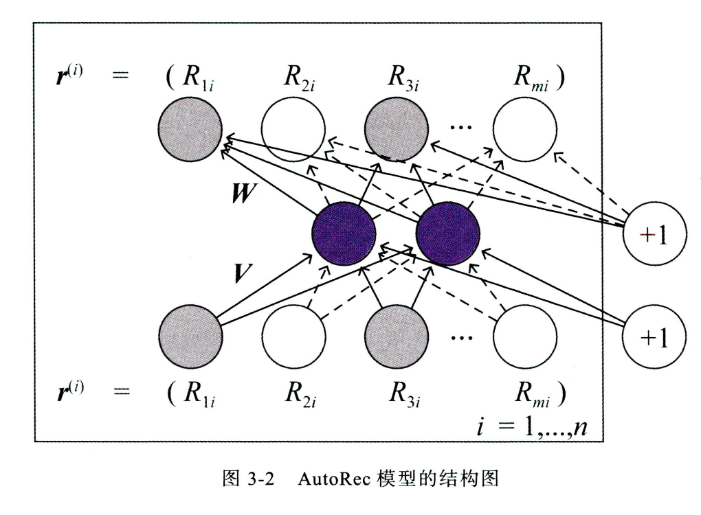
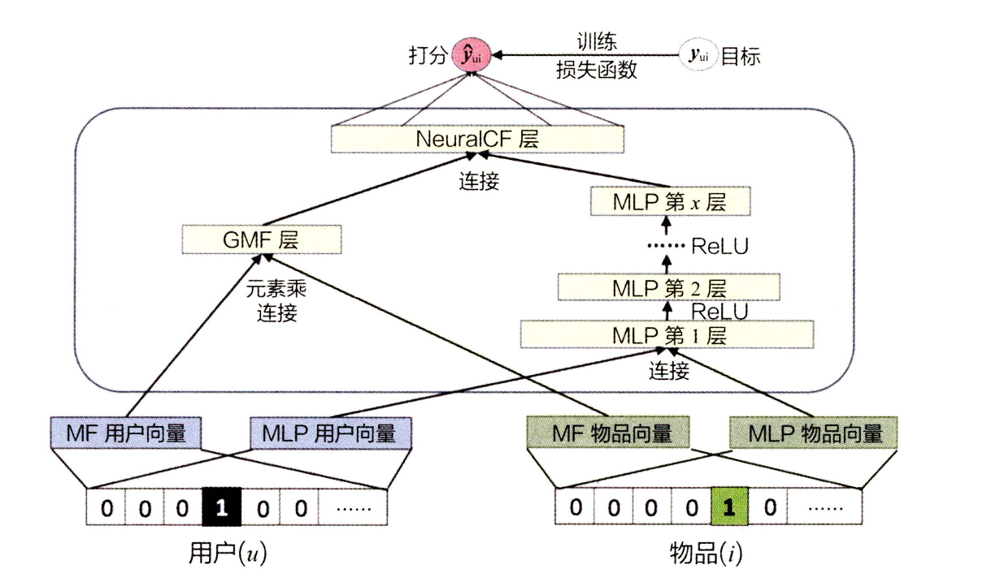
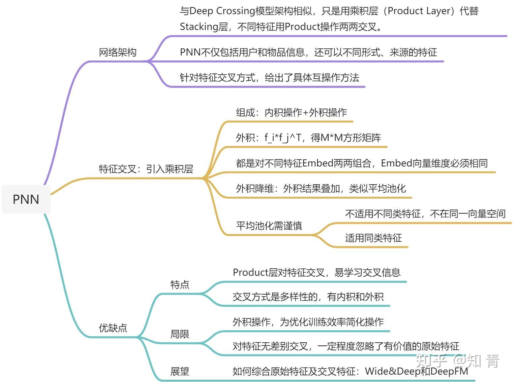
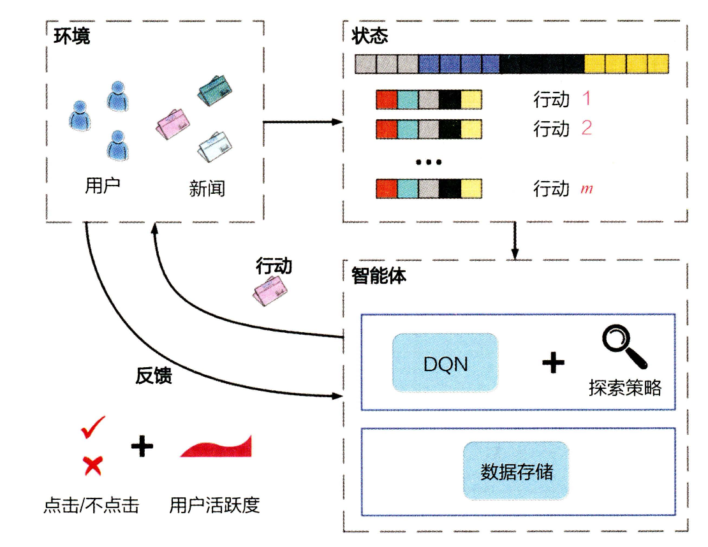
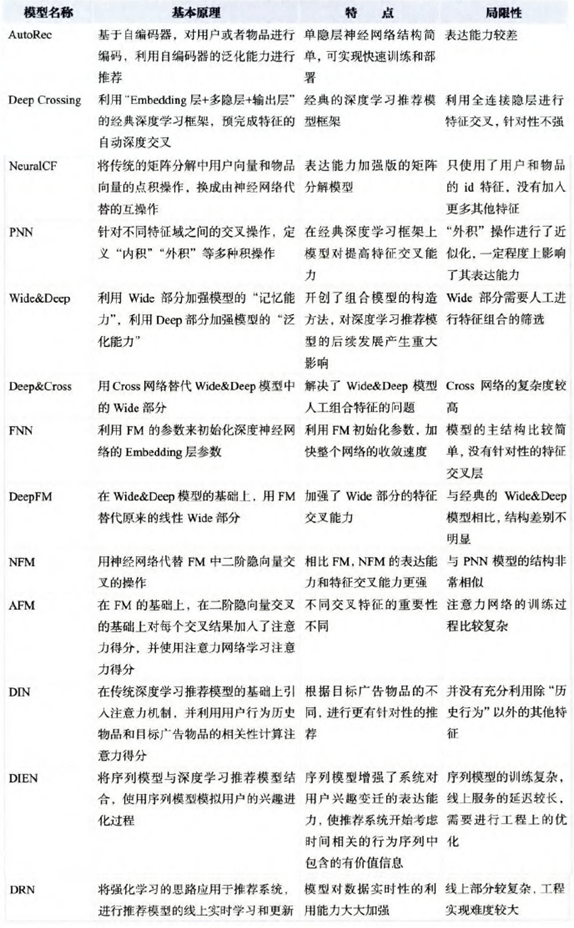

# 第三章：浪潮之巅-深度学习在推荐系统中的应用

## 3.1 深度学习推荐模型的演化关系图

    
      <figcaption style="text-align: center">
        深度学习推荐模型的演化关系图
      </figcaption>
    </img>
    

分别有以下几种改进方向：
- 改变神经网络的复杂程度：从单层神经网络AutoRec(自编码器推荐)，到经典的深度神经网络结构Deep Crossing(深度特征交叉)，进化方式在于增加网络层数和结构复杂度。
- 改变特征交叉方式：改变用户、物品向量互操作方式的NeuralCF（神经网络协同过滤），定义多种特征交叉操作的PNN（基于积操作的神经网络）模型。
- 组合模型：组合两种不同特点、优势互补的深度学习网络，提升模型综合能力。主要指Wide&Deep，Deep&Cross和DeepFM等。
- FM模型的深度学习演化版本：
  - NFM（神经网络因子分解机）主要使用神经网络提升FM的二阶部分的特征交叉能力。
  - AFM（基于因子分解机支持的神经网络）引入了注意力机制的FM模型。
  - FNN（注意力因子分解机）利用FM的结果进行网络初始化。
- 注意力机制与推荐模型的结合：将注意力机制应用到深度推荐模型中。 
  - AFM（基于因子分解机支持的神经网络）结合注意力机制与FM。
  - DIN（深度兴趣网络）引入注意力机制的CTR预估模型。
- 序列模型与推荐模型的结合：使用序列模型模拟用户行为或用户兴趣的演化趋势，代表模型是DIEN（深度兴趣进化网络）。
- 强化学习与推荐模型的结合：强化学习在推荐领域中的应用，强调模型的在线学习和实时更新，代表模型是DRN（深度强化学习网络）。

## 3.2 AutoRec一一单隐层神经网络推荐模型
自编码器思想和协同过滤结合

## 3.2.1 AutoRec 模型的基本原理
AutoRec 模型是一个标准的自编码器，它的基本原理是利用协同过滤中的共现矩阵，完成物品向量或者用户向量的自编码。再利用自编码的结果得到用户对物品的预估评分，进而进行推荐排序。

## 3.2.2 AutoRec 模型的结构

    
      <figcaption style="text-align: center">
        AutoRec模型结构
      </figcaption>
    </img>
    

图中蓝色的神经元代表模型的k维单隐层，其中 k << m。V和W是参数矩阵，分别代表输入层到隐层，以及隐层到输出层的参数矩阵。输入层是物品的评分向量，比如协同过滤中的共现矩阵。V矩阵把输入投射到k维度，W矩阵再把投射过的返回来。

    
      <figcaption style="text-align: center">
        AutoRec模型的重建函数
      </figcaption>
    </img>
    

    
      <figcaption style="text-align: center">
        AutoRec模型的目标函数
      </figcaption>
    </img>
    

以上输入为物品的评分向量（I-AutoRec），也可以是用户的评分向量（U-AutoRec）。在进行推荐列表生成的过程中，U-AutoRec 相比 I-AutoR 目的优势在于仅需输入一次目标用户的用户向量 ，就可以重建用户对所有物品的评分向量。 也就是说，得到用户的推荐列表仅需一次模型推断过程; 劣势是用户向量的稀疏性可能会影响模型效果。

## 3.2.4 AutoRec 模型的特点和局限性
- 模型结构较为简单，只有简单的三层神经网络，存在一定表达能力不足问题。
- 没有用到物品或者用户的其它特征，和协同过滤一样。
- 总结：模型思路来源于AutoEncoder，使用单隐层学习，使模型具备一定的泛化和表达能力，拉开了使用深度学习的思想解决推荐问题的序幕，为复杂深度学习网络的构建提供了思路。

    
      <figcaption style="text-align: center">
        AutoRec章节思维导图
      </figcaption>
    </img>
    

## 3.3 Deep Crossing 模型一一经典的深度学习架构
Deep Crossing模型完整地解决了从特征工程、稀疏向量稠密化、多层神经网络进行优化目标拟合等一系列深度学习在推荐系统中的应用问题。核心思想是，使用Embedding将稀疏类目特征向量稠密化，在与数值特征连接，一起输入到多层残差网络，进行特征交叉，最后经过输出层输出。

## 3.3.1 Deep Crossing 模型的应用场景
搜索广告排序应用，尽可能地增加搜索广告的点击率，准确地预测广告点击率，并以此作为广告排序的指标之一，也是 Deep Crossing 模型的优化目标。

## 3.3.2 Deep Crossing 模型的网络结构

    
      <figcaption style="text-align: center">
        Deep_Crossing模型结构图
      </figcaption>
    </img>
    

- Embedding层：全连接层结构，稀疏类别特征转换为稠密向量，与word2vec作用一样，数值特征不需要经过。
- Stacking层：将Embedding特征和数值特征连接在一块。
- Multiple Residual Units层：主要结构为多层感知机，采用了多层残差网络作为MLP的具体实现。残差网络包含了特征组合的信息。解决了特征自动组合交叉的问题。
- Scoring层：输出层，二分类使用LR，多分类使用Softmax。
- 残差网络解决的两个问题，对应所有有次结构的网络都有一样的作用：
  - 神经网络过深，易过拟合。在残差网络中，由于输入向量短路的存在，大多可以越过两层ReLU，达到保留原始地输入信息，减少过拟合现象。 
  - 解决梯度消失问题。 
    - 梯度消失现象：梯度方向传播，越靠近输入端，梯度的幅度越小，参数收敛的速度越慢
    - 为了解决这个问题： 
      - 残差网络使用ReLU取代Sigmoid
      - 输入向量短路可以将梯度毫无变化传递到下一层，使得残差网络收敛得更快

## 3.3.3 Deep Crossing模但对特征交叉方法的革命
Deep Crossing模型中没有任何人工特征工程的参与，原始特征经 Embedding 后输入神经网络层，将全部特征交叉的任务交给模型。 相比之前介绍的 FM、FFM 模型只具备二阶特征交叉的能力，Deep Crossing 模型可以通过调整神经网络的深度进行特征之间的"深度交叉"，这也是 Deep Crossing 名称的由来。
总结：虽然模型思路很简单 Embedding + MLP，但是第一次正式的开创了特征工作自动化，并且是完全交给模型进行自动化处理。

    
      <figcaption style="text-align: center">
        Deep_Crossing章节思维导图
      </figcaption>
    </img>
    

## 3.4 NeuralCF 模型一CF与深度学习的结合
核心思维：基于用户和物品向量两个Embedding层，利用不同的互操作层进行特征的交叉组合（使用神经网络替换矩阵分解的内积），并且可以灵活地进行不同互操作层的拼接。

## 3.4.1 从深度学习的视角重新审视矩阵分解模型
从深度学习的角度看待矩阵分解就是，把用户隐向量和物品隐向量看作一种 Embedding方法。 最终的 "Scoring 层"就是将用户隐向量和物品隐向量进行内积操作后得到"相似度"，这里的"相似度"就是对评分的预测。但是矩阵分解的模型结构太过于简单，scoring层无法对目标函数有效拟合。

## 3.4.2 NeuralCF 模型的结构
- 从矩阵分解到NeuralCF，将矩阵分解中的内积互操作换成了神经网络MLP。本质上所有用户和物品的互操作层都可以被任意形式替代，也就是广义上矩阵分解模型。
  

    
      <figcaption style="text-align: center">
        NeuralCF模型结构
      </figcaption>
    </img>
    

- NeuralCF混合模型，将不同互操作网络得到的向量拼接起来作为最终输出层的输入。
  

    
      <figcaption style="text-align: center">
        NeuralCF混合模型结构
      </figcaption>
    </img>
    

## 3.4.3 NeuralCF 模型的优势和局限性
- 优势：
  - 理论上能拟合任意特征函数，并且灵活地组合不同的特征。
- 局限性：
  - 基于协同过滤构建，没有引入其它特征类型
  - 模型中互操作的种类并没有做进一步的探究和说明
总结：提出了更多的特征交互层的设计，为以后特征交互的延伸打下基础

    
      <figcaption style="text-align: center">
        NerualCF章节思维导图
      </figcaption>
    </img>
    

## 3.5 PNN 模型一一加强特征交叉能力
PNN模型在DeepCross基础上，将Stacking层替换成了Product层（乘积层）。

## 3.5.1 PNN 模型的网络架构
PNN 模型用乘积层( Product Layer )代替了 Deep Crossing 模型中的 Stacking 层。不同特征的 Embedding 向量不再是简单的拼接，而是用 Product 操作进行两两交互，更有针对性地获取特征之间的交叉信息。同时embedding

    
      <figcaption style="text-align: center">
        PNN模型结构图
      </figcaption>
    </img>
    

## 3.5.2 Product 层的多种特征交叉方式
- 内积：IPNN
  - 每个特征向量在每个维度上两两进行交叉相乘后sum
  - 比如：输入输入向量 x -> [batch_size, num_fields, embedding_dim]，内积之后得到 -> [batch_size, num_fields * (num_fields - 1) // 2]，每个样本会得到它对应所有特征组合两两交叉相乘后特征维度上的和。
- 外积：OPNN
  - 每个特征向量在每个特征维度上，维度之间的两两进行交叉相乘
  - 比如：输入输入向量 x -> [batch_size, num_fields, embedding_dim]，外积之后得到 -> [[batch_size, embedding_dim^2]]。每个样本先把所有的特征进行一个sum pooling，得到[batch_size, embedding_dim]，然后再和内积一样两两交叉相乘。

## 3.5.3 PNN 模型的优势和局限性
- 优点：
  - Product操作更强调不同特征之间的交互，模型更容易捕获特征的交叉信息。
- 局限性：
  - 外积操作的实际应用中，为了优化训练效率进行了大量的sum pooling简化操作。容易丢失原始特征信息。
  - 对所有特征进行无差别的交叉，在一定程度上忽略了原始特征向量中包含的有价值信息。
总结：提出了多样的特征交互层的设计，而不仅仅只是MLP。并且可以融合更多的用户特征。

    
      <figcaption style="text-align: center">
        PNN章节思维导图
      </figcaption>
    </img>
    

## 3.6 Wide&Deep 模型一一记忆能力和泛化能力的综合
Wide&Deep模型是由单层的Wide部分和多层的Deep部分组成的混合模型。其中Wide部分主要作用是让模型具有较强的“记忆能力”，Deep部分主要作用是让模型具有“泛化能力”。

## 3.6.1 模型的记忆能力与泛化能力
- 记忆能力：可以被理解为模型直接学习井利用历史数据中物品或者特征的 "共现频率"的能力。比如历史出现过的特征组合对于特定的label有很高的共线频率，那么简单的模型很容易给予这个特征组合很高的权重。
- 泛化能力：可以被理解为模型传递特征的相关性，以及发掘稀疏甚至从未出现过的稀有特征与最终标签相关性的能力。比如深度神经网络通过特征的多次自动组合，可以深度发掘数据中潜在的模式，即使是非常稀疏的特征向量输入，也能得到较稳定平滑的推荐概率，这就是简单模型所缺乏的"泛化能力"。

## 3.6.2 Wide&Deep 模型的结构
W&D模型单输入层的Wide部分与由Embedding层和多隐层组成的Deep部分连接起来，一起输入最终输出层。

    
      <figcaption style="text-align: center">
        Wide&Deep模型结构
      </figcaption>
    </img>
    

- 单层Wide部分善于处理大量稀疏的id类特征
- Deep部分利用神经网络表达能力强，进行深度特征交叉，挖掘潜在的数据模式
- 最终，利用逻辑回归，输出层将Wide和Deep组合起来

具体的特征工程中，体现了那些特征放进Wide部分，哪些放进Deep部分

    
      <figcaption style="text-align: center">
        Wide&Deep模型详细结构
      </figcaption>
    </img>
    

- Deep部分输入的是全量的特征向量，对所有特征做完embedding后，直接拼接起来放进MLP。
- Wide部分对已安装应用和曝光应用做交叉积变换，两特征同时为1才为1，否则为0，希望记住“如果用户已经安装了应用 A，是否会安装 B”这样的规则。在通过交叉积变换层操作完成特征组合之后，Wide 部分将组合特征输入最终的 LogLoss 输出层，与 Deep 部分的输出一同参与最后的目标拟合。

## 3.6.3 Wide&Deep 模型的迸化一Deep&Cross模型
相对比Wide&Deep，Deep&Cross（DCN）模型主要改动的是Wide部分，Deep部分完全一样。

    
      <figcaption style="text-align: center">
        Deep&Cross模型结构
      </figcaption>
    </img>
    

- 利用Cross Net代替Wide部分，增加特征交叉力度。避免了更多基于业务理解的人工特征组合。
- 每一层都保留的初始输入向量 ，保证了输出与输入之间的变化不会特别明显。
- 每一层只增加了一个 n 维的权重向量 w，n 是输入向量的所有特征维度的拼接。

## 3.6.4 Wide&Deep 模型的影响力
- 抓住了业务问题的本质特点，能够融合传统模型记忆能力和深度学习模型泛化能力的优势。
- 模型的结构并不复杂，比较容易在工程上实现、训练和上线，加速了在业界的推广应用。

总结：提出了更加复杂的Cross Net部分来代替Wide。增加特征交叉力度。

    
      <figcaption style="text-align: center">
        Wide&Deep章节思维导图
      </figcaption>
    </img>
    

## 3.7 FM 与深度学习模型的结合
改进FM部分或者不同的组合，融入进深度学习

## 3.7.1 FNN 一 用FM的隐向量完成Embedding层初始化
使用FM的隐层向量作为user和item的Embedding，从而避免了完全从随机状态训练Embedding。初始化Embedding的原因如下
- id类特征大量采用one-hot的编码方式，导致其维度极大，向量极稀疏，所以Embedding层与输入层的连接极多，梯度下降的效率很低，大大增加了模型的训练时间和Embedding的不稳定性，使用pre train的方法完成Embedding层的训练，降低深度学习模型复杂度和训练不稳定性。
- Embedding层权重占了整个网络权重的绝大部分。那么大部分训练时间跟计算开销都在这里，同时输入向量过于稀疏，随机梯度下降过程中，只有与非零特征相连的embedding层权重会被更新。 初始化的是embedding神经元与输入神经元之间的连接权重。

    
      <figcaption style="text-align: center">
        FNN模型结构图
      </figcaption>
    </img>
    

## 3.7.2 DeepFM 一一 用 FM 代替 Wide 部分
对比 Wide&Deep 模型，有以下两点改进：
- 用FM替换掉了原来的Wide部分，加强了浅层网络部分特征组合的能力。事实上，由于FM本身就是由一阶部分和二阶部分组成的，DeepFM相当于同时组合了原Wide部分+二阶特征交叉部分+Deep部分三种结构，进一步增强了模型的表达能力。
- 同时FM替换Wide后实现了自动特征工程组合，思路上和DCN一样，只是特征工程组合的形式不一样。一个是cross net，一个是FM。

    
      <figcaption style="text-align: center">
        DeepFM模型结构图
      </figcaption>
    </img>
    

## 3.7.3 NFM 一 FM的神经网络化尝试
NFM可以看作是对Deep部分的改进。
- 我们从深度学习网络架构的角度看待FM，FM也可以看作是由单层LR与二阶特征交叉组成的Wide&Deep的架构，与经典W&D的不同之处仅在于Deep部分变成了二阶隐向量相乘的形式。
- NFM从修改FM二阶部分的角度出发，用一个带Bi-interaction Pooling层的DNN替换了FM的特征交叉部分，形成了独特的Wide&Deep架构。其中Bi-interaction Pooling可以看作是不同特征embedding的element-wise product的形式。最终在所有特征组合维度上进行sum pooling。和PNN的内积操作一样。

    
      <figcaption style="text-align: center">
        NFM模型公式
      </figcaption>
    </img>
    

    
      <figcaption style="text-align: center">
        NFM模型结构图
      </figcaption>
    </img>
    

## 3.7.4 基于FM的深度学习模型的优点和局限性
- 优点：
  - FNN、DeepFM、NFM都是在经典多层神经网络的基础上加上有针对性的特征交叉操作，让模型具备更强的非线性表达能力
- 局限性：
  - 同样这种特征工程的思路基本穷尽了所有可能的尝试，提升空间非常小。之后更多的模型开始探索结构性的改变，诸如注意力机制、序列模型、强化学习开始进入推荐系统领域。

## 3.8 注意力机制在推荐模型中的应用
基于用户对整个页面的不同区域的注意力区别很大。

## 3.8.1 AFM 一一 引入注意力机制的FM
基于FM是Wide&Deep结构思路，其中Wide部分是FM的一阶部分，Deep部分是FM的二阶部分，而AFM即为引入Attention机制的FM。
- AFM对FM的二阶部分的每个交叉特征赋予了权重，这个权重控制了交叉特征对最后结果的影响，思路类似于NLP领域的注意力机制（Attention Mechanism）。
- 为了训练Attention权重，AFM加入了Attention Net，采用简单的特征交叉层计算所有的特征交叉的结果，然后全连层计算加softmax，转化成对每个特征组合的权重，在利用Attention Net训练好Attention权重后，再反向作用于FM二阶交叉特征之上，使FM获得根据样本特点调整特征权重的能力。主要用处是区分不同特征组合的重要性，例如：男生&买过键盘比男生&30岁对于是否推荐鼠标更重要。

    
      <figcaption style="text-align: center">
        AFM模型结构图
      </figcaption>
    </img>
    

## 3.8.2 DIN 一一 引人注意力机制的深度学习网络
利用候选商品和用户历史交互商品之间的相关性得出注意力权重，以此根据用户历史交互商品计算出用户的加权和Embedding，这个权重就代表了 "注意力" 的强弱。开启了注意力机制和序列模型。其中注意力机制采用一个外积和MLP的操作得到候选商品对每个用户历史交互商品的权重。

    
      <figcaption style="text-align: center">
        DIN模型结构图
      </figcaption>
    </img>
    

## 3.9 DIEN 一 序列模型与推荐系统的结合
用序列模型模拟了用户兴趣的进化过程。

## 3.9.1 DIEN 的进化动机
用户的兴趣随着时间变化的趋势是比较重要的，模型是基于用户所有购买历史的综合推荐，所以序列信息的重要性在于一下两点：
- 最近行为对下次行为预测的影响，比如一个男生上周买了一双篮球鞋，他这周购买键盘的概率会明显高于再买一双篮球鞋的或者购买其他商品的概率。
- 序列模型能够学习到购买趋势，比如在这个例子中他会一定程度上建立篮球鞋到机械键盘的转移概率，如果这个概率在全局意义上足够高的， 那么买篮球鞋时候，推荐键盘也是一个很不错的选择。 简单说，序列模型就是预测用户“下一次购买的物品”。

## 3.9.2 DIEN 模型的架构

    
      <figcaption style="text-align: center">
        DIEN模型结构图
      </figcaption>
    </img>
    

- 行为序列层(Behavior Layer，浅绿色部分)：主要作用是把原始的ID类行为转换成embedding行为序列
- 兴趣抽取层(Interest Extractor Layer，米黄色部分)：其主要作用就是通过模拟用户兴趣迁移过程，抽取用户兴趣
- 兴趣进化层(Interest Evolving Layer，浅红色部分)：主要作用就是通过在兴趣抽取层上加入注意力机制，模拟与当前目标广告相关的兴趣进化过程

## 3.9.3 兴趣抽取层的结构
兴趣抽取层的基本结构是GRU，对比RNN解决了梯度消失问题，相对LSTM参数更少，收敛更快。经过由 GRU 组成的兴趣抽取层后，用户的行为向量 b(t)被进一步抽象化，形成了兴趣状态向量 h(t)。理论上，此时在兴趣状态向量序列的基础上，GRU 网络已经可以做出下一个兴趣状态向量的预测。

## 3.9.4 兴趣进化层的结构
兴趣进化层注意力得分的生成过程与 DIN 完全一致，都是当前状态向量与目标广告向量进行互作用的结果。兴趣进化层完成注意力机制的引人是通过 AUGRU ( GRU with Attentional Update gate，基于注意力更新门的 GRU) 结构， AUGRU 在原 GRU 的更新门( update gate) 的结构上加入了注意力得分。本质上就是在判断更新当前状态向量不仅仅取决于之前的兴趣状态，还取决于和当前目标广告的注意力。

    
      <figcaption style="text-align: center">
        DIEN中的AUGRU公式
      </figcaption>
    </img>
    

## 3.9.5 序列模些对推荐系统的启发
优势：
  - 序列模型具备强大的时间序列的表达能力，使其非常适合预估用户经过一系列行为后的下一次动作。
局限性：
  - 有比较高的训练复杂度，以及线上推断过程中的串行推断，使其在模型服务过程中延迟较大。

## 3.10 强化学习与推荐系统的结合
把推荐系统也当作一个智能体，把整个推荐系统学习更新的过程当作智能体"行动-反馈-状态更新"的循环。以上就是强化学习的理念应用于推荐系统。一下着重讲解DRN框架。

## 3.10.1 深度强化学习推荐系统框架

    
      <figcaption style="text-align: center">
        深度强化学习推荐系统框架
      </figcaption>
    </img>
    

- 智能体：推荐系统本身，包括推荐模型、探索策略、相关数据储存。 
- 环境： 由新闻网站或app、用户组成的整个推荐系统外部环境。在环境中，用户接受推荐结果并作出相应的反馈。 
- 行动：对一条新闻推荐系统来说，行动指的是推荐系统进行新闻排序后给用户的动作 
- 反馈：用户收到推荐结果后，进行正向或者负向的反馈。 
- 状态：可以看做已收到所有行动和反馈，以及用户和新闻的所有相关信息的特征向量表示。

模型学习的迭代过程如下:
- 初始化推荐系统(智能体)
- 推荐系统基于当前已收集的数据(状态)进行新闻排序(行动)，并推送到网站或者App中(环境)中 
- 用户收到推荐列表，点击或者忽略(反馈)某推荐结果
- 推荐系统收到反馈，更新当前状态或者通过模型训练更新模型 
- 重复第2步

整个过程可以看出强化学习相比于传统的深度模型的优势在于强化学习的模型可以进行在线学习。

## 3.10.2 深度强化学习推荐模型
在 DRN 框架中，扮演"大脑"角色的是 Deep Q-Network (深度 Q 网络，简称 DQN)，其中 Q 是 Quality 的简称，指通过对行动进行质量评估，得到行动的效用得分，以此进行行动决策。

    
      <figcaption style="text-align: center">
        DNQ模型结构图
      </figcaption>
    </img>
    

套用强化学习概念，状态向量和行动向量。
- 把用户特征( user features )和环境特征( context features )归为状态向量，因为和行动无关，通过左侧神经网络生成的价值( value )得分 V(s)
- 把用户-新闻交叉特征和新闻特征归为行动特征，因为其与推荐新闻这一行动相关，同时利用状态向量生成优势( advantage )得分 A(s)
- 最后把上面两个联合起来得到质量得分 Q(s，a)
- 本质上任何深度学习框架都可以用于生成智能体的推荐模型，不一定是上述DQN框架。

## 3.10.3 DRN 的学习过程

    
      <figcaption style="text-align: center">
        DRN模型学习过程
      </figcaption>
    </img>
    

- 在离线部分，根据历史数据训练好 DQN 模型，作为智能体的初始化模型。
- 在 t1 → t2 阶段，利用初始化模型进行一段时间的推送( push) 服务，积累反馈( feedback) 数据。
- 在 t2 时间点，利用 t1 → t2 阶段积累的用户点击数据，进行模型微更新( minor update)。微更新，DRN 使用一种新的在线训练方法一一竞争梯度下降算法( Dueling Bandit Gradient Descent Algorithm )。
- 在 t4 时间点，利用 t1 → t4 阶段的用户点击数据及用户活跃度数据进行模 型的主更新( major update )。主更新可以理解为利用历史数据的重新训练，用训练好的模型替代现有模型。
- 重复第2-4步。

## 3.10.4 DRN 的在线学习方法 ——— 竞争梯度下降算法

    
      <figcaption style="text-align: center">
        DRN模型在线学习方法
      </figcaption>
    </img>
    

- 对于已经训练好的当前网络 Q，对其模型参数 W 添加一个较小的随机扰动 delta-W ， 得到新的模型参数 W~， 这里称 W~ 对应的网络为探索网络 Q~。
- 对于当前网络 Q 和探索网络 Q~。分别生成推荐列表 L 和 L~， 用 Interleaving 将两个推荐列表组合成 一个推荐列表后推送给用户。
- 实时收集用户反馈。 如果探索网络 Q~。生成内容的效果好于当前网络 Q，则用探索网络代替当前网络，进入下一轮迭代;反之则保留当前网络。

总结核心思想，很像随机梯度下降的思路，虽然一次样本的结果可能产生随机扰动，但只要总的下降趋势是正确的，就能通过海量的尝试最终达到最优点。 DRN 正是通过这种方式，让模型时刻与最"新鲜"的数据保持同步，将最新地反馈信息实时地融入模型中。

## 3.10.5 强化学习对推荐系统的启发
核心思想对比之前复杂的深度学习模型是变静态为动态，把模型学习的实时性提到了一个空前重要的位置。同样引入了一个思考的问题一一到底是应该打造一个重量级的、"完美"的，但训练延迟很大的模型;还是应该打造一个轻巧的、简单的，但能够实时训练的模型。当然可能都兼顾这两点一部分，需要更多的技术的尝试和思考。

## 3.11 总结一一推荐系统的深度学习时代
下表为深度学习的推荐模型对比总结。

    
      <figcaption style="text-align: center">
        深度学习的推荐模型对比总结
      </figcaption>
    </img>
  
